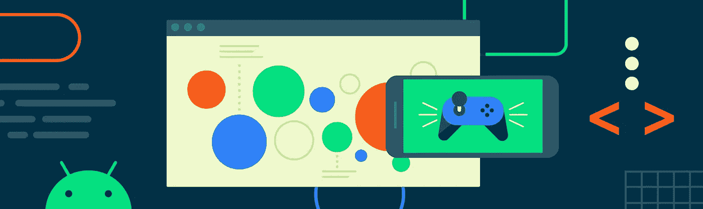

# 新 Android 游戏技术的代码实验室

> 原文：<https://medium.com/androiddevelopers/codelabs-for-new-android-game-technologies-486a847eb92e?source=collection_archive---------0----------------------->

Play Asset Delivery and Android Performance Tuner now have Codelabs

将新技术整合到游戏中是一项艰巨的任务。Google 开发人员代码实验室是指导性的实践教程，它会带你了解向代码添加新功能的具体细节。我们很高兴宣布推出新的游戏开发商 Codelabs，用于游戏资产交付和 Android 性能调谐器。每种技术都有两个版本的 Codelab:一个用于使用 Unity 游戏引擎的游戏，另一个用于使用原生 C++代码的游戏。

[**游戏资产交付**](http://g.co/play/assetdelivery)游戏内容可能很大，许多游戏的数据太多，无法容纳在应用捆绑包的大小限制内。过去，你必须在 Google Play 中使用 APK 扩展文件(OBB ),或者从他们自己的内容交付网络下载数据来支持更大的游戏。Play Asset Delivery 是一个新系统，它在 Google Play 上托管和提供数据，比传统的 APK 扩展方法更加灵活——通常不需要使用外部内容交付网络。

如果你正在使用 Unity，谷歌已经开发了一个与 Unity 2018.3 及更高版本兼容的[插件](https://developer.android.com/guide/playcore#unity)。“[在 Unity games 中使用 Play Asset Delivery](https://codelabs.developers.google.com/codelabs/unity-gamepad)”Codelab 将此插件添加到一个示例项目中，逐步完成生成资源包所需的步骤，并修改项目以支持下载和使用资源包内容。

如果你使用的是原生 C++引擎，谷歌已经开发了 [Play Core 原生 SDK](https://developer.android.com/guide/playcore#native) 。“[在本地游戏中使用 Play Asset Delivery](https://codelabs.developers.google.com/codelabs/native-gamepad)”Codelab 演示了如何将这个 SDK 集成到一个示例项目中。集成后，Codelab 将向您展示如何使用 Android Studio 生成资产包，以及如何使用 Play Core 原生 SDK 中的资产包管理器 API 来下载和访问资产包数据。

[**安卓性能调谐器**](http://d.android.com/performance-tuner)确保你的游戏表现良好，对于吸引和满足你的用户至关重要。大规模收集众多 Android 设备的性能数据是一项艰巨的任务。Android Performance Tuner 使这项任务变得易于管理，让您能够从您的安装群中获取关键性能指标。有关您的游戏在不同设备型号和设备规格级别上的表现的详细信息，提供了您所需的信息，有助于优化目标、调整设置，并确保您的用户获得最佳体验。

如果你正在使用 Unity，谷歌已经开发了一个与 Unity 2017.4 (LTS)或更高版本兼容的[插件](https://github.com/android/tuningfork/releases)。“[将 Android Performance Tuner 集成到您的 Unity 游戏中](https://codelabs.developers.google.com/codelabs/android-performance-tuner-unity)”Codelab 指导您将插件集成到 Boat Attack Unity 示例项目中。您将了解如何配置 Android Performance Tuner，使用监控应用程序进行本地测试，以及可视化上传到 Google Play 的构建所收集的数据的结果和见解。

如果你使用的是原生 C++引擎，Android Performance Tuner 是包含在 [Android 游戏 SDK](https://developer.android.com/games/sdk) 中的一部分。“[将 Android Performance Tuner 集成到您的原生 Android 游戏中](https://codelabs.developers.google.com/codelabs/android-performance-tuner-native)”Codelab 指导您将 Android 游戏 SDK 集成到一个示例项目中。您将了解如何配置 Android Performance Tuner，使用监控应用程序进行本地测试，以及可视化上传到 Google Play 的构建所收集的数据的结果和见解。

我们对游戏资产交付和 Android 性能调谐器为游戏开发者开放的可能性感到兴奋。这些代码实验室展示了在你自己的游戏中开始利用它们是多么容易。

查看[d.android.com/games](http://d.android.com/games)以了解这些工具和更多，并通过注册[游戏季度简讯](https://developer.android.com/updates)保持最新状态。