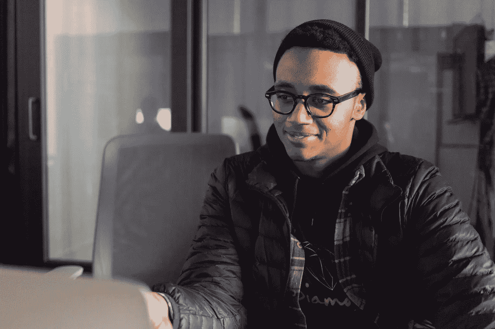

# 大学毕业后编码:第 1 周+第 2 周

> 原文：<https://medium.com/quick-code/coding-after-college-week-1-week-2-ff952f3402d7?source=collection_archive---------10----------------------->

Taken when I was going in to talk about an internship

**重新介绍:**

大家好，我是亚历克斯，第一次自我介绍时，我是佐治亚州立大学计算机科学专业的大三学生，但我现在可以自信而快乐地说，我已经在 2019 年夏天正式从大学毕业了！

自从毕业后，我不仅制定了一个申请工作的时间表，还开始做一件我觉得在大学里并没有像我想的那样去探索的事情，那就是编程。听起来很疯狂，对吧？一个计算机科学专业的学生不会真的去探索编程？那你到底在做什么？*专注地凝视。好吧，我可以告诉你，我一直在编程，一直在学习，但是我总觉得少了点什么。我从来不觉得我有信心只是为了好玩而做一些东西，或者如何思考我正在建造的东西——它的各种组成部分，以及它将服务的目的。所以我现在利用这段时间来学习和练习。

**我如何练习和“重新学习”编程？**

我打算通过每周做几件事来自学成为一名更好的程序员:

1.  每周通过“家庭作业”和“小问题”来应对编码挑战。
2.  重新学习和练习数据结构。
3.  从头开始重新制作我的作品集网站。

我通过 GitHub 仓库“一天一个 Python”(下面的链接)来练习编程、命令行和数据结构，“一周一个网站”(将在本周创建)来练习我想出的有趣网站，以及 YouTube、notes 和文本编辑器来练习数据结构。

我确保使用我觉得有趣或有趣的想法来保持兴趣和减少疲劳。我的最终目标是为包括我自己在内的人创造一些东西，这些东西可以做简单或复杂的事情，但要有趣且易于使用。我想确保我创造的东西能为外面的人解决一些问题，从我的父母到我的一个朋友，再到我的团队在任何地方工作的潜在客户。

**第一周:发生了什么事**

如果我用一个短语或一个词来总结第一周，那将是“有趣”,因为我不仅觉得编程很有趣，而且我收到了佐治亚州立大学的通知，说我正式毕业了，我应该会在几周内拿到学位，那天是我的生日，我开始了求职之旅，这对我来说是一个新的领域。

这一周充满了创造性的编程项目想法和学习令人惊叹的 Python 语言和编程的渴望。

第一周:我学到了什么

我学到了很多关于 Python 语言的知识，包括哈希映射以及 Python 如何通过字典实现它们。

我的“家庭作业”教会了我一些事情，比如:

*   Python 2.7 中的输入必须使用 raw_input
*   根据要检索的值，可以用多种方式遍历字典；对我来说，就是遍历这些键来返回值。
*   字典是有趣而又酷的数据结构，我仅仅触及了它的表面。
*   我应该是成年人了，更新到 Python 3。

我的“小作业”比我的家庭作业难多了，但实际上它教会了我关于 Python“流”的最多知识。这让我思考我应该把我的函数放在哪里，我想让它们做什么，我想从它们那里得到什么。我学到的一件大事是，有些东西 Python 天生就没有。例如，一个 switch 语句，它本来可以更好地处理口味选择，但我确实学到了一个技巧，我可能会在后面的程序中使用。

总之，这一周教会了我，编程不是你为了晚上 11:59 要交的作业而做的事情，而是一种神奇的工具，它让你可以制作出你可能从未想象过能够发挥作用的东西。当我现在编程的时候，我觉得我在做一些事情并且从中得到乐趣！考虑到所有的事情可能感觉顺利或粗糙，我已经意识到这是旅程应该是什么。

第二周:发生了什么事

我会用“奋斗”这个词来形容第二周。在这一周里，我觉得自己在严重感冒的情况下，努力去把握自己的目标。简而言之，这一周我感到有点失落，因为我给自己安排了过多的日常目标，没有做任何有趣的事情，也没有真正影响到我最初的计划，即学习、娱乐、编程和做让你微笑的事情。

**我放弃了吗？**

**没有**。**普-利兹**。**为什么我会？旅程应该有平坦和崎岖的路段。当我们在岩石上绊倒，擦伤了膝盖时，假装有一块巨石砸在我们身上，把我们永远钉在地上，这不是解决问题的方法。决定我们在旅程中的奉献和成功的是我们如何应对早期道路上的挑战和障碍，即使那些障碍看起来很像我们。**

现在战胜自己就是在用 Python 做框架的时候，或者开始用 JavaScript 的时候，或者因为 API 返回错误的东西而放弃自己。我们将面临挑战，我感谢我的挑战，感谢我在克服挑战中所学到的东西。

**我是如何旋转的？**

我后退一步，回忆起我开始这段旅程的原因以及我喜欢编程的地方，休息一会儿，编写我的家庭作业，然后再休息一会儿重新设置。

**我将如何应对第 3 周及以后的每一周？**

1.  回去享受我正在做的事情。
2.  制定现实可行的每日目标。
3.  倾听我自己。
4.  锻炼身体，更好地对待自己和自己的健康。

最终，我将继续我剩下的旅程，知道大象是被部分而不是整个吃掉的。

第二周:我从编程中学到了什么？

我的作业是创建一个 10 进制到 10 以下任何进制的转换器，它教会了我很多。我学到的东西是:

1.  我需要后退一步，因为我有过度思考我的程序的倾向。
2.  Python 使用列表而不是数组
3.  。join 和 map()使用起来非常有趣
4.  我必须做一些转换来使用某些东西，比如我的输入数字，我必须把它转换成整数。
5.  Python 有一种有趣的反转字符串的方式，在这方面我有很多东西要学。

**第 1+2 周结论**

总之，这两周教会了我很多，不仅仅是关于 Python，还有我自己。我期待着继续这段旅程，并学习更多关于通过编程创造东西的知识，无论是通过 Python、JavaScript，还是任何我可能需要使用或感兴趣的语言。

**我的 Github 和作品集网站的链接**

*   一天一条蟒蛇 Github:[https://github.com/A-Mitch/apythonaday](https://github.com/A-Mitch/apythonaday)
*   作品集网站:[https://a-mitch . github . io](https://a-mitch.github.io/)

感谢阅读，

亚历克斯