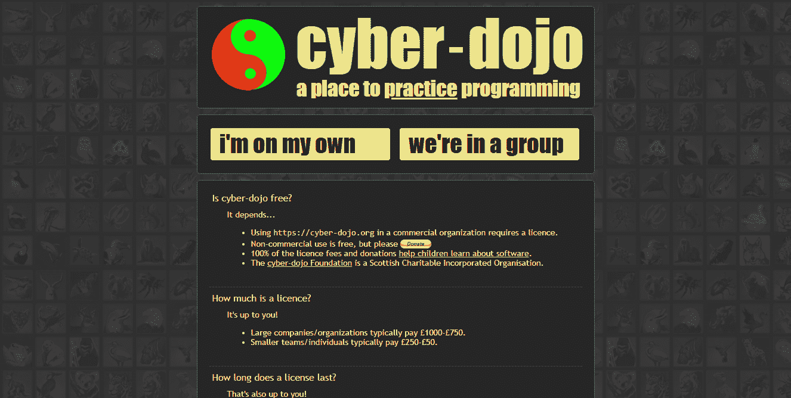

# 2021 年的编码目标:学习 Java 的理由

> 原文：<https://medium.com/quick-code/coding-goals-for-2021-the-reasons-to-learn-java-3c614579ae7a?source=collection_archive---------4----------------------->

Photo by [Danielle MacInnes](https://unsplash.com/@dsmacinnes?utm_source=unsplash&utm_medium=referral&utm_content=creditCopyText) on [Unsplash](https://unsplash.com/s/photos/goals?utm_source=unsplash&utm_medium=referral&utm_content=creditCopyText)

就疫情的情况而言，许多大公司被迫将所有流程都放到网上。因此，他们需要能够构建企业级服务器端应用程序、创建网站内容并及时维护它的人。在这种情况下，许多项目选择 Java 来构建应用程序，因此，需要尽可能多的 Java 程序员来实现。所以，如果你还在问自己“我为什么要学 Java”，这应该是一个答案。

但是，这不是唯一的原因，我将解释为什么在 2021 年成为 Java 开发人员是一个新的开始。

# 为什么选择在 2021 年成为程序员

在考虑开始掌握 Java 的其他原因之前，从基础开始并发现成为一名程序员有什么好处是有意义的。

# 稳定的工业

软件工程是一个相当稳定的行业。就连美国劳工统计局的研究也显示，计算机和信息技术行业的失业人口比例不仅一直很低，到 2020 年 5 月还会下降。所有其他职业的失业人口比例也上升至 13.5%。

不管行业稳定性如何，技术仍在快速发展，五年或十年后，你不太可能使用今天获得的技能。但这不应该妨碍你学习编程。公司对员工的不断发展感兴趣，通常支持他们采用最新的技术、工具和概念。所以，你可以继续提高你的技能，成为一名受欢迎的程序员。

# 可观的收入

如果我说程序员可以比其他大众职业选择的专家挣得多得多，我不会多此一举。许多公司都需要软件工程师的技能，而 [Glassdoor](https://www.glassdoor.com/index.htm) 的下一份薪资清单清楚地说明了这一点:

*   Java 开发人员——79，137 美元/年
*   Python 开发人员——76，526 美元/年
*   Go 开发者—75，715 美元/年
*   Ruby 开发者——75，715 美元/年
*   C Net 开发人员—75，715 美元/年
*   Swift 开发人员—75，715 美元/年
*   C++开发人员——76，526 美元/年

# 积极的工作文化

羊群里都有害群之马，讨厌的人到处都是。但是，遇到这样的同事并在 IT 世界面临歧视的机会仍然是悲惨的。除此之外，市场上还有各种各样的工作机会，谣言在当地程序员中迅速传播。因此，你可以很容易地避开糟糕的公司，这在许多其他领域很难做到。

此外，越来越多的软件公司努力采取有效的做法，帮助他们关心其雇主的生产力水平和福利。反馈会议、一对一会议、回顾只是允许经理与团队保持联系的已采用流程的一小部分。

许多雇佣 Java 开发人员的公司都支持远程办公，他们允许灵活的工作时间表和远程工作，所以你可以在世界的任何地方完成你的工作。

# 2021 年学习 Java 的理由

现在你知道了，2021 年成为一名程序员，对你未来的职业生涯是一个很好的前景。让我们进一步讨论为什么 Java 值得为即将到来的项目所选择。

# Java 仍然是领先的编程语言

TIOBE 指数最近公布了 12 月份的新结果，Java 现在是世界上第二大流行的编程语言。

在 Devskiller 上进行的测试使 Java 成为赢家，而 SQL 和 JavaScript 分别获得第二和第三名。如此受欢迎的原因在于 Java 的不断发展，这导致了新的、最新的功能。后者使开发过程更容易和更优化，从而大大有助于开发人员。

其中，Java 以其广泛的应用而闻名。它几乎无处不在，无论是台式机、移动平台、智能汽车还是住宅等等。目前，所谓的“Java 生态系统”包含全球约 800 万名 Java 编码人员。由于有大量经验丰富的专家，许多公司选择在他们的项目中使用这种语言。对于需要构建企业级服务器端应用的大型组织来说尤其如此，而 Java 开发人员正是这一角色的完美人选。

尽管越来越多的新技术涌现出来，但 Java 仍然很受欢迎，而且从统计数据来看，这种趋势不会很快改变。

# 了解 Java 打开了许多职业大门

说到就业率，Java 自信地击败了很多其他编程语言。正如我已经提到的，它经常被用于大公司启动大项目，并要求许多专家加入。也有足够的工作和金钱让大公司雇佣初级员工，所以初学者在掌握 Java 基础知识后就可以马上找到工作。

这些和其他项目通常需要以下技能:

*   春季(包括 Spring Boot)和冬季
*   单元测试
*   Android 开发
*   饭桶
*   Servlets
*   码头工人
*   JSON/Jackson
*   用于 RESTful Web 服务的 Java API
*   詹金斯
*   设计和架构模式
*   构建自动化工具(Maven、Gradle)
*   SQL 数据库等。

而 Java 应用最受欢迎的领域如下:

*   企业级服务器端应用程序
*   移动应用程序开发
*   反应式编程
*   使用大数据
*   物联网
*   金融
*   营销
*   赌博
*   零售

上面提到的 wide Java 应用程序允许开发人员在职业生涯中成长，并依靠向上流动。从事大型项目的专家通常会学习其他语言，以便能够用 Java 完成部分任务，如果需要的话，还可以使用其他语言。Java 开发人员不害怕被解雇，因为他们被允许在工作的同时学习一门新的语言(在 Java 之后，几乎所有的语言都可以轻松快速地学习)。这些和其他一些原因使得编码员对他们的工作条件很满意，这样他们就不会经常转行。

# 在线课程适合各种口味和预算

既然你已经开始了你的编程之旅，是时候选择正确的学习课程了。幸运的是，网络上有很多提供互动课程和挑战的资源。接下来，你会发现几个我强烈推荐的。

所以，让我们开始吧。

## CodeGym

CodeGym 以基于实践的方法学习 Java 而闻名。该课程包含超过 1200 个要完成的任务，确保虚拟导师的即时验证，允许在游戏部分构建您自己版本的经典视频游戏，并提供加入社区的机会。

## 代码战争

[Codewars](https://www.codewars.com) 是另一个在线学习平台，允许掌握超过 20 种编程语言，包括 Java。你将被提供与你的同伴一起训练叫做形的挑战，以及创造你自己的形和挑战你的同伴开发者。

## 赛博道场

如果你正在寻找一个有效的游戏化资源来提高你的编程技能，考虑一下 [Cyber-Dojo](https://cyber-dojo.org/creator/home) 。该平台提供了多项任务来完成，每项任务都附有详细的描述和结果示例。

## 厨师长

除了教你一门编程语言， [CodeChef](https://www.codechef.com) 让你有可能通过参加编码竞赛来磨练技能。您还可以使用该平台来了解更多关于二分搜索法、算法和其他技术主题的信息。

## 完整的 Java Masterclass

这是初学者的理想[课程](https://www.udemy.com/course/java-programming-course/)，因为它允许从零开始学习 Java。一旦掌握了基本的主题，就可以学习更高级的 Java 概念，比如多线程、OOPs、ArrayList 等等。

## 面向完全初学者的 Java 编程

这门[课程](https://www.udemy.com/course/java-programming-tutorial-for-beginners/)承诺你将在 250 多个步骤中掌握 Java 编程语言。它还包含 200 多个代码挑战、测验和示例，您应该通过它们来磨练您的知识和技能。

## 杜克大学的 Java 认证

考虑另一门[课程](https://www.coursera.org/specializations/java-programming)，它涵盖了 Java 编程和软件工程基础。除了学习数组、列表和结构化数据、软件设计原则以及用软件解决问题，您还可以掌握 JavaScript、HTML 和 CSS 的编程基础。

# 这个社区在不断发展，活跃，友好

除了无数的学习课程、教程、书籍和挑战，Java 还因其庞大而活跃的社区而闻名。它在迟早加入它的每个人的生活中起着关键作用——该社区支持新手和专业人员，帮助解决问题，允许共享知识，并且仍然是最新编码新闻的最大来源之一。

有数百个活跃的 Java 论坛和组织，但我想区分其中的几个:

*   [GitHub](https://github.com)
*   [堆栈溢出](https://stackoverflow.com)
*   [黑客新闻](https://news.ycombinator.com)
*   [站点点](https://www.sitepoint.com/community/)
*   [Reddit](https://www.reddit.com) 频道
*   r/编程
*   学习编程
*   r/代码在一起
*   r/编程工具
*   r/游戏开发
*   r/Prog articles
*   r/webdev
*   r/每日程序
*   r/java
*   r/javahelp
*   [Java form](https://www.javaprogrammingforums.com)

Java 社区鼓励积极参与讨论，并促进援助和帮助。这让新来者感到自信和安全——他们不会失去支持。

# 手边有许多公共图书馆

继续使用 Java 的另一个原因是它的大量库被全世界的开发者所使用。此外，许多非营利组织和大公司，如 Google 和 Apache，继续发布开放访问的图书馆。它们极大地影响了 Java 开发的过程，使之更快、更容易、更有效。

因为大多数库都是公开可用的，所以新手甚至在开始编写代码之前，通常会被推荐使用 google 搜索所需的功能。该功能很可能已经存在于开源库中，并且之前已经由专业开发人员测试过。

如果您正在寻找 Java 库作为起点，请考虑其中的几个:

*   [Java 标准库](https://docs.oracle.com/javase/8/docs/api/index.html)
*   [杰普斯特](https://www.jhipster.tech)
*   [阿帕奇社区](https://commons.apache.org)
*   [番石榴](https://github.com/google/guava)
*   [google-gson](https://github.com/google/gson)
*   [Hibernate-ORM](http://hibernate.org/orm/)
*   [莫奇托](https://site.mockito.org)
*   [JUnit](https://junit.org/junit4/)

我是否回答了你的问题“我为什么要学习 Java？”希望关于这种编程语言的一点信息已经使您相信这是一个不错的选择。所以，继续使用 Java，让明年成为你的游戏改变者。