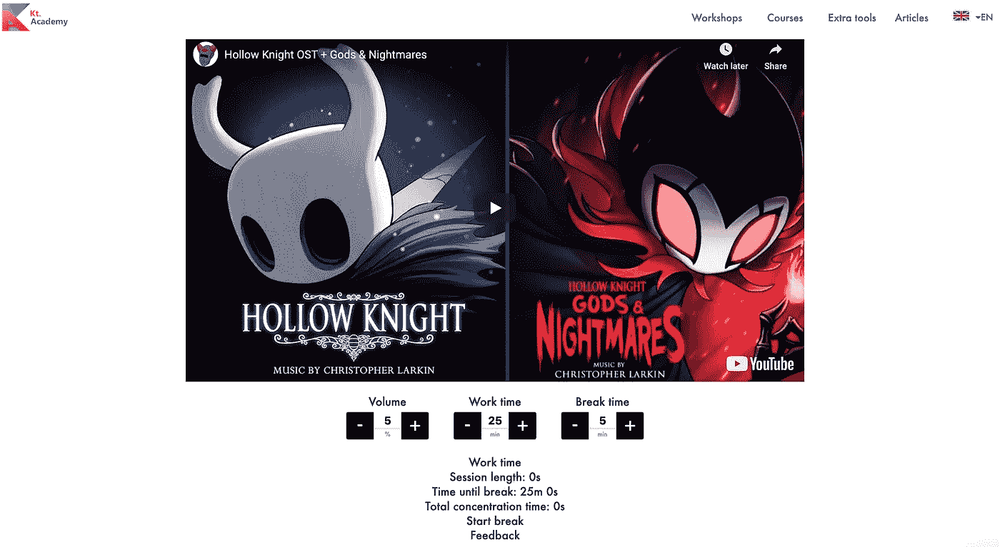
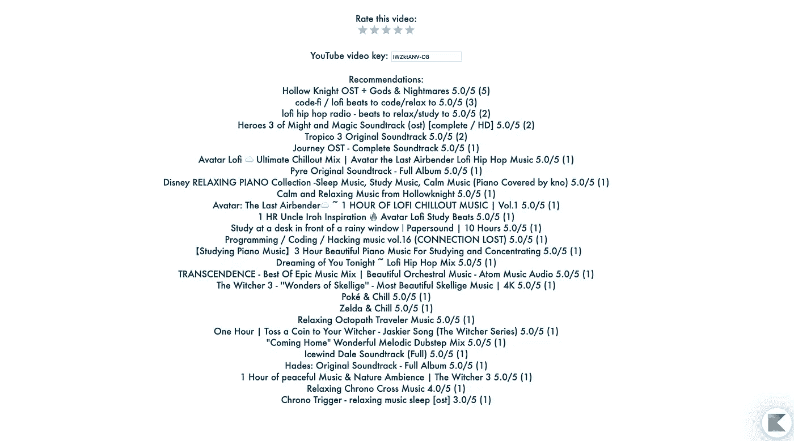
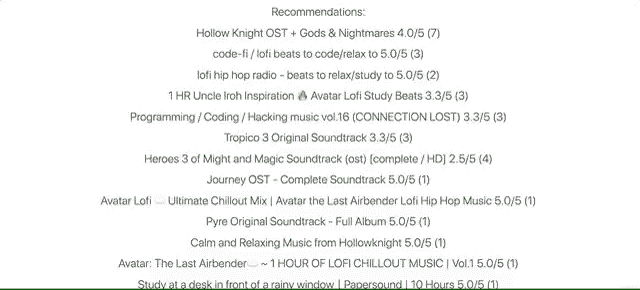
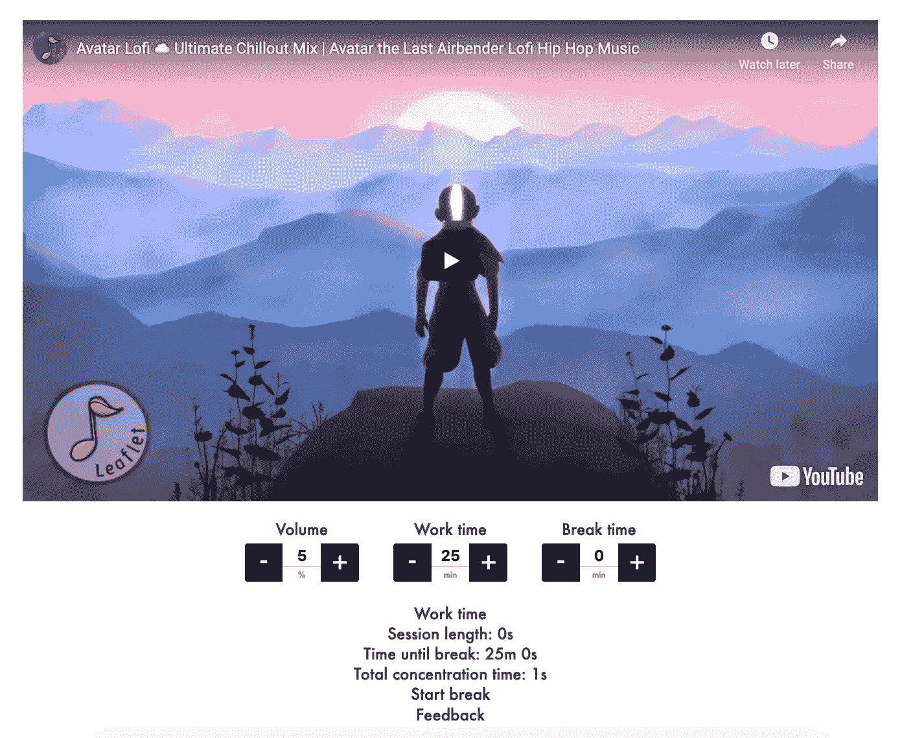

# 编码音乐🎵

> 原文：<https://blog.kotlin-academy.com/coding-music-da4a96e14af1?source=collection_archive---------5----------------------->

我们相信好的专注音乐和番茄工作法对编程很有帮助，所以我们将它们结合在我们新的 [**编程音乐工具**](https://kt.academy/music) 中。

你可以找到适合编程的音乐，设置工作和休息时间的偏好(所有值都存储在 cookies 中)，推荐和评价曲目。

您可以在我们网站的“额外工具”按钮下找到它。

您还可以通过添加到收藏夹或阻止推荐来自定义您的推荐列表。

我们还想到了那些喜欢用所有音乐工具功能听音乐，但不遵循番茄工作法定时器的人！您可以将休息时间设置为 0，您的会话将继续运行，除非您通过暂停视频来暂停它😉

如果您有任何建议或有任何其他想要分享的内容，请通过[联系人@kt.academy](http://contact@kt.academy) 联系我们。我们很乐意帮忙！🙂

*编码快乐！
Kt。学院队*

