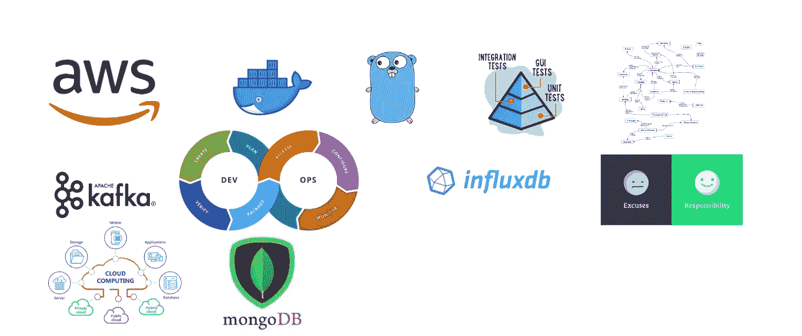

# 编码回顾(SMK 毕业后的故事)

> 原文：<https://medium.easyread.co/coding-recap-story-after-graduated-from-smk-bbb8ecf67193?source=collection_archive---------5----------------------->

大约 10 个月前，当我从 SMK 电信毕业后，我决定先工作，然后继续深造。现在我在 ketitik.com 工作，担任软件工程师，在 Binus 在线学习学习计算机科学。

我想重述一下我从凯迪克那里得到的信息。在我第一次加入 ketitik.com 的[时，我只知道基本的编程和基本的算法，我对软件的心态只是 CRUD，面向输出(这意味着我不知道我所构建的软件背后的协议等技术)，然后当我遇到问题时，我会在](http://ketitik.com) [stackoverflow](http://stackoverflow.com) 上搜索解决方案。但我在 ketitik 工作后，我有了新的思维、技术、经验和许多东西:d。

在这里，我回顾一下我从 SMK 毕业后至少 10 个月所得到的东西

# 戈朗

我从 ketitik 得到的第一件事是 golang，我以前从未接触过 golang，但在这里我建立了新的思维，编程不是关于语言，而是编程是关于解决问题，分解问题，模块化解决方案，并使你的代码可重用，所以在知道这一点后，在我看来学习新的编程语言很容易，这是真的[我只是花 3 天时间了解什么是 golang 和基本语法](https://medium.com/easyread/pengalaman-saya-belajar-golang-94478b98331d)，然后尝试用它解决一些问题。但是如果你想深入了解编程语言，你必须不断尝试。

# 单元测试

> 单元测试是一种软件测试方法，通过这种方法测试源代码的各个单元、一个或多个计算机程序模块的集合以及相关的控制数据、使用过程和操作过程，以确定它们是否适合使用。(来源于维基百科)

我以前不知道单元测试，但是在 ketitik 我被告知每个软件都应该有单元测试。第一次接触单元测试是很难的，尤其是关于模拟功能，大约一个星期左右，我学习单元测试，有时它会出现在我的脑海中，就像“伙计，我是做软件的，不是做单元测试 lol XD”，但随着时间的推移，我可以理解单元测试，并可以使测试覆盖 100%。

# TimeDivisionDuplex 时分双工

> **测试驱动开发** ( **TDD** )是一个[软件开发过程](https://en.wikipedia.org/wiki/Software_development_process)，它依赖于一个非常短的开发周期的重复:需求被转化为非常具体的[测试用例](https://en.wikipedia.org/wiki/Test_case)，然后软件被改进以通过新的测试，只是。这与允许添加未被证明满足需求的软件的软件开发相反。(来源于维基百科)

简而言之，TDD 就是你做一个测试用例，然后当你运行测试时，它必须先失败，然后你写实际代码，使它绿色或成功，然后添加更多的用例，重新写实际代码或重构。但是现在我实际上不是 100%做 TDD，但是我认为 TDD 是有趣的，因为你应该知道解决方案和分解问题，尝试从婴儿阶段直到你实际的代码编写解决问题，做 TDD 使你的代码可测试。哦，阿雅，我有一个关于 TDD 的激励视频

TDD Video

# 设计模式

除了学习 TDD，我还学习了设计模式，设计模式是设计问题解决方案的可重用形式，有了设计模式，你的代码将是可重用和可测试的，我认为学习这一点并不容易，因为你必须首先知道问题的解决方案，然后选择最佳模式。我有本书推荐学习设计模式，尤其是 GO 语言

 [## Go 设计模式|包装书籍

### 通过使用 TDD 学习惯用的、高效的、干净的和可扩展的 Go 设计和并发模式

www.packtpub.com](https://www.packtpub.com/application-development/go-design-patterns) 

# 消息代理

我得到的新事物是消息代理，一直以来我只知道软件前端后端和数据库，但软件比我知道的更多。我使用的消息代理是 [Apache Kafka](https://kafka.apache.org/) 。参考消息消息代理不仅仅是 apache kafka，还有很多消息代理，比如 Rabbit MQ，NSQ 等等。库我用来和阿帕奇卡夫卡一起工作的是 Shopify 的 Sarama。

 [## 萨拉马包

### 包 sarama 是一个纯粹的 Go 客户端库，用于处理 Apache Kafka(版本 0.8 及以后)。

godoc.org](https://godoc.org/github.com/Shopify/sarama) 

# gRPC

在我知道 gRPC 之前，应用程序是如何与 http 相互通信的。gRPC 是 google 开发的 RPC 系统，在 http 中，连接到同一个网络的每个人都可以相互交谈，但是在 gRPC 应用程序中，必须有接口描述语言(IDL)才能相互交谈，在这种情况下，gRPC 使用协议缓冲区，并在协议文件中定义 IDL。

# 码头工人

> **Docker** 是一个[计算机程序](https://en.wikipedia.org/wiki/Computer_program)，它执行[操作系统级虚拟化](https://en.wikipedia.org/wiki/Operating-system-level_virtualization)，也称为“容器化”。[【6】](https://en.wikipedia.org/wiki/Docker_(software)#cite_note-SYS-CON_Media-7)于 2013 年首次发布，由 [Docker，Inc .](https://en.wikipedia.org/wiki/Docker,_Inc.)[【7】](https://en.wikipedia.org/wiki/Docker_(software)#cite_note-os4u-8)开发

Docker 是帮助你的软件或服务在容器之上运行的应用程序，也许你知道 lxc，或多或少它们是一样的。学习 docker 并不难，有很多关于 docker 的资料，你可以阅读。

# CI/CD

如何让你的应用自动部署到服务器上？在我了解 CI/CD 之前，当我想部署应用程序时，我会 ssh 到服务器并运行命令以使应用程序运行，但现在我了解了 CI/CD，它使部署到服务器变得很容易。有许多 CI/CD 工具，如 GitlabCI、Jenkins 等。

# 流入量 DB

最后是 influre DB，influre DB 是时序数据库，那么什么是时序数据库呢？时间序列数据库是处理时间序列数据或任何以时间为索引的事物的数据库。sintax 就像 sql，所以如果你想了解 influxDB，你可以了解 influxdb 的概念，因为 influxdb 不像 SQL 那样有表和字段，但是 influxdb 有度量、标签、值。

 [## 流入数据文件

### InfluxDB、Telegraf、Chronograf、Kapacitor 和 Flux 的文档

docs.influxdata.com](https://docs.influxdata.com/influxdb) 

# 结论

这是我从 SMK 毕业后 10 个月的总结，实际上我得到了很多东西，但不是我上面写的所有东西，比如 graphql 服务器，basic ML 等等。学习任何东西的关键是学会找到你的最佳学习模式，如果你找到了你的学习模式，你会很容易学会任何东西，对于学习软件开发来说，你必须有如何解决问题的心态，而不是如何用任何编程语言编码，因为编程语言就像工具一样。

对于学生 SMK 或大学，请阅读文档，如果你在编码时有问题，请减少打开 stackoverflow 并尝试阅读文档，因为当你在 stackoverflow 中找到解决方案时，它只是即时解决方案，你不知道解决方案背后的内容。现在我正在学习 kubernetes，katacontainer 和 12factor.net。

所以伙计们，感谢阅读我的文章，我希望我的文章是有用的，并为我的糟糕的英语感到抱歉，这是我第一次用英语写文章，:D 干杯！！