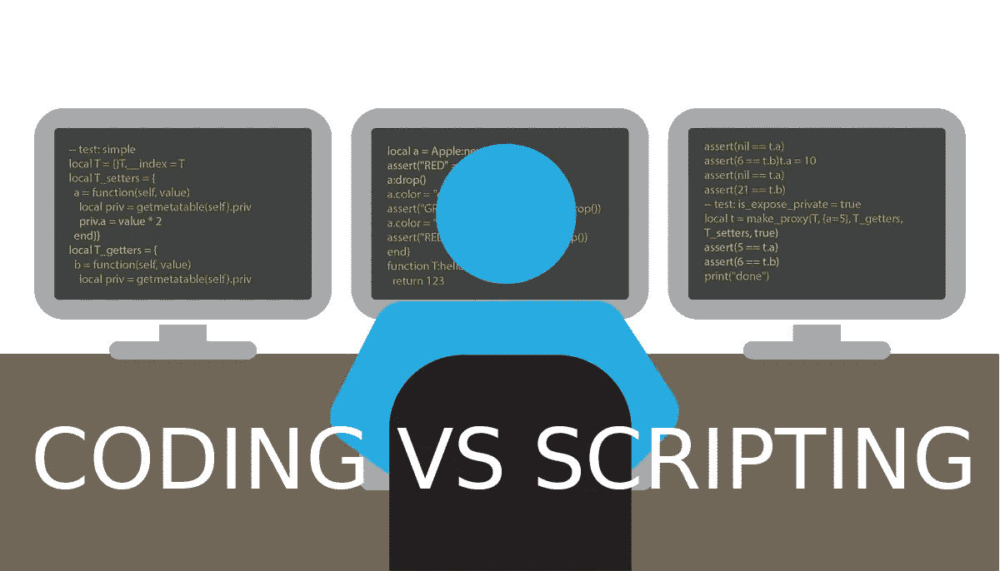

# 编码与脚本

> 原文：<https://medium.com/quick-code/coding-vs-scripting-42299d2dd17d?source=collection_archive---------4----------------------->

你可能听说过编码和脚本，但是有什么区别呢？

先解释一些事情吧。

# 什么是编码？

计算机编码是使用计算机编程语言给计算机和机器一套指令，告诉它们要执行什么动作。这是人类与机器交流的方式。它让我们能够创建计算机软件…