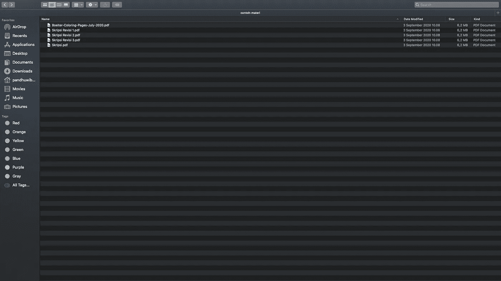
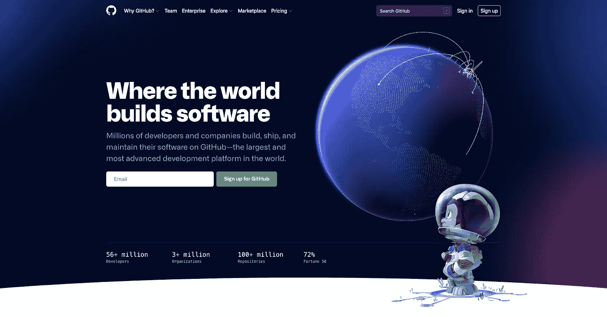

# Collaboration? Sering ada Revisi? coba Git deh! — Part 1

> 原文：<https://medium.easyread.co/collaboration-sering-ada-revisi-coba-git-deh-part-1-b954257d7543?source=collection_archive---------2----------------------->

Photo by [Austin Distel](https://unsplash.com/@austindistel?utm_source=medium&utm_medium=referral) on [Unsplash](https://unsplash.com?utm_source=medium&utm_medium=referral)

Halo teman-teman, selamat datang di blog saya. Tulisan kali ini saya akan membahas tentang **Git** .

Ketika kamu bekerja dengan banyak revisi baik jarang terjadi atau bahkan sering terjadi sehingga kamu menyimpan versi-versi revisian kamu lebih dari satu file, nah kamu perlu Git. Ketika kamu bekerja dengan tim alias lebih dari 2 orang untuk memudahkan pekerjaan kamu, nah kamu perlu Git.

Sebelum kita membahas tentang Git itu sendiri. Alangkah baiknya kita tau dulu mengenai **Version Control System** ( **VCS** ) atau ada juga yang menyebutnya dengan **Source Code Management** .

Version Control System/Source Code Management merupakan sebuah tools untuk membantu kamu dan saya dalam memanajemen suatu system/software/project aplikasi.

[Disclaimer] Maaf teman-teman, penggunaan VCS kurang tepat jika digunakan untuk memaintance pekerjaan seperti contoh di bawah ini atau pada gambar diatas. Contoh tersebut tidak harus untuk ditirukan dalam kehidupan kamu.

Misalnya pada contoh kasus seorang mahasiswa yang sedang mencoba menyelesaikan skripsinya. Mahasiswa tersebut mendapat banyak revisi setiap melakukan bimbingan ke dosen pembimbingnya (artinya setiap bertemu, pasti ada revisi). Belum lagi jika sudah direvisi, dan ternyata dosen tersebut melihat kembali, ternyata masih logis dan lebih baik dari tulisan sebelumnya, alhasil Mahasiswa tersebut harus kembali lagi ke tulisan sebelumnya. Bayangkan beberapa kali setiap pertemuan terjadi seperti itu, berapa banyak versi revisi yang akan mengisi direktorinya?

Nah, sama ketika kamu mengerjakan project/aplikasi/sistem, bisa saja terjadi seperti Mahasiswa tersebut. Nah, alangkah baiknya kenapa tidak dipakai tools yang sangat bermanfaat seperti layanan Version Control System ini.

Case lain, misalkan kamu ingin mengerjakan suatu project dengan tim, bagaimana melakukannya agar satu sama lain tidak saling tunggu-tungguan? Belum lagi ketika menggabungkan hasil kerjaannya, pasti ga mau kan kerjaan kamu bisa bisa ke replace kalau tidak teliti. Iya, kalau misalkan yang bertambah atau berkurangnya satu file. Tapi kalau misalkan yang berubah cuma 1 line code aja? Apa iya harus replace satu file?

Nah, pada contoh diatas kamu bisa memanfaatkan VCS juga. Kurang lebih seperti itu pengertian sederhananya.

Tools VCS sendiri sebenarnya bukan hanya Git saja yang nanti akan saya bicarakan, melainkan ada :

*   Subversion / SVN,
*   Mercurial,
*   CVS (Concurrent Versions System),
*   dan masih banyak lagi

## Jadi apa sih Version Control System itu?

Saya akan mengutip langsung ini dari website dari Git, bahwa

> Version Control adalah sebuah sistem yang merekam perubahan-perubahan dari sebuah berkas atau sekumpulan berkas dari waktu ke waktu sehingga kamu dapat melihat kembali versi khusus suatu saat nanti.

Semoga langsung paham dari penjelasan diatas ya teman-teman. Lengkapnya bisa baca pada referensi akhir tulisan ini ya.

# Git

Nah sebenarnya untuk macam-macam VCS masih banyak di luar sana. Tapi untuk tulisan ini seperti pada judul di atas, saya hanya akan membahas mengenai **Git** . Git juga sudah menjadi kebutuhan saya dalam bekerja, sudah menjadi hal penting untuk saya.

So, yukk saya harap kamu juga mau kenalan sama Git ini ya.

Photo by [Yancy Min](https://unsplash.com/@yancymin?utm_source=medium&utm_medium=referral) on [Unsplash](https://unsplash.com?utm_source=medium&utm_medium=referral)

Git yang dibuat oleh Linus Torvalds. Tugasnya untuk mencatat setiap perubahan pada file proyek yang dikerjakan oleh banyak orang ataupun sendiri. Git juga disebut dengan distributed revision control atau VCS terdistribusi, apa sih itu? Yakni penyimpanan database Git tidak hanya berada dalam satu tempat saja.

Semua orang yang terlibat dalam project akan menyimpan database Git, sehingga akan memudahkan dalam mengelola project baik online maupun offline.

Manfaat jika kamu tau tentang Git dan mempraktekkannya dalam kehidupan sehari-hari diantaranya :

*   Kamu bisa menyimpan seluruh versi source code,
*   Kamu bisa paham mengenai kolaborasi di dalam suatu project,
*   Kamu juga bisa ikut berkontribusi dalam project open-source di luar sana,
*   dan lain lain.

# **GitHub**

GitHub merupakan platform hosting kode untuk kontrol versi dan kolaborasi. Dapat memungkinkan kamu dan orang lain bekerja bersama dalam project dari mana saja. Project yang disimpan disebut dengan **repository** .

Setiap kamu buat repository, kamu bisa membuat versi public atau pun private. Kalau public, developer dapat melihat project-project kamu tanpa harus diinvite, mereka bisa download projectnya dengan suka-suka. Sebaliknya kalau repository-nya bersifat private, project tersebut hanya dapat dilihat oleh akun GitHub kamu dan orang-orang yang kamu undang untuk berkolaborasi.

Anyway, GitHub juga bukan hanya untuk sebagai tempat berkolaborasi dan menyimpan project saja, melainkan sudah lebih canggih lagi, bisa mengintegrasikan project kamu dengan hosting yang sudah kamu sediakan, dapat juga untuk melakukan automatisasi, dan lain semacamnya bisa dilakukan disana.

Oiya, selain GitHub kamu juga bisa menggunakan GitLab atau BitBucket sebagai pilihan kamu dalam berkolaborasi.

# Konklusi

Dengan mengetahui tools yang sudah saya sedikit jelaskan, semoga menambah wawasan kamu dan selamat mencoba, semoga bermanfaat! Sampai ketemu ditulisan berikutnya.

# Referensi

 [## Git - Tentang Version Control

### Apa itu version control dan mengapa sebaiknya Anda peduli? Version control adalah sebuah sistem yang merekam…

git-scm.com](https://git-scm.com/book/id/v2/Memulai-Tentang-Version-Control)  [## Apa Perbedaan Git dan GitHub? Berikut Penjelasannya - Dicoding Blog

### Seiring berjalannya waktu, setiap pekerjaan manusia selalu mengalami pembaharuan untuk lebih efisien. Tujuannya tidak…

www.dicoding.com](https://www.dicoding.com/blog/perbedaan-git-dan-github/)  [## Apa itu Git dan Kenapa Penting bagi Programmer?

### Git adalah salah satu tool yang sering digunakan dalam proyek pengembangan software. Git bahkan menjadi tool yang wajib…

www.petanikode.com](https://www.petanikode.com/git-untuk-pemula/)  [## Hello World

### The Hello World project is a time-honored tradition in computer programming. It is a simple exercise that gets you…

guides.github.com](https://guides.github.com/activities/hello-world/) 

[Call Friends]

Halo teman teman, untuk mendukung agar saya tetap bisa membuat tulisan-tulisan menarik lainnya. Kamu bisa support saya dengan membeli produk-produk asli produksi sendiri, homemade, dan yang pastinya brand lokal hanya di [@beneteen](https://www.instagram.com/beneteen/) atau ke [beneteen.com](https://beneteen.com/)