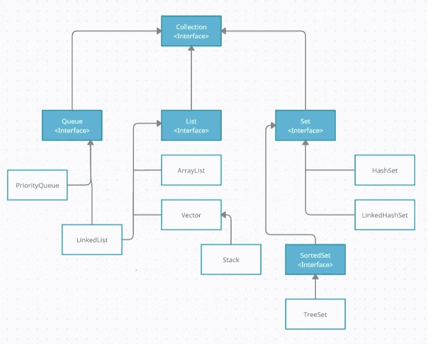

# 收集框架:快速指南

> 原文：<https://medium.com/quick-code/collection-framework-quick-guide-e9dbb21f940a?source=collection_archive---------0----------------------->

Java 中的集合框架是接口和类的集合，它提供了存储和操作一组对象的架构，有助于高效地处理数据。

集合接口封装了不同类型的集合，如下图所示。这些接口允许他们独立操作。下图中显示的接口是 Java 集合框架的基础。

Collection Interface

集合表示一组称为元素的对象，由集合接口中的一组类实现。有些允许重复元素，而有些则不允许。每个集合都有一些默认方法。

# 列表界面

列表是一个有序集合，它是集合接口的子接口。List 接口由类 ArrayList、LinkedList、Vector 和 Stack 实现。

## 数组列表

ArrayList 是 List 接口的一个可调整大小的数组实现。存储在列表中的元素可以被随机访问。

## 链接列表

LinkedList 是集合接口的实现。它在内部使用一个双向链表来存储元素。使用指针和地址来链接元素。我们不必在插入或删除后移动元素，所以插入和删除更容易。使用链表的一个小缺点是元素不能被直接访问，要访问一个元素我们需要从头开始。

## 矢量

Vector 是一个动态数组实现，意味着它是一个可增长的对象。它可以根据数组列表的需要而增长或收缩。唯一的区别是 vector 是同步的，因此它很少在非线程环境中使用。因为是同步的，所以在添加、搜索、删除和更新元素时，可以观察到较差的性能

## 堆

Stack 是 vector 的子类。它用后进先出的方法实现了堆栈数据结构。栈的实现和向量一样，但是有额外的操作，比如**推**和**弹出**。

# 队列接口

QueueInterface 保持先进先出的顺序(FIFO)。这是一个功能有限的有序列表，你可以在列表的末尾插入元素，在列表的开头删除元素，也就是说，它遵循 FIFO 规则。有各种子类，让我们谈谈优先级队列。

## 优先级队列

它是队列接口的实现，用于根据优先级处理对象。它不允许空值。

# SetInterface

java.util 包中存在 Set 接口。它是扩展集合框架的对象的无序集合，最多允许一个空值，并且不存储重复值。

## 哈希特

HashSet 是 Set 接口的一个实现。因为它实现了 set 接口，所以不允许出现重复值。HashSet 的底层数据结构是 Hashtable。它还实现了**可序列化的**和**可克隆的**接口。

## LinkedHashSet

LinkedHashSet 是 HashSet 的有序版本。这个实现与 HashSet 的不同之处在于，它维护一个贯穿所有条目的双向链表。这个链表定义了迭代排序，即元素被插入到集合中的顺序(*插入顺序*)。允许空元素

## 分类集合

SortedSet 接口是集合接口中 Set 接口的实现。该方法继承了 SetInterface 的特性，并添加了以排序方式存储所有元素的特性。

## 树集

TreeSet 是集合接口的实现，也是集合接口的子集。然而，在树集中的访问和检索是快速的。TreeSet 中的元素按升序存储。

这个故事只是给你提供一个集合框架的基本概述。但是为了详细阅读它们，oracle 文档是最好的参考。