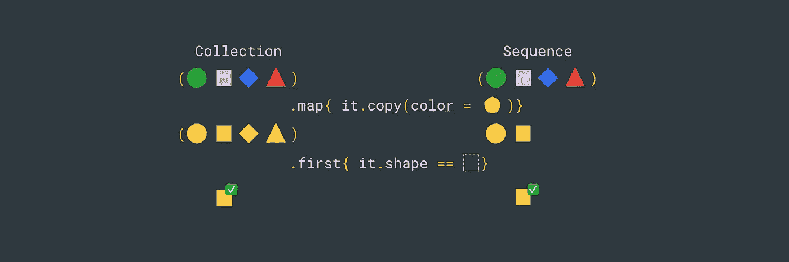
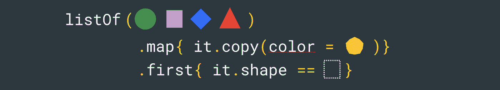
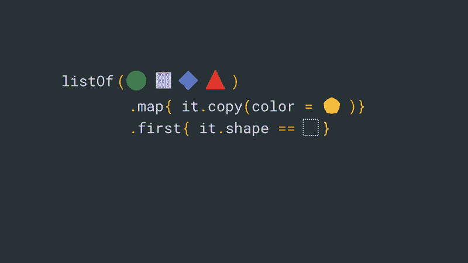
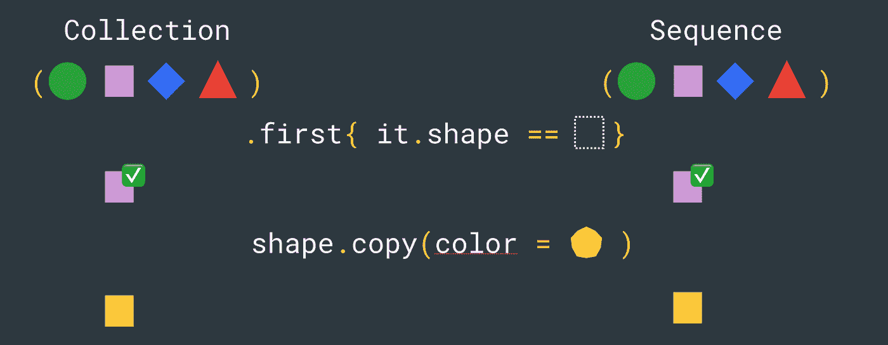

# 科特林中的集合和序列

> 原文：<https://medium.com/androiddevelopers/collections-and-sequences-in-kotlin-55db18283aca?source=collection_archive---------0----------------------->



Collections vs sequences

使用集合是一项常见的任务，Kotlin 标准库提供了许多非常有用的功能。它还提供了两种 ***方式*** 来处理集合，基于它们是如何被评估的:**急切地**——用`[Collection](https://kotlinlang.org/api/latest/jvm/stdlib/kotlin.collections/index.html)` [s](https://kotlinlang.org/api/latest/jvm/stdlib/kotlin.collections/index.html) ，和**懒散地**——用`[Sequence](https://kotlinlang.org/api/latest/jvm/stdlib/kotlin.sequences/index.html)` [s](https://kotlinlang.org/api/latest/jvm/stdlib/kotlin.sequences/index.html) 。请继续阅读，了解这两者之间的区别，您应该在何时使用哪一种，以及它们各自的性能含义。

# 集合与序列

急切求值和懒惰求值的区别在于*何时对集合执行*每个转换。

**集合**被*急切地*评估——每个操作在被调用时被执行，操作的结果被存储在一个新的集合中。集合上的转换是[内联函数](https://kotlinlang.org/docs/reference/inline-functions.html)。例如，看看`[map](https://github.com/JetBrains/kotlin/blob/master/libraries/stdlib/common/src/generated/_Collections.kt#L1312)`是如何实现的，我们可以看到它是一个`inline`函数，它创建了一个新的`ArrayList`:

```
public **inline** fun <T, R> Iterable<T>.map(transform: (T) -> R): List<R> {
  return mapTo(**ArrayList**<R>(collectionSizeOrDefault(10)), transform)
}
```

**序列**被*延迟*评估。它们有两种操作:**中间**和**终端**。中间操作不在现场进行；它们只是被储存起来。只有当一个终端操作被调用时，中间操作才会在一行中的每个元素上被触发**，最终应用终端操作。中间操作(如`map`、`distinct`、`groupBy`等)返回另一个序列，而终端操作(如`first`、`toList`、`count`等)不返回。**

序列不包含对集合项目的引用。它们是基于原始集合的迭代器创建的，并保存对所有需要执行的中间操作的引用。

与集合上的转换不同，序列上的中间转换不是内联函数—内联函数不能存储，序列需要存储它们。看看像`[map](https://github.com/JetBrains/kotlin/blob/master/libraries/stdlib/common/src/generated/_Sequences.kt#L860)`这样的中间操作是如何实现的，我们可以看到转换函数保存在一个`Sequence`的新实例中:

```
public fun <T, R> Sequence<T>.map(transform: (T) -> R): Sequence<R>{      
   return **TransformingSequence**(this, transform)
}
```

像`[first](https://github.com/JetBrains/kotlin/blob/master/libraries/stdlib/common/src/generated/_Sequences.kt#L117)`这样的终结操作遍历序列的元素，直到谓词条件匹配。

```
public inline fun <T> Sequence<T>.first(predicate: (T) -> Boolean): T {
   for (element in this) if (predicate(element)) return element
   throw NoSuchElementException(“Sequence contains no element matching the predicate.”)
}
```

如果我们看看像`[TransformingSequence](http://transformingsequence)`(在上面的`map`中使用)这样的序列是如何实现的，我们将会看到当在序列迭代器上调用 next 时，存储的转换也被应用。

```
internal class TransformingIndexedSequence<T, R> 
constructor(private val sequence: Sequence<T>, private val **transformer**: (Int, T) -> R) : Sequence<R> {override fun iterator(): Iterator<R> = object : Iterator<R> {
   …
   override fun **next()**: R {
     return **transformer**(checkIndexOverflow(index++), iterator.next())
   }
   …
}
```

不管您使用的是集合还是序列，Kotlin 标准库都为两者提供了相当广泛的操作，比如`find`、`filter`、`groupBy`等等。在实现你自己的版本之前，确保你已经检查过了。



# 集合和序列

假设我们有一个不同形状的物体列表。我们想把形状变成黄色，然后取第一个正方形。

Collections vs sequences

让我们看看每个操作如何、何时应用于集合，何时应用于序列

## 收集

*   调用——创建一个新的数组列表。我们遍历初始集合的所有项目，通过复制原始对象并更改颜色来转换它，然后将其添加到新列表中。
*   `first`被调用——我们遍历每一项，直到找到第一个方块

## 顺序

*   `asSequence` —基于原始集合的迭代器创建序列
*   `map`被调用—转换被添加到序列需要执行的操作列表中，但操作**未执行**
*   `first`被调用——这是一个终端操作，因此，所有的中间操作都在集合的每个元素上被触发。我们应用 map 遍历初始集合，然后首先遍历每个集合。因为第二个元素满足第一个元素的条件，所以我们不再对集合的其余部分应用映射。

当处理序列时，不会创建中间集合，因为项目是逐个评估的，所以只对某些输入执行映射。



Collections vs sequences — eager vs lazy evaluation

# 表演

## 变换的顺序

不管您使用的是集合还是序列，转换的顺序都很重要。在上面的例子中，`first`不需要发生在`map`之后，因为它不是`map`转换的结果。如果我们颠倒业务逻辑的顺序，首先调用集合，然后转换结果，那么我们只创建一个新对象—黄色方块。当使用序列时——我们避免创建两个新对象，当使用集合时，我们避免创建一个全新的列表。



Order of transformations matters — avoid unnecessary work

因为终端操作可以提前完成处理，而中间操作是延迟计算的，所以在某些情况下，与集合相比，序列可以帮助您避免不必要的工作。确保您总是检查转换的顺序以及它们之间的依赖关系！

## 内联和大型数据集的后果

集合操作使用内联函数，因此操作的字节码以及传递给它的 lambda 的字节码将被内联。序列不使用内联函数，因此，为每个操作创建新的`Function`对象。

另一方面，集合为每个转换创建一个新的列表，而序列只保留一个对转换函数的引用。

当使用 1-2 个操作符的**小集合**时，这些差异没有太大的影响，所以使用**集合**应该没问题。但是，当使用**大型列表**时，中间集合的创建会变得很昂贵；在这种情况下，使用**序列**。

不幸的是，我不知道有任何基准测试研究可以帮助我们更好地理解不同大小的集合或操作链如何影响集合与序列的性能。

集合急切地评估您的数据，而序列则懒洋洋地这样做。根据数据的大小，选择一个最合适的:集合——对于小的列表或序列——对于大的列表或序列，并注意转换的顺序。