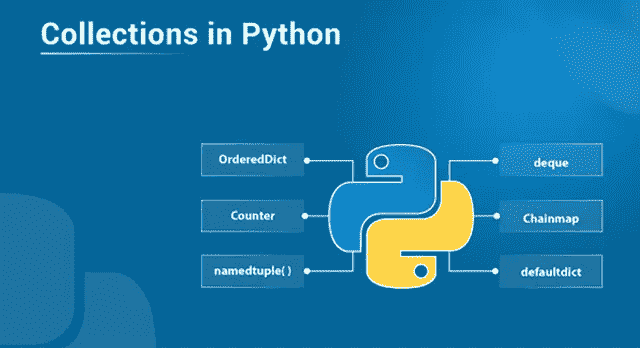

# 关于 Python 集合您需要知道的一切

> 原文：<https://medium.com/edureka/collections-in-python-d0bc0ed8d938?source=collection_archive---------1----------------------->



Collections in Python — Edureka

Python 编程语言有四种集合数据类型——列表、元组、集合和字典。但是 python 还附带了一个内置模块，称为集合，它具有专门的数据结构，基本上弥补了四种数据类型的缺点。在本文中，我们将详细介绍每一种专门的数据结构。以下是这篇文章涉及的主题:

*   Python 中的集合是什么？
*   专用集合数据结构

1.  命名元组( )
2.  双端队列
3.  链式地图
4.  计数器
5.  有序直接
6.  默认字典
7.  用户词典
8.  用户列表

# Python 中的集合是什么？

python 中的集合基本上是容器数据类型，即列表、集合、元组、字典。基于声明和使用，它们具有不同的特征。

*   列表在方括号中声明，它是可变的，存储重复的值，并且可以使用索引访问元素。
*   一个元组本质上是有序的和不可变的，尽管在一个元组中可以有重复的条目。
*   集合是无序的，用方括号声明。它没有索引，也没有重复的条目。
*   字典有键值对，本质上是可变的。我们用方括号声明一个字典。

这些是 python 的通用内置容器数据类型。但是众所周知，python 总是能提供一些额外的东西。它附带了一个名为 collections 的 python 模块，该模块具有专门的数据结构。

# 专用集合数据结构

python 中的集合模块实现了专门的数据结构，为 python 的内置容器数据类型提供了一种替代方案。以下是集合模块中的专用数据结构。

1.  命名元组( )
2.  双端队列
3.  链式地图
4.  计数器
5.  有序直接
6.  默认字典
7.  用户词典
8.  用户列表
9.  用户字符串

## 命名元组( )

它返回一个带有命名条目的元组，这意味着元组中的每个值都有一个指定的名称。它克服了使用索引值访问元素的问题。使用 namedtuple()可以更容易地访问这些值，因为您不必记住索引值来获取特定的元素。

它是如何工作的？

首先，您必须导入 collections 模块，它不需要安装。

```
from collections import namedtuple
```

查看以下代码，了解如何使用 namedtuple。

```
a = namedtuple('courses' , 'name , tech')
s = a('data science' , 'python')
print(s)

#the output will be courses(name='python' , tech='python')
```

**如何使用列表创建命名元组？**

```
s._make(['data science' , 'python'])
#the output will be same as before.
```

## 双端队列

发音为“deck”的 deque 是一个优化的列表，可以轻松地执行插入和删除操作。

**它是如何工作的？**

```
#creating a deque
from collections import deque

a = ['d' , 'u' , 'r' , 'e' , 'k']
a1 = deque(a)
print(a1)
#the output will be deque([ 'd' , 'u' , 'r' , 'e' , 'k' ])
```

现在让我们来看看我们将如何在 deque 中插入和删除项目。

```
a1.append('a')
print(a1)
# the output will be deque([ 'd' , 'u' , 'r' , 'e' , 'k' , 'a' ])
a1.appendleft('e')
print(a1)
# the output will be deque(['e' , 'd' , 'u' , 'r' , 'e' , 'k' , 'a' ])
```

显而易见，使用 deque 可以增强组件的插入，也可以删除组件。

```
a1.pop()
print(a1)
#the output will be deque([ 'e' , 'd' , 'u' , 'r' , 'e' , 'k' ])
a1.popleft()
print(a1)
#the output will be deque([ 'd' , 'u' , 'r' , 'e' , 'k' ])
```

与内置数据类型类似，我们还可以对 deque 执行其他一些操作。像计数元素或清除队列等。

## 链式地图

这是一个类似字典的类，它能够创建多个映射的单一视图。它基本上返回其他几个字典的列表。假设您有两个包含几个键值对的字典，在这种情况下，ChainMap 将创建一个包含这两个字典的列表。

它是如何工作的？

```
from collections import ChainMap
a = { 1: 'edureka' , 2: 'python'}
b = {3: 'data science' , 4: 'Machine learning'}
c = ChainMap(a,b)
print(c)
#the output will be ChainMap[{1: 'edureka' , 2: 'python'} , {3: 'data science' , 4: 'Machine learning'}]
```

为了访问或插入元素，我们使用键作为索引。但是要在链表中添加一个新的字典，我们使用下面的方法。

```
a1 = { 5: 'AI' , 6: 'neural networks'}
c1 = c.new_child(a1)
print(c1)
#the output will be ChainMap[{1: 'edureka' , 2: 'python'} , {3: 'data science' , 4: 'Machine learning'}, { 5: 'AI' , 6: 'neural networks'}]
```

## 计数器

它是一个字典子类，用于统计可散列对象。

**它是如何工作的？**

```
from collections import Counter
a = [1,1,1,1,2,3,3,4,3,3,4]
c = Counter(a)
print(c)
#the output will be Counter = ({1:4 , 2:1 , 3:4 , 4:2})
```

除了可以在字典计数器上执行的操作之外，我们还可以执行另外 3 个操作。

1.  element 函数—它返回一个包含计数器中所有元素的列表。
2.  Most_common( ) —它返回一个排序列表，其中包含计数器中每个元素的计数。
3.  Subtract( ) —它接受一个 iterable 对象作为参数，并减去计数器中元素的计数。

## 有序直接

它是一个字典子类，记住条目添加的顺序。基本上，即使你改变了键的值，位置也不会因为它在字典中的插入顺序而改变。

**它是如何工作的？**

```
from collections import OrderedDict
od = OrderedDict()
od[1] = 'e'
od[2] = 'd'
od[3] = 'u'
od[4] = 'r'
od[5] = 'e'
od[6] = 'k'
od[7] = 'a'
print(od)
#the output will be OrderedDict[(1 , 'e'), (2 , 'd') , (3 , 'u'), (4 , 'r'), (5 , 'e'), (6 , 'k'), (7 , 'a')]
```

在字典中插入什么值并不重要，OrderedDict 会记住它的插入顺序，并相应地获得输出。即使我们改变了键值。比方说，如果我们将键值 4 更改为 8，输出中的顺序不会改变。

## 默认字典

它是一个字典子类，调用工厂函数来提供缺失的值。通常，当在字典中调用缺少的键值时，它不会引发任何错误。

**它是如何工作的？**

```
from collections import defaultdict
d = defaultdict(int)
#we have to specify a type as well.
d[1] = 'edureka'
d[2] = 'python'
print(d[3])
#it will give the output as 0 instead of keyerror.
```

## 用户词典

这个类充当字典对象的包装器。对这个类的需求来自于直接从 dict 继承子类的需要。随着底层字典成为一个属性，使用这个类变得更加容易。

```
class collections.UserDict([initialdata])
```

这个类模拟了一个字典。实例的内容保存在一个常规的字典中，可以通过 UserDict 类的“data”属性来访问它。不保留原始数据的参考，以便用于其他目的。

## 用户列表

这个类就像是列表对象的包装器。对于其他列表来说，它是一个有用的基类，比如可以从列表中继承并覆盖现有方法或者添加更少的新方法的类。

对这个类的需求来自于直接从列表中派生子类的需要。随着底层列表成为一个属性，使用这个类变得更加容易。

```
class collections.UserList([list])
```

它是一个模拟列表的类。实例的内容保存在一个习惯列表中。依赖列表的子类来提供一个构造函数，这个构造函数可以在没有或只有一个争用的情况下被调用。

在本文中，我们学习了 python 中集合模块的专用数据结构。优化会带来更好的性能和增强的结果。这同样适用于我们自己的职业和技能。如果你想查看更多关于人工智能、DevOps、道德黑客等市场最热门技术的文章，你可以参考 Edureka 的官方网站。

请留意本系列中的其他文章，它们将解释 Python 和数据科学的各个方面。

> 1.[Python 中的机器学习分类器](/edureka/machine-learning-classifier-c02fbd8400c9)
> 
> 2.[Python Scikit-Learn Cheat Sheet](/edureka/python-scikit-learn-cheat-sheet-9786382be9f5)
> 
> 3.[机器学习工具](/edureka/python-libraries-for-data-science-and-machine-learning-1c502744f277)
> 
> 4.[用于数据科学和机器学习的 Python 库](/edureka/python-libraries-for-data-science-and-machine-learning-1c502744f277)
> 
> 5.[Python 中的聊天机器人](/edureka/how-to-make-a-chatbot-in-python-b68fd390b219)
> 
> 6.[用 Python 进行网页抓取](/edureka/web-scraping-with-python-d9e6506007bf)
> 
> 7. [Python 模块](/edureka/python-modules-abb0145a5963)
> 
> 8. [Python 开发者技能](/edureka/python-developer-skills-371583a69be1)
> 
> 9.[哎呀面试问答](/edureka/oops-interview-questions-621fc922cdf4)
> 
> 10.一个 Python 开发者的简历
> 
> 11.[Python 中的探索性数据分析](/edureka/exploratory-data-analysis-in-python-3ee69362a46e)
> 
> 12.[带 Python 的乌龟模块的贪吃蛇游戏](/edureka/python-turtle-module-361816449390)
> 
> 13. [Python 开发者工资](/edureka/python-developer-salary-ba2eff6a502e)
> 
> 14.[主成分分析](/edureka/principal-component-analysis-69d7a4babc96)
> 
> 15. [Python vs C++](/edureka/python-vs-cpp-c3ffbea01eec)
> 
> 16.[刺儿头教程](/edureka/scrapy-tutorial-5584517658fb)
> 
> 17. [Python SciPy](/edureka/scipy-tutorial-38723361ba4b)
> 
> 18.[最小二乘回归法](/edureka/least-square-regression-40b59cca8ea7)
> 
> 19. [Jupyter 笔记本备忘单](/edureka/jupyter-notebook-cheat-sheet-88f60d1aca7)
> 
> 20. [Python 基础知识](/edureka/python-basics-f371d7fc0054)
> 
> 21. [Python 模式程序](/edureka/python-pattern-programs-75e1e764a42f)
> 
> 22.[Python 中的生成器](/edureka/generators-in-python-258f21e3d3ff)
> 
> 23. [Python 装饰器](/edureka/python-decorator-tutorial-bf7b21278564)
> 
> 24. [Python Spyder IDE](/edureka/spyder-ide-2a91caac4e46)
> 
> 25.[在 Python 中使用 Kivy 的移动应用](/edureka/kivy-tutorial-9a0f02fe53f5)
> 
> 26.[十大最佳学习书籍&练习 Python](/edureka/best-books-for-python-11137561beb7)
> 
> 27.[用 Python 实现的机器人框架](/edureka/robot-framework-tutorial-f8a75ab23cfd)
> 
> 28.[使用 PyGame 的 Python 中的贪吃蛇游戏](/edureka/snake-game-with-pygame-497f1683eeaa)
> 
> 29. [Django 采访问答](/edureka/django-interview-questions-a4df7bfeb7e8)
> 
> 30.[十大 Python 应用](/edureka/python-applications-18b780d64f3b)
> 
> 31.[Python 中的哈希表和哈希表](/edureka/hash-tables-and-hashmaps-in-python-3bd7fc1b00b4)
> 
> 32. [Python 3.8](/edureka/whats-new-python-3-8-7d52cda747b)
> 
> 33.[支持向量机](/edureka/support-vector-machine-in-python-539dca55c26a)
> 
> 34. [Python 教程](/edureka/python-tutorial-be1b3d015745)

*原载于 2019 年 6 月 24 日 https://www.edureka.co*[](https://www.edureka.co/blog/collections-in-python/)**。**