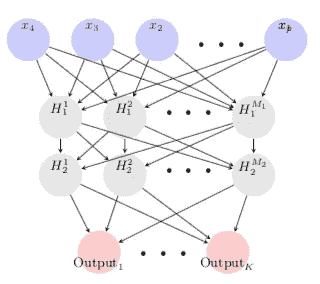
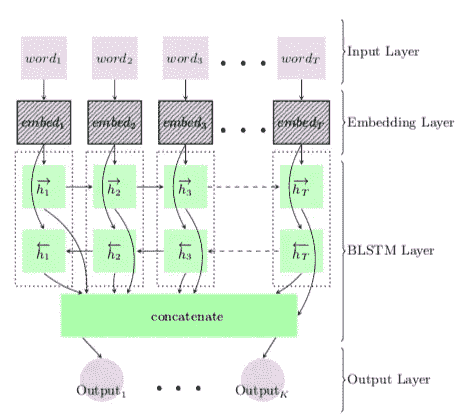
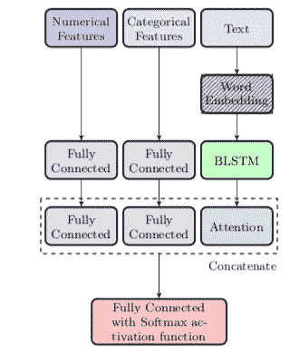
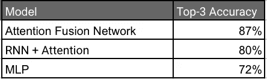

# 将行为和电子邮件内容结合起来以改善客户支持

> 原文：<https://medium.com/square-corner-blog/combining-behavior-and-e-mail-content-to-improve-customer-support-da0a02eb8d69?source=collection_archive---------2----------------------->

作者:夏羽·福索、菲利普·斯潘诺德斯、本杰明·c·波内德尔、布莱恩·雷诺索和珍妮特·柯

> 注意，我们已经行动了！如果您想继续了解 Square 的最新技术内容，请访问我们在 https://developer.squareup.com/blog[的新家](https://developer.squareup.com/blog)

# 介绍

我们在 Square 的主要目标之一是提供卓越的客户体验，尤其是当客户委托公司进行融资时。这对于 Square 的贷款分支机构 [Square Capital 来说更为关键，在这里，我们的卖家也是借款人。我们的运营团队致力于实现这一目标，并对卖家有关贷款产品的询问提供一致、快速和量身定制的回复。

每年，该团队都会收到数万封来自卖家的关于我们产品的电子邮件。为了对查询提供一致的响应，运营代理(OA)手动将电子邮件分为 20 多个不同的类别。例如，这些主题包括贷款成本解释、贷款资格要求和贷款提前还款。OA 然后根据与该类别相关联的模板电子邮件来做出他们的响应。多年来，查询量随着贷款发放量的增加而增加，这促使人们需要一种数据科学解决方案。Square Capital 数据科学团队试图通过开发一个深度学习模型来减轻一些电子邮件量，该模型在提交后立即向卖家提供关于他们的查询的热门信息。

为了实现这一目标，我们与 Square 内容和法律团队合作，针对每个类别创建了易于阅读的文章，其中包含的信息与运营团队回复的电子邮件类似。在提交他们的查询时，向卖家呈现相关的文章，并且如果内容解决了他们的问题，卖家可以将他们自己从服务队列中移除。因为书面查询通常可以链接到多个类别，所以我们构建了模型来提供与查询最相关的前三篇文章。](https://squareup.com/capital)

# 我们的解决方案

在这个项目中，我们通过将两个不同的深度学习模型结合到一个称为 ***注意力融合网络模型*** 的混合模型中，描述了一个用于服务卖方查询的鲁棒预测算法。

*   第一个模型通过**多层感知器(MLP)** 仅使用与销售者和方形产品互动相关的数据。

Representation of a 2-hidden layer Neural Network

*   第二个主要关注入站电子邮件查询中包含的文本。为了实现这一点，我们首先使用 [FastText](https://github.com/facebookresearch/fastText) 词汇查找矩阵将每个单词转换为其向量表示，并将单词嵌入序列编码到句子矩阵中。这是通过将序列输入到由**长短期记忆模块(LSTM)** 组成的**双向递归神经网络(RNN)** 来实现的。最后，我们使用一种注意机制来总结编码信息，并使最重要的特征更加突出。这种方法遵循 Matthew Honnibal 提出的[嵌入、编码、参与、预测(EEAP)框架。](https://explosion.ai/blog/deep-learning-formula-nlp)

Representation of a Bidirectional LSTM

MLP 模型和注意力 RNN 模型的最后隐藏层被连接并被馈送到 softmax 激活函数以计算类别概率。

Representation of the Attention Fusion Network model

# 结果

总的来说，我们的解决方案优于两个候选模型，并表明可以利用客户信号和查询上下文之间的复杂交互来提供更好的预测。

Comparison of the models performances using Top-3 Accuracy

# 结论

这项工作最有趣的方面之一是揭示文本特征和非文本特征之间的相互作用。特别是，在结合两种来源时，总体预测能力得到了实质性的提高。非文本信号有助于放大文本的关键方面，如果没有额外的上下文，这些方面是不可能学习的。

该结果表明，在 NLP 的工业应用中，大量文本数据不可用(就样本而言)，或者在底层文本数据不能单独预测结果的情况下；可以利用可用的外部信号来提高手头任务的预测性能。这里介绍的注意力融合网络是实现这一目标的一种尝试，也是为我们的卖家提供最快和最有针对性的回应。

你会在 https://arxiv.org/pdf/1811.03169.pdf 找到我们的报纸。