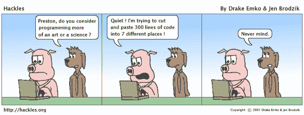
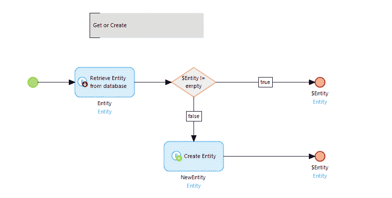
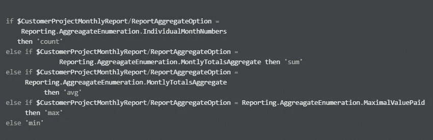
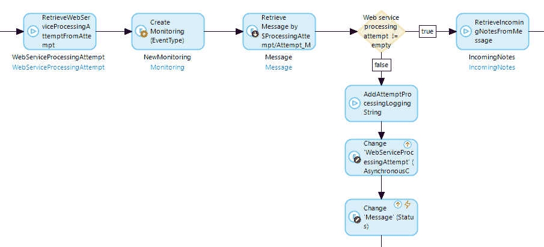
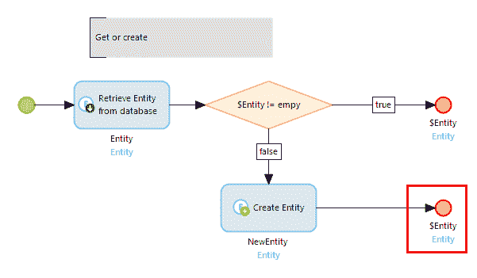
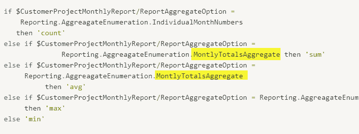
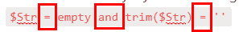
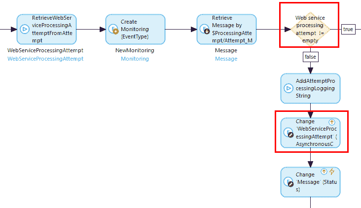

# 常见的 Mendix 错误

> 原文：<https://medium.com/mendix/common-mendix-bugs-64bfe356c76c?source=collection_archive---------3----------------------->

作为一名开发人员，我很高兴地说，开发人员非常重视他们(我们)自己。我们为自己的工作感到自豪，并认为自己非常擅长。因此，我们有这样的想法，如果奇迹般地出现了一个 bug，它一定是在一段非常复杂的代码中。然而，研究表明，大多数 bug 的起源要卑微得多。

错误的主要来源之一是…等等… **复制粘贴**代码。例如，当复制一段代码并打算在另一个地方稍微修改它时，这就引入了错误。由于分心或其他原因，修改(或其一部分)没有完成。更多的例子，我推荐这个关于[最后一行效果](https://www.viva64.com/en/b/0260/)的精彩帖子。

错误的另一个主要来源是**过度自信**以及相应的缺乏关注。在这个场景中，开发人员正在实现一些琐碎的算法，给人一种“这太简单了，我以前已经做过很多次了”的感觉，这导致了愚蠢的错误。点击查看一些真实的例子[。](http://findbugs.blogspot.com/2007/05/round-and-round-we-go-netbeans-wtf.html)

在这篇博文的下一部分，我将分享一些包含错误的 Mendix 微流和表达式的例子。这些错误的例子来自我参与过的真实的 Mendix 项目(为了使它们更具说明性，做了一些小的简化)。为了使它更有趣，我鼓励你在检查答案之前自己找出错误(答案在底部)。

**附件 A:获得或创造**

啊，我的最爱。每当需要延迟加载时，这是首选的方法。检查数据库中是否存在某个对象，如果不存在，则创建它。因为在 Mendix 中不可能重新分配对象变量，所以我经常为此使用一个单独的微流。如此简单，如此琐碎。只有三个动作，还会有什么问题呢？你能发现这个错误吗？

**附件 B:丢失开关案例**

由于 Mendix 表达式中缺少 switch case，我经常编写 if-else if 语句链。看看你能否找出下面表达式中的错误。

**展示 C:让空字符串比较再次变得伟大**

每个 Mendix 开发人员[都知道检查空字符串](https://forum.mendixcloud.com/link/questions/1057)需要检查空字符串值即`''`和`empty`即`null`变量/成员。这通常与`trim`相结合，要求有意义的用户输入。这是每个开发人员每天都要做的事情。所以下面的表达式 **(1)** : `trim($Str) != ''and $Str != empty`应该没有错误

或者这个 **(2)** : `$SignupHelper/AddressCityCode != empty and trim($SignupHelper/AddressCountryCode) != ''`

如果这太容易了，试试下面这个 **(3)** : `$Str = empty and trim($Str) = ''`

**展示 D:可怕的空指针异常**

根据 java 文档，当应用程序试图在需要值的情况下使用空值时，会引发空指针异常。有了这个提示，您能发现下面微流中的错误吗？

示例到此结束(答案如下)

*简单总结一下*每个开发者在开发的时候都会犯错误。这一点很清楚。通过这篇文章，我希望让你相信，这些错误中的许多确实可以被一台机器检测出来，而无需了解正在被审查的应用程序的商业案例。

## Mendix 的自动代码审查程序

Mendix 的自动代码审查程序检查 100 多条不同类别的规则，如*安全性*、*性能*和*可维护性*。还有 [30 *可靠性*规则](https://sdf-docs.mansystems.com/docs/acr-rules/reliability/)它们的目标是发现你的应用程序中的 bug。例如，这些规则检查:

*   [流程的返回表达式应该不同](https://sdf-docs.mansystems.com/docs/acr-rules/reliability/identicalreturnvalue/)(展示 A)
*   [“if/else if”语句链应该有不同的条件](https://sdf-docs.mansystems.com/docs/acr-rules/reliability/identicalifelseifcondition/)(附件 B)
*   [应正确检查空钻柱](https://sdf-docs.mansystems.com/docs/acr-rules/reliability/emptystringcheck/)(附件 C)
*   [空变量不应该用在抛出空指针异常的动作中](https://sdf-docs.mansystems.com/docs/acr-rules/reliability/emptyvariableaction/)(展示 D)

*不相信，*然后注册一个免费试用版，亲自体验自动化代码审查的威力:[https://content.mansystems.com/acr-trial-request](https://content.mansystems.com/acr-trial-request)

[最初发表于此。](https://www.notion.so/gajduk/How-can-automated-code-reviews-find-bugs-in-your-Mendix-app-b330e72e19cf45a0a334ada93075bc63)

## 答案

**附件 A:获取或创建**

原来新创建的实体没有返回。

**证物 B:** **丢失开关案例**

这是复制粘贴错误的一个很好的例子。没有人愿意键入的长变量名加上重复的模式。

**展示 C:让空字符串比较再次变得伟大**

**(1)**`trim`在检查变量是否为`empty`之前完成。如果变量确实是`empty`，对`empty`的检查甚至不会被触发，因为`trim`将失败，并出现空指针异常😱。

**(2)** 一个不同的变量被比较为空，而不是被修剪的变量。虽然这在技术上是正确的代码，不会导致任何错误，但这很可能不是开发人员想要的。

**(3)** 当比较为空时有三个运算符要写，每个有两个选项:

这导致了 8 种可能的组合，其中只有两种是正确的:`**if $A != empty and trim($A) != '' then $A else 'empty'**` **、**和`**if $A = empty or trim($A) = '' then 'empty' else $A**` **。**

**展示 D:可怕的空指针异常**

这是一个严重的错误，因为这个流甚至没有机会做预期的事情。在第一次出现空对象时，错误流将直接导致空指针异常和用户的严重错误，并且可能导致数据库中的*数据损坏。*