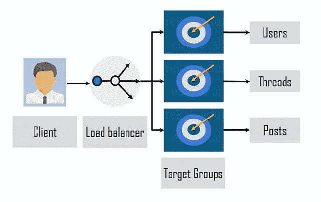
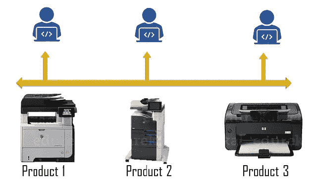

# 2021 年使用 DevOps 的五大公司

> 原文：<https://medium.com/edureka/companies-using-devops-c8480b18315?source=collection_archive---------1----------------------->

使用 DevOps 的公司正在经历一场严重的文化转变。但在理解其背后的原因之前，让我们来看看什么是 DevOps 是一种方法论，它带来了“DevOps？在本文中，我们将关注一些已经实施 DevOps 的快速增长的跨国公司和初创公司。 **Dev** 和 **Ops** 团队在一起。这种实践旨在通过使用不同的自动化工具以更快的速度交付产品。DevOps 帮助那些热衷于提高团队灵活性和敏捷性的企业。

使用 DevOps 的公司名单如下:

*   亚马孙
*   大功率(High Power)ˌ高压(High Pressure)ˌ高性能(High Performance)ˌ高聚物(High Polymer)
*   Etsy
*   网飞
*   砖坯黏土

# 1.亚马逊河

# 问题

*   你一定知道亚马逊是世界上最大的电子商务公司之一。但是早在 2001 年，他们的网站就遵循了 T4 传统的整体架构。在这里，所有流程都耦合在一起，作为单一服务运行
*   随着时间的推移，随着源文件的增长，在物理服务器上扩展、维护和升级他们的应用变得越来越困难

## 解决办法

为了解决单一架构的问题，亚马逊从物理服务器转向基于云的**亚马逊网络服务(AWS)** 。

目前，AWS 遵循一个**微服务**架构，如下图**所示。**在这个架构中，客户端首先发出请求。这里，负载平衡器检查客户端请求，并将其分配给正确的微服务。反过来，微服务有一个跟踪实例和端口的目标组。在 Amazon 中，它们是三种类型的微服务，即用户、线程和帖子。

## 功能和工具

现在我们知道了微服务是如何工作的，让我们看看 Amazon 为采用 DevOps 实践而实现的一些工具和特性。

开发人员通过版本控制工具(如)和实践(如**代码部署**)对他们的代码进行频繁但微小的更改，以帮助修复错误并添加新功能来改进底层软件应用程序。AWS CodeDeploy 就是这样一种服务，它跟踪部署并简化软件发布过程。

*亚马逊还使用了* ***阿波罗、*** *简单的一键内部部署工具。阿波罗的工作是在一组主机上部署一套特定的软件。它还提供了版本化的工件和测试回滚。*

另一方面，像**配置管理**和**基础设施即代码**这样的实践有助于监控和修改软件。它跟踪系统的性能和开发人员使用的资源。这样，测试团队可以提前发现问题，并立即修复它们。

***这些 DevOps 实践和实现帮助亚马逊节省了数百万美元！***

接下来，我将讨论本文的第二个案例。

# 2.大功率(High Power)ˌ高压(High Pressure)ˌ高性能(High Performance)ˌ高聚物(High Polymer)

他分析说，开发人员花了大约 5%的时间开发和支持新功能，而其余的时间则用于规划、集成和测试。

## 问题

*   Gary 的团队由分布在美国、巴西和印度等国家的大约 400 多名开发人员组成，但每年只发布两个软件版本！这是因为 LaserJet 型号有单独的代码库，这导致效率低下
*   在编写代码 6 周后，通过手工测试发现了软件缺陷。修复一个几周前在代码中出现的错误，对开发人员来说是劳动密集型的，也是令人厌倦的
*   这就是团队需要一种新方法来消除瓶颈的地方

惠普团队采用了持续集成/持续部署(CI/CD)管道和测试自动化。

正如您在下图中看到的，他们的第一步是创建一个通用平台来支持所有产品和型号。这被称为基于主干的开发或**持续集成**，它消除了不同代码分支的集成所带来的辛劳。

## 解决办法

惠普团队采用了持续集成/持续部署(CI/CD)管道和测试自动化。

正如您在下图中看到的，他们的第一步是创建一个通用平台来支持所有产品和型号。这被称为基于主干的开发或**持续集成**，它消除了不同代码分支的集成所带来的辛劳。

他们还构建了一组针对主干运行的自动化单元测试，这减少了 6 周的手动测试时间，从而提高了产品质量并诱导了更快的反馈。

*在这些自动化测试中，惠普使用了一个名为*"**Stopped the line "***的工具，当代码破坏任何单元测试或构建时，该工具会向开发人员发出警报。*

***这些 DevOps 实践在一天内导致了大约 100 到 150 次代码提交和 75，000 到 1，000，000 行代码变更！***

在本文的下一部分，我将讨论一个创业公司如何实现 DevOps 的实践。

# 3.ETSY

*   Etsy 是最早使用 DevOps 的公司之一。它是一家专注于销售手工和复古用品的美国电子商务网站。

## 问题

*   最初，Etsy 为他们组织的发展而奋斗，因为他们采用了整体架构
*   他们的部署率大约是一周两次，导致各部门相互隔离。Etsy 必须找到摆脱这种传统体制的方法

## 解决办法

新的首席技术官(CTO)引入了一个团队来采用 DevOps 实践。如下图所示，CI/CD 管道每天帮助部署大约 50 到 100 次服务。

代码的第一次发布是面向组织内随机的一组用户。经过测试和反馈后，它将被推向整个 Etsy 社区。

## 进步和工具

*在代码部署中，Etsy 使用了****deploy inator****一个提供一键部署的工具。*它每天帮助部署大约 40 次代码。

他们还使用**亚马逊网络服务(AWS)** 来执行他们的 DevOps 操作。

因此，在一个非常著名的叫做 Jenkins 的持续集成工具的帮助下，整个测试阶段可以自动化。它有助于 CI/CD 渠道的平稳运行。Jenkins 现在每天执行超过 14，000 个测试套件。

Etsy 开发 Kale 来检测数据中的异常值。Kale 有助于监控执行的每个部署，以确保应用程序是用户友好的和稳定的。

***在 Etsy，员工要勇于承担风险，提前为失败做好准备！***

在文章的下一部分，我将讨论使用 DevOps 的公司的最著名的案例研究，

# 4.出租 DVD（网站）

网飞以 DVD 租赁业务起家，但现在他们是最大的媒体服务提供商。他们在全球拥有大约 1.82 亿流媒体用户。

## 问题

*   就像任何其他组织一样，网飞也采用了整体架构
*   为了应对用户带来的巨大规模和流量，网飞缺少商业工具

## 解决办法

他们开始从单一架构转向基于 AWS 云的微服务架构。

网飞使用大约 700 个微服务来控制整个服务的每个部分。

微服务架构将工程团队彼此分开&让他们构建、测试和部署他们的服务。这种灵活性使他们能够加快步伐。

*   就像任何其他组织一样，网飞也采用了整体架构
*   为了应对用户带来的巨大规模和流量，网飞缺少商业工具

他们开始从单一架构转向基于 AWS 云的微服务架构。

网飞使用大约 700 个微服务来控制整个服务的每个部分。

微服务架构将工程团队彼此分开&让他们构建、测试和部署他们的服务。这种灵活性使他们能够加快步伐。

# 为失败做准备

准备是处理意外失败的最好方法。网飞构建了一个名为“**混沌** **猴子**的工具，帮助测试其应用程序的稳定性。因此，混沌猴通过在开发人员工作时随机终止服务器来故意造成故障。

这是“**网飞猿人军**的一部分”组织努力为他们意想不到的问题寻找解决方案。

这种实践是 DevOps 的最佳实践，因为在开发过程中，在不利的环境中做出改变会产生顶级的、高弹性的应用程序。

# 集装箱化

网飞还开发了一种叫做 **Titus** 的集装箱管理工具。它运行现有的应用程序，而无需对容器进行任何更改，因此消除了伸缩问题。它处理资源共享能力，并与亚马逊网络服务集成。Titus 在流媒体、推荐和内容系统方面帮助网飞。

最后但同样重要的是，我将讨论本文的最后一个案例研究。

# 5.砖坯黏土

Adobe Creative cloud 由一组服务组成，使用户能够在不同的软件应用程序上工作。你必须知道其中的一些他们是 Photoshop，Lightroom，Illustrator 等。

## 问题

*   最初，Adobe 中的服务之间的通信是点对点的，因为它们采用了整体架构
*   但是随着这些应用程序的负载快速增长，集成变成了一项不可能完成的任务

## 解决办法

在这次开发运维转型之旅中，Adobe 采用的关键工具和实践是微服务、容器和 CI/CD。

下图所示的“ **Adobe 体验平台管道**”是一个分布式的、基于 Apache Kafka 的消息总线，用于跨 Adobe 解决方案的通信。它的目标是打破 Adobe 的内部孤岛，并通过减少手动步骤的数量来简化服务之间的通信。

管道收到的消息在 AWS、Azure 和 Adobe 数据中心的 13 个数据中心之间复制

您现在一定知道部署自动化有助于节省时间。在这里，我将讨论管道中使用的一些自动化工具:

*   Git 是进行代码配置的版本控制工具
*   集装箱化过程中的码头工人
*   Jenkins 是一个持续集成工具
*   **Kubernetes** 和 Spinnaker，用于容器部署和多云连续交付平台

***Adobe Experience Platform 是降低资源成本、改善基础设施管理以及简化跨不同云和平台的服务迁移的最佳选择。***

现在我们已经到了这篇博客的结尾，我希望你已经了解了使用 DevOps 的公司是如何通过实现它的实践而获得一些好处的。DevOps 提高了工作效率和透明度，并防止了通信孤岛和瓶颈问题。要成为这种意识形态的一部分，你不必是一个价值百万美元的 IT 组织。任何有正确态度的团队都可以完成转变并取得成功！

如果你想查看更多关于人工智能、Python、道德黑客等市场最热门技术的文章，你可以参考 Edureka 的官方网站。

请留意本系列中解释 DevOps 各个方面的其他文章。

> *1。* [*DevOps 教程*](/edureka/devops-tutorial-89363dac9d3f)
> 
> *2。* [*Git 教程*](/edureka/git-tutorial-da652b566ece)
> 
> *3。* [*詹金斯教程*](/edureka/jenkins-tutorial-68110a2b4bb3)
> 
> *4。* [*码头工人教程*](/edureka/docker-tutorial-9a6a6140d917)
> 
> *5。* [*Ansible 教程*](/edureka/ansible-tutorial-9a6794a49b23)
> 
> *6。* [*木偶教程*](/edureka/puppet-tutorial-848861e45cc2)
> 
> *7。* [*厨师教程*](/edureka/chef-tutorial-8205607f4564)
> 
> *8。* [*Nagios 教程*](/edureka/nagios-tutorial-e63e2a744cc8)
> 
> *9。* [*如何编排 DevOps 工具？*](/edureka/devops-tools-56e7d68994af)
> 
> *10。* [*连续交货*](/edureka/continuous-delivery-5ca2358aedd8)
> 
> *11。* [*持续集成*](/edureka/continuous-integration-615325cfeeac)
> 
> *12。* [*连续部署*](/edureka/continuous-deployment-b03df3e3c44c)
> 
> *13。* [*持续交付 vs 持续部署*](/edureka/continuous-delivery-vs-continuous-deployment-5375642865a)
> 
> *14。* [*CI CD 管道*](/edureka/ci-cd-pipeline-5508227b19ca)
> 
> *15。* [*Docker 作曲*](/edureka/docker-compose-containerizing-mean-stack-application-e4516a3c8c89)
> 
> *16。* [*码头工人群*](/edureka/docker-swarm-cluster-of-docker-engines-for-high-availability-40d9662a8df1)
> 
> *17。* [*码头工人联网*](/edureka/docker-networking-1a7d65e89013)
> 
> 18。
> 
> **19。* [*可能的角色*](/edureka/ansible-roles-78d48578aca1)*
> 
> *20。[*Ansible for AWS*](/edureka/ansible-for-aws-provision-ec2-instance-9308b49daed9)*
> 
> *21。 [*詹金斯管道*](/edureka/jenkins-pipeline-tutorial-continuous-delivery-75a86936bc92)*
> 
> **22。* [*顶级 Docker 命令*](/edureka/docker-commands-29f7551498a8)*
> 
> **23。*T38*Git vs GitHub**
> 
> **24。* [*顶级 Git 命令*](/edureka/git-commands-with-example-7c5a555d14c)*
> 
> **25。* [*DevOps 面试问题*](/edureka/devops-interview-questions-e91a4e6ecbf3)*
> 
> **26。* [*谁是 DevOps 工程师？*](/edureka/devops-engineer-role-481567822e06)*
> 
> **27。* [*DevOps 生命周期*](/edureka/devops-lifecycle-8412a213a654)*
> 
> **28。*[*Git ref log*](/edureka/git-reflog-dc05158c1217)*
> 
> **29。**
> 
> ***30。* [*组织正在寻找的顶尖 DevOps 技能*](/edureka/devops-skills-f6a7614ac1c7)**
> 
> **三十。 [*瀑布 vs 敏捷*](/edureka/waterfall-vs-agile-991b14509fe8)**
> 
> ***31。* [*詹金斯小抄*](/edureka/jenkins-cheat-sheet-e0f7e25558a3)**
> 
> ***32。* [*Ansible 备忘单*](/edureka/ansible-cheat-sheet-guide-5fe615ad65c0)**
> 
> ***33。* [*Ansible 面试问答*](/edureka/ansible-interview-questions-adf8750be54)**
> 
> ***34。* [*50 码头工人面试问题*](/edureka/docker-interview-questions-da0010bedb75)**
> 
> **35。 [*敏捷方法论*](/edureka/what-is-agile-methodology-fe8ad9f0da2f)**
> 
> **36。 [*詹金斯面试问题*](/edureka/jenkins-interview-questions-7bb54bc8c679)**
> 
> ***37。* [*Git 面试问题*](/edureka/git-interview-questions-32fb0f618565)**
> 
> ***38。* [*码头工人建筑*](/edureka/docker-architecture-be79628e076e)**
> 
> **39。[*devo PS 中使用的 Linux 命令*](/edureka/linux-commands-in-devops-73b5a2bcd007)**
> 
> **40。 [*詹金斯 vs 竹子*](/edureka/jenkins-vs-bamboo-782c6b775cd5)**
> 
> **41。 [*Nagios 教程*](/edureka/nagios-tutorial-e63e2a744cc8)**
> 
> ***42。* [*Nagios 面试问题*](/edureka/nagios-interview-questions-f3719926cc67)**
> 
> ***43。* [*DevOps 实时场景*](/edureka/jenkins-x-d87c0271af57)**
> 
> ***44。* [*詹金斯和詹金斯 X*](/edureka/jenkins-vs-bamboo-782c6b775cd5) 的区别**
> 
> ***45。*[*Windows Docker*](/edureka/docker-for-windows-ed971362c1ec)**
> 
> ***46。*[*Git vs Github*](http://git%20vs%20github/)**

***原载于 2020 年 9 月 23 日 https://www.edureka.co***。****