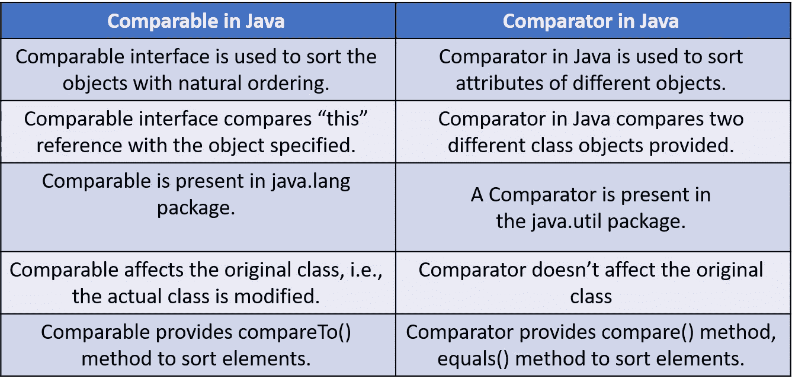

# Java 中的可比性——了解可比性和比较器接口

> 原文：<https://medium.com/edureka/comparable-in-java-e9cfa7be7ff7?source=collection_archive---------0----------------------->


Comparable in Java — Edureka

在 Java 编程语言中，接口用于指定类必须实现的行为。Java world 为我们提供了两个这样的接口 Comparable 和 Comparator！Java 中的 Comparable 用于对自然排序的对象进行排序，Comparator 用于对不同对象的属性进行排序。让我们通过本文的媒介来了解这些接口。

我已经介绍了以下指针，它们在 Java 中演示了 comparable 和 comparator:

*   Java 有什么可比性？
*   如何使用 compareTo 方法？
*   Java 可比示例
*   Java 中的比较器是什么？
*   如何实现一个比较器？
*   Java 中的可比 v/s 比较器

既然我们清楚了我们的议程，让我们开始吧！

# Java 有什么可比性？

顾名思义， **Comparable** 是一个接口，它定义了将一个对象与同类型的其他对象进行比较的方法。它有助于对具有自我排序倾向的对象进行排序，即对象必须知道如何对自己进行排序。 **Eg:** 卷号，年龄，工资。这个接口在 *java.lang 包*中，它只包含一个方法，即 *compareTo()。* Comparable 本身不能对对象进行排序，但是接口定义了一个负责排序的方法 *int compareTo()* 。

此外，你一定在想什么是 compareTo 方法？好吧，让我解释给你听！

# 什么是 compareTo 方法，如何使用？

此方法用于将给定对象与当前对象进行比较。方法返回一个整数值。该值可以是正数、负数或零。所以现在我们已经熟悉了 Java 中 Comparable 接口和 **compareTo** 方法的理论知识。

让我们开始理解实现过程。首先，我们来看看如何实现 Comparable。

# Java 可比示例

下面的代码描述了 Java 中 comparable 的用法。

```
public class Student implements Comparable {
private String name;
private int age;
public Student(String name, int age) {
this.name = name;
this.age = age;
}
public int getAge() {
return this.age;
}
public String getName() {
return this.name;
}
[@Override](http://twitter.com/Override)
public String toString() {
return "";
}
[@Override](http://twitter.com/Override)
public int compareTo(Student per) {
if(this.age == per.age)
return 0;
else
return this.age &gt; per.age ? 1 : -1;
}

public static void main(String[] args) {
Person e1 = new Person("Adam", 45);
Person e2 = new Person("Steve", 60);
int retval = e1.compareTo(e2);

switch(retval) {
case -1: {
System.out.println("The " + e2.getName() + " is older!");
break;
}

case 1: {
System.out.println("The " + e1.getName() + " is older!");
break;
}

default:
System.out.println("The two persons are of the same age!");

}
}
}
```

在上面的例子中，我创建了一个班级学生，有两个字段，姓名和年龄。Class Student 正在实现 Comparable 接口并覆盖 compareTo 方法。该方法根据年龄对 Student 类的实例进行排序。

现在我已经介绍了 Java 中的 Comparable，接下来我将讨论另一个接口，即 Java 中的 Comparator。让我们转到理解 Java 中的比较器！

# Java 中的比较器是什么？

比较器接口用于对特定类的对象进行排序。这个接口可以在 java.util 包中找到。它包含两种方法；

*   比较(对象 obj1，对象 obj2)
*   等于(对象元素)。

第一个方法，`compare(Object obj1,Object obj2)`比较它的两个输入参数并显示输出。它返回负整数、零或正整数，以说明第一个参数是小于、等于还是大于第二个参数。

第二个方法，`equals(Object element),`需要一个对象作为参数，并显示输入对象是否等于比较器。只有当提到的对象也是比较器时，该方法才会返回 true。顺序与比较器的顺序相同。

在简要了解了 Java 中的 Comparator 之后，是时候向前迈进一步了。让我给你看一个用 Java 描述 Comparator 的例子。

# 如何用 Java 实现比较器

下面是一个在 Java 中使用 Comparator 的例子:

```
import java.util.Comparator;

public class School {
private int num_of_students;
private String name;
public Company(String name, int num_of_students) {
this.name = name;
this.num_of_students = num_of_students;
}
public int getNumOfStudents() {
return this.num_of_students;
}
public String getName() {
return this.name;
}
}
public class SortSchools implements Comparator {
[@Override](http://twitter.com/Override)
public int compare(School sch1, School sch2) {
if(sch1.getNumOfStudents()== sch2.getNumOfStudents())
return 0;
else
return sch1.getNumOfStudents() &gt; sch2.getNumOfStudents() ? 1 : -1;
}
public static void main(String[] args) {
School sch1 = new School("sch1", 20);
School sch2 = new School("sch2", 15);
SortSchools sortSch = new SortSchools();
int retval = sortSch.compare(sch1, sch2);
switch(retval) {
case -1: {
System.out.println("The " + sch2.getName() + " is bigger!");
break;
}
case 1: {
System.out.println("The " + sch1.getName() + " is bigger!");
break;
}
default:
System.out.println("The two schools are of the same size!");
}
}
}

Output:
The sch1 is bigger!
```

好吧，没必要惊慌。上面写的代码很容易理解。我们走吧！

首先，我创建了一个由学生姓名和年龄组成的班级学校。之后，我创建了另一个类 SortSchools，以实现 Comparator 接口，该接口实现了根据学生数量在名为 School 的第一个类的实例之间施加顺序的目标。

理解了 Java 中的比较器和比较器之后，让我们进入下一个话题。

# Java 中的可比 v/s 比较器



我希望上面提到的差异能够澄清这两个概念。

至此，我们已经接近了文章的结尾。希望这些内容能够给你的 [Java 世界](https://docs.oracle.com/javase/tutorial/)带来信息和知识。敬请期待！

如果你想查看更多关于人工智能、DevOps、道德黑客等市场最热门技术的文章，那么你可以参考 [Edureka 的官方网站。](https://www.edureka.co/blog/?utm_source=medium&utm_medium=content-link&utm_campaign=comparable-in-java)

请留意本系列中的其他文章，它们将解释 Java 的各个方面。

> 1.[面向对象编程](/edureka/object-oriented-programming-b29cfd50eca0)
> 
> 2.[Java 中的继承](/edureka/inheritance-in-java-f638d3ed559e)
> 
> 3.[Java 中的多态性](/edureka/polymorphism-in-java-9559e3641b9b)
> 
> 4.[Java 中的抽象](/edureka/java-abstraction-d2d790c09037)
> 
> 5. [Java 字符串](/edureka/java-string-68e5d0ca331f)
> 
> 6. [Java 数组](/edureka/java-array-tutorial-50299ef85e5)
> 
> 7. [Java 集合](/edureka/java-collections-6d50b013aef8)
> 
> 8. [Java 线程](/edureka/java-thread-bfb08e4eb691)
> 
> 9.[Java servlet 简介](/edureka/java-servlets-62f583d69c7e)
> 
> 10. [Servlet 和 JSP 教程](/edureka/servlet-and-jsp-tutorial-ef2e2ab9ee2a)
> 
> 11.[Java 中的异常处理](/edureka/java-exception-handling-7bd07435508c)
> 
> 12.[高级 Java 教程](/edureka/advanced-java-tutorial-f6ebac5175ec)
> 
> 13. [Java 面试问题](/edureka/java-interview-questions-1d59b9c53973)
> 
> 14. [Java 程序](/edureka/java-programs-1e3220df2e76)
> 
> 15. [Kotlin vs Java](/edureka/kotlin-vs-java-4f8653f38c04)
> 
> 16.[依赖注入使用 Spring Boot](/edureka/what-is-dependency-injection-5006b53af782)
> 
> 17. [Java 教程](/edureka/java-tutorial-bbdd28a2acd7)
> 
> 18.十大 Java 框架
> 
> 19. [Java 反射 API](/edureka/java-reflection-api-d38f3f5513fc)
> 
> 20.[Java 中的 30 大模式](/edureka/pattern-programs-in-java-f33186c711c8)
> 
> 21.[核心 Java 备忘单](/edureka/java-cheat-sheet-3ad4d174012c)
> 
> 22.[Java 中的套接字编程](/edureka/socket-programming-in-java-f09b82facd0)
> 
> 23. [Java OOP 备忘单](/edureka/java-oop-cheat-sheet-9c6ebb5e1175)
> 
> 24.[Java 中的注释](/edureka/annotations-in-java-9847d531d2bb)
> 
> 25.[Java 中的图书管理系统项目](/edureka/library-management-system-project-in-java-b003acba7f17)
> 
> 26.[Java 中的树](/edureka/java-binary-tree-caede8dfada5)
> 
> 27.[Java 中的机器学习](/edureka/machine-learning-in-java-db872998f368)
> 
> 28.[Java 中的顶级数据结构&算法](/edureka/data-structures-algorithms-in-java-d27e915db1c5)
> 
> 29. [Java 开发者技能](/edureka/java-developer-skills-83983e3d3b92)
> 
> 30.[前 55 个 Servlet 面试问题](/edureka/servlet-interview-questions-266b8fbb4b2d)
> 
> 31. [](/edureka/java-exception-handling-7bd07435508c) [顶级 Java 项目](/edureka/java-projects-db51097281e3)
> 
> 32. [Java 字符串备忘单](/edureka/java-string-cheat-sheet-9a91a6b46540)
> 
> 33.[Java 中的嵌套类](/edureka/nested-classes-java-f1987805e7e3)
> 
> 34. [Java 集合面试问答](/edureka/java-collections-interview-questions-162c5d7ef078)
> 
> 35.[Java 中如何处理死锁？](/edureka/deadlock-in-java-5d1e4f0338d5)
> 
> 36.[你需要知道的 50 大 Java 集合面试问题](/edureka/java-collections-interview-questions-6d20f552773e)
> 
> 37.[Java 中的字符串池是什么概念？](/edureka/java-string-pool-5b5b3b327bdf)
> 
> 38.[C、C++和 Java 有什么区别？](/edureka/difference-between-c-cpp-and-java-625c4e91fb95)
> 
> 39.[Java 中的回文——如何检查一个数字或字符串？](/edureka/palindrome-in-java-5d116eb8755a)
> 
> 40.[你需要知道的顶级 MVC 面试问答](/edureka/mvc-interview-questions-cd568f6d7c2e)
> 
> 41.[Java 编程语言十大应用](/edureka/applications-of-java-11e64f9588b0) 42。[Java 中的死锁](/edureka/deadlock-in-java-5d1e4f0338d5)
> 
> 43.[Java 中的平方和平方根](/edureka/java-sqrt-method-59354a700571)
> 
> 44.[Java 中的类型转换](/edureka/type-casting-in-java-ac4cd7e0bbe1)
> 
> 45.[Java 中的运算符及其类型](/edureka/operators-in-java-fd05a7445c0a)
> 
> 46.[Java 中的析构函数](/edureka/destructor-in-java-21cc46ed48fc)
> 
> 47.[爪哇的二分搜索法](/edureka/binary-search-in-java-cf40e927a8d3)
> 
> 48.[Java 中的 MVC 架构](/edureka/mvc-architecture-in-java-a85952ae2684)
> 
> 49. [Hibernate 面试问答](/edureka/hibernate-interview-questions-78b45ec5cce8)

*原载于 2019 年 7 月 9 日*[*https://www.edureka.co*](https://www.edureka.co/blog/comparable-in-java/)*。*