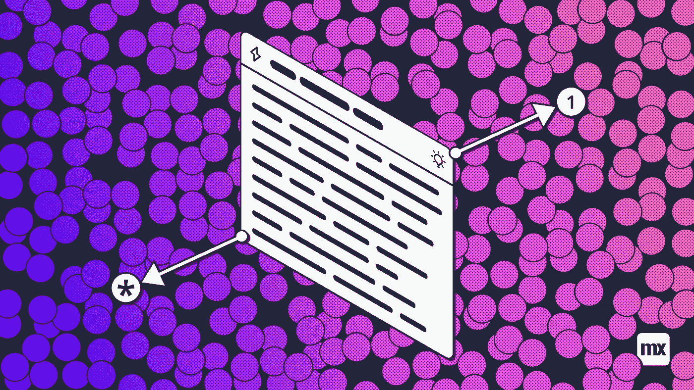
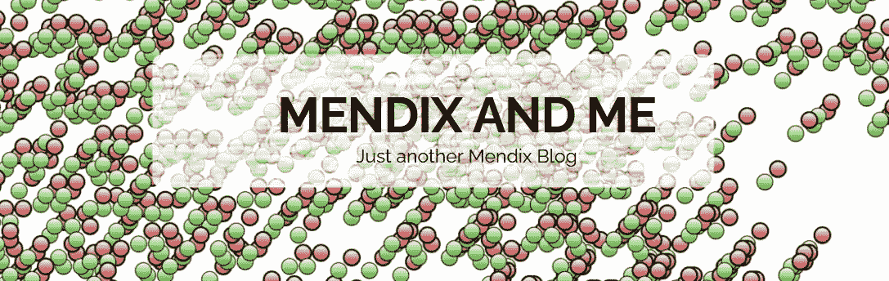
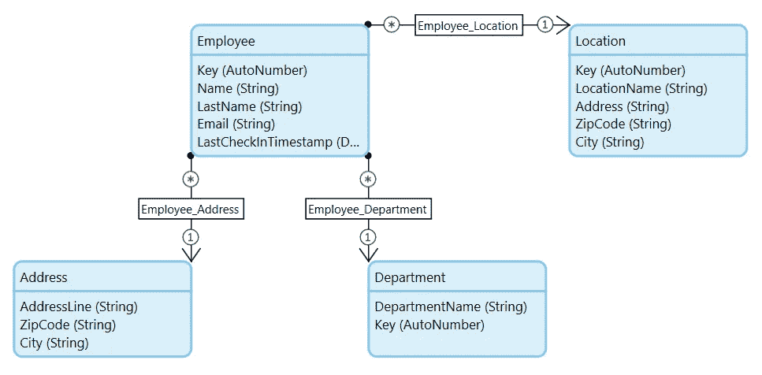
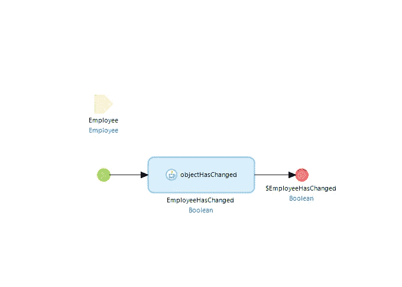
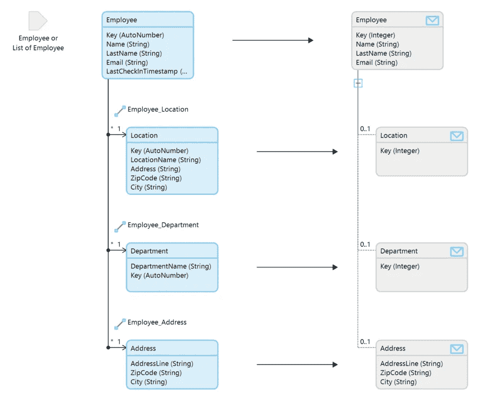
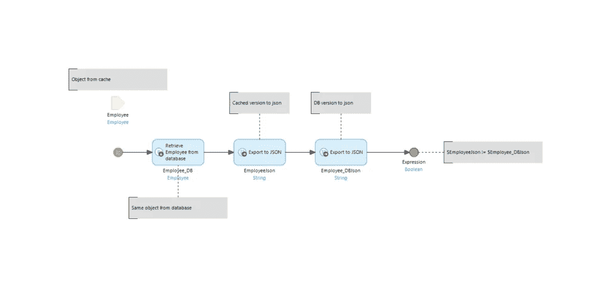

# 跨越实体边界比较数据——Mendix 和我

> 原文：<https://medium.com/mendix/compare-data-across-entity-boundaries-mendix-and-me-bc7d54d522c5?source=collection_archive---------4----------------------->

在我工作过的几乎每个应用程序中，我迟早都要做的一件事就是比较数据是否发生了变化。这里的典型案例是接口。如果我的应用程序中的某个记录发生了更改，我想通过一个接口发送这些更改，或者创建一个事件，以便其他应用程序可以得到这些更改的通知。

一个简单的方法是每当我的记录被保存时触发这个事件。在较小的环境中，这无疑是一个实用的解决方案。实现起来简单快捷。然而，它也带来了风险，即生成了许多可能不需要生成的事件。所以我们想决定是否真的必须生成事件。第一个简单易用的解决方案可以在 Mendix Marketplace 的社区共享模块中找到。

下面的例子都基于这个域模型，其中有一个 Employee 实体，它与一个位置、部门以及地址相关联。

The domain model used in the examples

# 对象已更改操作

在 Mendix Marketplace 的 [Community Commons 模块](https://marketplace.mendix.com/link/component/170)中有一个名为 objectHasChanged 的 Java 动作。这个动作是我们上述问题的简单解决方案。您从缓存中传递一个对象给它，Java 操作返回一个布尔值，告诉我们对象是否已经更改。在微流中，整个事情看起来像这样。

Using the objectHasChanged Action on the Employee Object

这种解决方案非常适合简单的情况，使用这种方法没什么不好。这个 Java 动作不仅检测更改的属性，还检测更改的关联。

然而，有两个明显的缺点。

1.  无法识别关联是否保持不变，但关联对象上的某些内容发生了变化。这方面的一个例子是员工地址的变更。
2.  Java 动作比较一切。您不能从比较中排除单个属性。例如，如果您想从比较中排除 *LastCheckInTimestamp* ，因为这个属性与事件无关，那么这个 Java 操作无法实现。

因此，我们正在寻找一种解决方案，可以忽略属性，并能够比较整个数据结构。

# 使用映射进行比较

一个可能的解决方案是使用映射进行这种比较。您可以在几个关联上使用一个映射，并且可以准确地定义应该包括哪些属性。因为您通常在使用接口时使用映射，所以使用它们进行数据比较是显而易见的。另一个很大的优势是映射可以轻松地扩展或修改。

具体来说，现在的解决方案是这样的。首先，我们为整个数据结构创建一个映射。

The Employee Export Mapping with the relevant attributes

该映射仅包含与比较相关的属性。如果由于变更而需要更多或更少的属性，则只需调整映射。

实际的比较发生在微流中。

Microflow for comparison between cache and database

这个微流从数据库中提取 Employee 对象，以便来自缓存的版本和来自数据库的版本在微流中并行存在。现在，它将贴图应用于两个对象。在端点中，只有两个 JSON 字符串相互比较。如果它们不相等，则相关属性或对象发生了变化。但是如果这些字符串相等，那么相关数据没有任何变化。

这个微流可以在 *Employee_NewEdit* 页面的保存过程中使用，但是也可以在 Employee 对象的 *BeforeCommit* 事件中使用。

尽情体验吧！

*于 2021 年 2 月 23 日*[*https://mendixamme . de*](https://mendixandme.de/index.php/2021/02/23/daten-vergleichen-ueber-die-entitaetsgrenzen-hinaus/)*以德语原文发表。*

*来自发布者-*

*如果你喜欢这篇文章，你可以在我们的* [*媒体页面*](https://medium.com/mendix) *或者我们自己的* [*社区博客网站*](https://developers.mendix.com/community-blog/) *找到更多喜欢的。*

*希望入门的创客，可以注册一个* [*免费账号*](https://signup.mendix.com/link/signup/?source=direct) *，通过我们的* [*学苑*](https://academy.mendix.com/link/home) *获得即时学习。*

*有兴趣更多地参与我们的社区吗？你可以加入我们的* [*Slack 社区频道*](https://join.slack.com/t/mendixcommunity/shared_invite/zt-hwhwkcxu-~59ywyjqHlUHXmrw5heqpQ) *或者想更多参与的人，看看加入我们的* [*遇见 ups*](https://developers.mendix.com/meetups/#meetupsNearYou) *。*