# 将一个数组与另一个数组进行比较。按角度进行过滤。

> 原文：<https://medium.com/quick-code/compare-one-array-to-another-make-filtration-in-angular-21dac021cc9f?source=collection_archive---------6----------------------->

## 角度形式验证器

## 使用 lodash 进行数据过滤

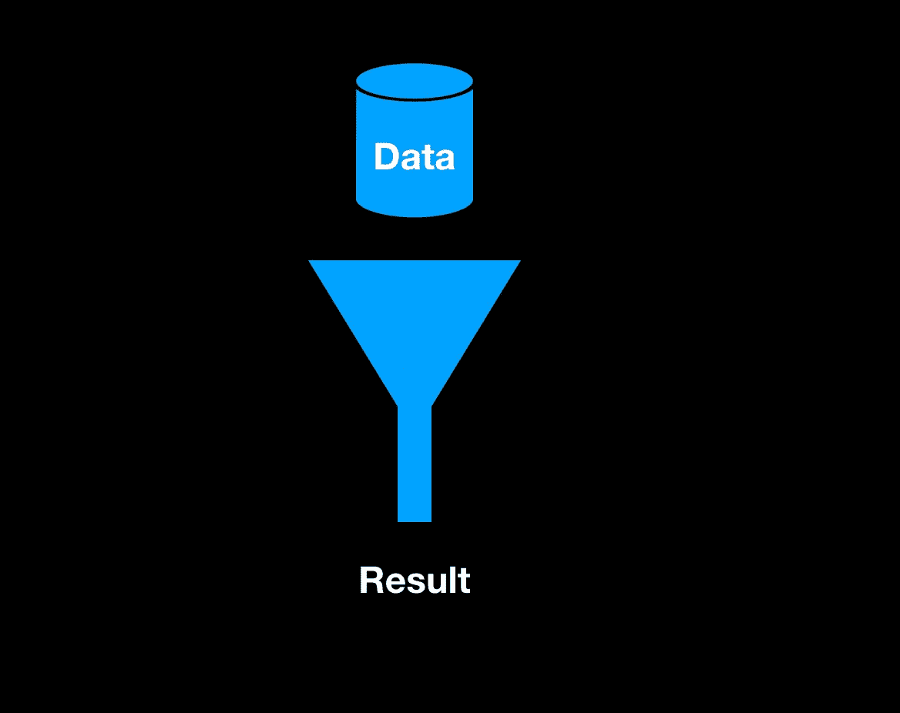

现在几乎每个项目都有过滤。仅通过一个属性进行筛选可能很容易，但是如果您有一个选项数组，并且需要与另一个数组进行比较，该怎么办呢？可能会很艰难。

让我们从创作模型开始。我们需要两个模型，一个用于过滤器，另一个用于数据。

用户可以听和喜欢不同类型的电影和音乐，这些属性我们会过滤。

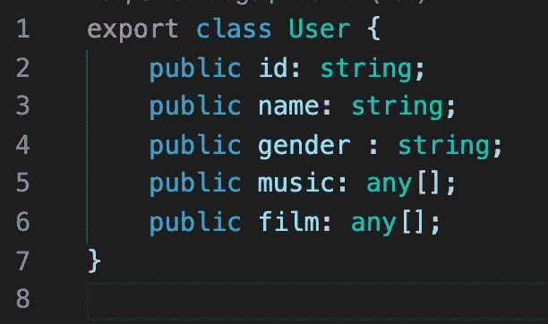

user.model.ts

过滤器模型只包含几个数组。我们将使用它来显示用户过滤器选项和存储选定的过滤器。

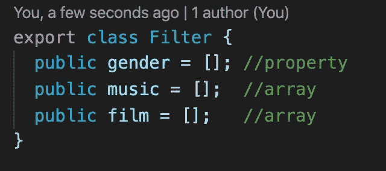

filter.model.ts

我们的 UI 会很简单。我们有几个用于过滤的多选下拉控件。

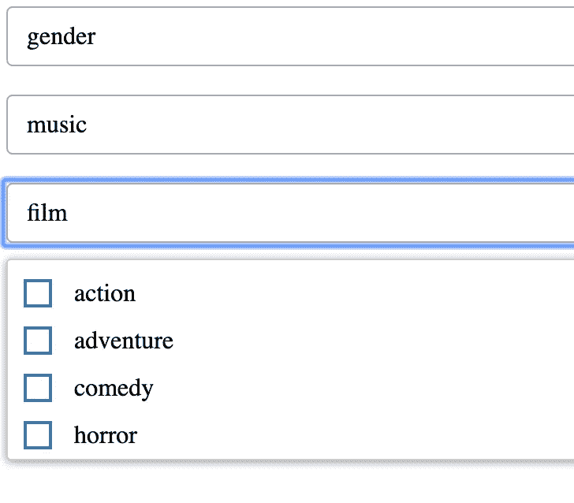

UI with filters

在 angular cli 中，我们需要键入“NPM install ng-multiselect-drop down ”, multiselect 将安装在我们的项目中。然后我们需要将它导入到我们的模块中，并在 html 中使用它。

在这里你可以找到更多关于这个[多选](https://www.npmjs.com/package/ng-multiselect-dropdown)的信息。

我们的“filtering”类存储关于过滤器的信息，即我们绑定到组件的那些属性。此外，他有一个方法，检查是否有任何过滤器选择和过滤。

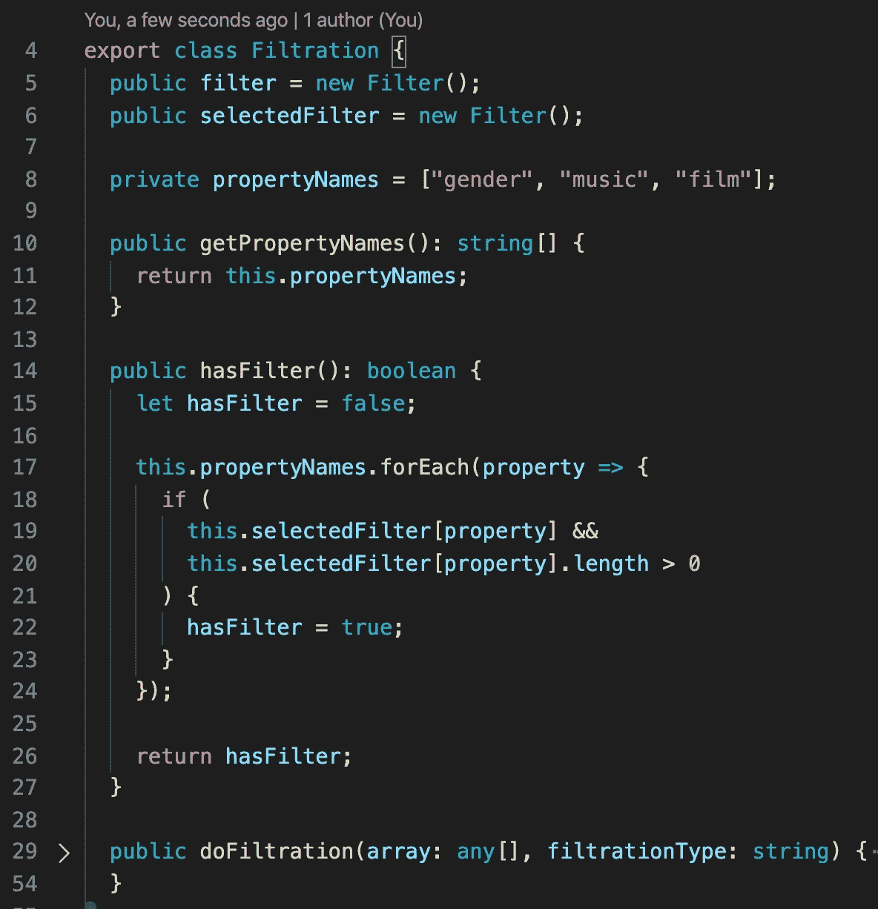

filtration.service.ts

在过滤器组件中，我们只设置下拉设置，生成数据和过滤器。

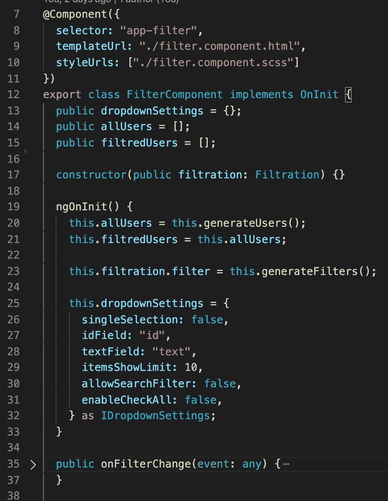

filter.component.ts

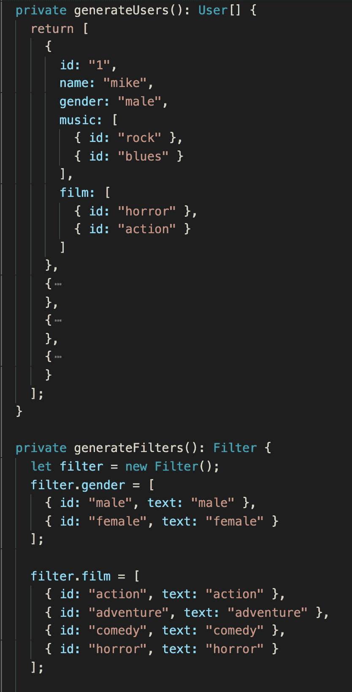

Creation data in filter.component.ts

在现实生活中，模型中的数组可能有两个主要属性“id”和“text ”,因为过滤器具有这两个属性。在我们的例子中，它们包含相同的文本。

在 html 中，我们显示过滤后的数据，并将下拉菜单绑定到过滤类。

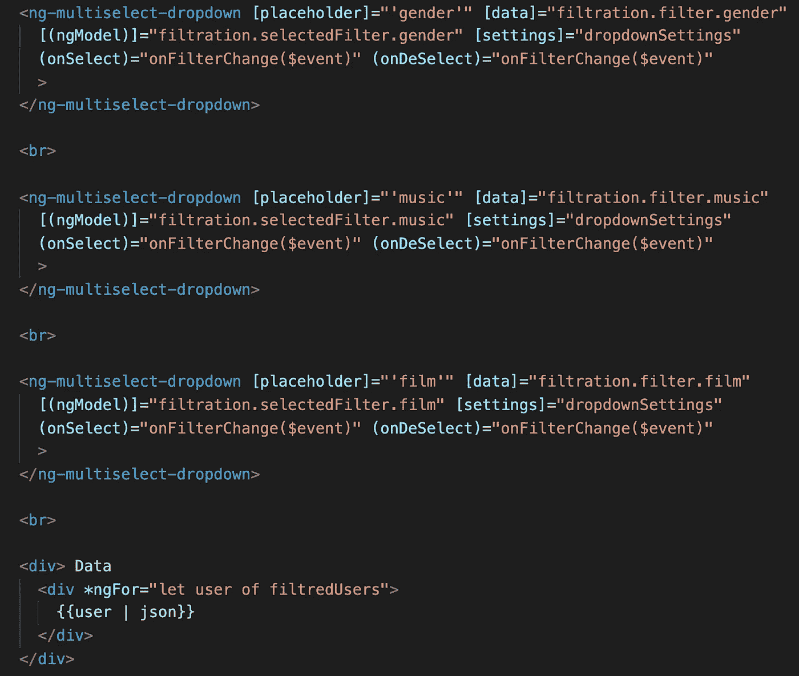

filter.component.html

过滤将如何工作？有两种类型的过滤:“与”、“或”。

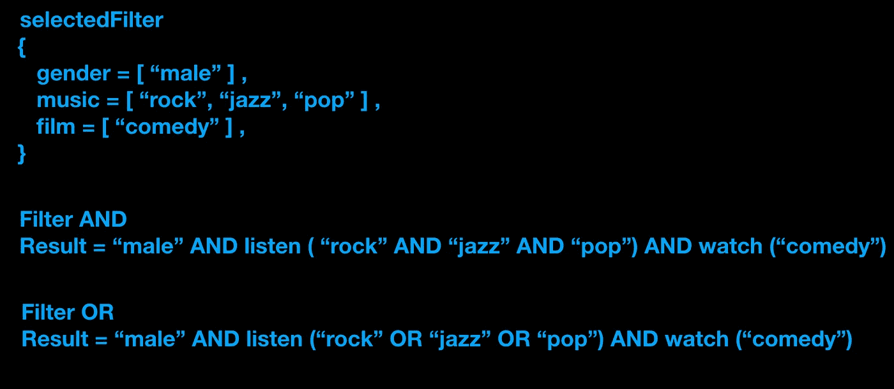

用户想知道哪个男人喜欢“摇滚”、“爵士”和“流行”音乐，还喜欢“喜剧”电影。

首先，我们需要检查用户是否选择了任何过滤器。如果没有，就返回发送给我们的相同数组。如果是，请继续。

假设我们有一个 10 人的列表，我们需要找到所有给我们 6 个人的人。如果用户选择“和”过滤类型，我们需要过滤 6 个人，找到喜欢“摇滚”的人— 4 个人，然后我们需要过滤 4 个人，找到喜欢“爵士”的人— 3 个人，对“流行”做同样的事情，做最后的过滤，找到也喜欢“喜剧”的人— 2 个人。

如果用户选择“或”过滤类型，我们需要过滤 6 个人(按性别过滤的结果)，找到喜欢“摇滚”的人——4 个人，然后过滤 6 个人找到喜欢“爵士”的人，并制作喜欢“摇滚”或“爵士”的人的唯一列表，然后找到喜欢“流行”的人，并制作喜欢“摇滚”或“爵士”或“流行”的人的唯一列表。在那之后做最后的筛选，在那份名单中找到也喜欢“喜剧”的人。

为了实现，我们需要“lodash”库中的一些方法。这是一个非常强大的库，如果你不熟悉这个库，请仔细看看这个库。

在 angular cli 中，我们需要键入“npm install -save lodash-es ”,这个库的小版本将安装在我们的项目中。

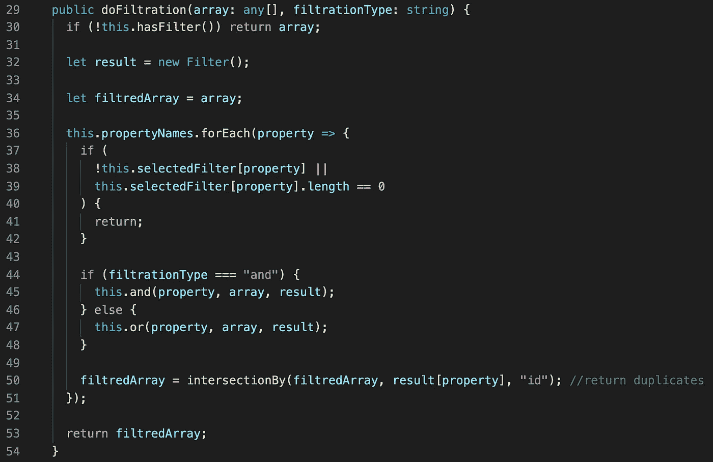

Implementation

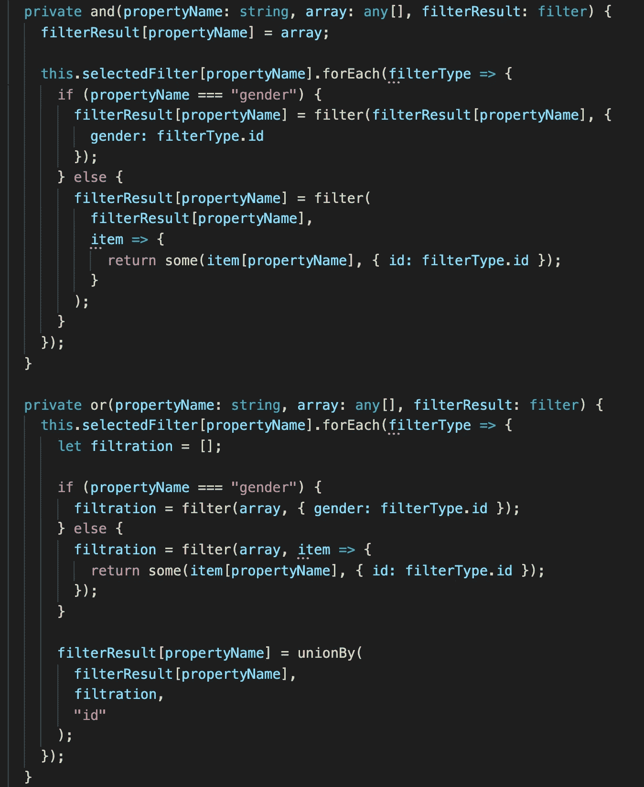

Filter type ‘or’ , ‘and’

在“lodash”库中，我们使用了类似于“unionBy”(获取两个数组并通过“id”返回一个唯一项的数组)、“filter”、“some”(这是一个谓词，如果项包含在数组中，则返回 true)和“intersectionBy”(获取两个数组并返回一个重复项的数组)的方法。

如果你需要仔细查看项目[，这里有](https://github.com/8Tesla8/tree-view-angular)[链接](https://github.com/8Tesla8/angular-filtretion-)。

*原载于 2019 年 12 月 17 日*[*http://tomorrowmeannever.wordpress.com*](https://tomorrowmeannever.wordpress.com/2019/12/17/compare-one-array-to-another-make-filtration-in-angular/)*。*