# 比较和对比开源 BPM 项目

> 原文：<https://medium.com/capital-one-tech/comparing-and-contrasting-open-source-bpm-projects-196833f23391?source=collection_archive---------0----------------------->

根据[黑鸭 2016 年开源的未来调查](https://www.blackducksoftware.com/2016-future-of-open-source)显示，现在有 65%的公司在使用开源项目并为其做出贡献。再加上[Githubs](https://github.com/about)3800 万个项目和 1500 万贡献者/开发者，你可以看到这种高水平的贡献已经导致了开源领域的持续变化。随着每天都有新的项目产生，这种趋势还在加速，而其他项目则从现有的开源项目中分离出来。这个不断扩大的开源项目列表为许多闭源产品提供了可行的替代方案。受这种开源趋势影响的一类软件是业务流程管理(BPM)。

BPM 产品面向自动化手动流程。许多业务流程从使用电子邮件或电子表格开始，发展到无法再管理的程度。例如，当业务流程跨越多个部门时，或者工作流除了人工步骤之外还包括与系统相关的步骤时。更高级的使用情形包括需要调查的案例管理类型活动和非结构化的动态类型工作流。案例管理方面一个特别有趣的趋势是，许多行业产品开始将案例管理和业务流程管理功能作为同一个工具的一部分提供，而不是要求单独的产品。您可以在开源 BPM 产品中看到这种趋势。

许多开源 BPM 产品可以为闭源 BPM 产品提供替代方案。其中包括 [Activiti](http://activiti.org/) 、 [Camunda](https://camunda.com/) 和 [jBPM](http://www.jbpm.org/) 。jBPM 成立于 2006 年，是这些产品中的第一个，Activiti 在 2010 年脱离 jBPM，Camunda 在 2012 年脱离 Activiti。虽然相似，但这些流行的开源 BPM 产品之间有许多不同之处。这些差异包括:

**开源模式(社区与企业)**

**能力集**

**贡献者**

让我们通过对开源 BPM 项目的比较和对比，简要地触及这些主题。

# **开源模式(社区与企业)**

每个支持开源项目的公司都有自己的商业模式。通常，开源公司提供企业开源产品作为创收的一种方式——通常你必须为企业版付费，而社区版(通常)是免费的。Camunda 提供了企业版的 Camunda，Alfresco 提供了企业版的 Activiti，RedHat 提供了企业版的 jBPM。我发现每个公司对“企业”的定义是不同的。对于使用或采购开源项目的开发人员来说，在使用它之前，理解公司所说的“企业开源”是什么意思是非常重要的。

在某些情况下，企业版不是开源的，但主要由开源项目组成，因此比竞争的闭源产品价格更低。这个版本的一个潜在的缺点是您失去了对代码做出贡献的能力，并且依赖于支持公司来进行代码更改。

在某些情况下，公司会在社区版本中提供特定的功能集，然后在企业版本中提供附加的功能。Camunda 和 Alfresco 都采用这种方法。例如，对于 Activiti，企业版有一个完整的 BPMN 编辑器，而社区版有一个缩减版。

在某些情况下，公司在社区版和企业版中提供相同的功能集，唯一的区别是企业版需要您支付支持费用。根据内部对开源项目的专业程度，您可能需要也可能不需要支持。RedHat 在 jBPM 中遵循了这种方法。jBPM 的企业版基于社区版的前一个版本，然后通过一系列的认证测试。为什么？有时，社区版本的实验性功能可能会有错误，这就是为什么企业版本经常利用旧版本的原因。

# **能力集**

让我们开始深入研究 Activiti、Camunda 和 jBPM 的功能。

1.  ***规则引擎***

一些 BPM 产品有自己的规则引擎，而其他产品为常用的规则引擎提供集成/插件。 [Drools](http://www.drools.org/) 是业界常用的规则引擎。jBPM 将 Drools 集成到它的项目中，而 Activiti 和 Camunda 采用了不同的方法，提供了与 Drools 的集成。这三者都使您能够将业务规则任务用作工作流的一部分；不同之处在于业务规则任务背后的集成。因为 Drools 是 jBPM 的原生产品，所以您可以在模型中的规则流组级别(规则分组)集成规则，而其他的则在规则级别集成。这使您能够使用 Drools 的本机特性选择一组特定的规则，在工作流中的特定点执行。用 Camunda 和 Activiti 也可以达到同样的效果，但是需要额外的编码，而 jBPM 提供了开箱即用的能力。

jBPM:

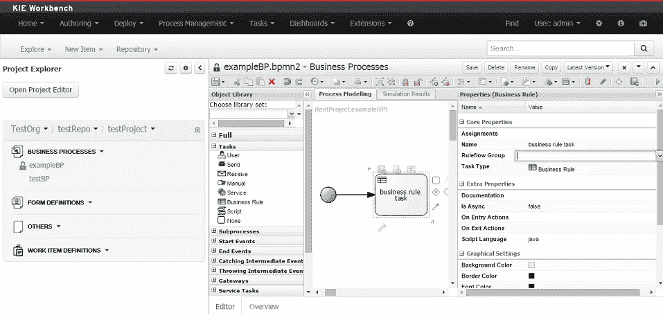

A look at how jBPM integrates the Drools rules engine.

活动:

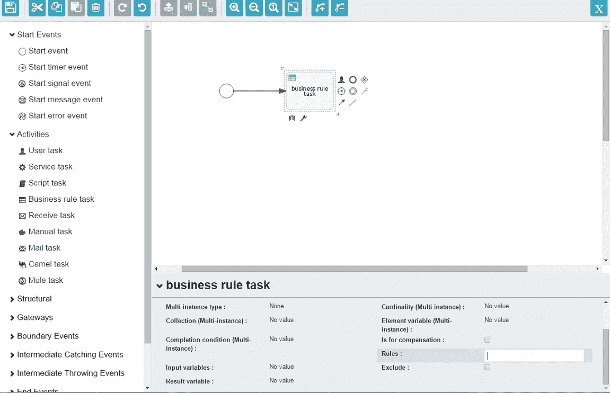

A look at how Activiti integrates the Drools rules engine.

卡蒙达:

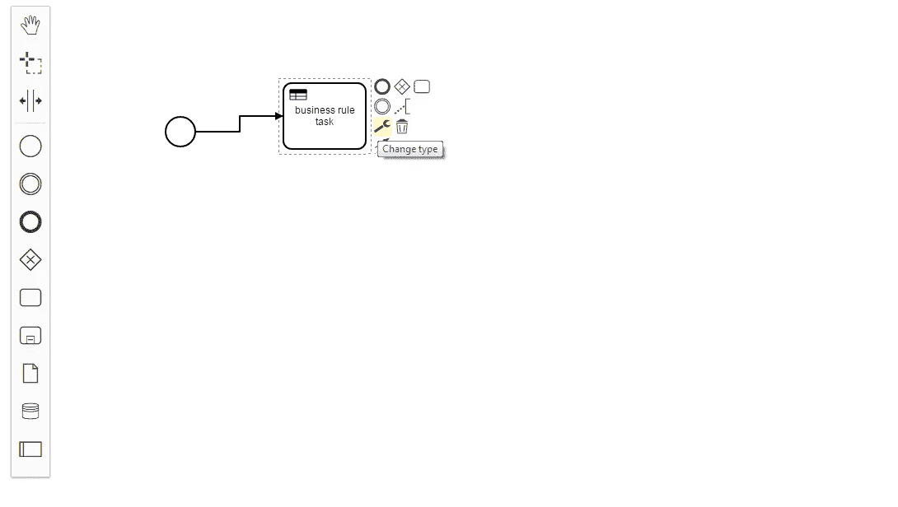

A look at how Camunda integrates the Drools rules engine.

**2*。建模&执行环境***

BPM 产品通常提供创作/建模用户界面，使用户能够构建流程图。有些还会为更愿意在 ide 中工作的开发人员提供 eclipse 插件。大多数 BPM 产品都有一个执行用户界面，允许用户查看和处理分配给他们的任务。Camunda 提供了四个独立的 ui——建模、任务列表、流程管理和监控。这是一种不同于 jBPM 和 Activiti 的方法，因为它们提供了一个用于开发和执行的 web 应用程序，就像 jBPM 工作台或 Activiti Modeler 一样。与 Camunda modeler UI 的另一个区别是，它目前只能作为桌面应用程序使用。从 Eclipse 插件的角度来看，Camunda 不再提供插件，因为他们决定与 Eclipse 分离，以消除在每个新版本中更新插件的需要。

卡蒙达:

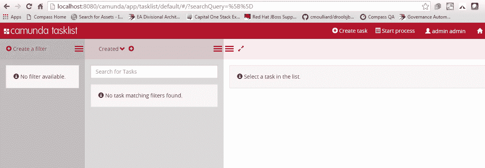

A view of the Camunda environment.

Activiti 提供了一个用于开发和执行的 web 应用程序。在社区版本中，它被称为 Activiti Explorer，使用起来非常简单。企业版提供了一个完整的 BPMN 编辑器，具有高级功能，如决策表和基于步骤的流程设计器。Activiti 提供了一个 Eclipse 插件，让开发人员可以根据自己的喜好灵活地在 IDE 中工作。

活动浏览器:

A view of the Activiti Explorer environment.

与 Activiti 类似，jBPM 为开发和执行提供了单一的 web 应用程序。在社区版本中，它被称为 KIE 工作台，在企业版本中，它被称为商务中心。与 Activti 不同，jBPM 在社区和企业版本中提供了相同的功能。与 Activti 类似，jBPM 提供了一个 Eclipse 插件。

jBPM:

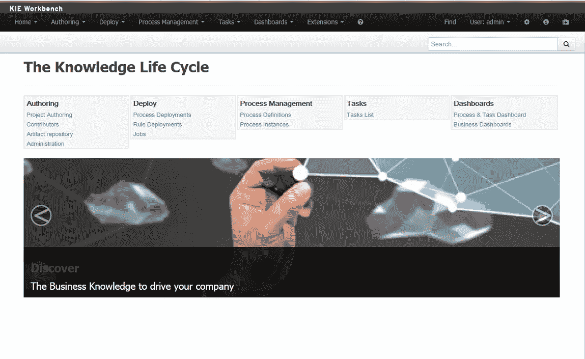

A view of the jBPM environment.

***3。表单生成器***

表单生成器为用户在执行用户界面中查看和添加/更新流程相关数据提供了一种简单的方法。jBPM 通过 KIE 工作台提供了一个基本的表单生成器(与前面提到的建模和执行使用相同的 UI ),它可以从流程变量自动生成。Camunda 不提供表单编辑器功能，因为他们更喜欢用户用自己喜欢的语言构建自己的表单/UI。Activiti 提供了一个表单生成器，但是它只在企业版中可用。

jBPM 表单生成器:

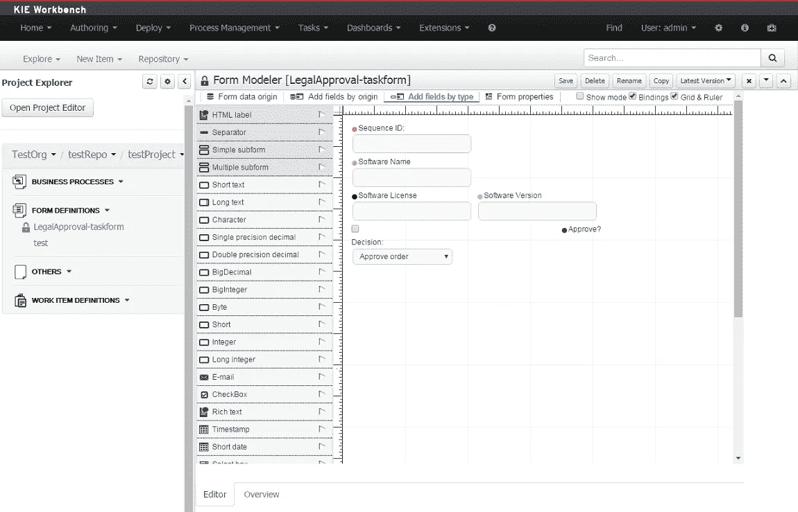

A view of jBPM from builder.

***4。适配器***

鉴于 API 在当今软件行业中的重要性，从应用程序进行 REST 调用的能力至关重要。这三个产品都提供了调用 REST API 的能力。jBPM 提供了开箱即用的 REST 服务任务，而 Camunda & Activiti 需要额外的开发来实现 REST 调用(自定义 java 类)。拥有开箱即用的 REST 服务任务的一个优点是，它通过基于配置而不是要求定制开发来减少开发时间。虽然这使得在工作流中添加 REST 调用变得更加容易，但是要小心使用。如果您在一个工作流中有许多 REST 调用，请评估并行执行它们以提高性能。

下面是 jBPM REST 服务任务的视图:

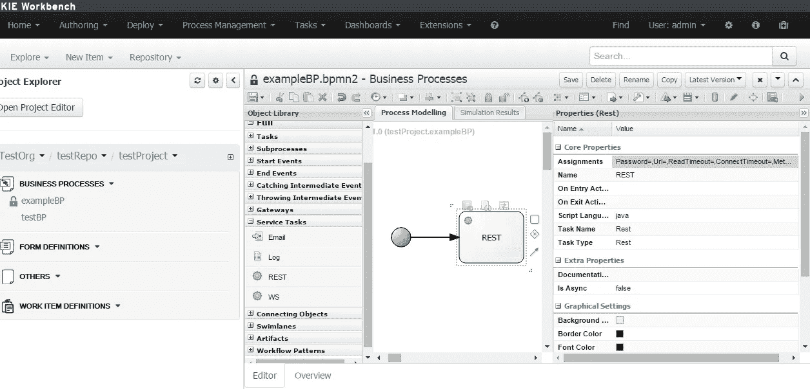

A view of the jBPM REST service task.

jBPM Rest 服务任务配置:

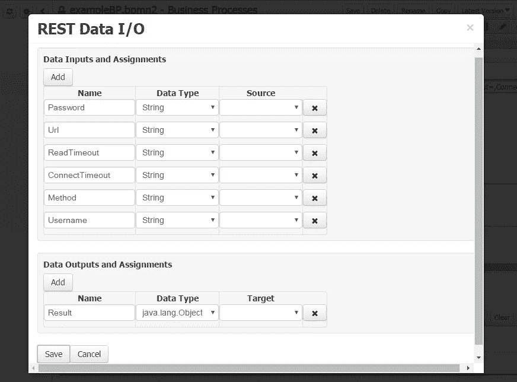

A jBPM REST Service Task configuration.

下面是 Activiti Modeler 中服务任务的视图。一旦添加了快速 Java 类，就可以执行 REST 调用:

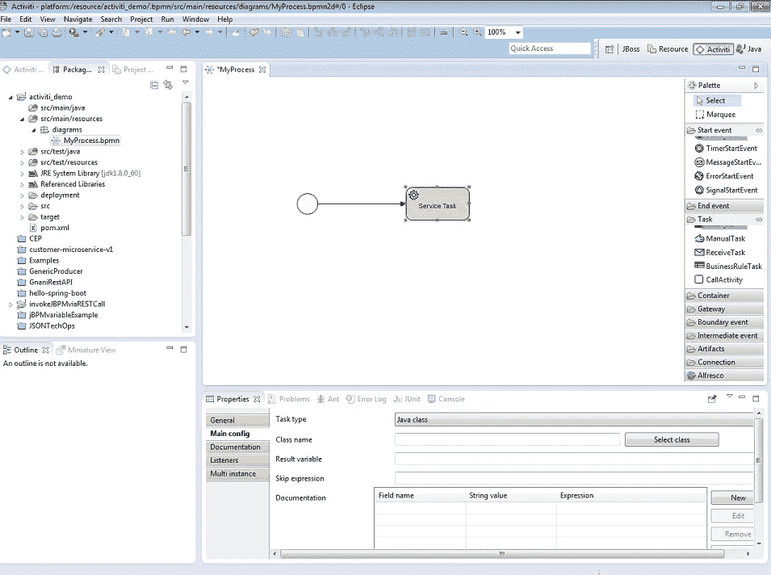

A view of the Service Task in Activiti Modeler.

以下是 Camunda 服务任务。与 Activiti 类似，它需要进一步编码:

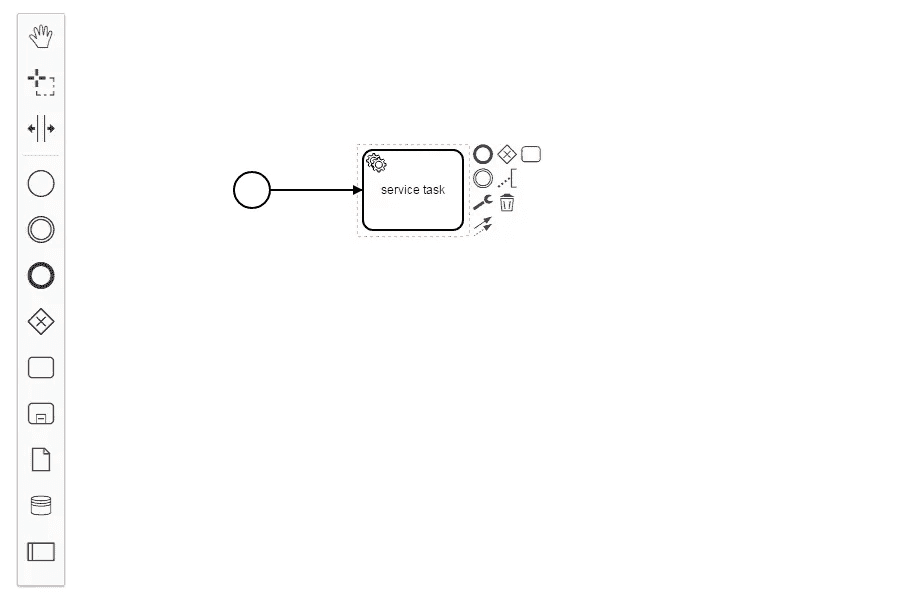

A Camunda service task that requires further coding.

***5。部署模式***

Camunda、jBPM 和 Activiti 都支持嵌入式和独立部署模式。嵌入式部署使您能够将 BPM 引擎作为现有应用程序的一部分运行(在同一个 JVM 中)。这可以提供性能优势，因为数据是在内存中传递的，而不是网络调用。独立部署公开了各种 API 函数，客户端可以通过 REST 调用这些函数。如果您希望在不同的应用程序之间重用单个工作流实例，这可能是有益的。它也可以是将应用程序集成到工作流引擎的一种方式，该工作流引擎可以用不同于 BPM 产品 API 的语言编写。让我们看看如何通过 API 调用 Activiti、jBPM 和 Camunda 的例子。

Activiti 引擎可以通过 REST 调用 [Spring Boot](http://www.activiti.org/userguide/index.html#springSpringBoot) :

下面的类是一个 Spring 服务，它有两个方法:一个用于启动进程，另一个用于获取给定受托人的任务列表。它是 Activiti 调用的包装器，但在现实生活场景中会更复杂。

下面的 REST 端点类用 *@RestController* 注释，并委托给上面的服务。

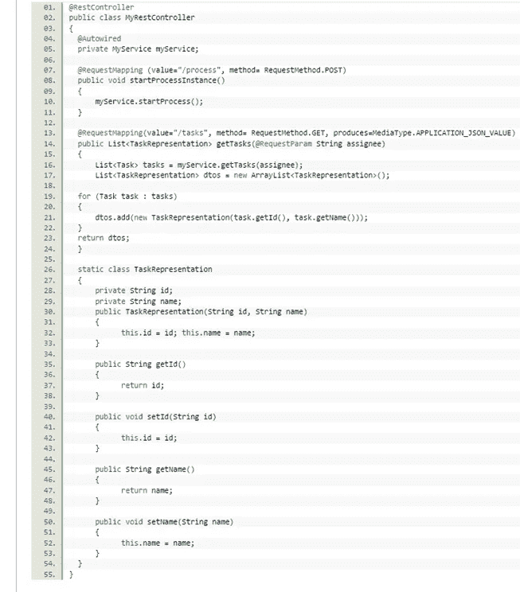

应用程序类中的自动组件扫描( *@ComponentScan* )会发现*@服务*和 *@RestController* 。下面的 curl 命令可以与 REST API 交互:

下面是一个使用 jBPM java API 调用 jBPM 工作流的例子，该 API 使用 REST。

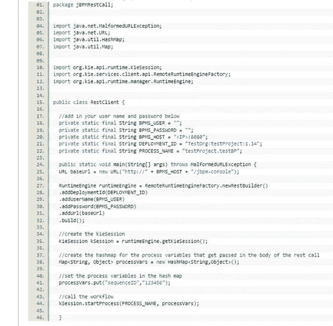

Camunda 没有提供开箱即用的 java API，但是可以通过 REST 调用访问。下面是可以启动实例的两个 POST REST 调用:

# **贡献者**

谁对开源 BPM 项目的源代码做出贡献很重要。一个活跃的社区标志着一个项目仍在改进和增强。支持公司之外的贡献者的数量也有助于表明投入到项目中的思想和观点的多样性程度。 [Open Hub](https://www.openhub.net/) 是一个可以用来查找这类信息的网站。它提供了活动、贡献者数量和提交等详细信息。这些都是需要考虑的重要因素。以下是 Camunda 的开放中心页面示例:

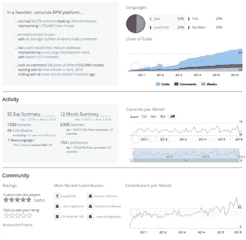

您还可以在 [Activiti](http://http/activiti.org/team.html) 和 [jBPM](http://jbpm.org/community/team.html) 和 [Camunda](https://camunda.org/team/) 站点看到贡献者列表。

# **总结**

在本文中，我们只是简单地介绍了开源 BPM 项目 Activiti、Camunda 和 jBPM 之间的一些相似之处和不同之处。这三种方法都有其优点，您项目的特定需求将有助于确定哪一种方法最适合您。好消息是，这三个都是闭源 BPM 产品的可行的开源替代方案。它们的开源特性意味着它们会随着时间的推移不断变化和发展。

*   本文中的分析是在 jBPM 6.4、Activiti 5.21 和 Camunda 7.5 上进行的

*欲了解更多关于 Capital One 的 API、开源、社区活动和开发人员文化的信息，请访问我们的一站式开发人员门户网站 DevExchange。*[【https://developer.capitalone.com/】T21](https://developer.capitalone.com/)