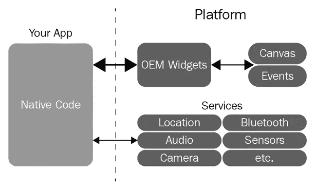
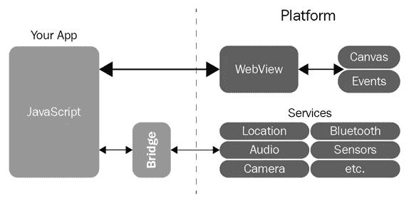
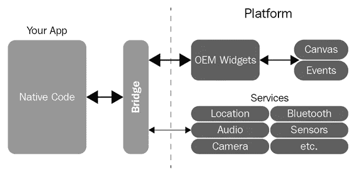
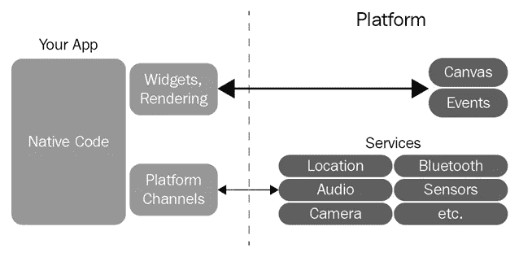

# 将 Flutter 与现有框架进行比较

> 原文：<https://medium.com/quick-code/comparing-flutter-to-existing-frameworks-f1115b443f4f?source=collection_archive---------0----------------------->

**Flutter** 是一个来自 Google 的应用开发框架，用于创建跨平台的移动应用(在 iOS 和 Android 中)。正如在[官方网站](https://flutter.io/)上提到的，它旨在使开发尽可能简单、快速和高效。像 **Hot Reload** 这样的东西，一个庞大的小部件目录，非常好的性能，以及一个坚实的社区都有助于满足这个目标，并使 [Flutter](https://hub.packtpub.com/google-releases-flutter-1-9-at-gdd-google-developer-days-conference/) 成为一个非常好的框架。

本文节选自 Prajyot Mainkar 和 Salvatore Giordano 撰写的由 Packt 出版社出版的《Google Flutter 移动开发快速入门指南》一书。这是一个快速的指南，帮助你开始使用 Google Flutter 进行跨平台的移动应用程序开发。

当谈到移动应用程序开发时，我们可以找到许多不同的方法，但最终，一切都归结为本机或跨平台方法。让我们看看与 Flutter 相比，不同的方法看起来和工作起来如何。我们将首先看一看原生平台，然后，在看跨平台方法之前，我们将看一看 **WebView** 系统，最后我们将看到 [Flutter](https://hub.packtpub.com/google-i-o-2019-flutter-ui-framework-now-extended-for-web-embedded-and-desktop/) 在这个组合中的位置。

# 本机平台

Android 和[iOS SDK](https://hub.packtpub.com/declarative-ui-programming-faceoff-apples-swiftui-vs-googles-flutter/)等原生框架坚如磐石。它们是移动应用程序开发最稳定的选择。他们有许多经过深度测试的可用应用程序，有一个大型社区和公开可用的教程。下图显示了本机移动应用程序开发框架的工作方式:

正如我们在上图中看到的，这个框架中的 **app** 直接与系统对话。这使得本机框架在功能上成为最强大的选择。然而，它确实有一个缺点:你需要学习两种不同的语言，Android 的 Kotlin 或 Java，iOS 的 Obj-C 或 Swift 以及 SDK。这些语言用于编写两个功能相同的不同应用程序。每一次修改都必须在两个平台上重复，这个过程可能不会那么顺利。对于小团队或者开发过程中需要速度的人来说，这不是一个好的选择。

# WebView 系统

另一方面，我们有跨平台方法，这种方法以高效著称。在这种方法中，我们可以从单个代码库获得 Android 和 iOS 的应用程序，就像在 Flutter 中一样。但是每个框架都有一些缺点。

一般来说，基于 Cordova、Ionic、PhoneGap 和 WebView 的框架都是跨平台框架的好例子，对于前端开发人员来说，它们是特别好的解决方案。但是这些方法缺乏性能，并且这些方法中的应用视图是由呈现 HTML 的 WebView 组成的；这意味着 app 基本上就是一个网站。

下图显示了基于 WebView 的框架如何工作:

系统使用一个桥在 JavaScript 和本地系统之间进行切换。这个过程会太慢，取决于你需要的特性，这给这个系统增加了另一个缺点。

# 其他跨平台方法

让我们以另一种跨平台方法为例，看看它的缺点是什么。 **Xamarin** 是跨平台开发的 Windows 答案，在我看来并不是那么方便，尤其是在生产力和编译时间方面。

当观察其他平台时， **React Native** 可以被认为是最好的跨平台框架之一，但是它严重依赖 OEM 组件。

让我们来看看 React Native 的工作方式:

React Native 扩展了 WebView 系统中的桥概念，不仅用于服务，还用于构建小部件。这在性能上确实很危险；例如，一个组件可能在一个动画中构建了数百次，但是由于桥的扩展概念，这个组件可能会在很大程度上变慢。这也可能导致其他问题，特别是在 Android 上，这是最分散的操作系统。

# 更多阅读: [React Native VS Xamarin:跨平台移动开发框架哪个更好？](https://hub.packtpub.com/react-native-vs-xamarin-which-is-the-better-cross-platform-mobile-development-framework/)

# 颤振的方法

在前面的章节中，我们研究了移动应用程序开发的不同方法。我们已经简要了解了这些方法的工作原理及其缺点。现在我们来看看[颤振](https://hub.packtpub.com/flutter-gets-new-set-of-lint-rules-to-build-better-chrome-os-apps/)。

与其他解决方案相比，Flutter 的性能要好得多，因为应用程序是在 **AOT** ( **提前**)而不是像 JavaScript 解决方案那样 **JIT** ( **及时**)编译的。它还消除了桥梁的概念，不依赖于 OEM 平台。它允许自定义组件使用屏幕中的所有像素。这是什么意思？它基本上意味着该应用程序在每个版本的 Android 和 iOS 上显示相同。

我们确实了解了其他方法的工作原理，所以让我们也了解一下 Flutter 的工作原理。您可以看到 Flutter 框架的工作方式，如下图所示:

现在你可以看到其他跨平台方法和 Flutter 之间的区别了。如前所述， [Flutter](https://hub.packtpub.com/google-to-make-flutter-1-0-cross-platform-introduces-hummingbird-to-bring-flutter-apps-to-the-web/) 取消了桥和 OEM 平台，并使用**小部件渲染**来处理画布和事件。并且它使用**平台通道**来使用服务。此外，在异步消息传递系统中使用平台 API 并不困难，这意味着如果您需要使用特定的 Android 或 iOS 功能，您可以轻松完成。

Flutter 还使得使用每个新开发者都可以使用的通道来创建插件成为可能。所以，简单来说:一次编码，处处用！

在这篇文章中，我们比较了 Flutter 和现有的框架——本地的、WebView 的和跨平台的。要进一步了解 Flutter 跨平台移动 app 开发入门的基础知识，请阅读 Packt 出版社出版的 [**Google Flutter 移动开发快速入门指南**](https://www.packtpub.com/in/application-development/google-flutter-mobile-development-quick-start-guide) 。