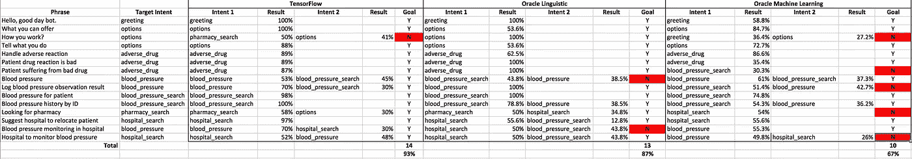
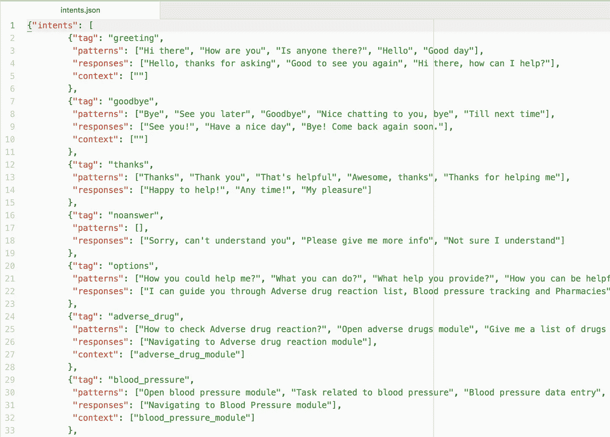
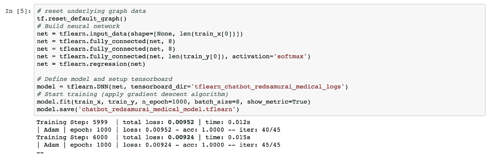
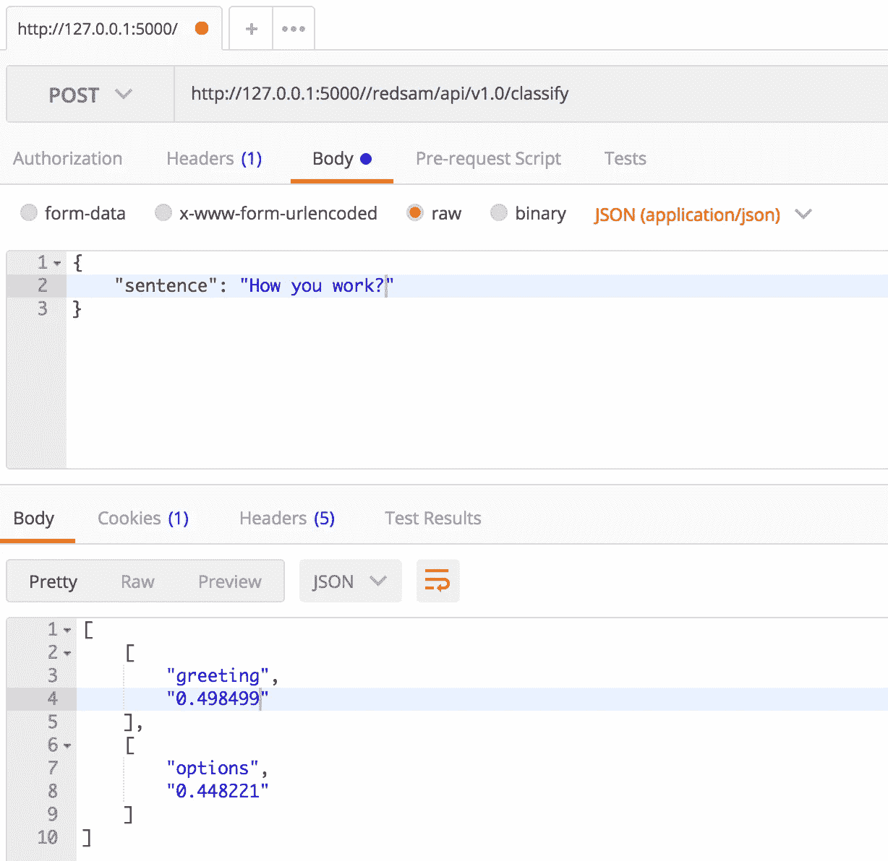
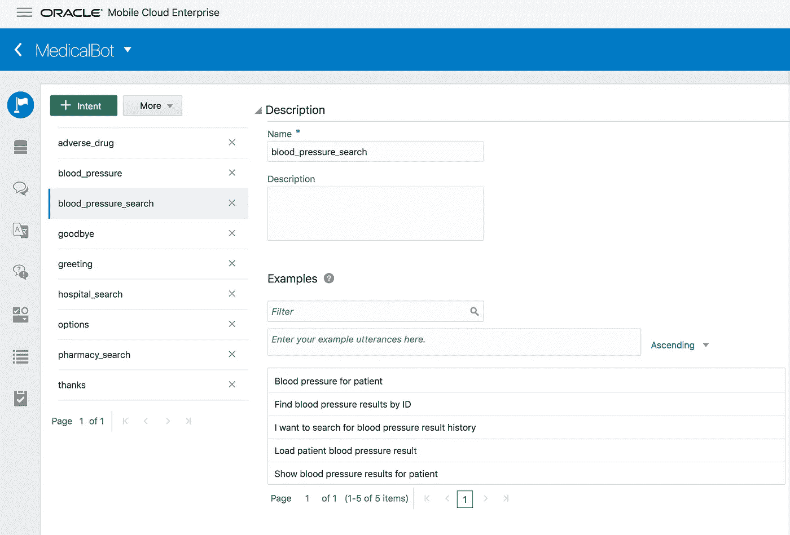
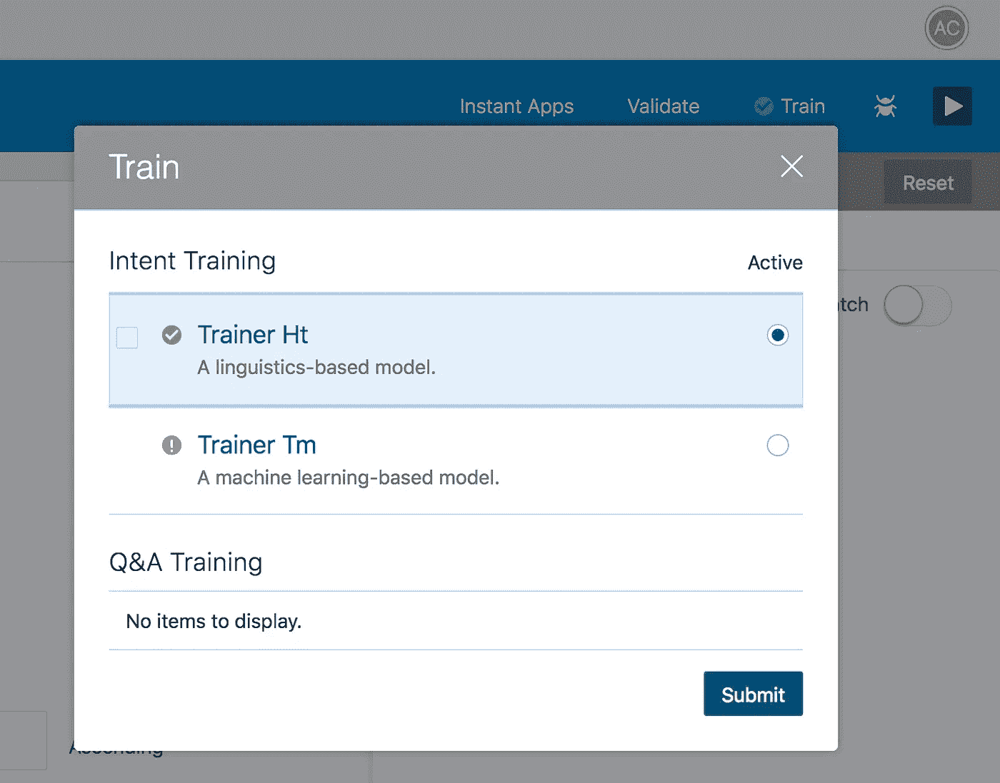
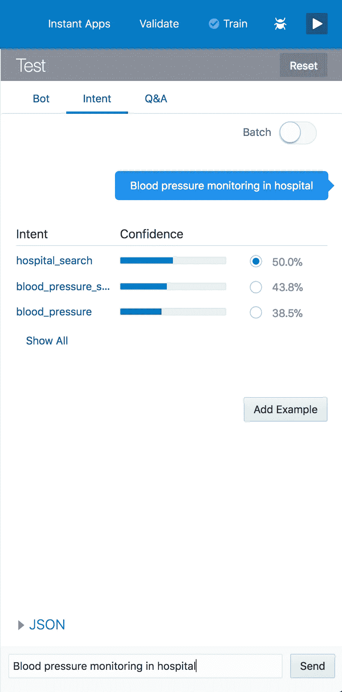
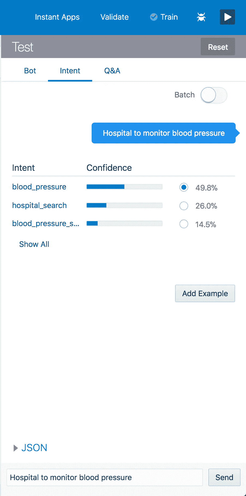

# TensorFlow 和 Oracle Chatbot 中意图分类的比较

> 原文：<https://medium.com/oracledevs/comparing-intent-classification-in-tensorflow-and-oracle-chatbot-997df5f6b682?source=collection_archive---------0----------------------->

我已经用短语创建了意向样本集(每个意向五个短语，十个意向)。利用这组数据，用 TensorFlow 和 Oracle Chatbot 机器学习来训练和建立分类模型。训练好模型后，使用 TensorFlow 和 Oracle Chatbot 对相同的样本短语进行分类，以比较结果。结合语言和机器学习模型使用 Oracle 聊天机器人。

**概要:**

1.  整体张量流模型表现更好。主要原因是，我多次训练 TensorFlow 模型，直到产生良好的学习输出(最小化学习损失)。
2.  Oracle Chatbot 不会在培训后返回关于学习损失的信息，这使得很难确定培训是否有效。因此，更差的分类结果可能与效率稍低的培训有关，这只是因为您没有获得关于培训效率的信息
3.  **分类结果评分** : 93% TensorFlow，87% Oracle Chatbot 语言模型，67% Oracle Chatbot 机器学习。TensorFlow 更好，但 Oracle Chatbot 语言模型非常接近。Oracle 聊天机器人机器学习模型可以改进，参见第 2 点

结果表(点击它，查看最大化):

**张量流**

JSON 文件中提供了 TensorFlow 的意向列表。Oracle Chatbot 中训练模型的目的相同:

张量流分类模型是通过训练两层神经网络建立的。训练完成后，它会打印出训练的总损失。这允许重复训练，直到产生具有最佳损耗(尽可能接近 0)的模型:在这种情况下为 0.00924:

TensorFlow 分类结果不错，它只对一句话分类失败——“你是如何工作的？”这句话与任何意图都没有直接关系，尽管我应该提到甲骨文聊天机器人语言模型能够对它进行分类。TensorFlow 提供了正确的分类意图作为第二选项，非常接近正确答案:

**甲骨文聊天机器人**

Oracle Chatbot 提供了输入意向和示例短语的用户界面—与 TensorFlow 使用相同的意向和短语集:

Oracle Chatbot 提供了两种训练模型——基于语言的和基于机器学习的。

一旦模型被训练，就没有关于训练损失的反馈。我们可以输入短语并检查意图分类结果。以下是语言模型分类失败的示例-它未能对其中一个意图进行分类，其中句子主题不是非常清楚，但是相同的意图被 Oracle Chatbot 机器学习模型很好地分类:

Oracle Chatbot 机器学习模型在另一个意图上失败了，我们想要检查医院(医院搜索)来监测血压。我确定是否有可能审查培训质量损失(可能在下一个版本中？)，我们可以决定重新训练模型并得到接近 TensorFlow 的结果。使用 Oracle Chatbot 机器学习模型进行分类:

*原载于 2018 年 4 月 3 日*[*【andrejusb.blogspot.com】*](https://andrejusb.blogspot.lt/2018/04/comparing-intent-classification-in.html)*。*