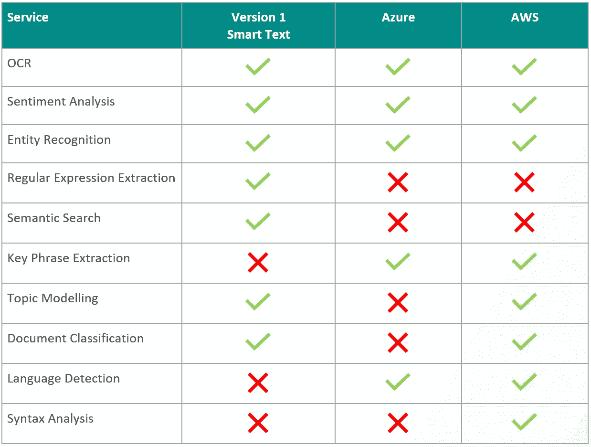
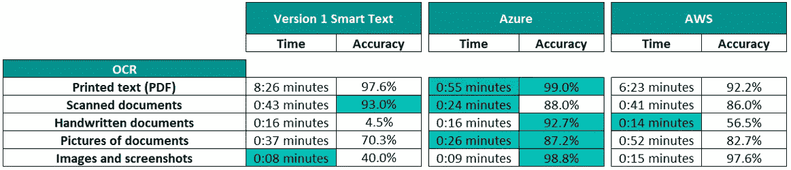
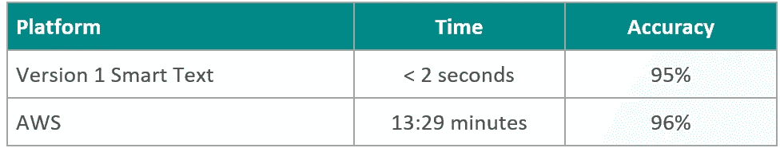
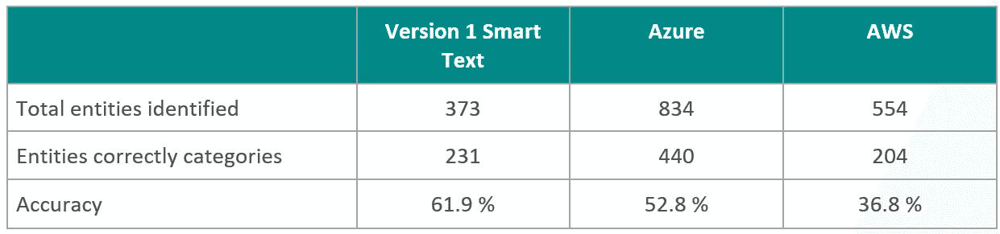
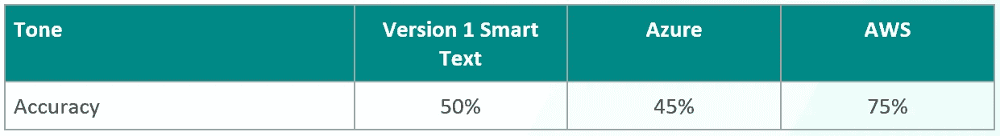
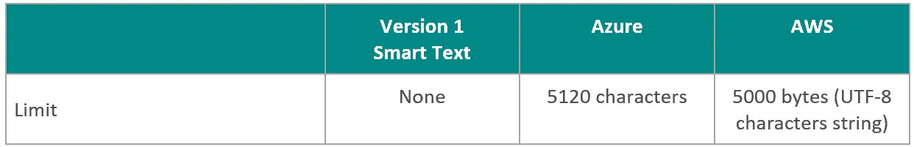
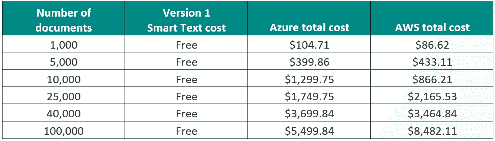

# 比较领先的自然语言处理技术

> 原文：<https://medium.com/version-1/comparing-the-leading-natural-language-processing-technologies-afd462caf4a5?source=collection_archive---------3----------------------->

Photo by [Sigmund](https://unsplash.com/@sigmund?utm_source=medium&utm_medium=referral) on [Unsplash](https://unsplash.com?utm_source=medium&utm_medium=referral)

2019 年，版本 1 创新实验室为一家大型公共部门客户开发了文档分析领域的价值证明(PoV)。该解决方案使用开源软件开发，使用人工智能(AI)和自然语言处理(NLP)技术，通过分析内容来深入了解非结构化文档，无需人工干预。该解决方案的[交互式演示](https://www.version1.com/innovation/smart-text)可在版本 1 网站上获得。

然而，作为 AWS 和 Azure 的主要云合作伙伴，我们完全了解各自提供的相关 NLP 解决方案。为此，我们创建了一份报告，详细介绍了 Azure 和 AWS 的 NLP 的“艺术状态”，并提供了它们与版本 1 开发的解决方案——“版本 1 智能文本”之间的比较。每个解决方案都使用相同的测试数据集进行了测试，每个解决方案的结果都从不同的角度进行了详细的比较:功能可用性、准确性、响应时间、成本、限制以及最后的数据保留和使用策略。

第一版创新实验室最近发布的一份报告详细介绍了这一分析(可通过此[链接](http://link)获得)。本文总结了主要发现。

# **NLP 定义和主要术语**

**NLP**

简而言之，NLP 是一种“基于适当的本体，将文本或音频语音转化为编码的结构化信息的能力”的技术(“T8”)Gartner，2020 。

**光学字符识别**

为了执行文本分析/NLP，经常需要 OCR 来将文本或手写图像转换成文本。这是语言理解的重要前兆。OCR 质量的一个重要考虑因素是每英寸点数(dpi)。此值的黄金标准是 300 DPI，这是文本文档的默认设置( [Cochran，2014](https://ieeexplore.ieee.org/stamp/stamp.jsp?arnumber=6758856) )。另一个考虑是 OCR 对图像起作用。如果提供了 PDF 或 Word 文档，可能需要首先转换为图像，然后执行 OCR。这可能会影响处理时间。

**情感分析**

这是计算机程序判断文本语气的能力，以理解总体情绪是积极的、消极的、中性的等等。这在许多情况下都很有用，例如呼叫中心分析和性能改进、聊天机器人、呼叫/查询优先级

**实体识别**

实体识别涉及计算机程序自动提取诸如名称、公司名称、国家等实体的能力。这也可以扩展到识别您的组织特定的实体。

**正则表达式提取**

这是实体识别的一个扩展，允许您提取遵循自定义模式的实体。例如，税号、电子邮件、发票号等。

**语义搜索**

提供确定文档/消息中是否提到关键词或这些关键词的同义词的能力。当您想要识别提及某个概念的文档/消息时非常有用。

**关键短语提取**

关键短语提取是自动提取给定文档/消息中提到的关键短语和术语的能力。

**主题建模**

主题建模是关键短语提取的扩展，其识别最准确描述主题的关键短语。这允许您将文档/消息的语料库分类为一组主题，并理解哪些关键短语最准确地代表每个主题。这些信息可以用来找出新文档中提到的主题，从而让您更准确地分类和理解这些文档。

**文档分类**

主题建模使用无监督的方法来自动确定主题或分类，而文档分类使用有监督的机器学习方法，通过该方法，模型通过仅被馈送该分类的文档来学习该分类(或主题)看起来像什么。与无监督的主题建模相比，这是一种有监督的机器学习方法。

**语言检测**

自动确定使用的语言。

**语法分析**

该功能根据语法角色对文本中的每个单词进行分类:代词、动词、形容词等等。

# 比较

第 1 版智能文本、Azure 和 AWS OCR 和 NLP 技术使用相同的数据集进行了测试，并在可能的情况下使用相同的配置。

在本[报告](http://link)中展示了比较的全部细节。下面是我们研究结果的简要总结。

1.  **服务可用性比较**

下表总结了这些功能的可用性。

***胜利者:*** 没有明确的胜利者。这取决于你需要哪种能力。

**2。OCR 比较**

***赢家:*** Azure Read API。它显然是最快的，在许多情况下也表现得最好。但是，如果您的需求是对印刷文本进行 OCR，那么这三种解决方案都可以胜任。

**3。监督文件分类比较**

***赢家:*** Azure 认知服务不呈现任何文档分类功能。AWS 和版本智能文本的表现相似。但是，如果考虑到处理时间，第 1 版智能文本可以被认为是赢家，因为响应时间接近实时。

**4。实体识别比较**

***赢家:*** 准确性方面，版本 1 智能文本更好。这些服务中的每一个都提供了一些不同的实体集合，Azure 也提供了子类。选择这些服务中的哪一个最适合取决于用例的需求。

**5。情感分析对比**

***获胜者:*** AWS 提供了更高的精度

**6。限值比较**

**获胜者:**第 1 版智能文本没有字符、页面或事务限制。

7。成本比较

报告中有详细的费用分析。下面是一个表格，比较了 ocr 和运行以前在同一组文档上引入的服务的成本。

***赢家:*** 没有明确的赢家。这三种解决方案的成本都相对较低，我们不认为成本是选择的主要驱动因素。如果您想要处理特别大的量，这种情况可能会改变，在这种情况下，版本 1 智能文本解决方案将是有意义的。

8。数据保留和使用政策比较

***赢家:*** 第 1 版智能文本 as 你的数据不被保留，用于 AI 模型训练等其他用途。

# **结论**

本博客简要介绍了创新实验室为比较不同的 OCR 和 NLP 技术而进行的测试。我强烈推荐任何对这个主题感兴趣的人，通过这个[链接](http://link)阅读完整的报告。

关键要点总结如下:

*   深度学习的进步使 NLP 能力在过去几年里取得了长足的进步，使组织能够采用清晰的用例。
*   在理解和回答文档上的问题方面，AI 模型可以比人类表现得更好。
*   这为组织获得对文档和文本的深入和可行的见解创造了巨大的机会，消除了员工进行分析的需要。
*   没有明确的赢家，也没有放之四海而皆准的办法。您需要哪种解决方案取决于您的需求。
*   所有解决方案都提供了一组重叠的功能，但是，每种解决方案还提供额外的独特服务。
*   版本 1 创新实验室构建的解决方案使用开源框架、模型和技术，在性能和功能上与云提供商不相上下。
*   第 1 版智能文本解决方案的[交互式演示](https://www.version1.com/innovation/smart-text)可在第 1 版网站上获得。