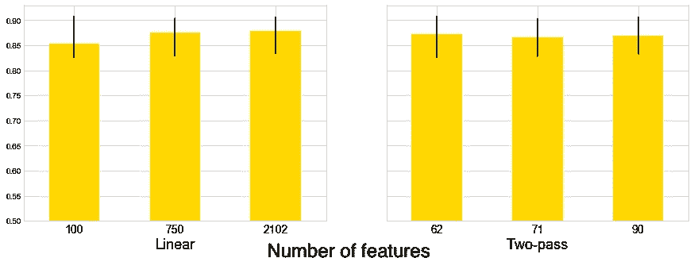
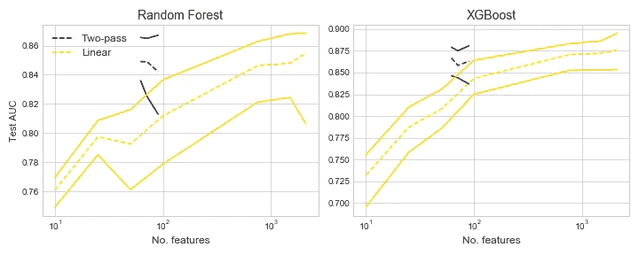
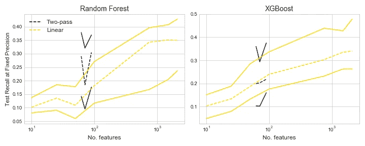
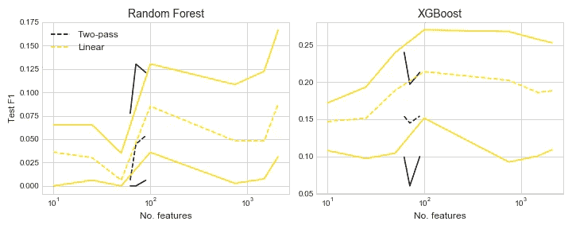

# 两种前向特征选择算法的比较

> 原文：<https://medium.com/square-corner-blog/comparing-two-forward-feature-selection-algorithms-c52f42868f55?source=collection_archive---------2----------------------->

*作者:* [帕特里克·卡利耶](https://twitter.com/data_pat) *|* [乔纳森·温岚](/@jslandy)

> 注意，我们已经行动了！如果您想继续了解 Square 的最新技术内容，请访问我们的新家[https://developer.squareup.com/blog](https://developer.squareup.com/blog)

# 一.导言

在本帖中，我们回顾了我们从生产特征选择应用的第一次实验中学到的一些东西。我们关注逐步选择的两个变体:(1)Efroymson[[2](#f13e)]的线性逐步选择方法，在此称为*线性*逐步向前，以及(2)使用两遍数据的定制逻辑回归逐步选择方法，我们称之为*两遍*逐步向前。这两种方法都依赖于使用简单的方法来迭代地选择最相关的特征。一旦算法完成，选择的特征被输入到更复杂的模型中，我们使用交叉验证来选择保留多少。

这两种方法在比全集小一个数量级的特征集上实现了合理的性能。线性方法速度快，并在各种评估指标中表现出稳健的性能。两遍方法较慢且有些脆弱，但在数据集上实现的示例性性能甚至比其他方法选取的数据集更小。对于这两种方法，随着您添加更多功能，性能通常会继续提高。

# 二。逐步方法

n 个特征的父集合将总是具有 2^N 可能的特征子集，该数量随着 n 呈指数增长。这种增长率意味着即使在适度的 n 下强力搜索最优子集也很少可行[ [1](#f13e) ]。这促使寻找快速但近似的特征选择搜索策略。

我们考虑的两种特征选择方法都是向前逐步选择方法的变体。传统的向前逐步选择工作如下:我们通过选择模型类(例如，线性或逻辑回归)开始我们的特征选择过程。接下来，我们询问 N 个特征中的哪一个能够提供我们类中预测目标的最佳模型。这需要构建 N 个独立的模型，每个模型只能访问原始数据集中的一个特征。一旦最佳的第一特征被确定，它就被锁定在适当的位置。然后我们迭代:保持第一个特征被选中，我们询问哪个第二个特征，当添加到第一个特征时，产生具有两个特征的最佳模型。这需要考虑 N-1 个单独的模型。以这种方式继续下去，我们可以遍历所有 N 个特征，按照它们何时应该被添加到保留的特征集中的顺序返回特征的排序。执行整个过程需要 N + (N-1) + (N-2) + … + 1 = N x (N + 1) / 2 个模型构建。

上述过程的实际运行时间取决于所选择的模型类。如果单次拟合的运行时间是 O(N^g)，其中 g 是特定于给定模型类型的运行时间复杂度的常数，那么全前向扫描的运行时间将看起来是 O(N^(2 + g)，因为我们需要 O(N)个模型构建，如上所述。逻辑回归方法就是如此(其中 g=3 [ [3](#f13e) ])，这令人沮丧，因为逻辑回归比我们在生产中使用的大多数模型训练起来更快。然而，在线性回归的情况下，存在用于执行逐步向前选择的有效方法，该方法允许在单个模型构建的相同时间复杂度内执行整个算法。这是通过在将特征添加到特征集中时高效地更新模型来实现的。见[ [2](#f13e) ]中与该方法相关的参考资料和代码，该方法首先由 Efroymson 发现，我们在下文中称之为“线性”方法。

我们考虑的第二种方法是*双程*过程，也属于向前逐步方法家族，由 Square 数据科学家 Ezzeri Esa ( [github](https://github.com/savarin) )首先设计。它不是试图对整个特征集进行排序，而是使用一种只需要 2N 次模型拟合的贪婪方法。

两遍程序首先对每个单独的特征建立一组小的单变量模型(这里是逻辑回归)。它根据选择的度量标准按降序排列模型。从选择与排名第一的单变量模型相关联的特征开始，我们沿着列表向下进行，在所选特征和下一个最佳候选特征上拟合模型。当所选特征+候选模型的度量改进超过可调阈值时，候选被添加到所选特征的集合中。从那里开始，选择以类似的方式进行，继续沿着尚未尝试的候选人列表向下。

如果候选模型对度量的改进不超过阈值，则不会重新考虑它。通过这种方式，您只需两次遍历数据即可完成选择过程，一次是对要开始的要素进行排序，另一次是在要素添加到选择池时拟合所有候选要素。这允许通过度量改进和选择顺序对特征进行分级，尽管这种分级对于未选择的特征可能不是特别有意义，而选择顺序对于未选择的特征肯定是没有意义的。

两遍方法的一个优点是，我们可以选择特性来优化可配置的指标。能够配置度量标准很有吸引力，因为这意味着您可以针对特定的业务问题定制功能选择。例如，在欺诈建模的实例中，当人们最终审查由模型标记的案例时，我们通常对分类器在给定精度水平或低于给定精度水平时的行为感兴趣，因为这允许我们为我们的工作人员估计和校准案例量。这促使基于固定精度水平或低于固定精度水平的最小召回进行调优，这对于线性选择是不可能的(至少在仍然保留 Efroymson 优化的同时)。

不幸的是，对于两遍方法的可调度量(和模型形式),我们不知道任何像 Efroymson 发现的那样的加速。因此，在两遍方法中，我们有一个 O(N^(1+g)特征选择过程。我们在实践中发现，当它包含超过几百个特性或几千个观察值时，它的运行时间是不利的，有时需要几个小时或几天才能在我们的笔记本电脑上运行。相比之下，线性方法通常在这种规模的数据集上运行几秒钟，并且也可以扩展到更大的数据集。

能够调优到特定的指标和模型类型是采用两遍方法的一个很好的理由，久经考验的质量和速度是采用线性方法的一个很好的理由。我们开始在大约 2000 个可用特征的数据集上测试每一个的经验性能，对照几个不同的性能指标。

# 三。实验

ROC AUC on validation set, top performing configurations.

在合理的约束条件下，我们希望在模型中添加信息性特征后，模型的性能会有所提高。因此，衡量特征选择技术的一个标准是，我们可以用越来越少的特征保持多少性能。在上图中，两种方法都可以找到与完整集性能相当的特征子集，但特征数量要少一个数量级。与线性方法找到的最小性能子集相比，快速方法在数量少得多的特征上保持优异的性能。

为了获得这些数字，我们从我们的一个产品中获取了一些数据，并在 Efroymson 提供的不同大小的特征子集上评估了随机森林和增强树分类器，以及我们的定制调整技术。对于每个特征子集，我们在树的数量和最大树深度上进行网格搜索，以搜索该特征集上的最佳模型。

一旦确定了每个模型的“最佳”模型和可用的功能数量，我们就在看不见的维持集上测试每个模型，并收集模型性能指标，如 ROC 曲线下面积(AUC)和固定精度下的召回率。

线性方法在整个特征集上产生完整的排名，因此我们在 5、10、25、50、100、500、1000 和所有特征上训练模型——刚好超过 2000。相比之下，两遍方法没有提供一种简单的方法来对拒绝的特征进行排序，因此我们在阈值参数的几个值处获取其输出，最终选择 20 到 60 个特征。我们告诉两步法优化 ROC AUC 作为选择的指标。

下图显示了使用由两种选择方法确定的特征集的所有模型拟合的评估指标的分布。我们显示了每个特征集大小的中值性能，以及 95%的置信界限。

Test ROC AUC by model type, feature set size, and feature selection algorithm.

正如所料，ROC AUC 通常随着特征数量的增加而增加。对于非常大量的要素，随机森林不会提高性能，但梯度增强树似乎表明 AUC 增加到最大要素数。

对于数量非常少的要素，两遍方法优于线性选择。当我们用另一个指标来衡量性能时，这种优势就消失了，回想一下精度=0.33 时的情况:

Test recall at fixed precision by model type, feature set size, and feature selection algorithm.

根据这一标准，随着特性数量的增加，性能提高的趋势依然存在，但是在任何特性集大小下，这两种方法之间都没有明显的区别。我们发现，虽然两遍选择通常在它所调整的指标(这里是 ROC AUC)上优于线性，但在它没有调整的指标上，它的性能几乎总是更脆弱。

这种模式在很大程度上与 F1 相同，尽管模型在这一指标上差异很小，无论是模型类型、特征大小还是选择算法。

Test F1 by model type, feature set size, and feature selection algorithm.

# 四。讨论

这种比较显示了线性和两遍向前选择相对于彼此的优点和缺点。线性选择的速度非常快，能够产生性能稳定的特征子集。但是，如果您正在寻找一个非常小的特性子集，并且希望它在某个特定的指标上表现优异，那么两遍方法是很好的，只要您有时间等待它完成。

我们已经关注了特性选择之后的模型性能，而不是人们可能追求的商业原因，但是我们应该考虑自动特性选择(通过任何方法)什么时候是值得的或者不值得的。

一种情况是沿着特征-观察权衡进行调整。在计算或存储受限的环境中，我们经常会发现自己在添加更多观察和添加更多功能之间受到限制。我们的一些实验利用了这种折衷来提高模型的性能。

另一个相关的用例是模型可解释性。具有少量(非共线)特征的线性模型比许多其他机器学习方法具有更大的优势，因为它提供了可解释性。例如，如果一个风险模型只根据三个特征给卖家打分——比如，他们在 Square 上呆了多长时间，他们处理了多少支付量，以及他们收到了多少退款——那么当该模型标记一个商家时，就很容易确定它为什么这样做。我们已经用[更通用的方法](/square-corner-blog/making-ai-interpretable-with-generative-adversarial-networks-766abc953edf)对可解释性进行了一些其他的实验，但是稀疏特征化的线性模型仍然是这个行业的黄金标准。

# 参考

[1]最优子集选择是 NP 难的。参见 B. K .纳塔拉詹。线性系统的稀疏近似解。SIAM 计算杂志，24(2):227–234，1995 年。

[2]埃夫洛姆森先生。多元回归分析。*数字计算机的数学方法*，1:191–203，1960 年。

最近 Efroymson 方法的 python 实现可以在 GitHub [这里](https://github.com/EFavDB/linselect)找到。数学细节——重点是无监督选择的扩展——在链接的 arXiv 论文中讨论。

[3]关于部分模型运行时复杂度的论文[此处](https://etda.libraries.psu.edu/files/final_submissions/11108)。