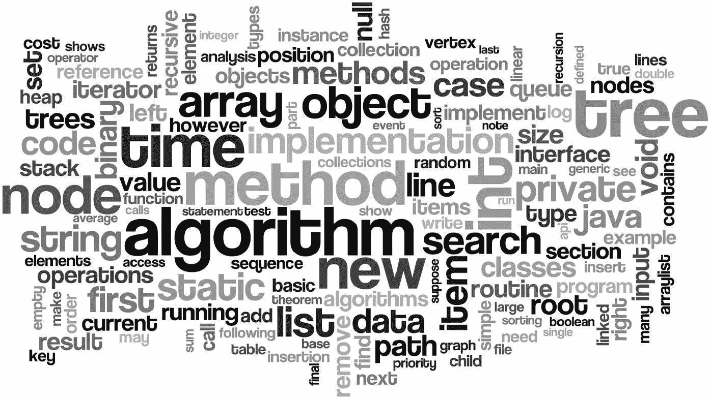

# Competitive Programming sebagai Pondasi

> 原文：<https://medium.easyread.co/competitive-programming-sebagai-pondasi-32f48de3a841?source=collection_archive---------0----------------------->

## Alasan mengapa *programmer* harus mencoba mengikuti Competitive Programming

Taken from [http://nihal111.github.io](http://nihal111.github.io)

Sebagai seorang mahasiwa Teknik Informatika, kemampuan pemrograman adalah *skill* utama yang harus dimiliki. Untuk mengasah kemampuan pemograman, kita perlu banyak berlatih berbagai macam bahasa, *framework* dan teknologi baru. Seperti yang saya lakukan, dimulai dari pengenalan *Hello World,* hingga saat saya menulis ini, saya sudah belajar membuat beberapa sistem informasi sederhana dan sedikit mengulik mengenai *Progressive Web App* . Hal tersebut melatih dan mengasah kemampuan saya dalam pemograman.

Pada awal masa perkuliahan, saya sudah dikenalkan dengan *Competitive Programming* oleh senior saya, [Taufan Silitonga](https://medium.com/u/ea5df35599e0?source=post_page-----32f48de3a841--------------------------------) . Saya diajak untuk mengikuti banyak kompetisi baik kompetisi dalam ataupun luar kampus. Saya juga diajak membentuk satu tim *programming* . Di tim tersebut, kami belajar membagi tugas dan topik supaya fokus tetapi tidak lupa tetap mempelajari topik lainnya.

Bermain dibanyak kompetisi membuat saya membuka jaringan dengan teman-teman mahasiswa dari kampus lain. Dari mereka saya sering mendapatkan informasi mengenai kompetisi, program *internship* , dan bahkan hal-hal yang sedang mereka pelajari. Sampai pada salah satu pencapaian terbaik menurut saya yaitu saat saya menjadi finalis *ACM ICPC Asia Jakarta 2016\.*

Berikut beberapa manfaat yang saya rasakan setelah mengikuti *Competitive Programming* .

## 1\. Terbiasa ‘ *ngoding’* mempermudah pemahaman saat perkuliahanan

Mencoba mengerjakan soal-soal *Competitive Programming* *(CP)* setiap harinya, membuat saya mulai terbiasa menangani kode-kode program. Menangani hal-hal seperti *nested if* dan *nested loop* menjadi hal yang sangat biasa. Ketika dosen mengatakan “nanti buat *method* ini dengan *return* *type* ini, dan parameternya ini”, saya jadi lebih mudah memahami bagaimana mengimplementasikannya nanti. Kalau dibandingkan dengan teman teman lain yang tidak ikut *CP* , saya dan teman yang mengikuti *CP* akan jauh lebih mudah memahami hal tersebut.

## 2\. Mengatahui hal apa yang harus dilakukan

*CP* mengajarkan saya untuk berpikir bagaimana cara memecahkan suatu masalah. Dari step A ke step B ke step C. Jika tidak bisa menyelesaikan dengan solusi pertama, mungkin harus merubah skenario solusinya dan memakai solusi yang lain. Intinya sih ***jadi lebih banyak mikir*** . Hal ini semakin mendorong saya untuk mempelajari hal yang baru. Pertama harus belajar teknologi A, kemudian B, lalu nanti dikombinasikan dengan C. Kebanyakan teman-teman saya kesusahan ketika mengerjakan suatu tugas dikarenakan tidak paham alur dari program yang akan dikerjakan. Jadi seringkali kebanyakan berputar disatu masalah yang sama.

## 3\. Berteman dengan error message

Ketika memulai belajar pemrograman, *error* merupakan hal yang akan sangat sering dijumpai. Pada awalnya saya tidak menyukai adanya *error* bahkan sampai membaca pesan *error* . Kalau ada *error* langsung *review* kodenya lagi tanpa berusaha memahami maksud dari *error* tersebut dan bagaimana untuk menyelesaikan. Dan pada akhirnya hasilnya akan *error* lagi. Dari sini saya belajar untuk membiasakan membaca pesan *error* yang ada. Jadi ketika saya membaca pesan *error* , saya mencoba memahami lalu saya tahu harus mengerjakan apa.

## **4\. Kesempatan internship**

Ketika saya masih tingkat dua, saya mencoba mengikuti *internship* untuk mengisi waktu liburan. Awalnya saya ragu untuk mengikuti program ini, tetapi saya berpikir bahwa tidak ada salahnya mencoba meskipun gagal. Saya memberanikan diri meng- *apply* ke salah satu perusahaan — yang kalau dikampus saya itu sangat *“wah”.* Saya mengirimkan *resume* saya yang bisa dibilang cukup berisi untuk mahasiswa tingkat dua — isinya pengalaman ikut kompetisi sana sini walau kebanyakan hanya peserta atau *finalis* . Ketika perusahaan tersebut memberikan ujian untuk mengikuti *internship* -nya, ternyata yang diberikan adalah soal- soal CP. Meskipun saya cuma bisa menyelesaikan 2 dari 3 soal yang diberikan, itupun karena soalnya mirip dengan yang pernah saya kerjakan. Akan tetapi, puji Tuhan saya diterima mengikuti program *internship* disana.

## **5\. Pemahaman algoritma dan struktur data**

*CP* tidak jauh dengan yang namanya algoritma dan struktur data. Mau tidak mau saya terpaksa harus banyak belajar algoritma dan struktur data supaya mengembangkan kemampuan CP saya. Saya sering bertanya kepada dosen dan senior saya bagaimana suatu algoritma berjalan, kapan saya harus menggunakan *Vector* atau *Array* , apa bedanya variabel yang didekarasikan *global* dan *local* , bahkan berapa batasan *array* dengan tipe data tertentu saya harus cari tahu. Ketika saya mengikuti mata kuliah Algoritma dan Struktur Data, saya merasa sedikit lebih mudah karena sudah terbiasa. Saya juga terbiasa mempelajari kompleksitas suatu algoritma, yang biasa dipelajari ***Big O Notation*** .

Pernah juga teman saya bertanya, *“kenapa sih kebanyakan perusahaan kalau ujian internship itu selalu pakai CP? kan belum tentu yang jago CP bisa develop app”* . Dari teman yang lain ada yang pro dan kontra dengan pendapat itu. Tetapi itu kembali keorangnya masing-masing. Lagian, tidak sedikit juga perusahaan yang tidak memakai *CP* untuk ujian internship maupun full time. Jadi menurut saya itu tidak perlu terlalu dipermasalahkan.

Demikian beberapa hal yang saya dapat dan alami ketika saya sering mengikuti lomba *Competitive Programming* . Jika kamu memiliki alasan lain yang mendorong kamu dalam mengasah kemampuan *programming* mu, kamu boleh memberikan pendapatmu di kolom komentar. Selain itu, setiap orang pasti memiliki cara belajarnya masing — masing. Saya juga tidak mengatakan kalau saya paham betul dengan *CP* , buktinya saya hanya bisa sampai finalist saja hahaha 😅

Oh iya, ini juga tulisan pertama saya, jadi kalau masih banyak yang salah disana sini mudah-mudahan kedepannya bisa diperbaiki. *Happy reading* ! *Cappy Hoding* !😃

*Artikel ini di tulis oleh* [*Eko Simanjuntak*](https://medium.com/u/efc3b4ea41af?source=post_page-----32f48de3a841--------------------------------) *beliau sering mengikuti berbagai kompetisi Competitive Programming. Follow profilnya untuk mendapatkan update-an terbaru artikel-artikel beliau.*

*Jika anda merasa artikel ini menarik dan bermanfaat, bagikan ke lingkaran pertemanan anda, agar mereka dapat membaca artikel ini.
Atau jika anda tertarik untuk membagikan cerita anda pada publikasi ini, anda boleh mengirimkan cerita anda ataupun mengikuti langkah-langkah yang ada* [***disini***](https://medium.com/easyread/about-easyread-74b20960e180) *.*