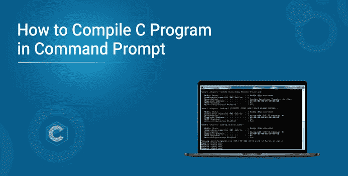
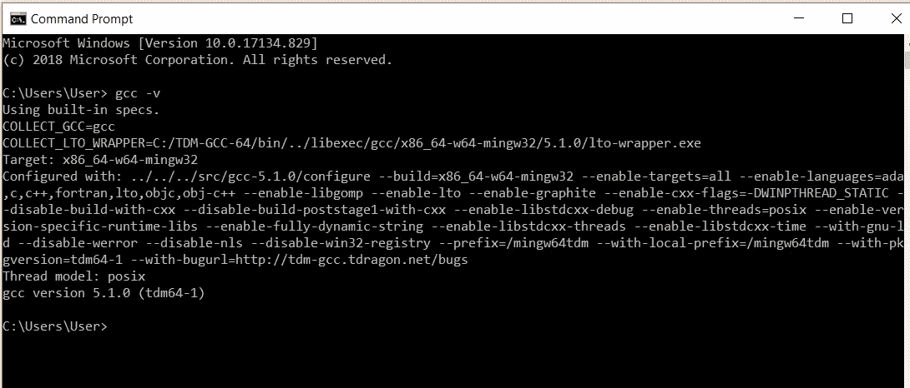
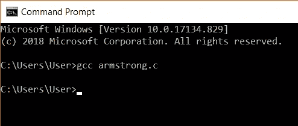
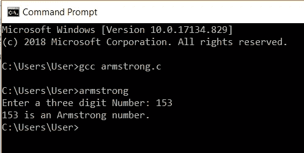

# 如何在命令提示符下编译 C 程序

> 原文：<https://medium.com/edureka/compile-c-program-in-command-prompt-e6cd3ce11d8e?source=collection_archive---------1----------------------->



我们通常使用带有图形用户界面的编译器来编译我们的 C 程序。这也可以通过使用 cmd 来实现。命令提示符有一组我们需要执行的步骤，以便在不使用 GUI 编译器的情况下执行我们的程序。在本文中，我们将了解如何在命令提示符下编译 C 程序。

因此，让我们从这篇关于如何在命令提示符下编译 C 程序的文章开始，

# 如何在命令提示符下编译 C 程序？

**第一步:**

运行命令“gcc -v”检查您是否安装了编译器。如果没有，你需要下载一个 gcc 编译器并安装它。您可以在 windows 系统中搜索 cmd 来打开命令提示符。



**第二步:**

创建一个 c 程序并将其存储在您的系统中。我已经编写了一个程序来查找阿姆斯特朗号码，并将其存储在目录 user 中。我们将使用下面的代码。

```
#include <stdio.h>
**int** main()
{
**int** num, original, rem, sum = 0;
printf("Enter a three digit Number: ");
scanf("%d", &num);
original = num;
**while** (original != 0)
{
rem = original%10;
sum =sum + rem*rem*rem;
original =original/ 10;
}
**if**(sum == num)
printf("%d is an Armstrong number.",num);
**else** printf("%d is not an Armstrong number.",num);
**return** 0;
}
```

**第三步:**

将工作目录更改为 C 程序所在的位置。你可以使用命令' **cd** '来改变目录。我们需要传递存储程序的目录名。

**举例:** >光盘桌面

我们的程序已经在用户目录中，所以我们不需要改变它。

**第四步:**

下一步是编译程序。为此，我们需要使用 gcc 命令，后跟我们将要执行的程序的名称。在我们的例子中，我们将使用 Armstrong.c。



在此之后，将在 c 文件所在的目录中创建一个可执行文件。Armstrong.exe

**第五步:**

下一步，我们可以运行程序。这可以通过简单地给出可执行文件的名称来实现，不需要任何扩展名。给出这个我们会得到一个输出。在这里，我们的阿姆斯特朗代码被执行，我们得到了这个代码的输出。



说到这里，我们来结束这篇关于“如何在命令提示符下编译 C 程序”的博客。我希望你发现这是有益的，请继续关注更多类似主题的教程。

这是一个 C 程序的基本结构。如果你想查看更多关于人工智能、DevOps、道德黑客等市场最热门技术的文章，那么你可以参考 [Edureka 的官方网站。](https://www.edureka.co/blog/?utm_source=medium&utm_medium=content-link&utm_campaign=how-to-compile-c-program-in-command-prompt)

> 1.[C 程序的基本结构](/edureka/basic-structure-of-c-program-ed3bf9c72632)
> 
> 2.[C 中的斐波那契数列](/edureka/fibonacci-series-in-c-3207f0f57eb6)
> 
> 3. [C 程序求一个二次方程的根](/edureka/c-program-quadratic-equation-1483f6a182af)
> 
> 4. [C 编程教程](/edureka/c-programming-tutorial-36bc0380175f)

*原载于 2019 年 7 月 12 日*[*【https://www.edureka.co*](https://www.edureka.co/blog/how-to-compile-c-program-in-command-prompt/)*。*