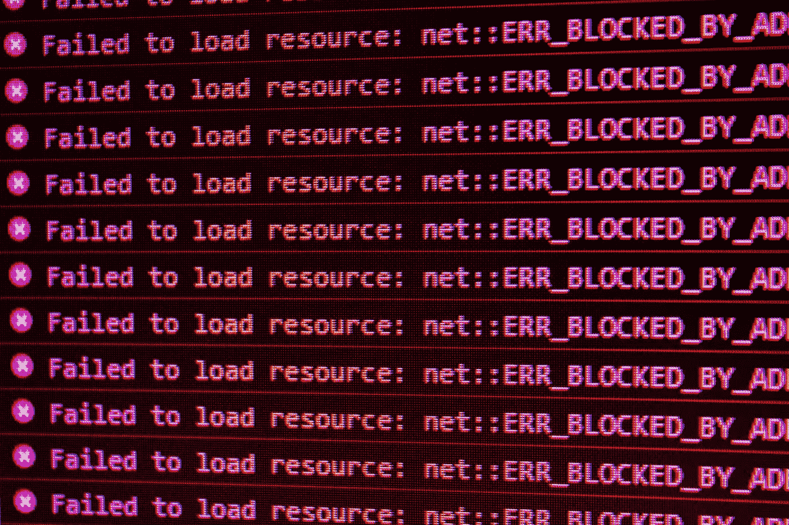

# Kotlin 中的编译时异常处理

> 原文：<https://blog.kotlin-academy.com/compile-time-exception-handling-in-kotlin-1126c55387ce?source=collection_archive---------1----------------------->



Photo by [David Pupaza](https://unsplash.com/es/@dav420?utm_source=unsplash&utm_medium=referral&utm_content=creditCopyText) on [Unsplash](https://unsplash.com/s/photos/error?utm_source=unsplash&utm_medium=referral&utm_content=creditCopyText)

在 Kotlin 中，没有类似 Java 的检查异常的概念。我们要么处理异常，要么让它在运行时崩溃。

我一直在做一个 Kotlin 项目，他们用**函数式风格**写代码。由于我来自 C++背景，适应这种风格相当棘手。一开始，我违反了规则，使用了大量的 **var** 而不是 **val** ，并且到处使用**可变集合**，但是过了一段时间，我开始适应了。

需要多花一点时间来适应的一件事是函数式编程中的错误处理。在 FP 风格中，没有异常，错误被视为值。每个函数返回**成功**或**错误**。但问题是，Kotlin 并不是像 Haskell 那样的纯函数式语言。大多数标准库函数都会抛出异常。

```
fun main() {
    *emptyList*<Int>().*first*()
}
```

这段代码将在运行时抛出`NoSuchElementException`。函数代码中不允许出现这种运行时意外😜当然，也可以把上面的代码毫无例外地写成如下。

```
fun main() {
    *emptyList*<Int>().*firstOrNull*()?.*let* **{** first **->** *println*("only execute if the list is not empty. First element = $first")
    **}** }
```

或者可以使用下面的箭头库来编写没有 null 的代码。

```
import arrow.core.firstOrNone
fun main() {
    *emptyList*<Int>().*firstOrNone*().tap **{** first **->** *println*("only execute if the list is not empty. First element = $first")
    **}** }
```

所以我们有一些抛出异常的标准库函数的替代函数。

那还有什么问题呢？问题在于开发者😄是的，在处理大型函数式项目时，我们有时会忽略并使用标准的库函数，它会抛出异常。甚至有几次我也陷入了这个陷阱，陷入了代码审查。

所以我在寻找一些 linter，它可以在编译时警告我未处理的异常。不幸的是，有两个问题( [KT-18276](https://youtrack.jetbrains.com/issue/KT-18276) 、 [KTIJ-10948](https://youtrack.jetbrains.com/issue/KTIJ-10948) )已经存在于 IntelliJ YouTrack 中，并且在过去的 3 年中没有得到解决😐

## 箭头分析

这篇文章基本上是为了表扬这个插件的开发者👍它在编译时分析代码，并试图捕捉潜在的未处理异常。例如，如果在 Gradle 构建中应用了箭头分析插件，下面的代码将无法编译。

```
fun main() {
    *emptyList*<Int>().*first*()
}
```

箭头分析插件的编译时错误。

```
pre-condition `not empty` is not satisfied in `first()`
  -> unsatisfiable constraint: `(emptyList<Int>().size) >= 1`
```

它仍然不能满足我的要求，因为它只捕获运行时可能崩溃的异常。例如，下面的代码可以顺利编译。

```
fun main() {
    *listOf*(1,2).*first*()
}
```

因此，该插件向类似于 Kotlin `[require](https://kotlinlang.org/api/latest/jvm/stdlib/kotlin/require.html)`的函数添加了一组前置和后置条件，但它们是在编译时验证的。

即使您的项目已经用 Kotlin `require`编写，使用这个插件仍然有好处。它在编译时而不是运行时检查那些`require`。

```
fun getIndices(count: Int): List<Int> {
    *require*(count >= 0) **{** "Count must be non-negative, was $count" **}** return *List*(count) **{ it** + 1 **}** }

fun main() {
    *getIndices*(-1)
}
```

箭头分析插件的编译时错误。

```
pre-condition `Count must be non-negative, was $count` is not satisfied in `getIndices(-1)`
  -> unsatisfiable constraint: `-1 >= 0`
```

## 向 Gradle 项目添加箭头分析

```
buildscript {
  dependencies {
    classpath("io.arrow-kt.analysis.kotlin:io.arrow-kt.analysis.kotlin.gradle.plugin:2.0")
  }
}
apply(plugin = "io.arrow-kt.analysis.kotlin")
```

延伸阅读:[λrrow 分析。超越编译器](https://arrow-kt.io/docs/meta/analysis/#%CE%BBrrow-analysis-beyond-the-compiler)

## 资源

[](https://arrow-kt.io/docs/meta/analysis/) [## rrow 元

### rrow 分析在您的编译管道中引入了新的检查，它会警告常见的错误，如越界…

arrow-kt.io](https://arrow-kt.io/docs/meta/analysis/) [](https://kotlin-academy.us17.list-manage.com/subscribe?u=5d3a48e1893758cb5be5c2919&id=d2ba84960a)