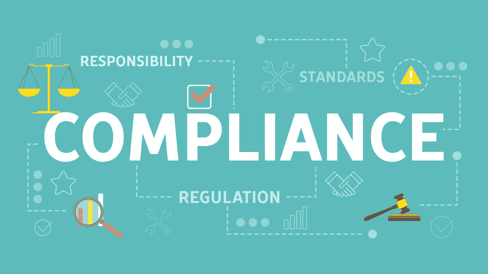
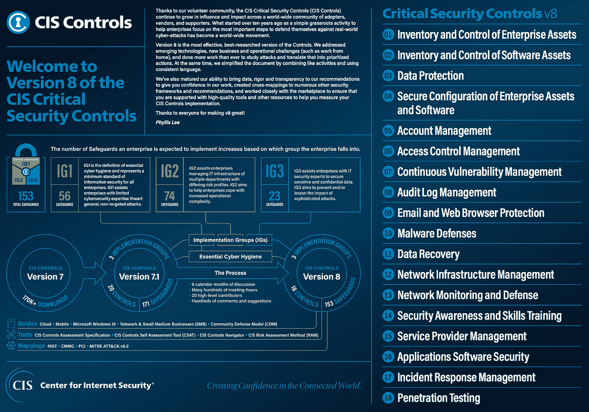
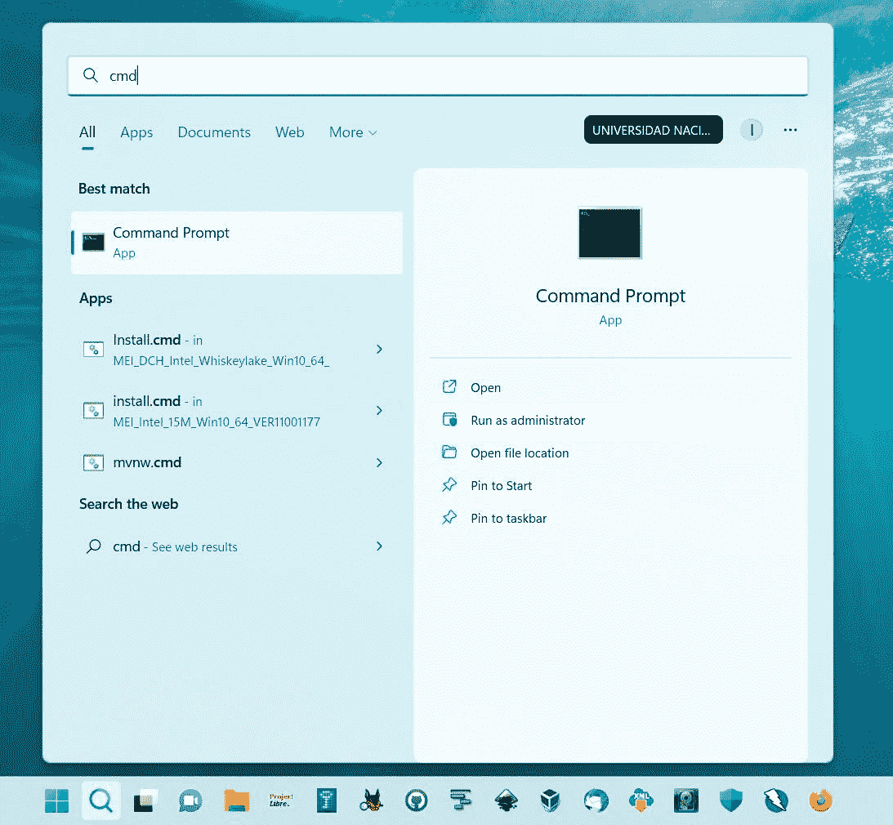
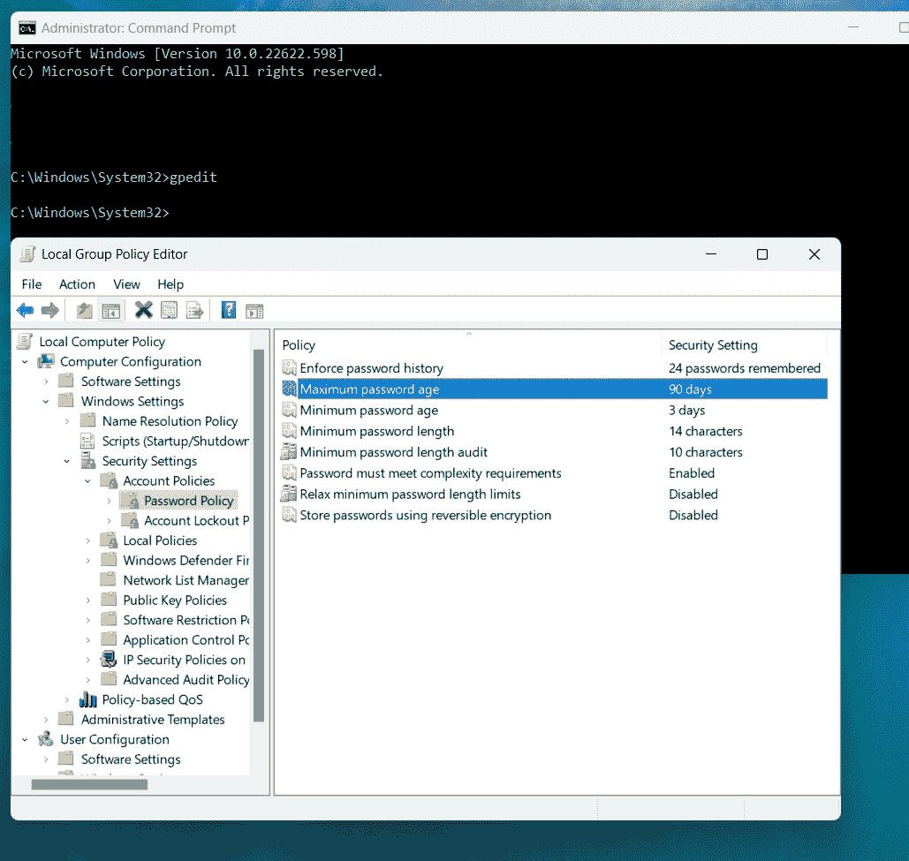
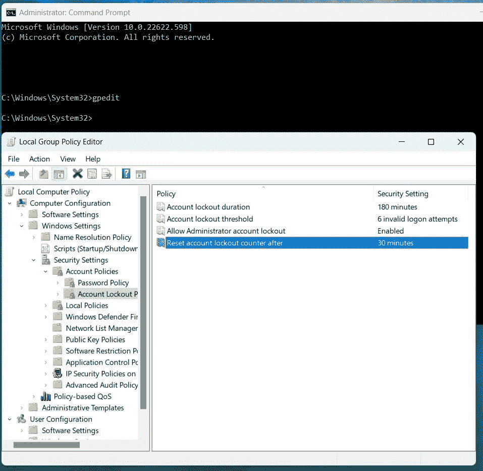
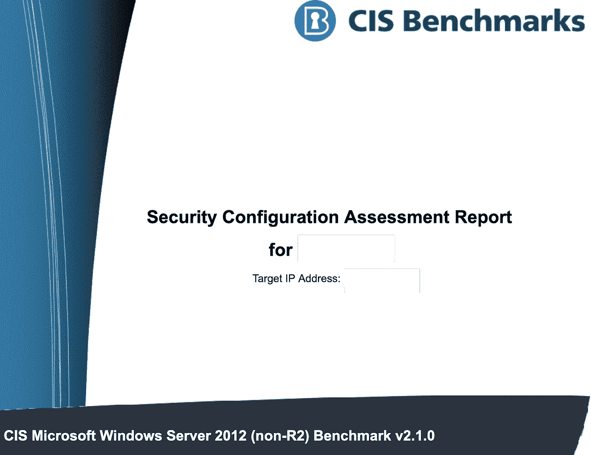
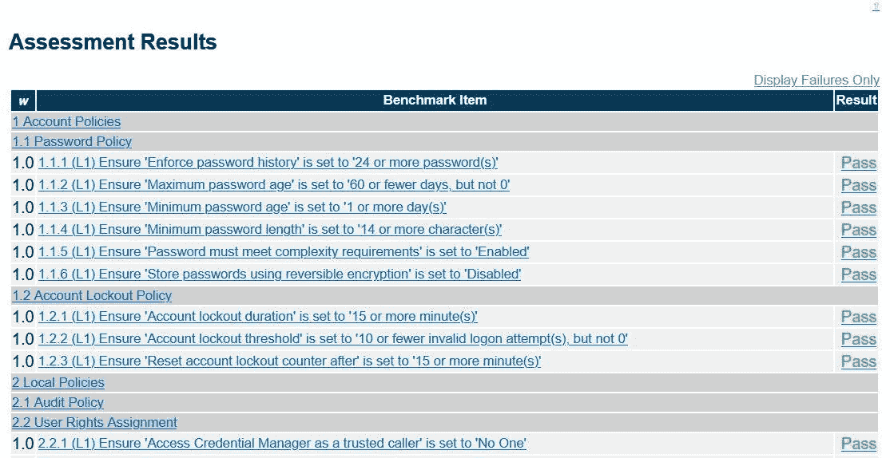
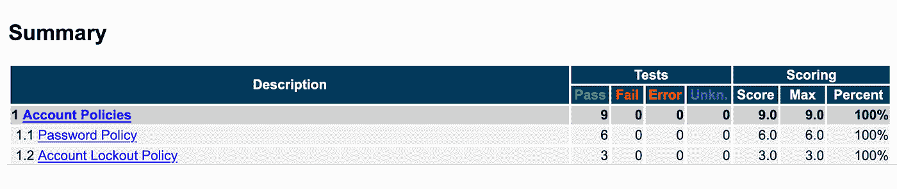

# 通过 CIS CSAT 实现合规

> 原文：<https://medium.com/globant/compliance-through-cis-csat-7fa24d78eed7?source=collection_archive---------0----------------------->

# 行动纲要

网络安全攻击越来越多，发展如此之快，以至于预防和抵御这些攻击比以往任何时候都更加困难。除了保护他们的信息系统，许多组织还必须遵守许多网络安全标准和要求，这是开展业务的先决条件。全世界有几十个网络安全标准，大多数组织必须遵守不止一个这样的标准。

CIS 关键控制由来自世界各地的私营和公共部门专家设计，是阻止已知攻击和减轻成功攻击造成的损害的最佳方式。它们已被国际政府、美国国土安全部、州政府、大学和许多私人公司采用，互联网安全中心是一个 501 非营利组织，成立于 2000 年 10 月。其使命是通过开发、验证和推广及时的最佳实践解决方案来帮助个人、企业和政府保护自己免受无处不在的网络威胁，从而使互联世界变得更加安全。

虽然新冠肺炎对许多商业和企业的影响是负面的，但受访者数据显示，全球疫情有助于留住人才。然而，招聘合规人才仍然充满挑战。此外，尽管相当多的受访者报告了疫情特定的安全支出，但围绕网络安全预算的乐观情绪继续下滑。

ISACA 和许多其他人一直在报告网络安全劳动力短缺的情况，这种情况在五年多的时间里没有明显改善，并增加了财务限制。我们有一个免费应用程序的案例，可以通过 CIS 控制实施安全强化计划，以改善每个组织的安全状况，如果可能的话，可以将该计划管理为*一个戴明周期，*一个迭代设计，以及组织中使用的管理方法，用于控制和持续改善每个迭代中的网络安全成熟水平。

# 先决条件

*   下载并执行 CIS 控制自我评估工具
*   正直的人

# 引言。每个组织的安全性

CIS CSAT 是一款免费工具，可以帮助各种规模或资源的组织改善其安全状况。有了多种报告格式、协作功能和交叉映射，这是开始理解和实施 CIS 控制的一个强有力的地方。

# 评估 CIS 关键安全控制的实施情况

CIS 关键安全控制是一套社区构建的优先网络安全指南。在过去的 10 年里，它们越来越受欢迎。全球数千名网络安全专家正在使用和开发 CIS 控制。为了帮助组织采用 CIS 控制，CIS 开发了一个新的网络应用程序。该工具使团队更容易实施、跟踪和记录 CIS 控制的强大安全指导。

# CIS CSAT

CIS 控制自我评估工具(简称 CIS CSAT)是一款免费的网络应用程序，可帮助安全主管跟踪 CIS 控制的实施情况并确定其优先级。CIS CSAT 的问题基于流行的[关键安全手册评估工具](https://www.auditscripts.com/?attachment_id=3816) Excel 文档，平台由[伦理帽](https://www.ethicalhat.com/)开发。对于每个 CIS 控制和子控制，CSAT 帮助组织跟踪它们的文档、实施、自动化和报告。

# 硬化过程

定义实施 CIS 控制的策略和流程，在本例中，我们将实施帐户策略控制，定义密码策略和帐户锁定策略。

第一步。使用您的管理员凭据登录服务器

第二步。使用“以管理员身份运行”选项执行 cmd 命令

第三步。键入命令“gpedit”

第四步。导航到“计算机配置> Windows 设置>安全设置>帐户策略>密码策略”

第五步。定义一个密码策略，该策略包含以下变量的以下参数

*   强制密码历史= 24
*   最长密码期限= 90 年
*   最短密码期限= 3
*   最小密码长度= 14
*   审核的最小密码长度= 10 个字符
*   密码必须满足复杂性要求=启用
*   放宽最小密码长度限制=禁用
*   使用可逆加密存储密码=禁用

第六步。导航到“计算机配置> Windows 设置>安全设置>帐户策略>帐户锁定策略”

第七步。定义一个密码策略，该策略包含以下变量的以下参数

*   帐户锁定持续时间= 180 分钟
*   帐户锁定阈值= 6 次无效登录尝试
*   允许管理员帐户锁定=启用
*   = 30 分钟后重置帐户锁定计数器

第八步。应用更改后，您将在 CIS 报告中看到如下评估结果

# 基本审计面谈指南

1.  准时参加你预定的面试
2.  查看您的团队提供给评估员的文档
3.  用简单的**是或否**回答问题，不需要额外的信息或评论，除非:
4.  如果评估员需要更多信息，他/她会询问(这是他们的工作)
5.  如果你不是 100%(你会把自己的一大笔钱押在你回答的确定性上吗？)一定，你的答案是**“我不知道，但我会查出来的”**。
6.  项目经理将做访谈记录，并与您一起跟进会议中无法回答的问题。

*不要在面试之外与评估员直接交流。*

*不得向评估员撒谎或歪曲事实*

***评估员:*** *是执行审计的人，他/她将签署合规性报告或合规性证明。该文件将帮助您证明您符合 PCI-DSS、SOX、ISO、GDPR 或 NIST。*

最后一点建议，如果你对问题的理解有任何疑问，请让评估员说得更具体些。

# 结论

CIS CAT 工具会生成一份报告，您可以确定在 Linux 或 Windows 服务器上实施控制措施的优先级，互联网安全中心的研究证明，实施 CIS 控制措施可以阻止 85%的黑客入侵您的网络。

通过关键基础设施(如传统服务器)中的 CIS 控制实施强化计划。这些报告是遵守 NIST 和 ISO27001 网络安全框架的证据。

例如，遗留服务器具有密码策略和帐户锁定策略；实现这两种控制可以防止黑客使用自动密码暴力攻击。

您可以在每次实施每个 CIS 控制时提高合规性，建议分阶段将合规性提高到 60%、80%或 90%，以减少对生产的影响。

# 参考

[https://www.sans.org/](https://www.sans.org/)

[https://www.cisecurity.org](https://www.cisecurity.org)

[https://www.isaca.org/state-of-cybersecurity-2021](https://www.isaca.org/state-of-cybersecurity-2021)