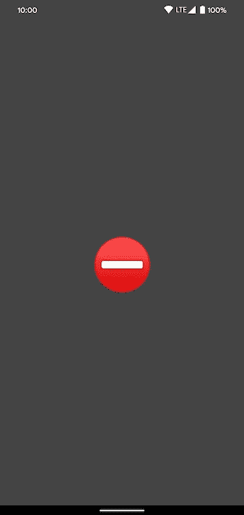

# 撰写和模型绑定

> 原文：<https://medium.com/google-developer-experts/compose-and-model-binding-cf0b21d3f953?source=collection_archive---------1----------------------->

Photo by [Dayne Topkin](https://unsplash.com/@dtopkin1?utm_source=unsplash&utm_medium=referral&utm_content=creditCopyText) on [Unsplash](https://unsplash.com/s/photos/compose?utm_source=unsplash&utm_medium=referral&utm_content=creditCopyText)

> **注意:**在撰写本文时，Jetpack Compose 尚未发布到稳定的渠道，API surface 也尚未最终确定，因此一切都可能发生变化。

当 Compose 第一次发布时，老实说，我对从 XML 转向一种更清晰、更易测试的方式来编写 Android 上的 UI 组件感到非常兴奋。我也害怕我所学的一切都将是无用的，但我很快发现这根本不是真的。

网上有很多关于如何开始使用这个框架的例子，但是我想把重点放在一个方面，这个方面在我上次的尝试中让我的生活变得更加容易，那就是模型绑定。

## 编写用户界面

我想创建一个非常简单的 UI，当以太网上没有检测到互联网时，它会显示一个⛔作为起点，当连接可用时，它会显示一个✅。这个表情符号会显示在屏幕中间，大到一眼就能看到。一个非常简单的任务的非常简单的用户界面。

The simple UI we are talking about

我可以通过使用一个带有`Center`排列标志的`Column`来实现这一点，它将拥有一个带有`Center`排列标志和`ExpandedWidth`修改器的`Row`。这两个项目一起将我的`Text`放在屏幕中间:

此时，我需要一种基于网络状态改变内容的方法。如前所述，我公开了一个`LiveData`，所以这只是一个将更改链接到 UI 的问题。幸运的是，这可以通过用 Compose 框架中的`[@Model](https://developer.android.com/reference/kotlin/androidx/compose/Model)`类注释一个类来实现:

有了这个注释，`State`的实例将变得可以观察到，因此每次执行更改时，这个类下的每个组件都将被重新组合。

这个类是一个表示 UI 的状态，我决定把它作为私有字段保存在`Activity`中，并把它传递给绘图函数，这样以后就可以很容易地检查它。

当然，我们需要根据由`LiveData`发出的值来改变状态内部的值，但是这可以通过观察变化很容易地实现:

一旦模型得到更新，UI 也是如此，因为我们只需将状态传递给绘制组件树的函数:

现在，一旦`LiveData`中的值发生变化，UI 就会做出反应。

> **注意:**如果我想用一个`VectorDrawable`来代替表情符号，这可以通过使用官方样本中的[所用的相同逻辑来实现。](https://github.com/android/compose-samples/blob/master/JetNews/app/src/main/java/com/example/jetnews/ui/home/PostCards.kt#L118)

## 结论

我发现绑定数据比预期的要容易得多，只需要一个注释。

我对 Compose 感到非常兴奋，迫不及待地想在日常生活中使用它，这是开发团队的荣誉！

*感谢* [*丹尼尔·博纳尔多*](https://twitter.com/danybony_) *和* [*弗洛里纳·芒特内斯库*](https://twitter.com/FMuntenescu) *对本帖进行校对。*