# 构成时钟

> 原文：<https://medium.com/google-developer-experts/compose-oclock-50c778a6360?source=collection_archive---------3----------------------->

*原载于*[*zsmb.co*](https://zsmb.co/compose-o-clock/)*。*

前几天在 Reddit 上见过[这个花里胡哨的钟](https://www.reddit.com/r/oddlysatisfying/comments/lsa654/this_clock_hitting_midnight_is_oddly_satisfying/)。看到我是如何在本周开始使用 Jetpack Compose 的，我觉得尝试用我们新的 Android UI 工具包重新实现那个时钟会很有趣。

几个小时前，我看到 Aurimas Liutikas [已经创建了一个相同设计的 Compose 实现](https://twitter.com/_aurimas/status/1366557927067185157)，但我故意不看源代码，因为我真的想自己弄清楚如何做到这一点。

这是我在学习 Jetpack Compose 两天后，经过大约一个小时的反复试验得出的结论。

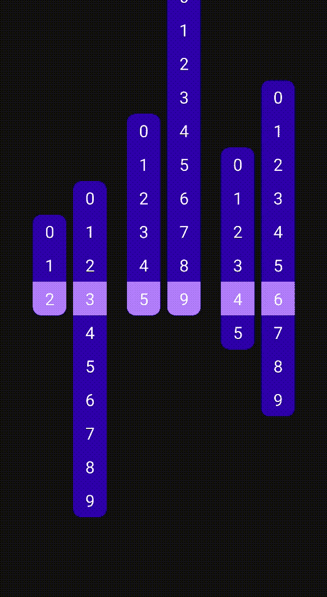

让我们一步一步来看看如何构建它。

> *如果您正在寻找该示例的完整代码，GitHub* *上的* [*都可以找到。*](https://github.com/zsmb13/ComposeClock/blob/main/app/src/main/java/co/zsmb/composeclock/MainActivity.kt)

# 一位数

首先，我们将创建一个`Number` composable，它包含一个固定大小的`[Text](https://developer.android.com/reference/kotlin/androidx/compose/material/package-summary.html#text)`。这需要一个参数，它应该显示的数值。

```
@Composable
fun Number(value: Int) {
    Text(
        text = value.toString(),
        fontSize = 20.sp,
        modifier = Modifier.size(40.dp)
    )
}
```

创建一个带有`Number`的`@Preview`让我们快速检查一下这个看起来如何:

```
@Composable
@Preview
fun NumberPreview() {
    Number(3)
}
```

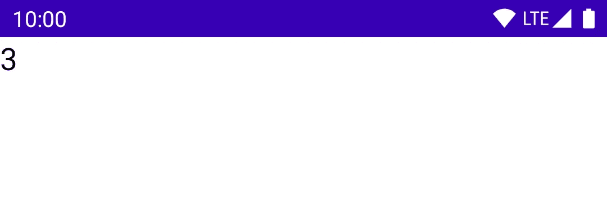

这将数字呈现在左上角，但是我们希望将这个`Text`放在它的`40dp`乘`40dp`区域的中心。在它上面设置`textAlign`可以水平解决这个问题，但是我没有找到任何类似的垂直对齐方式。因此，让我们用一个`[Box](https://developer.android.com/reference/kotlin/androidx/compose/foundation/layout/package-summary#box)`将它包起来，以实现对齐。

```
@Composable
fun Number(value: Int) {
    Box(
        contentAlignment = Alignment.Center,
        modifier = Modifier.size(40.dp),
    ) {
        Text(
            text = value.toString(),
            fontSize = 20.sp,
        )
    }
}
```

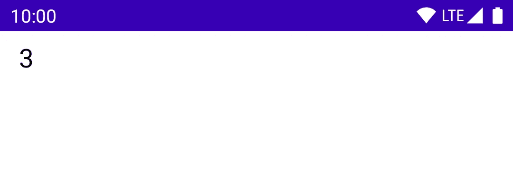

继续，是时候添加一些颜色了！`Box`将提供深色背景，文本为白色:

```
@Composable
fun Number(value: Int) {
    Box(
        contentAlignment = Alignment.Center,
        modifier = Modifier
            .size(40.dp)
            .background(MaterialTheme.colors.primary),
    ) {
        Text(
            text = value.toString(),
            fontSize = 20.sp,
            color = Color.White,
        )
    }
}
```

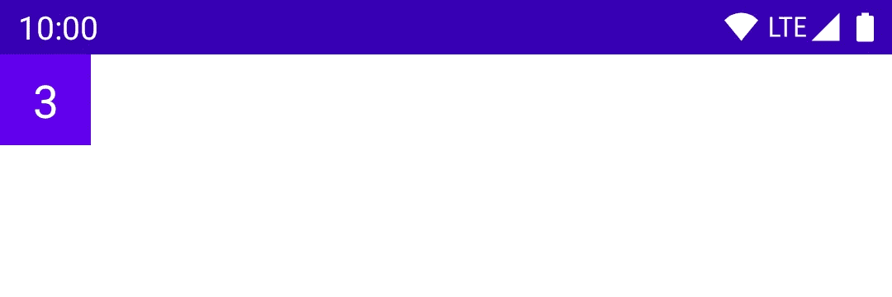

当前选择的数字在其列中应该有不同的背景颜色。这需要 composable 中有一个新的`Boolean`参数，然后一个简单的`if`语句就可以决定使用哪种颜色。

```
@Composable
fun Number(value: Int, active: Boolean) {
    val backgroundColor = if (active) {
        MaterialTheme.colors.primary
    } else {
        MaterialTheme.colors.primaryVariant
    }

    Box(
        contentAlignment = Alignment.Center,
        modifier = Modifier
            .size(40.dp)
            .background(backgroundColor),
    ) {
        Text(
            text = value.toString(),
            fontSize = 20.sp,
            color = Color.White,
        )
    }
}
```

让我们也更新预览，以便它显示每一种风格的`Number`:

```
@Composable
@Preview
fun NumberPreview() {
    Column {
        Number(value = 3, active = true)
        Number(value = 7, active = false)
    }
}
```

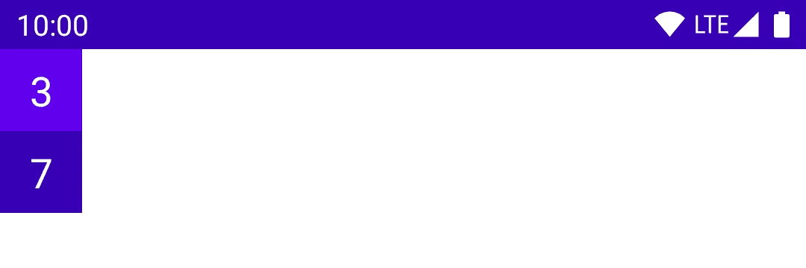

# 一列数字

单个数字就这样！现在，用一个新的`NumberColumn` composable 来呈现一列。它采用一系列有效值和当前选择的值作为其参数。一个`[clip](https://developer.android.com/reference/kotlin/androidx/compose/ui/draw/package-summary#(androidx.compose.ui.Modifier).clip(androidx.compose.ui.graphics.Shape))`修改器给了我们整洁的圆角，创建每个`Number`就像迭代提供的`range`一样简单。

```
@Composable
fun NumberColumn(
    range: IntRange,
    current: Int,
) {
    Column(
        Modifier.clip(RoundedCornerShape(percent = 25))
    ) {
        range.forEach { num ->
            Number(num, num == current)
        }
    }
}
```

让我们再次快速预览一下:

```
@Composable
@Preview
fun NumberColumnPreview() {
    NumberColumn(range = 0..9, current = 5)
}
```

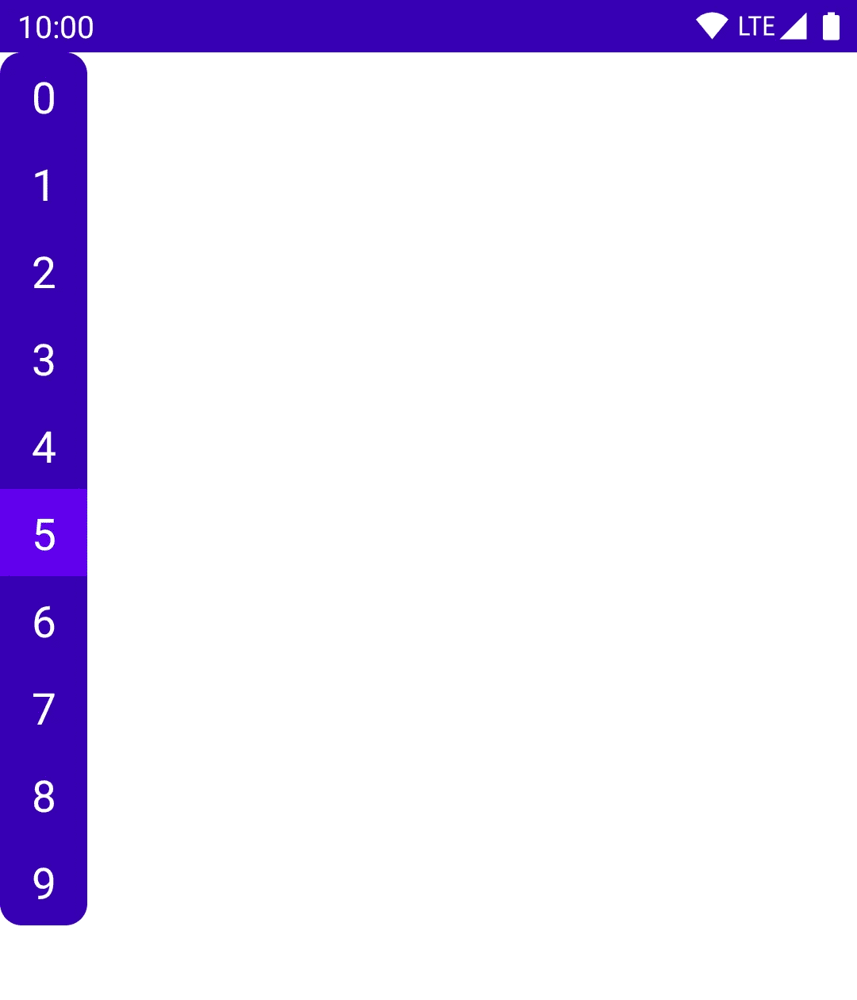

目前看起来不错！

# 创建时钟

是时候让它看起来像时钟一样工作了。这需要六个这样的`NumberColumn`，每个接收一个当前时间的数字作为它的参数。时间将由一个`Time`数据类提供。这些列排列在一个`[Row](https://developer.android.com/reference/kotlin/androidx/compose/foundation/layout/package-summary#row)`中，占据了整个屏幕，并在水平和垂直方向将所有内容居中。

```
data class Time(val hours: Int, val minutes: Int, val seconds: Int)

@Composable
fun Clock(time: Time) {
    Row(
        modifier = Modifier.fillMaxSize(),
        horizontalArrangement = Arrangement.Center,
        verticalAlignment = Alignment.CenterVertically,
    ) {
        NumberColumn(0..2, time.hours / 10)
        NumberColumn(0..9, time.hours % 10)
        NumberColumn(0..5, time.minutes / 10)
        NumberColumn(0..9, time.minutes % 10)
        NumberColumn(0..5, time.seconds / 10)
        NumberColumn(0..9, time.seconds % 10)
    }
}
```

现在，我们可以在预览中显示一个静态时间:

```
@Composable
@Preview
fun ClockPreview() {
    Clock(Time(14, 15, 59))
}
```

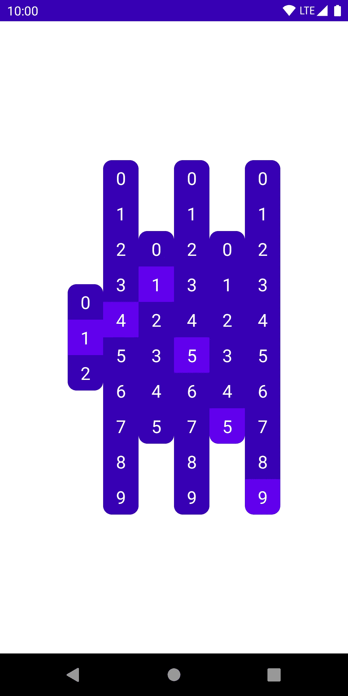

这正确地显示了给定的时间，但是我们没有对齐有效的数字。我们希望根据当前数字与列中间的距离垂直偏移每一列。如果当前数字在中间，则不需要偏移。如果它在末尾，我们想把它偏移列高的一半。

这个问题的数学计算结果是当前数字到中点的距离乘以每个数字的高度。`[offset](https://developer.android.com/reference/kotlin/androidx/compose/foundation/layout/package-summary.html#(androidx.compose.ui.Modifier).offset(androidx.compose.ui.unit.Dp,%20androidx.compose.ui.unit.Dp))`修改器给了我们一个非常简单的解决方案:

```
@Composable
fun NumberColumn(
    range: IntRange,
    current: Int,
) {
    val mid = (range.last - range.first) / 2f
    val offset = 40.dp * (mid - current)

    Column(
        Modifier
            .offset(y = offset)
            .clip(RoundedCornerShape(percent = 25))
    ) {
        range.forEach { num ->
            Number(num, num == current)
        }
    }
}
```

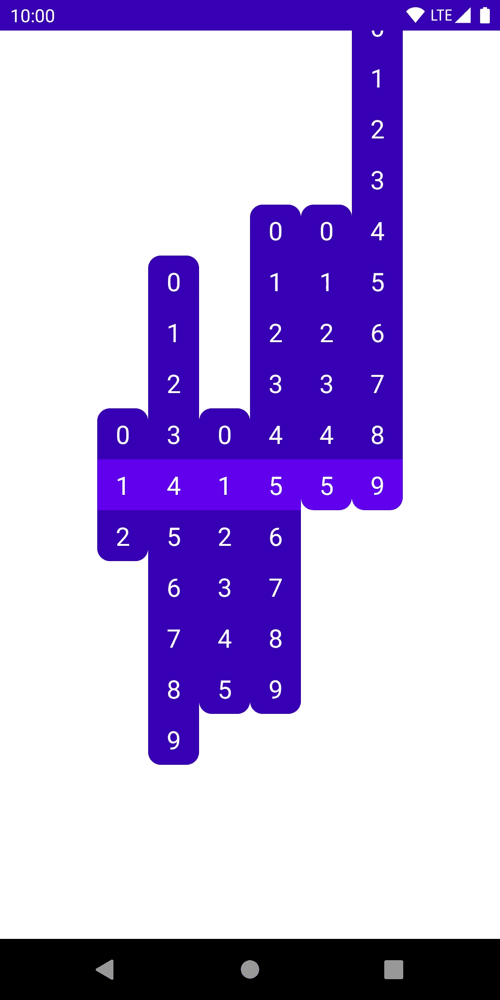

现在我们有了正确的外观，是时候输入当前时间，并保持更新。

```
@Composable
@Preview
fun ClockPreview() {
    fun currentTime(): Time { // 1
        val cal = Calendar.getInstance()
        return Time(
            hours = cal.get(Calendar.HOUR_OF_DAY),
            minutes = cal.get(Calendar.MINUTE),
            seconds = cal.get(Calendar.SECOND),
        )
    }

    var time by remember { mutableStateOf(currentTime()) } // 2
    LaunchedEffect(0) { // 3
        while (true) {
            time = currentTime()
            delay(1000)
        }
    }

    Clock(time)
}
```

让我们一步一步来看看这是如何做到的:

1.  `currentTime`函数获取一个`Calendar`来获得当前时间，并创建一个我们的`Time`对象，`Clock`可以使用它。
2.  这一行创建了一个可变状态，Compose 理解这个可变状态，并且当它的值改变时可以重新组合。这被初始化为当前时间。
3.  `[LaunchedEffect](https://developer.android.com/reference/kotlin/androidx/compose/runtime/package-summary#launchedeffect_1)`运行传递给它的暂停 lambda，它将每秒更新`time`。`LaunchedEffect`只有在它的`key`参数改变时才会重新编译:这里硬编码的虚拟 0 值确保它只开始这个循环一次。当包含它的`Composable`离开组合时，协程将被取消。

这为我们提供了一个正常工作的时钟，它在不同的状态之间跳动，就像这样:

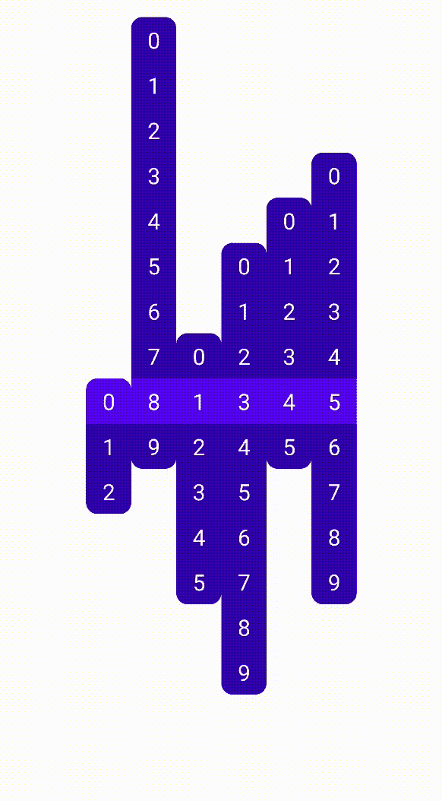

# 动画片

我们仍然有一些工作要做，但是会很容易。为了动画显示每个`Number`的颜色变化，我们可以使用`[animateColorAsState](https://developer.android.com/reference/kotlin/androidx/compose/animation/package-summary#animatecolorasstate)`。将我们的颜色包装到这个辅助函数中会在颜色之间创建一个平滑的默认动画，而不是一个瞬间的变化。

```
@Composable
fun Number(value: Int, active: Boolean) {
    val backgroundColor by animateColorAsState(
        if (active) MaterialTheme.colors.primary else MaterialTheme.colors.primaryVariant,
    )

    Box(
        contentAlignment = Alignment.Center,
        modifier = Modifier
            .size(40.dp)
            .background(backgroundColor),
    ) { ... }
}
```

这个故事非常类似于制作柱子运动的动画。我们简单地使用`[animateDpAsState](https://developer.android.com/reference/kotlin/androidx/compose/animation/core/package-summary#animatedpasstate)`函数包装它们的偏移值:

```
@Composable
fun NumberColumn(
    range: IntRange,
    current: Int,
) {
    val mid = (range.last - range.first) / 2f
    val offset by animateDpAsState(targetValue = 40.dp * (mid - current))

    Column(
        Modifier
            .offset(y = offset)
            .clip(RoundedCornerShape(percent = 25))
    ) { ... }
}
```

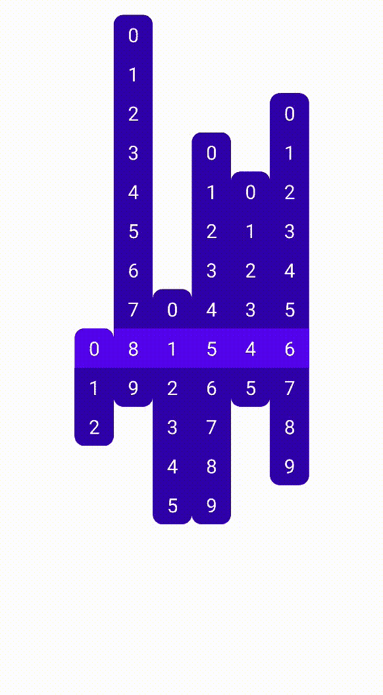

这看起来棒极了！通过修改几行代码添加动画。

# 清理和调整

让我们稍微调整一下 UI，让它看起来更好。首先，我们将为`Number`添加一个`modifier`参数，允许它的用户定制它。例如，以前我们的`Number`有一个固定的`40dp`大小——这是更好的外部控制。

我们将在`Number` composable 的根处的`Box`上使用该参数，并在其上添加我们自己的修饰符。

```
@Composable
fun Number(value: Int, active: Boolean, modifier: Modifier = Modifier) {
    val backgroundColor by animateColorAsState(
        if (active) MaterialTheme.colors.primary else MaterialTheme.colors.primaryVariant,
    )

    Box(
        modifier = modifier.background(backgroundColor),
        contentAlignment = Alignment.Center,
    ) { ... }
}
```

在`NumberColumn`中，我们将创建一个`size`值，我们将在偏移计算中使用它，并将其传递给每个`Number`。这样，调整用户界面的大小就可以在这里完成，只需在代码中的一个地方。

`NumberColumn`也将有自己的`modifier`参数，允许一些定制。

```
@Composable
fun NumberColumn(
    range: IntRange,
    current: Int,
    modifier: Modifier = Modifier,
) {
    val size = 40.dp
    val mid = (range.last - range.first) / 2f
    val offset by animateDpAsState(size * (mid - current))

    Column(
        modifier
            .offset(y = offset)
            .clip(RoundedCornerShape(percent = 25))
    ) {
        range.forEach { num ->
            Number(num, num == current, Modifier.size(size))
        }
    }
}
```

我们将使用`modifier`参数在每一列上添加一些填充，我们还可以在列对之间添加一些`[Spacer](https://developer.android.com/reference/kotlin/androidx/compose/foundation/layout/package-summary#spacer)`:

```
@Composable
fun Clock(time: Time) {
    Row(
        modifier = Modifier.fillMaxSize(),
        horizontalArrangement = Arrangement.Center,
        verticalAlignment = Alignment.CenterVertically,
    ) {
        val padding = Modifier.padding(horizontal = 4.dp)

        NumberColumn(0..2, time.hours / 10, padding)
        NumberColumn(0..9, time.hours % 10, padding)
        Spacer(Modifier.size(16.dp))
        NumberColumn(0..5, time.minutes / 10, padding)
        NumberColumn(0..9, time.minutes % 10, padding)
        Spacer(Modifier.size(16.dp))
        NumberColumn(0..5, time.seconds / 10, padding)
        NumberColumn(0..9, time.seconds % 10, padding)
    }
}
```

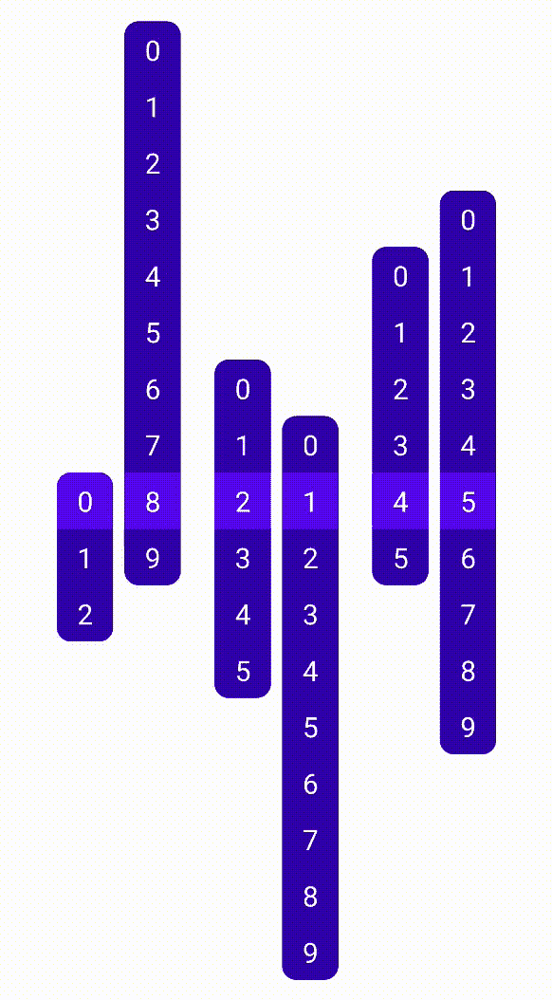

作为最后的调整，让我们为列重置时添加一个特殊的动画——从最高值到最低值——因为这种情况与以前的默认偏移动画相比看起来有点太跳跃了。

在`animateDpAsState`调用中，我们可以指定一个`[AnimationSpec](https://developer.android.com/reference/kotlin/androidx/compose/animation/core/AnimationSpec)`，它控制值如何从一个`targetValue`转换到下一个`[AnimationSpec](https://developer.android.com/reference/kotlin/androidx/compose/animation/core/AnimationSpec)`。不同类型的动画在[官方文档](https://developer.android.com/jetpack/compose/animation#animationspec)中列出。我们将使用一个`spring()`用于重置动画(有一点反弹)，一个简单的`tween()`用于剩余的偏移改变。

```
val reset = current == range.first
val offset by animateDpAsState(
    targetValue = size * (mid - current),
    animationSpec = if (reset) {
        spring(
            dampingRatio = Spring.DampingRatioLowBouncy,
            stiffness = Spring.StiffnessLow,
        )
    } else {
        tween(
            durationMillis = 300,
            easing = LinearOutSlowInEasing,
        )
    }
)
```

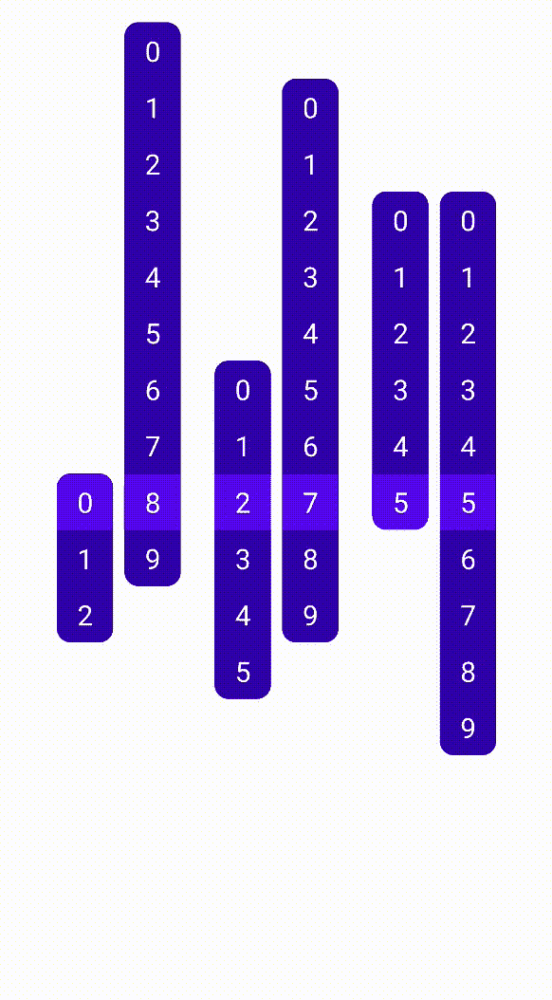

# 结论

就是这样！这是一个用 Jetpack Compose 构建 UI 的快速演示。本例的完整代码可从 GitHub 上的[获得。](https://github.com/zsmb13/ComposeClock/blob/main/app/src/main/java/co/zsmb/composeclock/MainActivity.kt)

Compose 是 Android UI 开发的明确未来路径，用它来构建 UI 真的很令人兴奋。用非常基本的框架知识组合这个例子的速度让我对 Compose 的未来充满希望。