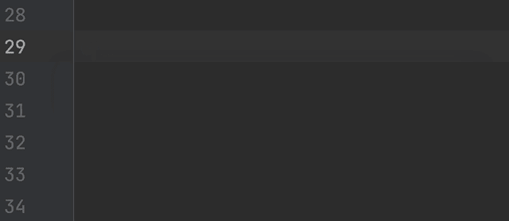

# 组合工具

> 原文：<https://medium.com/androiddevelopers/compose-tooling-42621bd8719b?source=collection_archive---------1----------------------->

Compose 允许您快速构建漂亮的 ui。有了 Android Studio 工具支持，您可以通过更快的迭代和更好的调试来进一步加速开发过程。

到目前为止，我们已经了解了如何在 Jetsurvey 中实现单个答案选项，jet survey 是我们的[撰写示例](http://goo.gle/compose-samples) ( [上一篇文章](/p/8d3651228764))之一。让我们看看 Android Studio 如何帮助我们高效地编写这些内容。

> 如果你对这一系列的作曲基础有任何问题，我们将在 10 月 13 日举行现场问答。请在这里、YouTube 上发表评论，或者在 Twitter 上使用#MADCompose 提出您的问题。

您也可以在这里观看本文的视频:

# 实时模板

为应用程序构建可组合元素时，您可能会发现自己经常键入:

为了帮助节省击键次数， [live templates](https://developer.android.com/jetpack/compose/tooling#live-templates) 允许您通过键入缩写来插入常用代码片段。要插入上面的代码片段，只需键入“comp ”,然后按 tab 或 return 键插入一个可组合的函数。在那里，您可以输入函数的名称，这样就完成了🏃‍♂️💨

“comp” live template to create a composable

您还可以分别使用“W”、“WR”或“WC”缩写，用`Box`(或另一个小部件)、`Row`或`Column`包装当前的可组合组件。因为我们希望在`SurveyAnswer`中有一个`Row`，所以我们将使用“WR”的缩写来生成它。

“WR” live template to create a Row

要查看与撰写相关的实时模板的完整列表，请导航到您的 Android Studio 的首选项。

Android Studio preferences for Live Templates

# 檐槽图标

`Row`中的第一个元素是一个`Image`可组合元素。在下面的代码片段中，我们使用`painterResource` API 获取一个名为“lenz”的资源 drawable，并显示在`Image`中。

使用 drawables 的一个挑战是很难知道 drawables 是什么样子的。为了帮助解决这个问题，Android Studio 在编辑器的[栏](https://developer.android.com/jetpack/compose/tooling#gutter-icons)中显示了一个图标，可以快速方便地切换到另一个图像。让我们将图像切换为显示“火花”。

Gutter Icon for drawables

接下来，让我们实现`Row`中的`Text`，并给它一个自定义颜色。让我们也实现`RadioButton`并将其设置为未选中。

这种颜色也应该出现在编辑器的装订线中。点击它给我们一个颜色选择器，我们可以使用它来快速改变颜色。您可以输入 RGB、十六进制或从材质调色板中轻松选择颜色。

Gutter Icon for colors

# 可组合预览

使用我们的基本可组合函数，是时候看看这个可组合函数实际上是什么样子了！如果能在我们工作时看到我们的可组合应用，而不必在设备上运行整个应用，那就太好了。通过创建一个[可组合预览](https://developer.android.com/jetpack/compose/tooling#preview)，这变得很容易。

使用实时模板，您可以键入“prev ”,然后按 tab 或 return 键。这样做将生成一个带有额外`@Preview`注释的可组合函数。让我们称之为`SurveyAnswerPreview`，调用包装在我们应用程序的自定义主题中的`SurveyAnswer`可组合组件。

“prev” live template to create a preview for a composable

`@Preview`注释告诉 Android Studio 这个可组合文件应该显示在这个文件的设计视图中。点击编辑器顶部的“拆分”图标，然后点击“构建&刷新”,应该会显示出`SurveyAnswerPreview`可组合！

Split view showing preview of a composable

`@Preview`注释也应该有一个装订线图标(⚙️),我们可以在这里为预览指定各种属性。例如，我们可以在夜间模式下用某种背景色显示预览。

Configuring a preview composable using the gutter icon

您可以多次向同一个函数添加`@Preview`注释，以预览具有不同属性的可组合组件。例如，我们可以添加另一个用超大字体显示`SurveyAnswer`的预览。

Multiple preview annotations

# 多重预览

通常，您会希望看到组件在不同配置下的外观——在亮或暗的模式下，以不同的字体大小，等等。使用[多预览特性](https://developer.android.com/jetpack/compose/tooling#preview-multipreview)，您可以定义一个注释类，该注释类本身具有多个与之相关联的预览注释。

例如，我们可以定义一个`FontScalePreviews`注释类，它有两个`@Preview`注释，用于以不同的字体比例预览一个可组合的字体，以及一个`DarkLightPreviews`注释类，用于以亮暗两种模式预览一个可组合的字体。

要查看这些预览，只需用新创建的注释类来注释您的预览组件。

Creating a new multipreview annotation

您可以以适合您的项目的方式混合和匹配多预览。较大的项目可能受益于为每个定制向量(例如`@FontScalePreviews`、`@DarkLightPreviews`)定义多预览注释，将它们组合成基于用例的多预览(例如`@DesignComponentPreviews`或`@ScreenPreviews`)，并用最相关的一个来注释预览组件。

# 在设备上预览

除了在 Android Studio 中查看预览，您还可以将预览直接部署到模拟器或设备上。为此，您可以使用编辑器栏中的运行图标。这将使用要部署到的设备的配置，而不是遵循预览的配置参数。

Previewing a composable on a device

# 文字的实时编辑

当您更新一个可组合组件时，通常您必须构建并刷新预览，或者重新部署到设备以查看您的更改。有了[文字的实时编辑](https://developer.android.com/jetpack/compose/tooling#live-edit-literals)，对于某些常量文字，如整数、字符串和颜色，就不需要重新构建了。例如，如果我们更新了超级英雄的名字，我们会看到这些变化被立即更新。同样，我们可以改变文本的颜色，而不需要重新构建。

Live edit of literals

# 实时编辑

Live Edit 进一步发展了这种行为，让您无需重新构建就可以更改可组合组件的内容。在我们的`SurveyAnswer`上工作，我们可以添加修饰符、属性，甚至删除或添加子组件。所有这些更改都会自动反映在您的设备上。

Live edit

Live Edit 是一个新的实验性功能，所以目前默认情况下还不可用。阅读[文档](http://goo.gle/compose-live-edit-docs)以了解如何为您的项目启用它。

# 布局检查器

通过预览、多重预览、文字的实时编辑和实时编辑，迭代您的设计轻而易举。但是，如果您的可组合组件有问题，您需要调试它，该怎么办呢？Android Studio 允许你深入挖掘，这样你就可以找出[布局检查器](https://developer.android.com/jetpack/compose/tooling#layout-inspector)的问题所在。

布局检查器允许您浏览 UI 层次结构中的所有节点。突出显示一个元素还会显示为特定元素设置的所有属性。例如，突出显示我们的 composable 中的`RadioButton`显示了我们代码中的哪一行实现了 onClick 处理程序，这在调试时非常有用。

Layout Inspector

布局检查器还允许您在布局上叠加图像，以验证您的实现是否像素完美。在我们的例子中，我们可以看到还有一些工作要做。

Layout Inspector with Overlay

# 摘要

这涵盖了 Android Studio 提供的许多有用的工具，帮助我们在 Compose 中更快地开发应用程序。

总结一下:

*   有了实时模板，我们可以使用缩写更快地插入常用代码片段
*   上下文栏图标允许我们快速改变图像和颜色
*   `@Preview`注释允许我们查看我们的组件，而不必将整个应用程序部署到设备上
*   文字的实时编辑和实时编辑都允许我们实时查看代码更新

有什么问题吗？请在下面留下评论或使用 Twitter 上的#MADCompose 标签，我们将在 10 月 13 日的直播问答中回答您的问题。敬请期待！