# 撰写工具包

> 原文：<https://medium.com/androiddevelopers/compose-toolkit-8d3651228764?source=collection_archive---------0----------------------->

在之前的 MAD 技能 Compose Basics [文章](/androiddevelopers/composable-functions-a505ab20b523)中，您学习了 Compose 中 UI 的构建块:可组合函数。现在，是时候了解 Compose 附带的强大 UI 组件工具包了，它使您能够构建丰富的 UI 和交互。

> 如果你对这一系列的作曲基础有任何问题，我们将在 10 月 13 日举行现场问答。请在这里、YouTube 上发表评论，或者在 Twitter 上使用#MADCompose 提出您的问题。

到目前为止，我们已经了解了如何在 Jetsurvey 中构建单选问题屏幕的一部分，jet survey 是我们的[组合示例](http://goo.gle/compose-samples)之一。让我们看看如何使用 Compose toolkit 构建屏幕的其余部分来匹配我们的设计规范。

你可以在这里观看本文的视频:

# 材料设计建筑

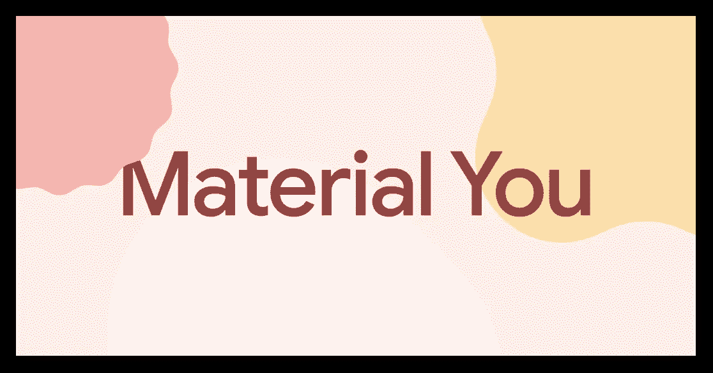

Jetpack Compose 通过从一开始就实现材质设计，使您的应用程序具有一致的外观和感觉。材料设计是一个适应性很强的指导方针、组件和工具系统，支持用户界面设计的最佳实践。

## 主题

Jetpack Compose 支持[材料设计 2](https://material.io/) 和 3。 [Material 3](https://m3.material.io/) 是材质设计的下一次发展，具有更新的组件和“Material You”定制功能，旨在匹配 Android 12 及更高版本的新视觉外观。通过材料设计，您的应用程序可以通过在一个地方提供自定义颜色、字体和形状来进行主题化，以匹配您的品牌。

Jetsurvey 使用材料主题来设计整个应用程序。 [Theme.kt](https://github.com/android/compose-samples/blob/main/Jetsurvey/app/src/main/java/com/example/compose/jetsurvey/theme/Theme.kt) 文件定义了一个名为`JetsurveyTheme`的可组合函数，该函数使用`MaterialTheme`可组合函数为颜色、形状和字体提供自定义值。

为了确保应用程序的配色方案在用户更改系统主题时自动响应，主题中使用了不同的颜色，具体取决于系统外观:亮或暗。

自定义字体和样式，如粗细、大小和行高，在[排版. kt](https://github.com/android/compose-samples/blob/main/Jetsurvey/app/src/main/java/com/example/compose/jetsurvey/theme/Typography.kt) 文件中设置。要对文本进行样式化，调用方可以引用`MaterialTheme`(例如`MaterialTheme.typography.titleMedium`)的排版属性，而不是在调用点定义文本样式，这允许文本一致地出现和样式化。

自定义形状也在 [Shape.kt](https://github.com/android/compose-samples/blob/main/Jetsurvey/app/src/main/java/com/example/compose/jetsurvey/theme/Shape.kt) 中配置，允许在应用中为不同尺寸的形状定制圆角。

要了解更多关于主题化的内容，请查看 Compose 中的[材质主题化。](https://developer.android.com/jetpack/compose/themes/material)

**脚手架**

`Scaffold`是工具包中的一个基本材料设计组件。这是在普通屏幕图案中排列材料组件的基本布局，例如带有`SmallTopAppBar`和`FloatingActionButton`的屏幕。

上面的代码片段将呈现一个屏幕，其中包含一个顶部应用程序栏、一个浮动操作按钮和一个显示内容的区域(当前显示一个空白区域)。

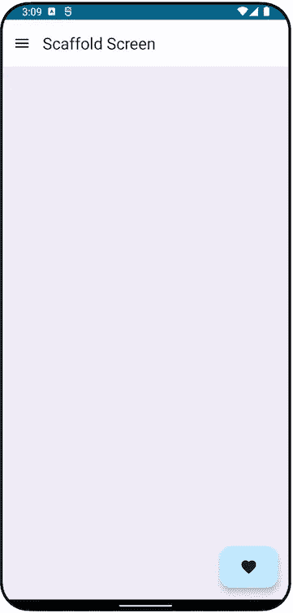

这看起来眼熟吗？Jetsurvey 的调查屏幕也符合`Scaffold`:

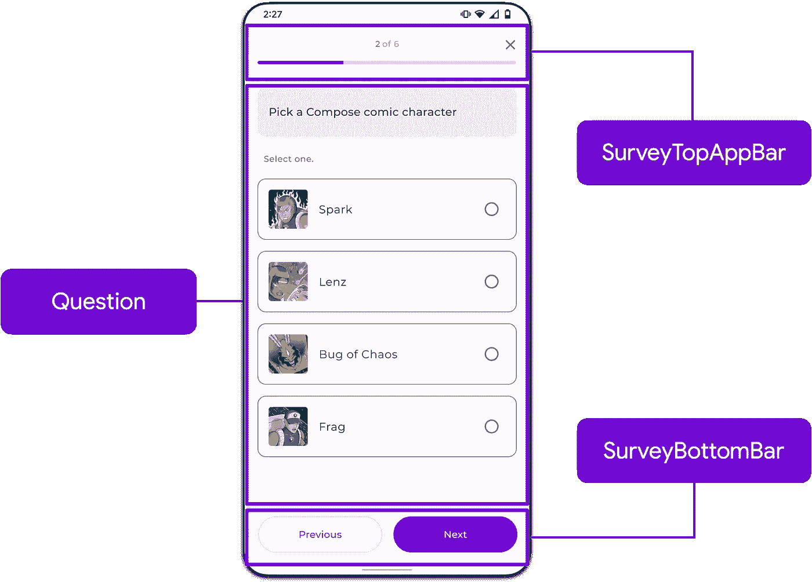

Scaffold usage in Jetsurvey

如果您想了解这是如何实现的，请查看 [SurveyScreen.kt](https://github.com/android/compose-samples/blob/main/Jetsurvey/app/src/main/java/com/example/compose/jetsurvey/survey/SurveyScreen.kt#L66) 文件中的`SurveyQuestionsScreen`可组合函数。

虽然顶部/底部应用程序栏和浮动操作按钮是`Scaffold`的常见用途，但它也支持其他配置，如托管导航抽屉或`Scackbar`。要了解更多信息，请查看脚手架[参考文档](https://developer.android.com/reference/kotlin/androidx/compose/material/package-summary#Scaffold(androidx.compose.ui.Modifier,androidx.compose.material.ScaffoldState,kotlin.Function0,kotlin.Function0,kotlin.Function1,kotlin.Function0,androidx.compose.material.FabPosition,kotlin.Boolean,kotlin.Function1,kotlin.Boolean,androidx.compose.ui.graphics.Shape,androidx.compose.ui.unit.Dp,androidx.compose.ui.graphics.Color,androidx.compose.ui.graphics.Color,androidx.compose.ui.graphics.Color,androidx.compose.ui.graphics.Color,androidx.compose.ui.graphics.Color,kotlin.Function1))。

## 表面和更多组件

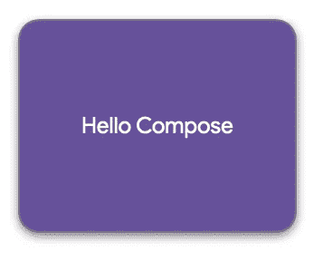

Text on a Surface

材料设计的另一个基本要素是`Surface`的概念。一个`Surface`是材料设计中的一个中心隐喻，内容位于其上。曲面可以包裹您的组件，以便您可以自定义它们的背景颜色、形状、边框以及色调和阴影高度。

除了`Surface`，你可能需要更多的组件来构建你能想到的任何类型的 UI。这就是为什么 Compose 提供了一系列现成的其他材料设计组件，例如:

*   顶部和底部应用程序栏
*   小跟班
*   卡片
*   开关
*   炸薯条
*   圆规
*   浮动操作按钮
*   …还有更多

**无障碍**

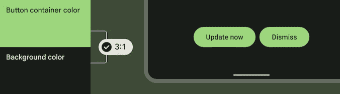

理解并以迎合用户不同需求的方式构建可能是一个挑战。为了帮助实现这一点，默认情况下，材料 3 的所有组件都可以使用，具有可接受的颜色对比度、最小触摸尺寸等等。

…而这只是在材料设计上刮擦了*表面*！你可以查看 Compose Material 3 API [参考](http://goo.gle/compose-material-ref)，以及 Material Design 3 [网站](http://m3.material.io)了解更多信息。

# 布局

我们已经了解了如何通过使用`Row` composable 函数在调查中安排单个答案的组成部分。但是我们如何为屏幕的其余部分安排所有不同的组件呢？我们通过使用布局来做到这一点！

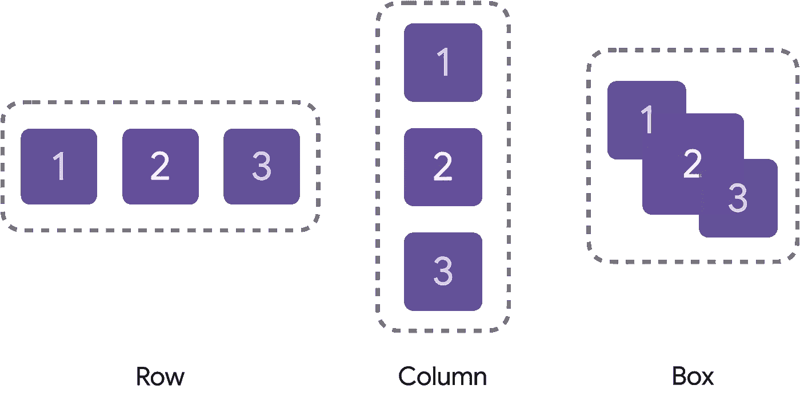

Compose’s standard layout elements: Row, Column and Box

Compose 有 3 个标准布局元素。正如我们之前看到的，为了水平排列项目，我们可以将 UI 组件包装在一个`Row`可组合函数中。要垂直排列项目，我们可以使用`Column` composable 函数。另一方面，如果我们想将元素放在或堆叠在另一个之上，我们可以使用`Box` composable。

这些标准布局也接受参数，因此您可以进一步控制项目的放置方式。以我们之前看到的`SurveyAnswer`(调用`Row`而不配置它)的实现为例，如果我们尝试运行它，调查中的答案实际上会像这样:

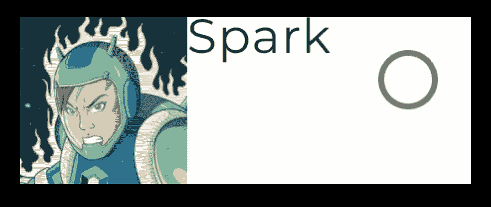

SurveyAnswer not styled yet

为了改变这一点，让我们向`Row`可组合函数传递一些额外的参数。

通过`verticalAlignment`参数可以改变`Row`中项目的垂直对齐。因为我们希望项目垂直居中，所以让我们传递`Alignment.CenterVertically`作为它的值。此外，我们还想改变项目的水平排列，使它们在`Image`和`RadioButton`之前的`Row`上均匀分布，并且使用`Arrangement.SpaceBetween`作为值。我们还看不到这个变化的太大影响，但是我们很快就会明白为什么这很重要。

我们的代码现在应该看起来像这样:

…以及由此产生的用户界面:

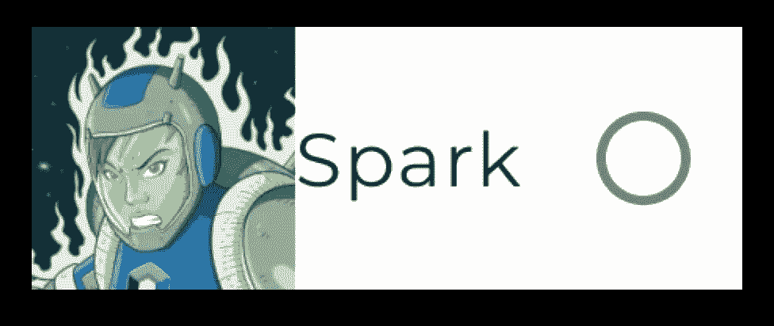

SurveyAnswer vertically aligned

布局还有更多的内容，所以请务必查看关于布局的[文档页面](http://goo.gle/compose-layout-docs)以了解更多信息。

# 修饰语

到目前为止，我们已经讨论了样式、组件和布局。但是我们如何控制尺寸、填充和其他外观呢？

你可以通过使用修饰符来做到这一点！修饰符允许你修饰或增加一个可组合的。compose toolkit 中的每个可组合函数都接受一个`Modifier`作为参数。修改器可以链接在一起，直到实现所需的自定义。

修饰符允许你做各种各样的事情，比如设置背景颜色，改变大小，添加填充，改变元素的 alpha，甚至处理用户的点击输入。

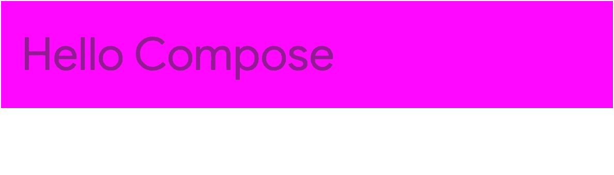

Modifiers applied to a Text

根据可组合函数的作用域，您还可以使用其他修饰符。

例如，如果您在一个`Box`的范围内，`align`修饰符允许您相对于包含`Box`来定位一个元素。下面的代码片段显示了将`Text`元素的对齐方式更改为`BottomEnd`，使其与`Box`的右下角对齐。这个修饰符在`Box` composable 及其范围之外是不可访问的，这使得修饰符是类型安全的。

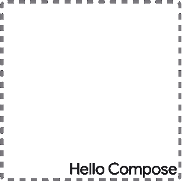

Box with Alignment.BottomEnd content

## 使用修饰符更新调查答案

使用修饰符，我们可以进一步定制`SurveyAnswer` composable 来匹配我们的设计。让我们在这里也假设这个可组合组件在我们的应用程序的主题中被调用，以便排版、形状和颜色与我们的品牌相匹配。

首先，让我们通过传入一个`Modifier`来进一步定制`Row`。因为我们想让这个项目占据分配的最大水平空间，所以我们调用`fillMaxWidth`。此外，因为我们希望容器周围有 16 dp 的填充，所以我们也链接一个`padding`修饰符。

通过这些修改，我们的调查答案看起来更接近我们想要的结果。请注意，`Text`的宽度占据了`Image`和`RadioButton`之间的可用空间，这要归功于我们为`Row`的`horizontalArrangement`值传递的`Arrangement.SpaceBetween`值。

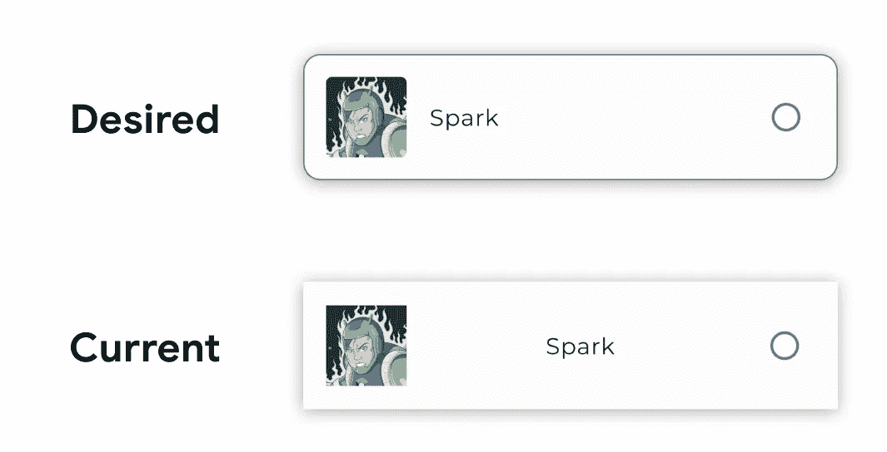

SurveyAnswer with Modifiers applied

要添加边框并调整答案的角，我们需要将`Row`包围在`Surface`可组合对象周围。这样做，我们可以配置形状，边框颜色和笔画大小。经过以下更改，我们现在应该看到答案与我们期望的输出相匹配。

我们只讨论了几个修饰符，还有很多可以用来修饰你的可组合函数，所以一定要查看关于修饰符的[文档页面](http://goo.gle/compose-modifiers)来了解更多。

# 摘要

我们涵盖了很多！在本文中，我们能够使用 Material 主题和现成的 Material 组件构建一个简单的屏幕。我们还看到了如何使用`Row`、`Column`和`Box`来布局组件，以及如何使用修饰符来构建完美的用户界面。

在下一篇文章中，我们将介绍组合工具，并展示这些工具如何帮助加速您的开发。

有什么问题吗？请在下面留下评论或使用 Twitter 上的#MADCompose 标签，我们将在 10 月 13 日的直播问答中回答您的问题。敬请期待！