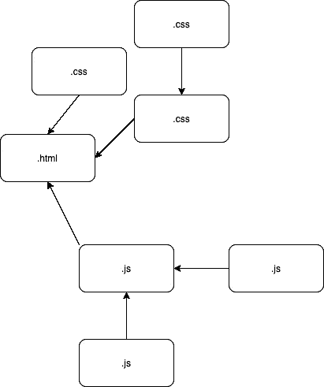
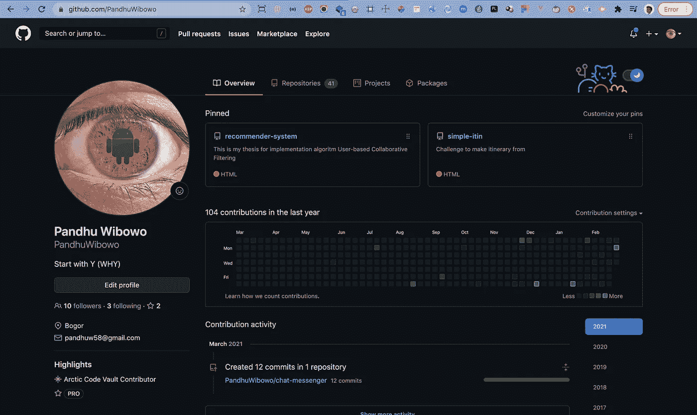

# Composer?

> 原文：<https://medium.easyread.co/composer-acc9b27764b9?source=collection_archive---------2----------------------->

Photo by [Rezli](https://unsplash.com/@rezli?utm_source=medium&utm_medium=referral) on [Unsplash](https://unsplash.com?utm_source=medium&utm_medium=referral)

Halo teman-teman, selamat datang di blog saya. Untuk yang baru tau, perkenalkan nama saya Pandhu, dan kamu sekarang berada dalam pembahasan mengenai **Composer** . Logo nya seperti dibawah ya anyway.

[https://getcomposer.org/](https://getcomposer.org/)

# Depedency

bikin sendiri

Kenapa ada composer? Penjelasan simplenya menurut saya seperti gambar diatas yang sudah saya buat. Kamu punya halaman **html** , ketergantungan dengan file-file **css** dan **js** . Kalau kamu punya lebih dari satu (dua, tiga atau sampe 4) bahkan bisa ada belasan bahkan puluhan, akan sulit jika kamu ingin tau file mana yang sudah tidak dikembangkan lagi atau sudah mulai ditinggalkan. Nah concernnya adalah kamu tidak perlu cape-cape dengan mengecek apakah depedency ini sudah **deprecated atau belum** dan harus mengganti seperti menghapus depedency lamanya, lalu ke web depedency yang kamu butuhkan dengan versi yang lebih baru, lalu download, lalu pasang ke project kamu. **Kalau cuma 1, kalau yang diganti ada banyak?**

Photo by [Zhang Kenny](https://unsplash.com/@kennyzhang29?utm_source=medium&utm_medium=referral) on [Unsplash](https://unsplash.com?utm_source=medium&utm_medium=referral)

Makanya hadirlah **Composer** .

# Composer

Photo by [Anas](https://unsplash.com/@anasshardi?utm_source=medium&utm_medium=referral) on [Unsplash](https://unsplash.com?utm_source=medium&utm_medium=referral)

Jadi Composer itu adalah package manager untuk bahasa pemrograman PHP. Tugas composer ini untuk memanage package-package/depedency-depedency (jamak) yang tersebar dimana-mana, dengan developer yang banyak (developer masing-masing depedency) yang tidak kamu kenal, dan package tersebut merupakan package yang diantaranya adalah package yang kamu butuhkan dalam project kamu. Jadi ketergantungan-ketergantungan kode-kode yang bukan dimiliki tim kamu atau kamu pribadi itu yang manage si composer.

> M enurut **Wikipedia** , Composer dikembangkan oleh Nils Adermann dan Jordi Boggiano, yang terus mengelola proyek. Mereka mulai pengembangan pada bulan April 2011 dan merilis Composer pertama kali pada tanggal 1 Maret 2012.

Kalau di **PHP** ada **Composer** , di bahasa pemrograman lain ada **NPM, Bower, Bundler, Yarn** , dan lain sebagainya. Sampai tulisan ini di publish, Composer sudah di versi **2.0.11\.**

Nah apakah composer ini sebagai tempat penyimpanan package-packagenya juga? Jawabannya sayangnya ***Tidak*** . Karena yang menampung atau menyimpan package-package tersebut adalah **Packagist** .

# Packagist

[https://github.com/PandhuWibowo](https://github.com/PandhuWibowo)

> Mengutip dari laman resminya *packagist.org* , Packagist is the main [Composer](https://getcomposer.org/) repository. It aggregates public PHP packages installable with Composer.

Packagist merupakan tempat tersimpannya semua library/package/dependency PHP.

# **Konklusi**

Composer merupakan permudahan dari segala bentuk effort lebih yang dilakukan oleh para software engineer secara manual untuk melakukan update, dan instalasi depedency ke kode projectnya masing-masing. Tidak salah jika masih berkutat dengan hal yang mempunyai effort lebih atau dilakukan secara manual, tapi saran saya dengan memakai package manager dalam project kamu, itu bisa menghemat waktu kamu dalam mencari, menemukan, mendownload, dan memindahkan ke project yang sedang kamu kerjakan.

Next, saya akan coba jelaskan mengenai instalasi Composer dan Instalasi packagenya, dan mungkin akan ada penjelasan mengenai penggunaan packagist mirror Indonesia.

Terima kasih sudah membaca tulisan ini, selamat belajar dan semoga bermanfaat!

# Referensi

 [## PandhuWibowo - Overview

### Arctic Code Vault Contributor Pro This is my thesis for implementation algoritm User-based Collaborative Filtering HTML…

github.com](https://github.com/PandhuWibowo)  [## Composer

### A Dependency Manager for PHP

getcomposer.org](https://getcomposer.org/)  [## Composer

### Composer adalah aplikasi manajer paket untuk bahasa pemrograman PHP yang menyediakan format standar untuk mengelola…

id.wikipedia.org](https://id.wikipedia.org/wiki/Composer)  [## Packagist

### Put a file named composer.json at the root of your package's repository, containing this information: { "name"…

packagist.org](https://packagist.org/) 

[Call Friends]

Halo teman teman, untuk mendukung agar saya tetap bisa membuat tulisan-tulisan menarik lainnya. Kamu bisa support saya dengan membeli produk-produk asli produksi sendiri, homemade, dan yang pastinya brand lokal hanya di [@beneteen](https://www.instagram.com/beneteen/) atau ke [beneteen.com](https://beneteen.com/)