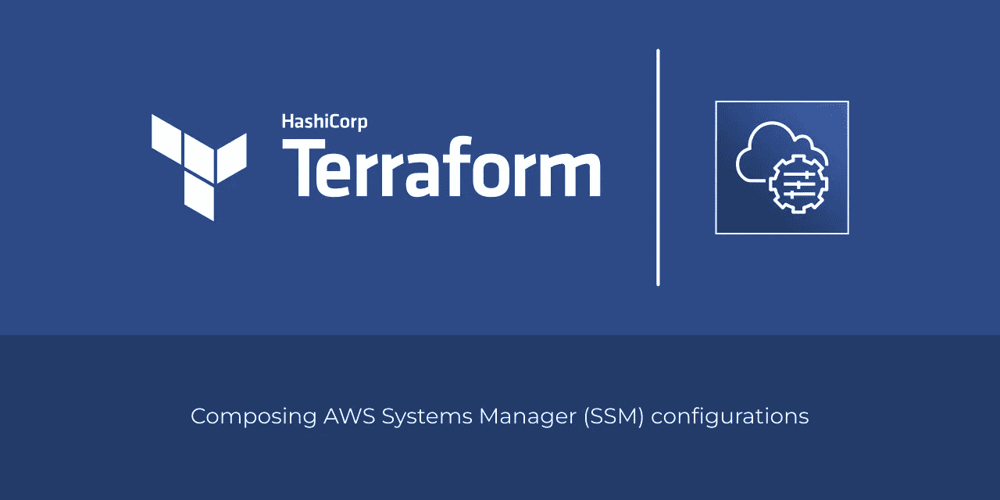

# 使用 Terraform 构建 AWS 系统管理器配置—第 1 部分

> 原文：<https://medium.com/globant/composing-aws-systems-manager-configurations-with-terraform-part-1-939585ee9b7d?source=collection_archive---------0----------------------->



本文介绍了如何使用 [terraform-aws-ssm](https://registry.terraform.io/modules/areguera/ssm/aws/) 模块设置 [AWS 系统管理器(SSM)](https://docs.aws.amazon.com/systems-manager/latest/userguide/what-is-systems-manager.html) 配置。如果您对使用 Terraform 为您的 AWS 基础设施构建 SSM 配置感兴趣，那么这篇文章就是为您准备的。

当您完成本文后，您将能够使用`[terraform-aws-ssm](https://registry.terraform.io/modules/areguera/ssm/aws/)`模块创建您自己的 SSM 配置。

本文将回顾以下部分:

*   模块配置
*   基础设施
*   结论

# 模块配置

`[terraform-aws-ssm](https://registry.terraform.io/modules/areguera/ssm/aws/)`模块需要如下所示的目录结构:

```
.
├── ansible
│   ├── 00-application-configuration.yml
│   ├── 99-application-tests.yml
│   └── roles
│       ├── application-httpd
│       │   ├── handlers
│       │   │   └── main.yml
│       │   ├── tasks
│       │   │   └── main.yml
│       │   └── templates
│       │       ├── index.html.j2
│       │       └── welcome.conf.j2
│       └── application-httpd-tests
│           └── tasks
│               └── main.yml
├── main.tf
├── README.md
└── variables.tf
```

## 可翻译的目录

该布局中的`ansible`目录用于组织可行的剧本和角色。使用此位置来声明 SSM 管理的 EC2 实例的所需状态。

当应用 ssm 关联时， [terraform-aws-ssm](https://github.com/areguera/terraform-aws-ssm) 模块创建一个名为`${var.name}-ssm/`的私有 S3 存储桶，并将整个`ansible`目录上传到该存储桶以供进一步使用。当您引入对`ansible`目录的更改时，它们将在您下次运行`terraform apply`命令时反映在新的 S3 桶版本中，因此 SSM 服务将在关联中使用它们。

当您在`ansible`目录中编写可翻译的剧本时，请记住它们将被下载到 SSM 托管实例并在那里应用。您不需要自己安装 ansible command，因为`${var.name}-ApplyAnsiblePlaybooks` SSM 文档已经处理好了，但是您必须编写您的剧本文件，以便仅使用`local`连接在`localhost`上运行。例如，考虑以下行动手册:

```
---
 - name: Examples simple - Configure application
  hosts: localhost
  connection: local

  roles:
     - application-httpd
```

## variables.tf 文件

默认情况下， [terraform-aws-ssm](https://github.com/areguera/terraform-aws-ssm) 模块需要两个变量作为输入。这些变量允许您自定义您创建的 SSM 配置。如果需要，还可以部署多个配置。

```
variable "name" {
  type        = string
  description = "The project's name. This value is used to identify resources and tags."
}

variable "region" {
  type        = string
  description = "The AWS region used by terraform provider."
}
```

## `main.tf`文件

`main.tf`文件有三个主要部分。第一个描述了 terraform 提供者和与之相关的限制。

```
terraform {
  required_providers {
    aws = {
      source  = "hashicorp/aws"
      version = "~> 4.0"
    }
  }
}

provider "aws" {
  region = var.region
}
```

`main.tf`文件中的第二部分调用 [terraform-aws-ssm](https://github.com/areguera/terraform-aws-ssm) 模块，并提供模块设置补丁基线、维护窗口和 ssm 配置的关联资源所需的信息。

```
# ------------------------------------------------------------------
# SSM Configuration
# ------------------------------------------------------------------
module "ssm" {
  source = "../../"

  name = var.name

  operating_system                     = "AMAZON_LINUX_2"
  approved_patches_compliance_level    = "CRITICAL"
  approved_patches_enable_non_security = false

  approval_rules = [{
    approve_after_days  = 7
    compliance_level    = "CRITICAL"
    enable_non_security = false
    patch_filters = [
      { key = "PRODUCT", values = ["AmazonLinux2"] },
      { key = "CLASSIFICATION", values = ["Security", "Bugfix"] },
      { key = "SEVERITY", values = ["Critical", "Important"] }
    ]
  }]

  maintenance_window = {
    enabled           = true
    schedule          = "cron(0 9 */7 * ?)"
    schedule_timezone = "UTC"
    cutoff            = 0
    duration          = 1
  }
}
```

这就是使用`[terraform-aws-ssm](https://registry.terraform.io/modules/areguera/ssm/aws/)`模块部署您的第一个 SSM 配置所需的全部内容。`main.tf`文件中剩余的配置部分专门用来说明 SSM 管理的 EC2 实例的部署。

```
# ------------------------------------------------------------------
# VPC
# ------------------------------------------------------------------
module "vpc" {
  source  = "terraform-aws-modules/vpc/aws"
  version = "~> 3.0"

  name = var.name

  cidr = "10.0.0.0/16"

  azs             = ["${var.region}a"]
  public_subnets  = ["10.0.1.0/24"]
  private_subnets = ["10.0.21.0/24"]

  enable_nat_gateway = true
}

# ------------------------------------------------------------------
# Security Groups
# ------------------------------------------------------------------
module "security-group_http-80" {
  source  = "terraform-aws-modules/security-group/aws//modules/http-80"
  version = "~> 4.0"

  name        = "${var.name}-sg-http-80"
  description = "Allow http traffic from public subnets."

  vpc_id              = module.vpc.vpc_id
  ingress_cidr_blocks = module.vpc.public_subnets_cidr_blocks
}

# ------------------------------------------------------------------
# Autoscaling
# ------------------------------------------------------------------
module "asg" {
  source  = "terraform-aws-modules/autoscaling/aws"
  version = "~> 6.0"

  name = var.name

  min_size         = 1
  max_size         = 5
  desired_capacity = 1

  iam_instance_profile_name = module.ssm.iam_instantace_profile_name
  security_groups           = [module.security-group_http-80.security_group_id]
  vpc_zone_identifier       = module.vpc.private_subnets

  launch_template_name        = var.name
  launch_template_description = "Launch template for ${var.name} autoscaling group."
  update_default_version      = true

  image_id          = "ami-0022f774911c1d690"
  instance_type     = "t2.micro"
  ebs_optimized     = false
  enable_monitoring = true

  instance_market_options = {
    market_type = "spot"
    spot_options = {
      max_price = "0.004"
    }
  }

  tags = {
    "Name"        = "${var.name}"
    "Patch Group" = "${var.name}"
  }
}
```

当部署新的 EC2 实例时，SSM 代理和 SSM 服务器之间的通信开始，并且代理联系 SSM 服务器以通知它的存在。默认情况下，这种通信是被拒绝的，您需要通过创建一个具有必要权限的 EC2 实例概要文件来允许它，然后编写 EC2 实例部署代码来使用它。一旦 EC2 实例在 SSM 注册，它的代理就准备好执行 SSM 服务被配置为在本地操作系统中运行的所有操作。

`[terraform-aws-ssm](https://registry.terraform.io/modules/areguera/ssm/aws/)`模块创建了一个名为`${var.name}-ssm-managed-instance`的 EC2 实例概要文件，它拥有 EC2 实例与 SSM 服务交互所需的所有权限。但是，它不会在部署 EC2 实例的代码中配置 EC2 实例概要文件名称。当您编写自己的 EC2 实例部署代码时，您需要自己建立这样的关系。

例如，在`example/simple/main.tf`文件中，`iam_instance_profile_name`属性使用对`iam_instance_profile_name`资源的引用，在模块配置块中先前定义的`ssm`模块中，建立由`[terraform-aws-ssm](https://registry.terraform.io/modules/areguera/ssm/aws/)`模块创建的 EC2 实例概要文件和为本文创建的 EC2 实例部署代码之间的关系。

```
module "asg" {
  source  = "terraform-aws-modules/autoscaling/aws"
  version = "~> 6.0" name = var.name # ... iam_instance_profile_name = module.ssm.iam_instantace_profile_name # ...}
```

# 基础设施

本节描述基础结构的理想状态以及如何部署它。

## 期望状态

基础设施期望状态是您希望满足的条件列表。例如，`example/simple/`基础设施的理想状态如下:

*   所有 EC2 实例必须使用 Ansible playbooks 进行安装和配置，以允许 HTTP 请求到达`[http://localhost/](http://localhost/)`并接收`Hello, World!`响应。
*   所有 EC2 实例必须批准分类为“安全”且严重性级别为“关键”或“重要”的所有操作系统补丁程序。补丁在发布后七天自动获得批准。还在发布后七天批准所有分类为“Bugfix”的修补程序。由补丁引起的系统重启也必须在没有人工干预的情况下以协调、渐进和可预测的方式发生。

## 部署

1.  克隆存储库:
    `git clone [https://github.com/areguera/terraform-aws-ssm](https://github.com/areguera/terraform-aws-ssm)`
2.  将工作目录更改为简单配置示例目录。
    `cd terraform-aws-ssm/examples/simple/`
3.  初始化地形提供程序和模块:
    `terraform init`
4.  自定义以设置您自己的 SSM 配置。您应该更改的主要位置是用于修改修补程序基准定义、维护窗口计划和自动扩展组容量的`examples/simple/main.tf`文件，以及用于修改基础架构所需状态的`examples/simple/ansible/`目录结构。
5.  查看地形部署计划:
    `terraform plan -var name=MyProject -var region=us-east-1`
6.  应用地形部署计划:
    `terraform apply -var name=MyProject -var region=us-east-1`

重复第 4 步和第 6 步。

# 结论

这是由两部分组成的文章的第一部分。在第一部分中，您了解了`terraform-aws-ssm`模块以一致的方式供应 SSM 配置所需的非常基本的配置，考虑了 IAM 权限、修补程序基线、EC2 实例的修补程序组分配、自动修补实例的关联以及使用 ansible 确保其所需状态等关键方面。

文章的第二部分“使用 Terraform 构建 AWS 系统管理器配置—第 2 部分”一步步地解释了`terraform-aws-ssm`模块的代码，并以分享关于使用基础设施作为代码构建 SSM 配置的最终想法这一主题结束。