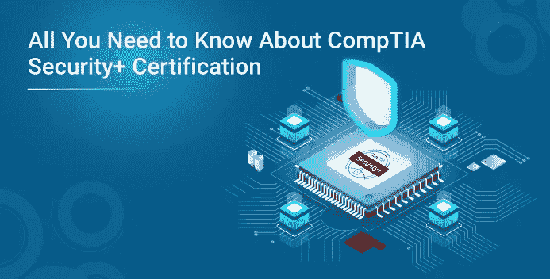

# 关于 CompTIA Security+认证，您需要知道的一切

> 原文：<https://medium.com/edureka/comptia-security-certification-5d1173d99602?source=collection_archive---------0----------------------->

前所未有的新冠肺炎局势大大增加了人们对互联网的依赖。由于社会距离规范，不同领域、行业等的人们已经转向在线解决方案。这种巨大的转变只是增加了数据的脆弱性，从而导致对认证网络安全专业人员的需求增加。因此，如果你对这个不断发展的领域感兴趣，你绝对应该去看看 CompTIA Security+认证。

在继续之前，让我们先来看看本文将要讨论的内容:

*   CompTIA 简介
*   什么是 CompTIA Security+认证？
*   为什么您应该参加 CompTIA Security+认证？
*   有什么资格，适合什么人？
*   你将获得哪些技能？
*   CompTIA 安全+考试详情
*   考试重点关注的领域有哪些？
*   预计会有多少问题，什么类型的问题？
*   考试持续时间

# CompTIA 简介

CompTIA 或**计算机技术行业协会**是一家总部位于美国的非营利性行业协会。它为全球 120 多个国家的 It 行业颁发厂商中立的专业认证。

CompTIA 创建于 1982 年，每年发布 50 多份行业研究报告，以跟踪行业趋势和相应的变化。自协会成立至今，超过**220 万**人**获得了 CompTIA 认证**。

如前所述，CompTIA 提供了许多有价值的认证，从入门级到专家级，其中 CompTIA Security+认证是为网络安全行业设计的。

# 什么是 CompTIA Security+认证？

CompTIA Security+考试是一项全球公认的认证考试，旨在确认您执行重要的安全任务和追求 IT 安全专业人员职业所需的标准技能。

CompTIA Security+强调动手实践技能，确保认证安全专家能够很好地解决任何类型的信息安全问题。CompTIA Security+是 IT 专业人员需要获得的第一个安全认证。它授权安全专业人员掌握处理网络安全的任何角色所需的核心知识，以便为获得中级网络安全工作提供突破。

拥有 CompTIA Security+认证的网络安全专家不仅知道识别安全问题，还知道解决这些问题。

# 为什么选择 CompTIA Security+认证？

事实上，任何持有 CompTIA Security+认证的人都将有一个武器来瞄准网络安全领域的任何中级职位。除此之外，还有许多其他的好处。在本次会议中，我将讨论其中的一些好处。

*   **行业标准** CompTIA Security+认证通常被认为是当前网络安全市场上最基本的信息安全认证之一。不仅如此，ANSI 还加速了这一过程，确保能够应用符合 ISO 17024 标准所需的知识、技能和属性。
*   **厂商中立**
    如前所述，CompTIA Security+认证是一个厂商中立的认证。这基本上意味着您可以专注于基本的网络安全原则，而不必关注任何特定供应商的安全或技术。通过这种方式，你将不会局限于任何特定的技能，你将有一个视野，使你更适合任何类型的网络安全工作角色，从而使你永远受欢迎。
*   我想我们都承认这样一个事实，工资是任何人选择特定职业的最大驱动因素之一。作为 CompTIA 安全+认证专家，你一定会赚很多钱。薪水基本上取决于各种因素，如地理位置、经验、招聘组织、候选人的软技能、工作角色等。
    根据*Indeed.com*的数据，CompTIA Security+的一些工作及其平均工资如下:
*   系统管理员 84，939 美元
*   网络管理员 73，157 美元
*   安全管理员 93，102 美元
*   安保工程师 131 424 美元
*   **跨行业工作** 作为 CompTIA Security+认证专家，你将有资格获得任何行业的网络安全工作，无论是私营部门还是公共部门。
    许多领先的组织，如亚马逊、戴尔、E & Y、埃森哲、凯捷、英特尔、惠普、威瑞森等，都强制要求在申请各种安全配置文件时必须获得 CompTIA Security+认证。
    根据微软开发者博客，CompTIA Security+是美国国防部的授权认证，也是更广泛的计划的子集，通常称为 DoD-Directive 8140/8570；要求国防部信息系统所有授权用户遵守的政策。所有政府雇员、军人、承包商或其他批准进入国防部网络以履行信息安全职责的人都需要它。
*   如前所述，CompTIA Security+考试是一项全球公认的认证考试，为 CompTIA Security+认证专家提供了执行重要的安全任务和从事 IT 安全专业职业所需的标准技能。由于网络安全领域一直在寻找熟练的专业人员，CompTIA 认证专业人员将拥有所有必要的技能，如合规性和运营安全、威胁和漏洞、应用程序、数据和主机安全、访问控制和身份管理、加密等，这将是您一直受欢迎的原因。

# CompTIA Security+的资格是什么，面向谁？

任何具有两年 IT 管理经验、接触过 IT 安全或接受过同等培训的人都可以参加 CompTIA Security+认证考试。任何寻求以下职位的人:

*   系统管理员
*   网络管理员
*   安全管理员
*   初级 IT 审计员/渗透测试员
*   安全专家
*   安全顾问
*   安全工程师

**你将获得哪些技能？**

CompTIA Security+考试侧重于获得网络安全工作所需的所有基本技能。不仅如此，CompTIA security+考试的最新版本考虑到了网络安全工作如何发展和变得更加专业化的当前场景，例如，像安全分析这样的职位。这也是各种工作岗位对 CompTIA Security+认证专业人员的需求日益增加的另一个原因。

这一认证将培养候选人实际了解网络安全问题，并提供适当的解决方案。

任何成功通过考试的人都将验证一些技能，例如:

*   识别恶意网络犯罪分子为入侵网络和主机而制定的策略，并制定适当的对策来保护受到攻击的网络和主机的知识
*   充分了解组织 IT 安全的基本原则以及有效网络安全政策的所有要素
*   候选人将精通安全技术和加密标准和产品的知识
*   安装和配置基于网络和主机的安全技术的能力
*   将能够描述如何实施无线和远程访问安全性
*   支持网络安全和通信技术所需的安全标准、安全工具和产品的知识
*   可以制定确保业务连续性、容错和灾难恢复的计划
*   编译应用程序和程序的易感性，并分析旨在减轻它们的开发和部署技术

# CompTIA 安全+考试详情

# 考试重点关注的领域有哪些？

CompTIA Security+认证考试侧重于以下几个方面:

*   **可能的安全威胁、攻击和漏洞**以便找出危害的迹象，并确定恶意软件的类型，或者比较和对比网络攻击的类型
*   **身份和访问管理:**该领域主要关注身份和访问管理控制的实施，或者区分常见的帐户管理实践
*   **技术和工具:**解决最常见的 IT 安全问题或安全部署移动设备
*   **风险管理:**这个领域着重于解释与组织安全相关的安全策略、计划和程序的重要性
*   **架构和设计:**这主要是总结安全应用程序开发、部署、云和虚拟化的概念
*   **密码学和 PKI:** 你应该能够比较和对比密码学的基本概念或者实现公钥基础设施

# 考试有多少题，什么类型的题？

CompTIA Security+认证考试有 **90 道题**。这些将分为**选择题、拖放活动和基于表现的项目**。

MCQ 可以是单选题，也可以是多选题。基于表现的问题旨在分析您在模拟环境中解决问题的能力。

现在，你必须记住的一件事是时间管理，因为大多数考试问题将在考试的初始阶段出现，当你解决它们时，你将无法看时钟。

完成这些问题后，您将收到一份可选的调查表，其中包含 12 个问题，涉及您的个人学习实践以及您选择 CompTIA Security+考试的原因。

# 考试持续时间

参加 CompTIA Security+认证考试的考生将有 **90 分钟的时间回答前面主题中解释的 90 个问题**。请注意，这不包括您在考试中心完成所有报到手续所需的时间。因此，你最好在预定的考试时间之前到中心。

如果你想查看更多关于人工智能、DevOps、道德黑客等市场最热门技术的文章，你可以参考 Edureka 的官方网站。

请留意本系列中的其他文章，它们将解释网络安全的各个方面。

> *1。* [*什么是网络安全？*](/edureka/what-is-cybersecurity-778feb0da72)
> 
> *2。* [*网络安全框架*](/edureka/cybersecurity-framework-89bbab5aaf17)
> 
> *3。* [*隐写术教程*](/edureka/steganography-tutorial-1a3c5214a00f)
> 
> *4。* [*什么是网络安全？*](/edureka/what-is-network-security-1f659407dcc)
> 
> *5。* [*什么是计算机安全？*](/edureka/what-is-computer-security-c8eb1b38de5)
> 
> *6。* [*什么是应用安全？*](/edureka/application-security-tutorial-e6a0dda25f5c)
> 
> *7。* [*渗透检测*](/edureka/what-is-penetration-testing-f91668e2291a)
> 
> *8。* [*伦理黑客教程*](/edureka/ethical-hacking-tutorial-1081f4aacc53)
> 
> *9。* [*关于 Kali Linux 你需要知道的一切*](/edureka/ethical-hacking-using-kali-linux-fc140eff3300)
> 
> *10。* [*道德黑客利用 Python*](/edureka/ethical-hacking-using-python-c489dfe77340)
> 
> *11。* [*DDOS 攻击*](/edureka/what-is-ddos-attack-9b73bd7b9ba1)
> 
> *12。* [*MacChanger 与 Python*](/edureka/macchanger-with-python-ethical-hacking-7551f12da315)
> 
> *13* [*ARP 欺骗*](/edureka/python-arp-spoofer-for-ethical-hacking-58b0bbd81272)
> 
> *14。* [*Proxychains，anon surf&MAC change*](/edureka/proxychains-anonsurf-macchanger-ethical-hacking-53fe663b734)
> 
> *15。* [*足迹*](/edureka/footprinting-in-ethical-hacking-6bea07de4362)
> 
> 16。[*50 强网络安全面试问答*](/edureka/cybersecurity-interview-questions-233fbdb928d3)

*原载于 2018 年 8 月 9 日*[*www.edureka.co*](https://www.edureka.co/blog/comptia-security-plus-certification/)*。*