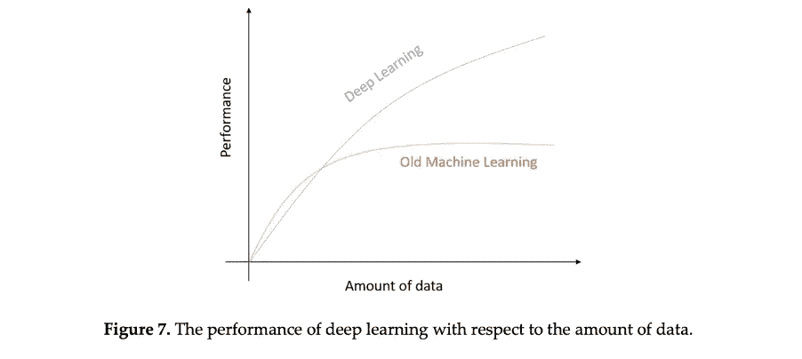
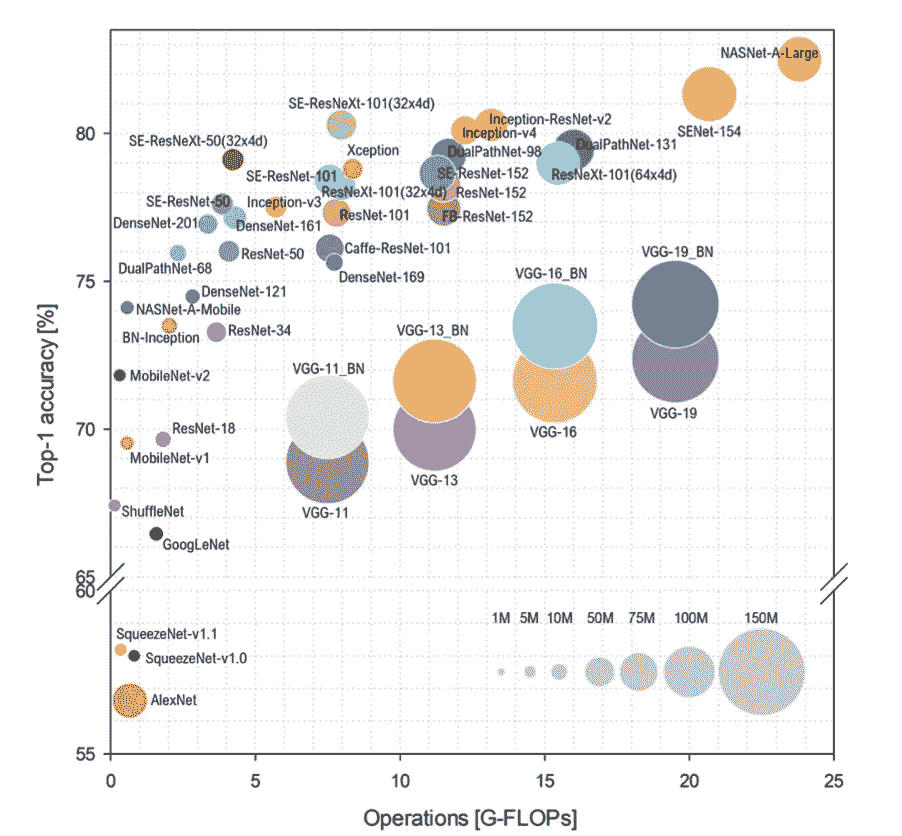
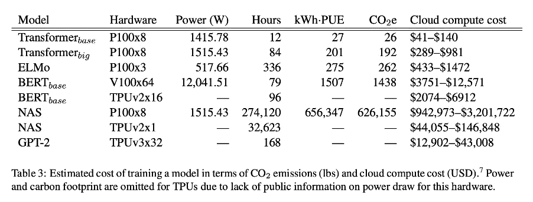
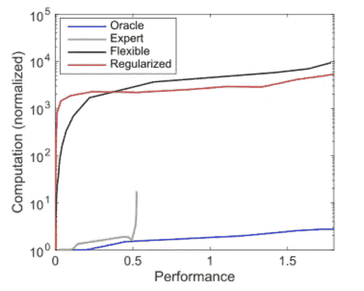

# 深度学习的计算复杂性:解决方法

> 原文：<https://medium.com/walmartglobaltech/computational-complexity-of-deep-learning-a-birds-eye-view-2250b7c098a1?source=collection_archive---------0----------------------->

***沃尔玛全球技术部数据科学总监 Vijay Agneeswaran 博士。沃尔玛全球技术部首席数据科学家 Anirban Chatterjee 和沃尔玛全球技术部员工数据科学家 Kunal Banerjee。***

这篇博客的灵感来自于本·洛里卡在[数据交易所](https://thedataexchange.media/why-you-should-optimize-your-deep-learning-inference-platform/)上主持的一个关于“为什么你应该优化你的深度学习推理平台”的播客。

eep learning 在广泛的任务中取得了显著的成功，例如成为围棋冠军击败机器的一部分( [AlphaGo 击败了世界围棋冠军 Lee Sedol](https://www.theatlantic.com/technology/archive/2016/03/the-invisible-opponent/475611/) )以及作为最近几个月计算机视觉、语音处理、语言翻译等领域多项进步的单一驱动者。

为什么深度学习如此成功？深度学习能从大数据中学习的根本原因是什么？为什么传统的 ML 不能像深度学习那样高效地从现在可用于不同任务的大型数据集学习？这些问题可以通过理解深度学习的可学性来回答——也称为 Vapnik-Chervonenkis 维度，如图 1 [1]中的曲线所示。该曲线捕捉了传统 ML 和 DL 的性能与用于训练模型的数据量的关系。可以观察到，当数据集较小时，传统的 ML 比 DL 具有更好的性能，但是随着数据集进入大数据区，DL 的性能保持增长，几乎呈指数增长。这就是我们在特定任务上看到深度学习如此显著的性能提升的原因，其中有大量带标签的数据集可用于训练(图像分类是典型的例子)。

Figure 1: Source Credit [1].

最近观察到的一个趋势是深度神经网络正在被过度参数化，这意味着参数的数量远大于用于训练的可用数据点的数量。已经证明，对于训练过度参数化的神经网络，某些特征允许通过局部试探法和二次激活有效地找到全局最优模型[2]。过度参数化网络的一个例子是最先进的图像识别系统 nosys student[3]，它有大约 4.8 亿个参数，或者是微软的图灵 NLG，它有 170 亿个参数。OpenAI 的 GPT3 将这一点发挥到了极致，它有 175B 个参数。尽管像加里·马库斯这样的一些研究人员已经表明 GPT3 可以生成自然语言，但这是毫无意义的——这是一个单独的主题，需要进一步研究。

过度参数化网络的计算需求与数据点数量和参数数量的乘积成比例(并且假设在过度参数化设置中，所需的参数数量随着数据点数量的增加而增加)，这本质上意味着训练过度参数化深度学习的计算需求与数据点数量成二次关系。图 2 中的图表量化了常用深度学习模型的计算要求，由[4]提供。从图中可以看出，性能最好的预训练架构是那些计算复杂度非常高的架构(如 NASNet-A-Large)，位于图中的最右侧。还应该记住，它们不是具有最大模型复杂性的模型(如气泡大小所示)。另一个重要的观察结果是，几乎所有的模型都能够在高端 GPU 上实现实时或超实时性能，这可能意味着拥有 GPU 可以解决计算问题。

Figure 2: Source Credit [4]

我们试图说明的一点是，虽然 GPU 解决了一些计算复杂性，并有助于采用深度学习，但 AlexNet 或 ResNext-101 等先进系统中实际使用的计算能力增长得更快。

从能源角度来看，深度学习的碳足迹也是巨大的。从图 3[5]中的表格可以看出，训练 BERT 或 Transformers 等常见 NLP 模型的成本相当高，网络架构搜索(NAS)是一种调整模型超参数并获得最佳模型的方法，是环境的最高负担。将 CO2e 列中的成本与 1984 年 1 名乘客从纽约到旧金山的航空旅行成本进行比较。

Figure 3: Source Credit [5]

# 解决方法

GPU 一直处于深度学习革命的前沿，从 Hinton 的基础论文开始，当时他们在 GPU 上使用深度学习解决了 ImageNet 挑战[6]以及过去几年在计算机视觉、语言翻译和语音处理等各种挑战中的许多其他深度学习胜利。谷歌还推出了加速深度学习推理的专门硬件，称为张量处理单元(TPUs) [7]，现在已经可以在谷歌云中使用。TPU 实现了深度学习的显著加速，并且消耗了更少的功率。Nvidia 也推出了自己的加速深度学习的专业硬件，称为 [Xavier 处理器](https://blogs.nvidia.com/blog/2018/01/07/drive-xavier-processor/)，每秒钟可以进行 30 万亿次运算，仅消耗 30 瓦的功率。由于这些专业化正面临回报递减，因此正在探索包括量子计算在内的其他硬件进步。一项有趣的工作是在[8]中，作者展示了如何在 HPC(如 ORNL 的泰坦超级计算机)、神经形态计算(针对尖峰神经网络)和量子计算(波尔兹曼机器网络)上实现具有层内互连的复杂神经架构。

第二个广泛的工作试图通过稀疏化经过训练的神经网络来降低深度学习的计算复杂性，以便它需要更少的推理计算。这方面的三种常用方法包括剪枝、低秩压缩和量化。例如,[9]中的工作使用低成本协作层来加速网络中的每个卷积层。一劳永逸网络[10]中使用的渐进收缩技术是一种广义的多维剪枝方法。在这个方向上另一个有趣的努力是 BNNs ( [二进制神经网络](https://towardsdatascience.com/binary-neural-networks-future-of-low-cost-neural-networks-bcc926888f3f))，这是一种量化网络的方法。低秩近似(LRA)是一种用两个或更多更小的矩阵来代替大矩阵乘法以降低计算复杂度的技术。[11]提出了力正则化，以将深度学习滤波器协调到更相关的状态，从而实现更有效的 LRA。

第三项工作是寻找小型深度学习架构，这在计算上更有效。例如，神经架构搜索(NAS)最初是使用强化学习[12]提出的，通过搜索超参数的可能空间来获得最佳可能的架构(接近人类制作的架构)。如此发现的体系结构可能有效地执行推理。然而，它不能保证是低能量模型，加上整个搜索过程本身计算量很大。ENAS 被提出来缓解[13]中的一些问题——这里的关键改进是使子模型共享参数(权重),而不是从头开始训练每个子模型。寻找更小架构的另一个有趣方法是[14]中概述的彩票假设，它认为找到这样一个理想的性能架构就像赢得一张彩票(接近拥有理想的初始化参数)，并描述了一种实现相同目标的方法。另一个有助于减少深度网络模型规模的相关方法是“知识提炼”[15]。在这种方法中，我们首先训练一个称为“教师模型”的大模型。接下来，我们训练一个较小的模型，称为“学生模型”，它试图模仿教师模型的行为。学生模型通过尝试复制教师模型的特定层的输出以及最终损失来做到这一点。

沿着类似的思路，有一个思维过程，即深度学习可能需要以不同的方式增强，以使其更好地用于现实世界的应用，特别是从类人学习的角度来看[16]。谷歌和 T2 最近都试图加入基本的直觉物理学(如重力、形状等)。)转化为深度学习模型。可微分神经计算机(DNC)是一种用随机存取读写存储器增强的神经网络，它保持端到端的可微分性，已被应用于解决方块拼图和寻找图中节点之间的路径。在围棋比赛中击败人类冠军的机器 AlphaGo 是一个深度学习系统，它增强了基于模型的树搜索[17]，这是一个经典的人工智能构建模块。这个领域最近的一家初创公司是 [deci。AI](https://deci.ai/) ，它提出了一项名为自动神经架构构建(AutoNAC)的技术，以现有的神经网络为输入，将其转换为计算效率更高的网络。

另一种规避深度学习计算限制的方法是转移到其他可能尚未发现的机器学习类型。例如，“专家”模型在计算上可能更高效，但是如果这些专家不能像灵活模型那样高效地探索和识别起作用的因素，那么它们的性能就会停滞不前(图 4) [2]。这种技术已经优于深度学习模型的一个例子是那些可以更直接地应用工程和物理知识的技术:对已知物体(例如车辆)的识别[18] [19]。机器学习的符号方法的最新发展更进了一步，使用符号方法有效地学习和应用某种意义上的“专家知识”，例如[20]从数据中学习物理定律，或方法[21] [22]将神经符号推理应用于场景理解、强化学习和自然语言处理任务，建立系统的高级符号表示，以便能够用更少的数据更有效地理解和探索它。

Figure 4: Source Credit [2]

# 参考

[1] M. Alom，T. Taha，C. Yakopcic，s .韦斯特博格，P. Sidike，M. Nasrin，M. Hasan，B. Van Essen，A. Awwal 和 v .阿莎丽，深度学习理论和架构的最新调查，第 8 卷(3)，电子，2019 年，第 292 页。

[2] N. C. Thompson，K. Greenewald，K. Lee 和 G. F. Manso，深度学习的计算极限，第 4 卷，麻省理工学院数字经济研究简报倡议，2020 年。

[3]qi . Xie，M.-T. Luong，E. Hovy 和 Q. V. Le，“对有噪声的学生进行自我训练可提高 ImageNet 分类”，IEEE 计算机视觉和模式识别会议，西雅图，2020 年。

[4] S. Bianco，R. Cadene，L. Celona 和 P. Napoletano，“代表性深度神经网络架构的基准分析”， *IEEE Access，*第 6 卷，第 64270–64277 页，2018 年。

[5] E. Strubell，A. Ganesh 和 A. McCallum，“NLP 中深度学习的能源和政策考虑”，*计算语言学协会(ACL)* 第 57 届年会，意大利佛罗伦萨，2019 年。

[6] A .克里热夫斯基、l .苏茨基弗和 G. E .辛顿。，“深度卷积神经网络的 ImageNet 分类”，*《美国计算机学会通讯》，*第 60 卷第 6 期，第 84–90 页，2017。

[7] N. P. Jouppi 和 e. al，“张量处理单元的数据中心内性能分析”，载于*第 44 届计算机架构年度国际研讨会会议录(ISCA '17)* ，纽约州，2017 年。

[8] T. E. Potok，C. Schuman，S. Young，R. Patton，F. Spedalieri，J. Liu，K.-T. Yao，G. Rose 和 G. Chakma，“关于高性能、神经形态和量子计算机的复杂深度学习网络的研究”， *ACM 计算系统中的新兴技术杂志，*第 14 卷第 2 期，2018 年 7 月。

[9] X. Dong，J. Huang，Y. Yang 和 S. Yan，“更多即更少:推理复杂度更低的更复杂网络”，载于 *IEEE 计算机视觉与模式识别大会(CVPR)* ，2017。

[10]蔡海华，甘春华，王天庭，张志军，韩少南，“一劳永逸:培养一个网络，并使之专业化，以实现高效部署”，*(ICLR)*，2020 年。

[11]魏文等。al，“为更快的深度神经网络协调过滤器”，在 *IEEE 计算机视觉国际会议(ICCV)* ，2017 年，意大利威尼斯。

[12] B. Zoph 和 Q. V. Le，“具有强化学习的神经架构搜索”，载于 2016 年*国际学习表征会议*。

[13] H. Pham，M. Y. Guan，B. Zoph，Q. V. Le 和 J. Dean，“通过参数共享实现高效的神经架构搜索”，载于*国际机器学习会议(ICML)* ，2018 年。

[14] J. Frankle 和 M. Carbin，“彩票假说:寻找稀疏的、可训练的神经网络”，载于 2019 年*国际学习表征会议(ICLR)* 。

[15] G. Hinton，O. Vinyals 和 J. Dean，“在神经网络中提取知识”，NIPS 深度学习和表征学习研讨会*，2015 年。*

[16] B. M. Lake，T. D. Ullman，J. B. T. Gershman 和 J. Samuel，“构建像人一样学习和思考的机器”，*行为脑科学，*第 40 卷，2017 年 11 月。

17 戴维·西尔弗等人。al，“用深度神经网络和树搜索掌握围棋博弈”，*《自然》，*第 529 卷，第 484–503 页，2016。

[18] T. He 和 S. Soatto，“Mono3d+:具有双尺度 3d 假设和任务先验的单目 3d 车辆检测”，载于 2019 年*AAAI 人工智能会议论文集*。

[19] V. Tzoumas，P. Antonante 和 L. Carlone，“离群值-稳健的空间感知:硬度、通用算法和保证”，载于 *arXiv，stat。ML* ，2019。

[20] S.-M. Udrescu 和 M. Tegmar，《Ai feynman:一种受物理学启发的符号回归方法》，*科学进展，*第 6 卷，第 16 期，2020 年。

21m . Asai 和 C. Muise。“通过立方体空间先验学习神经符号描述性规划模型:回家之旅(to STRIPS)”，载于*国际人工智能联合会议(IJCAI)* ，2020 年。

[22] K. Yi，J. Wu，C. Gan，A. Torralba，P. Kohli 和 J. Tenenbaum，“神经-符号 vqa:从视觉和语言理解中解开推理”，载于*神经信息处理系统进展(NIPS)* ，2018 年。

工具

1.[https://quic.github.io/aimet-pages/index.html](https://quic.github.io/aimet-pages/index.html)—看看这是否可以用来优化 TensorFlow 笔记本电脑以及 PyTorch 笔记本电脑的 DeepSpeed。

2.[https://github.com/IntelLabs/distiller](https://github.com/IntelLabs/distiller)—自动压缩框架——不确定是否可以对所有类型的模型进行探索。

3.https://github.com/forresti/SqueezeNet——较老的框架之一——必须看看这是否是当前的。