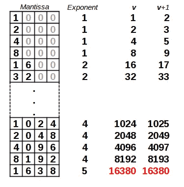
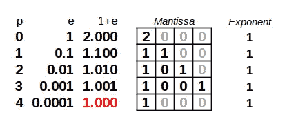

# 计算机数字和不合逻辑的代码？

> 原文：<https://medium.com/globant/computer-numbers-and-illogical-code-dd2510ecde83?source=collection_archive---------0----------------------->

一个简短有趣的算法揭示了 JavaScript(以及一般计算机)如何在内部表示数字的细节。


Photo by [Andrew Buchanan](https://unsplash.com/@photoart2018?utm_source=medium&utm_medium=referral) on [Unsplash](https://unsplash.com?utm_source=medium&utm_medium=referral)

当你开始编程时，你迟早会意识到数学性质并不总是满足于计算机数学，一些意想不到的结果会突然出现。例如，你会认为两个正数相加应该产生一个更大的正数，不是吗？然而，情况并非总是如此…

在本文中，我们将检查一个相当简单(并且完全有效)的算法，它包括四个看起来非常不合逻辑的语句，这将引导我们更好地理解计算机内部数字表示的某些方面。

# 一个无止境的算法？

“算法”这个词意味着一种必须停止的方法:如果你运行一个算法，它最终必须结束，已经计算了一些东西。(如果你的方法不一定能计算出预期的结果，那么可以称之为“启发式”。)但是如果代码永远不会停止，那么它将毫无用处！在这篇文章中，我们将看到一些代码，似乎是在最后一类，有几个可疑的指令，但实际上工作，即使不清楚如何或为什么！

下面的算法是我们将要分析的算法；你能发现它所有令人担忧的地方吗？顺便说一下，不要担心这是 JavaScript 代码；您还可以对其稍加修改，以在 Java、Python 或 C++中运行。我已经突出了麻烦的部分。

```
let v = 1;
while (**(v + 1) - v === 1**) { // *always true, so an infinite loop?*
    v = v * 2;
}let d = 1;
while (**(v + d) === v**) {     // *always false?*
    d = d * 2;
}const b = **(v + d) - v**;      // *isn't this just d ?* console.log(b);             // *what's this?*let p = 0;
let e = 1;
while (**(1 + e) !== 1**) {     // *another infinite loop?*
    p = p + 1;
    e = e / b;
}
console.log(p);             // *what's this?*
```

让我们看看所有奇怪的部分…

*   第一个循环在`(v+1)-v`等于`1`时运行……但这不总是正确的吗？而且，那样的话，这岂不是一个无限循环？
*   当`(v+d)`不同于`v`时，第二个循环停止……但是既然`d`不为零，情况不总是这样吗？然后，循环永远不会被执行？
*   我们计算出`b`是`(v+d)`和`v`之差……那不就是简单的`d`吗？为什么不直接用后者？
*   最后，当`(1+e)`不同于`1`时，最后一个循环继续执行……这难道不是给定的吗，因为`e`不是零？那么，这里不是还有一个无限循环吗？

解释以上所有的“怪异”需要了解计算机是如何做数学和内部表示数字的，我们现在就去做。

# 代表数字

当我们处理实数(即非整数)时，所有内部表示都可以包括最大小数位数；无限精确是不可能的。在内部，一个数被表示为一对(*尾数，指数*)满足

> 数字=尾数×(基数的幂)

此外，除非数字是零，否则尾数是介于 0 和 1 之间的数字，选择介于之间，因此其第一个数字不是零，并且具有固定的位数；假设是 4。让我们暂时假设基数是 10，所以我们有一台十进制计算机。像 229 这样的数字在内部表示为 0。 **2290** ×10 ，或者就这一对(2290，3)。尾数和指数可能都是负数，但这些细节不会影响我们的算法。

> 更多名称:这种数字表示法被称为*科学记数法*，因为它在科学中的常见用法，或者被称为*浮点*，因为小数点总是移动到第一个非零数字的左边，从而相应地调整指数。尾数也被称为*有效数*，以避免与对数的[尾数](https://en.wikipedia.org/wiki/Common_logarithm#Mantissa_and_characteristic)相混淆。

从前面的段落中得到的关键信息是，数字不是精确表示的，而是具有有限的精度。如果一个数字需要的位数多于可用的位数，那么最没有意义的位数将被直接砍掉。这种行为是“打破”数学规则的行为，允许我们的算法从内部数字表示系统中嗅出属性，正如我们将看到的。

# 理解算法:第一次循环

有了这些定义，我们的第一个循环会怎样呢？在开始时，我们将变量`v`设为 1，并重复加倍，直到`v+1`不等于`v`。下表显示了循环是如何进行的。



Our first iteration: we double v until v+1 equals v

到了 16384 会怎么样？尾数没有足够的精度，所以只保留了四个更有意义的数字:在我们的模型中，`v`实际上会变成 16380。甚至更多:如果我们给`v`加 1，结果仍然是 16380；我们现在知道，一旦`v`变得足够大，足以“丢弃”它的个位数，我们的“无限循环”实际上将会结束……第一个谜，解决了！

现在让我们转向第二个循环:我们从 1 开始`d`，重复它直到`v+d`不再等于`v`。这里的关键是`v+d`的新值将是 16390，因为在 16380 和 16390 之间没有中间值，因为只存储了四个有效数字。在我们的例子中，将实现改变的值将是`d` =8(如果应用了舍入)或者`d` =16(如果没有进行舍入)，但是在任何情况下`v+d`都将是 16390。

那么，`b=(v+d)-v`的值是多少呢？当`v`增长时，内部数字最终会丢失其单位数字，所以现在连续值之间的最小差值是十进制数字中的 1…所以如果我们使用十进制数学，那么`b`等于 10，更一般地说，答案总是“`b` *是数字*的内部基数”；整洁！

# 理解算法:最后一个循环

我们现在知道了我们计算的第一个结果:我们能够确定数字内部表示的基础。现在让我们处理算法的第二部分，它包括一个循环；给你，作为提醒。

```
let p = 0;
let e = 1;
while (**(1 + e) !== 1**) {     // *another infinite loop?*
    p = p + 1;
    e = e / b;
}
console.log(p);             // *what's this?*
```

在上一节中，循环中的思想是让变量增长得太多，以至于“丢失”了它的单元的数字。这里的概念是使一个变量变得很小，以至于在求和时不会被“注意到”。让我们把这说得更清楚些。如果我们从 1 开始`e`，然后一次又一次地除以`b`(在我们的例子中是 10)，最终`1+e`将等于 1，因为加数太小了；没有足够的尾数数字始终表示精确的总和。



Our last iteration: we reduce e until 1+e equals 1

那么这里`p`的最终值是什么？简单地说，它显示了尾数的位数:在我们的例子中，我们可以验证我们的数字表示有 4 位数的尾数。我们现在知道了描述数字内部表示的两个细节:用什么基数写，尾数有多少位。我们能进一步了解内部表示吗？

# 了解更多信息

通过给我们的算法增加一些代码，我们可以得到更多的关于计算机数字的表示。例如，指数的极限是什么？我们可以用下面的额外逻辑找到。

```
let aMax = 1;
let nMax = 0;
while (aMax !== Infinity) {
  aMax = aMax * b;
  nMax = nMax + 1;
}console.log(nMax - 1);
```

如果我们从 1 开始，继续乘以基数，我们最终会达到一个足够高的值，这个值不适合我们的数值表示。(在 JavaScript 中，这个特别大的值应该是`Infinity`)。类似的逻辑让我们找到最低的指数；这里我们除以基数，直到一个数变得很小，以至于它变成零，因为不可能用所用的精度来表示它。

```
aMin = 1;
nMin = 0;
while (aMin !== 0) {
  aMin = aMin / b;
  nMin = nMin - 1;
}console.log(nMin + 1);
```

最后，有一种可能性，即使数字以固定的精度表示，内部运算也可能使用更多的数字(额外的精度),然后舍入得到更精确的结果。我们如何检测到这一点？我们只需要一句俏皮话。

```
const r = (v + (b - 1)) > v;console.log(r);
```

这个想法可以追溯到我们发现我们的表示的基础的时候:在我们的例子中，那时我们有`v`等于 16380。如果应用了额外的数字和舍入，那么加 9(比 10 小一，数字的基数)应该得到 16390；否则，单位的 9 位数将被简单地截断。如果我们测试将`b-1`加到`v`是否真的产生了更大的值，我们就有办法决定是否使用了额外的精度。

# 运行算法

好了，现在我们知道了原始算法，加上它的扩展，是做什么的…运行它怎么样？我用 JavaScript(node . js，版本 14.3.0)做了这个，得到了

*   `b=2`，所以 JavaScript 使用二进制表示，而不是我们例子中的十进制，并且
*   `p=53`，所以尾数有 53 位，大致相当于 16 位小数有效位数。

> `v`的最终值是 9007199254740992，比 [JavaScript 的](https://developer.mozilla.org/en-US/docs/Web/JavaScript/Reference/Global_Objects/Number/MAX_SAFE_INTEGER) `Number.MAX_SAFE_INTEGER`多 1。在这种情况下，“安全”意味着不损失精度的内部表示——正如我们所看到的！JavaScript [还包括](https://developer.mozilla.org/en-US/docs/Web/JavaScript/Reference/Global_Objects/Number/isSafeInteger) `Number.isSafeInteger()`来检查一个数字是否可以在不丢失数字的情况下被表示。

指数的极限是什么？我们得到最大指数是 1023，根据标准也是正确的。对于最小指数我们得到了不同的结果，-1074:为什么？似乎对于非常小的数字，尾数可以小于 0.1(它的起始数字是零)，所以你可以表示更小的值，尽管由于有效数字较少，精度较低。

最后，对于我们代码中的最后一个测试，碰巧没有额外的精度可用；最终结果是一个`false`值。

> 我们的结果符合 [IEEE 754 标准](https://en.wikipedia.org/wiki/IEEE_754)、[双精度浮点](https://en.wikipedia.org/wiki/Double-precision_floating-point_format)格式；还可以查看 ECMA-262 现行标准[第 4.3.20 节*数值*](https://www.ecma-international.org/ecma-262/11.0/index.html#sec-terms-and-definitions-number-value) 。

根据可用的文档，许多其他语言也遵循 IEEE 754 标准，这可以通过实现上面的简单算法并在不同的环境中运行它来检查。

# 结论

我们已经看到了如何通过运行一个似乎充满了无限循环和不合逻辑的代码的奇怪算法来确定浮点数表示的实现方面…这是一种学习编程语言内部细节的有趣方式！