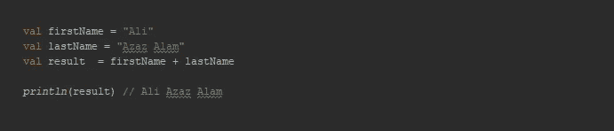
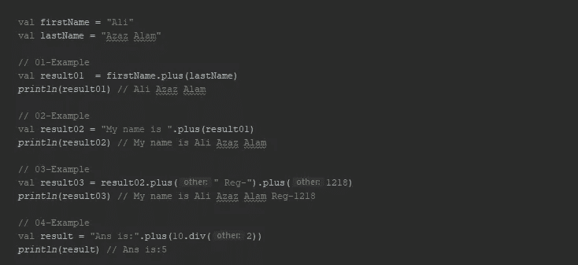
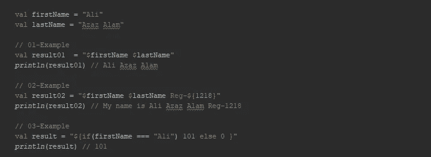
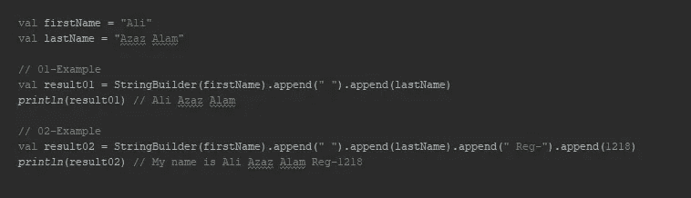
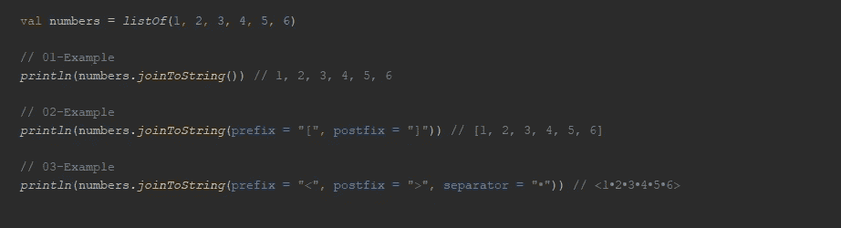
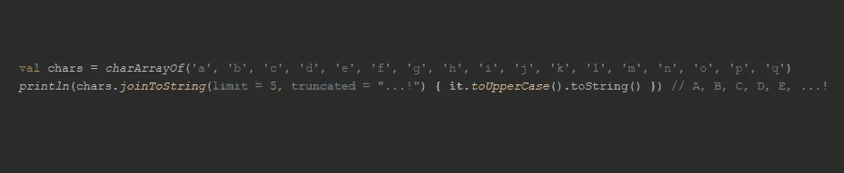

# 在 Kotlin 中连接字符串...幕后🎃

> 原文：<https://blog.kotlin-academy.com/concatenate-strings-in-kotlin-behind-the-scene-1-4-d16c2ee183fa?source=collection_archive---------1----------------------->

世界上的疫情情况，但#Kotlin 在这里是为了方便开发者进行字符串串联。


Image from freepik.com

我写这篇文章的背景是，由于新冠肺炎，整个世界都被封锁了，但是开发人员并没有停止工作😁

由于代码 的 ***简单，有助于避免最著名的 ***NullPointerException，点击 Java → Kotlin 代码转换器，互操作性，数据类，*** 等等，Kotlin 现在正成为程序员最钦佩的语言。它在 2016 年因[谷歌开发者](https://medium.com/u/991272e72e68?source=post_page-----d16c2ee183fa--------------------------------)正式推出用于 android 开发的 Kotlin 而出名。***

在这个简短的主题中，我们将介绍字符串连接的一些最佳实现，并揭示哪种方法更好。那么，让我们开始找出这个问题的答案。

# +'运算符:

如果我们回顾过去的编程时代，我们通常使用 **+操作符**来连接。这里的场景是一样的。



+ operator example

在该方法中，结果字符串包含字符串的两个对象**，一个在**操作符**的**右侧**，另一个在**左侧**。**

# plus()方法:

*根据官方来源*:集合定义了`[plus](https://kotlinlang.org/api/latest/jvm/stdlib/kotlin.collections/plus.html)`(`+`)`[minus](https://kotlinlang.org/api/latest/jvm/stdlib/kotlin.collections/minus.html)`(`-`)运算符。它们将集合作为第一个操作数；第二个操作数可以是一个**元素**或另一个**集合**。

```
operator fun plus(**other**: Any?): String
```

串联`plus()`方法将起始字符串与其他任何类型的文字组合在一起，并返回一个新的 ***字符串对象*** 。这是作为一个运营商超负荷工作。



plus method example

***最重要的*** ，如果传递的对象不是字符串，那么它将使用该对象的字符串表示。

# 字符串模板:

kotlin 提供的另一个最强大的特性是字符串模板。在这个方法中，string literal 包含另一个表达式，它可以是任何数据类型，就像`plus()`方法一样。您也可以在字符串模板中定义逻辑。



String template example

字符串模板遵循 ***字符串插值的过程。***

# StringBuilder:

从 JDK 1.5 到目前阶段，我们大多沉迷于 StringBuilder，因为它的功能是创建可变的(可修改的)和非同步的字符串。

现在，Kotlin 提供的 StringBuilder 具有与 java 相同的特性。如果我们比较不同的连接方法，比如`plus()` 或`+ Operator`，它们创建不可变的字符串，而 StringBuilder 创建可变的字符串。



StringBuilder example

StringBuilder 使用方法`append()`来连接。连接的字符串可以是一种类型或多种类型的组合。连接大量字符串是很有效的。

# 接合方法

用于集合和数组的另一个强大的 Kotlin 方法。该方法可以使用 [***分隔符***](https://kotlinlang.org/api/latest/jvm/stdlib/kotlin.collections/join-to-string.html#kotlin.collections$joinToString(kotlin.Array((kotlin.collections.joinToString.T)),%20kotlin.CharSequence,%20kotlin.CharSequence,%20kotlin.CharSequence,%20kotlin.Int,%20kotlin.CharSequence,%20kotlin.Function1((kotlin.collections.joinToString.T,%20kotlin.CharSequence)))/separator)*并使用给定的 [***前缀***](https://kotlinlang.org/api/latest/jvm/stdlib/kotlin.collections/join-to-string.html#kotlin.collections$joinToString(kotlin.Array((kotlin.collections.joinToString.T)),%20kotlin.CharSequence,%20kotlin.CharSequence,%20kotlin.CharSequence,%20kotlin.Int,%20kotlin.CharSequence,%20kotlin.Function1((kotlin.collections.joinToString.T,%20kotlin.CharSequence)))/prefix) 和 [***后缀***](https://kotlinlang.org/api/latest/jvm/stdlib/kotlin.collections/join-to-string.html#kotlin.collections$joinToString(kotlin.Array((kotlin.collections.joinToString.T)),%20kotlin.CharSequence,%20kotlin.CharSequence,%20kotlin.CharSequence,%20kotlin.Int,%20kotlin.CharSequence,%20kotlin.Function1((kotlin.collections.joinToString.T,%20kotlin.CharSequence)))/postfix)*(如果提供的话)将任何类型的列表转换为字符串。**

****

**joinToString example 01**

**如果您提供的集合太大，您可以指定一个非负值的 [limit](https://kotlinlang.org/api/latest/jvm/stdlib/kotlin.collections/join-to-string.html#kotlin.collections$joinToString(kotlin.Array((kotlin.collections.joinToString.T)),%20kotlin.CharSequence,%20kotlin.CharSequence,%20kotlin.CharSequence,%20kotlin.Int,%20kotlin.CharSequence,%20kotlin.Function1((kotlin.collections.joinToString.T,%20kotlin.CharSequence)))/limit) ，在这种情况下，只有第一个 [limit](https://kotlinlang.org/api/latest/jvm/stdlib/kotlin.collections/join-to-string.html#kotlin.collections$joinToString(kotlin.Array((kotlin.collections.joinToString.T)),%20kotlin.CharSequence,%20kotlin.CharSequence,%20kotlin.CharSequence,%20kotlin.Int,%20kotlin.CharSequence,%20kotlin.Function1((kotlin.collections.joinToString.T,%20kotlin.CharSequence)))/limit) 元素会被处理，后面是[截断的](https://kotlinlang.org/api/latest/jvm/stdlib/kotlin.collections/join-to-string.html#kotlin.collections$joinToString(kotlin.Array((kotlin.collections.joinToString.T)),%20kotlin.CharSequence,%20kotlin.CharSequence,%20kotlin.CharSequence,%20kotlin.Int,%20kotlin.CharSequence,%20kotlin.Function1((kotlin.collections.joinToString.T,%20kotlin.CharSequence)))/truncated)字符串(默认为“…”)。**

****

**joinToString example 02**

**非常感谢 [***Kotlin 在线编译器***](https://play.kotlinlang.org) 在我写这篇文章的时候给了我很大的帮助，让我可以在粘贴之前轻松运行代码。😀**

**我希望这篇文章有助于解决关于字符串连接的基本问题，并探索其背后的好处。在 twitter 上关注我，了解更多更新。**

**[](https://twitter.com/AliAzazAlam1) [## 阿里·阿扎兹·阿拉姆

### 阿里·阿扎兹·阿拉姆的最新推文(@AliAzazAlam1)。阿库·🇵🇰.企业家👱🏻‍♂️安卓应用开发者📱开源…

twitter.com](https://twitter.com/AliAzazAlam1) 

感谢您花时间阅读这篇文章。👏如果你喜欢就分享一下。

在我的社交上与我联系，成为我的朋友 [***中***](https://medium.com/@ali.azaz.alam) ，[***Github***](https://github.com/aliazaz)***，*** 和[***LinkedIn***](https://linkedin.com/in/aliazazalam)。** 

# **单击👏说“谢谢！”并帮助他人找到这篇文章。**

**了解卡帕头最新的重大新闻。学院，[订阅时事通讯](https://kotlin-academy.us17.list-manage.com/subscribe?u=5d3a48e1893758cb5be5c2919&id=d2ba84960a)，[观察推特](https://twitter.com/ktdotacademy)，在 Medium 上关注我们。**

**如果你需要一个科特林工作室，看看我们如何能帮助你: [kt.academy](https://www.kt.academy/) 。**

**[](https://kotlin-academy.us17.list-manage.com/subscribe?u=5d3a48e1893758cb5be5c2919&id=d2ba84960a)**