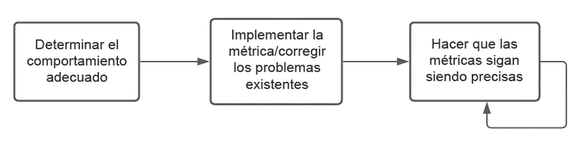

# 在 Pinterest 上信任指标

> 原文：<https://medium.com/pinterest-engineering/confiar-en-las-m%C3%A9tricas-en-pinterest-c6db4f224e9?source=collection_archive---------5----------------------->

Ryan Cooke | 工程经理

这篇文章最初发表在 英语;Read the English version [here](/pinterest-engineering/trusting-metrics-at-pinterest-ed76307e10a0)

像许多科技公司一样,Pinterest 在很大程度上依赖数据来指导决策并推动机器学习。这种策略主要取决于数据的准确性。多年来,我们一直致力于改进流程,证明我们可以依靠关键数据做出决策,并确保指标准确无误。

# 数据中可能存在错误

对于那些不熟悉指标的人来说,这似乎是一个奇怪的问题。诸如每日活跃用户数量(DAU)之类的东西似乎很容易衡量。但这里有一些例子说明这样一个简单的指标是如何失败的:

● 应用程序的扩展版本可能不会更新身份验证令牌;自动登录,无论用户是否使用该扩展。

● 在午夜保持活跃的用户可以算作一个平台的两天活跃用户,但不能算作另一个平台的活跃用户。

某些未计入的活动,例如使用浏览器扩展,可能会计入每日活跃用户。

除了这些例子之外,注册活跃用户通常是最简单的情况之一,因此我们将继续使用它作为示例。

# 验证 Metric

为了确保指标准确,我们创建了一个“验证”过程。此验证过程(图 1)有三个关键步骤:

Figura 1: El proceso de tres pasos

## 1.确定适当的行为

在开始之前,对正确的行为有一个明确的认识是至关重要的。我们为每个验证的量度创建了两个文档。产品规范(T3),提供清晰的定义(如活跃用户):

● 访问 Pinterest 网站或原生移动应用程序

● 使用异地工具创建引脚或引脚;例如 Web 浏览器扩展、Pin It Web 按钮、Facebook Messenger 移动 Web 扩展或 iOS/Android 共享扩展

此定义是思考量度的基础,但本文稍后将描述边界情况,并详细说明在各种情况下的正确行为(例如:,“打开 Pinterest,但在用户界面出现之前关闭它”不应计为活跃用户)。

产品规范由面向工程师的技术规范补充。它侧重于记录事件和元数据的确切方法;它准确地记录了每个平台如何实现一致的实施。

这些步骤看起来很明显,但我们审核的每个指标都有定义问题。**产品规格**和**技术规格**确保每个人在思考指标时指的是同一个指标。这些规范还可以提供一个框架来分析未来的用例。建议使用数据的人员创建一个定义,并根据该定义编写其他规范。预计工程师将提供有关使用简单解决方案可以测量的内容的反馈。注册表解决方案越简单,您遇到问题的可能性就越小。

## 2.实施指标/修复现有问题

下一个重要步骤是使指标准确。客户工程师可以轻松地执行第一层;他们只需要遵循定义并相应地实施。在实践中,将出现工程师无法预测的边界情况和奇点。

为了找到边界情况,我们创建了数据验证标准,以帮助证明数据符合我们的期望。通常,如果数据未通过特定的“验证”,它们会发送警报。对于每日活跃用户示例,最有效的验证类型之一是“无法解释的每日活跃用户”。这些用户具有活动的用户事件,但没有执行预期的其他活动。就像看到一个 PIN。在这些检查中,我们几乎从来没有达到 100%的准确性。只是足以检测是否有异常活动。验证过程的持续时间通常取决于发现数据问题和发送更正之间的迭代。

此外,我们可以通过用户界面测试来测试指标是否准确。对于每日活跃用户,最简单的情况是打开应用程序,登录并确认用户已作为每日活跃用户登录到您的帐户。与其他数据验证不同,数据验证使我们能够在提交更改之前发现问题。通常,我们根据所描述的产品规格用例和使用案例所考虑的事件量来决定要使用的用户界面测试。

## 3\. 使指标保持准确

在前面的步骤之后,你应该有一个准确的指标。但是,如果您希望度量保持不变,则该过程不会就此结束。定期执行最后一步的用户界面测试和数据验证,以证明指标的准确性。这意味着用户界面测试中的错误无法启动;数据验证将导致调查。重要的是要注意,找出量度在生产期间移动的原因比在发布之前发现它要困难得多,并且可能更昂贵。

最后,我们定期检查指标的状态(每三个月或一年,具体取决于指标)。这包括审查验证,以确保它们继续正常运行,并与产品团队合作,以确保没有需要考虑的新用例。

# 最终反思

上面提到的三个步骤描述了我们的指标验证过程。这个过程只有在每个平台(iOS,Web,Android)的工程师,数据工程师和不知疲倦的 TPM 中进行的大量多学科工作才能实现。仅建议对应尽可能完美的指标使用。

*有关 Pinterest 工程的更多信息,请查看我们的* [*工程博客 [*](https://medium.com/pinterest-engineering) *并访问我们的* [*Pinterest Labs*](https://www.pinterestlabs.com/?utm_source=medium&utm_medium=blog-article&utm_campaign=cooke-august-13-2021&utm_content=spanish) *网站。如需查看和申请职位,请访问我们的* [*工作*](https://www.pinterestcareers.com/?utm_source=medium&utm_medium=blog-article&utm_campaign=cooke-august-13-2021&utm_content=spanish) *页面。(T19)*