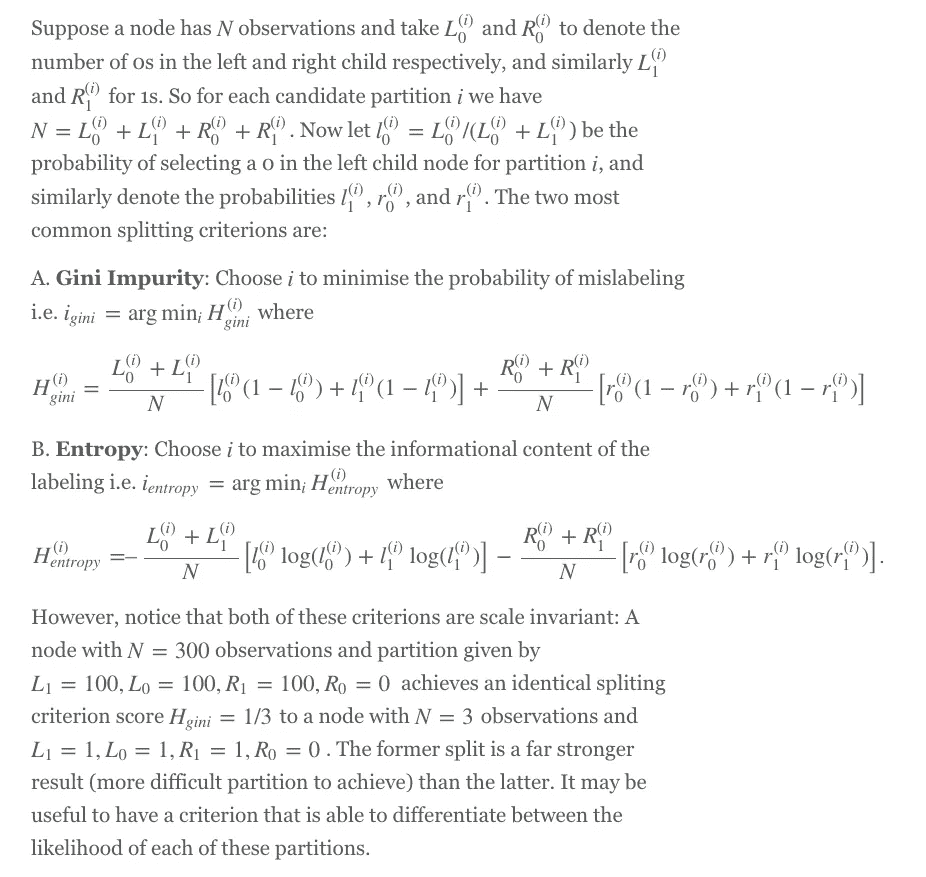
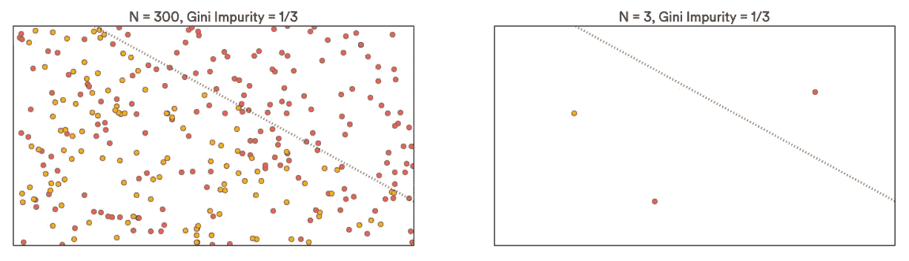
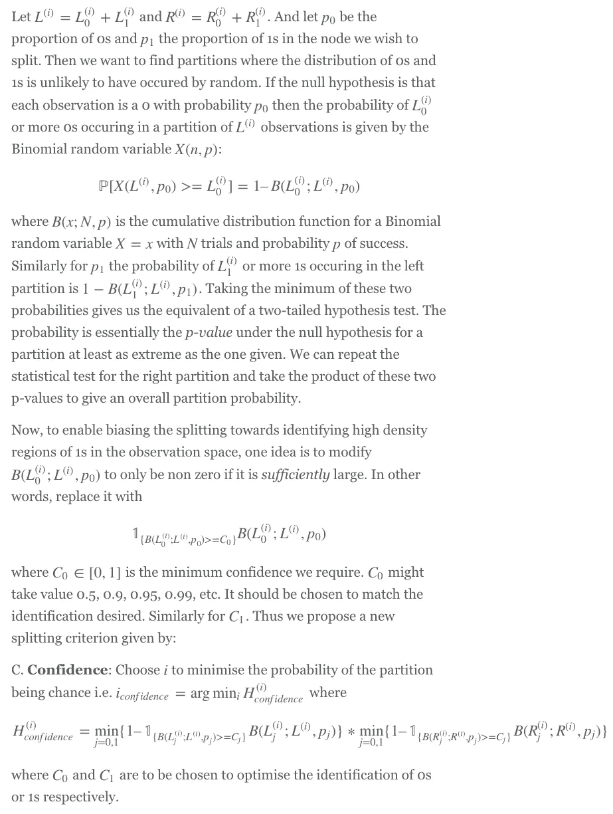
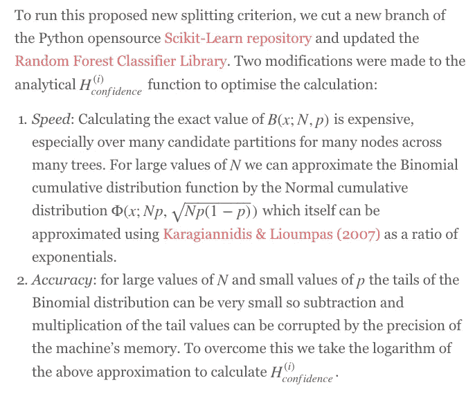
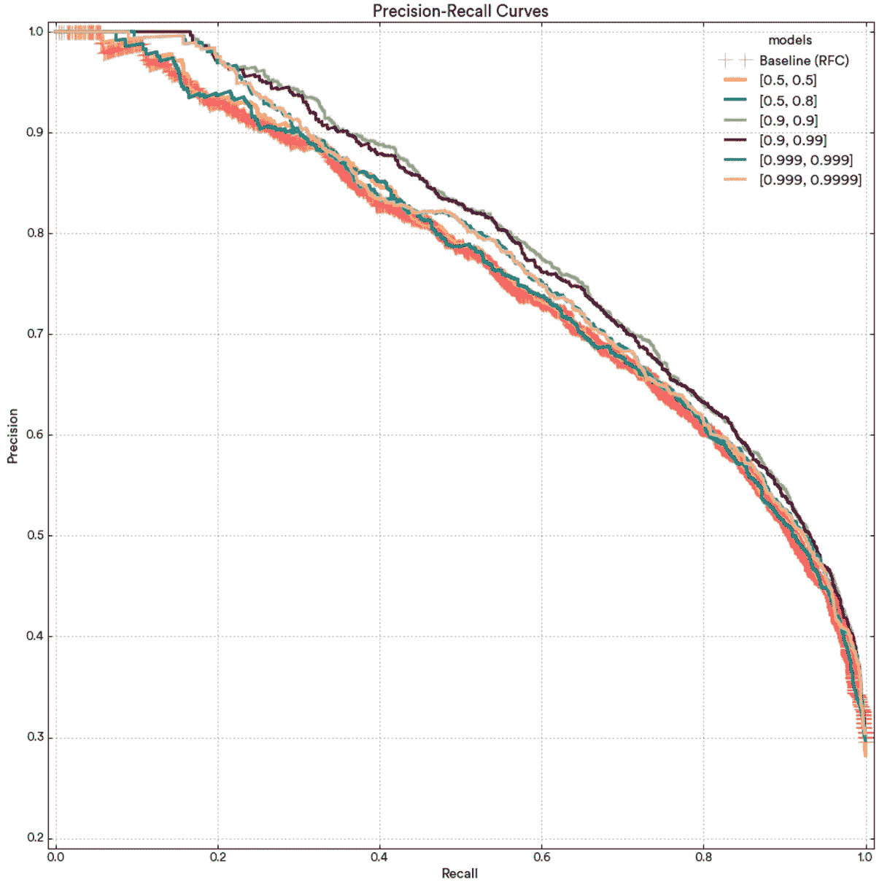
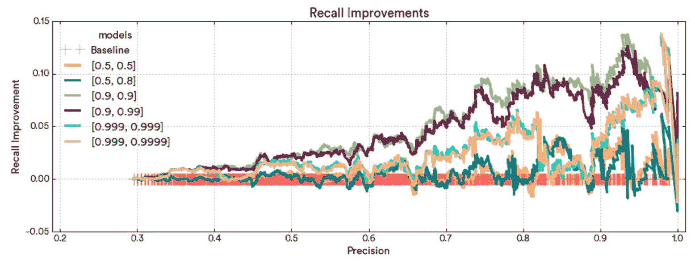

# 置信度分裂准则可以提高随机森林分类器的精度和召回率

> 原文：<https://medium.com/airbnb-engineering/confidence-splitting-criterions-can-improve-precision-and-recall-in-random-forest-classifiers-ad2d4ba696a4?source=collection_archive---------1----------------------->

作者:阿洛克·古普塔

[信任和安全团队](https://www.airbnb.com/trust)维护着许多用于预测和检测在线和离线欺诈行为的模型。我们面临的一个常见挑战是在识别欺诈行为时获得高度信心。包括将欺诈行为归类为欺诈行为(召回)和不将良好行为归类为欺诈行为(精确)。

我们经常使用的分类模型是随机森林分类器(RFC)。然而，通过稍微调整该算法的逻辑，以便我们寻找分类的高置信度区域，我们可以显著提高分类器预测的召回率和精确度。为了做到这一点，我们引入了一个新的分裂标准(解释如下),并通过实验表明，它可以实现更准确的欺诈检测。

## 传统的节点分裂准则

RFC 是随机生成的“决策树”的集合。决策树是一种将多维空间划分为具有相似行为的区域的方法。在欺诈检测的情况下，将事件标识为‘0’表示非欺诈，而‘1’表示欺诈，决策树是二进制的，并试图在信号空间中找到主要是 0 或主要是 1 的区域。然后，当我们看到一个新事件时，我们可以看看它属于哪个区域，并决定它是 0s 区域还是 1s 区域。

通常，决策树是从整个空间开始生长的，并迭代地将其分成越来越小的区域，直到一个区域只包含 0 或只包含 1。每个最终的均匀区域被称为“叶子”。将父区域划分成两个子区域的方法通常被称为“分裂标准”。评估每个候选分区，并且使用优化分裂标准的分区来划分区域。被分割的父区域被称为“节点”。



# 置信分裂准则

## **理论**



## 履行



在对算法进行这些调整之后，我们发现 Scikit-Learn 例程的运行时发生了一个无关紧要的变化。具有新标准的 Python 代码如下所示:

```
from sklearn.ensemble import RandomForestClassifier
# using [C_0,C_1] = [0.95,0.95]
rfc = RandomForestClassifier(n_estimators=1000,criterion='conf',conf=[0.95,0.95])
rfc.fit(x_train,y_train)
pred = rfc.predict_proba(x_test)
```

关于 Airbnb 机器学习模型构建过程的更多细节，你可以阅读以前的帖子，如[设计机器学习模型:精确和回忆的故事](http://nerds.airbnb.com/designing-machine-learning-models/)和[Airbnb 如何使用机器学习来检测主人偏好](http://nerds.airbnb.com/host-preferences/)。有关我们检测风险的架构的详细信息，您可以在[为风险构建机器学习系统](http://nerds.airbnb.com/architecting-machine-learning-system-risk/)了解更多。

# 估价

## **数据**

为了测试置信分裂标准可以提供的改进，我们使用了我们在之前的文章[中使用的相同数据集克服随机森林分类器](http://nerds.airbnb.com/overcoming-missing-values-in-a-rfc/)中的缺失值，即来自 [UCI 机器学习库](http://archive.ics.uci.edu/ml/)的*成人*数据集。与之前一样，我们的目标是使用提供的 14 个特征预测成年人的年收入水平是高于还是低于$50k。

我们尝试了 6 种不同的[C0，C1]组合来对抗带有基尼系数杂质的基准 RFC，并观察了精确召回曲线的变化。像往常一样，我们保持一个训练集，并对未使用的测试集进行评估。我们在 7 个场景中的每一个场景中都构建了 1000 棵树的 RFC。

**结果**



观察到 C0=0.5(黄线和蓝线)相对于基线 RFC 提供了非常小的改进，在 95%的精确度水平上，适度的绝对召回改进为 5%。然而，对于 C0=0.9(绿色和紫色线)，我们看到召回率从 45%的精确水平开始稳步上升。在 80%及以上的准确率下，C0=0.9 提高了 10%的绝对召回率，在 95%的准确率水平下达到 13%。对于 C0=0.9，C1=0.9(绿线)和 C1=0.99(紫线)之间几乎没有变化，尽管[C1 C0]=[0.9，0.9](绿线)看起来确实更好。对于 C0=0.9(浅蓝色和粉色线条)，改善并不显著或一致。

# 最后的想法

将分析扩展到比较新的分裂标准和优化现有的超参数将是有用的。在 RFC 的 Scikit-Learn 实现中，我们可以使用 *min_samples_split* 或 *min_samples_leaf* 来克服缩放问题。我们还可以测试不同的 class_weight 值，以捕捉由不相等的 C0 和 C1 引入的不对称性。

在这种方法的实现上可以做更多的工作，并且仍然有一些关于置信度阈值 Cj 如何与召回率或精确度的提高相关联的未完成的分析研究。然而注意，该方法已经推广到非二元分类器，即 j=0，1，2，3，…。将这个新标准实现到 Apache Spark RandomForest [库](https://github.com/apache/spark/blob/master/mllib/src/main/scala/org/apache/spark/mllib/tree/RandomForest.scala)中也是有用的。

# 业务影响

对于检查的数据集，新的分裂标准似乎能够更好地识别 0 或 1 的较高密度区域。此外，通过考虑分区的大小和在零假设下观察值的这种分布的概率，我们可以更好地检测 1。在信任和安全方面，这意味着能够更准确地检测欺诈行为。

将接收器操作特性向外移动(相当于将精确度-召回曲线向外移动)的商业含义已经在以前的帖子中讨论过了。正如[克服随机森林分类器](http://nerds.airbnb.com/overcoming-missing-values-in-a-rfc/)帖子中的“效率影响”部分所述，即使在召回率或精确度方面节省十进制百分点，也可以分别在欺诈缓解和效率方面节省大量资金。


## 在 [airbnb.io](http://airbnb.io) 查看我们所有的开源项目，并在 Twitter 上关注我们:[@ Airbnb eng](https://twitter.com/AirbnbEng)+[@ Airbnb data](https://twitter.com/AirbnbData)

*原载于 2015 年 10 月 20 日 nerds.airbnb.com*[](http://nerds.airbnb.com/large-scale-payments-systems-ruby-rails/)**。**