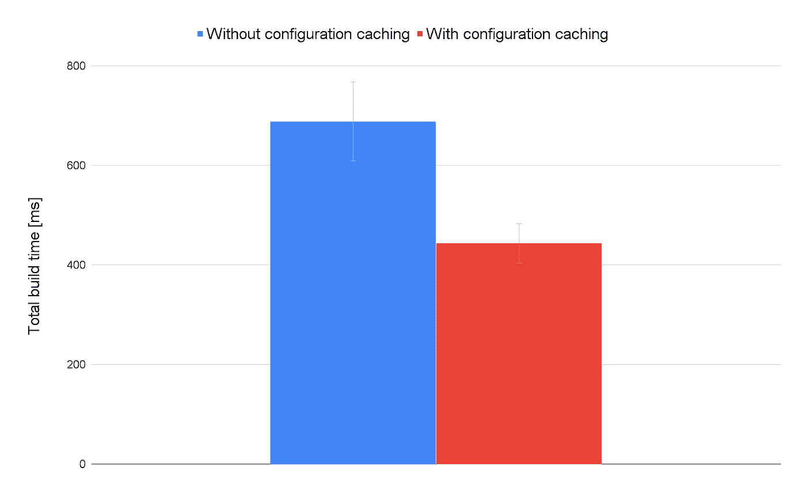

# 配置缓存深入探究

> 原文：<https://medium.com/androiddevelopers/configuration-caching-deep-dive-bcb304698070?source=collection_archive---------1----------------------->


# 什么是配置缓存？

无论是从 IDE 还是从命令行，配置缓存都是加快构建速度的基本构造块。Gradle `6.6`中的是一个高度实验性的[特性，它允许构建系统记录一次关于任务图的信息，并在后续的构建中重用它，从而避免了重新配置整个构建的需要。这也是配置阶段改进的延续，其中](https://docs.gradle.org/current/userguide/configuration_cache.html)[惰性配置](https://docs.gradle.org/current/userguide/lazy_configuration.html)被引入以避免在构建的这个阶段不必要的工作。不用说，这对于快速迭代开发尤其重要，这是 Android Studio 团队一直关注的用例。

# 性能改进

这项工作的主要目标是提高构建速度。在与 [Santa Tracker](https://github.com/gradle/santa-tracker-performance) Android 项目的基准测试中，我们测量了 Android Studio 中启用配置缓存的构建的总构建时间减少了 35%(从 688 毫秒减少到 443 毫秒)(在采用英特尔(R)至强(R) Gold 6154 CPU @ 3.00GHz 的 Linux 上测量)。这是一个图表，显示了在有和没有配置缓存的情况下，100 次构建的平均总构建时间(以毫秒为单位)。



对于某些项目，配置阶段可能需要几十秒钟，因此节省的时间可能会更多。无论您运行的是全新构建、增量构建还是最新构建，这种开销都是一样的。要测量构建的配置阶段需要多长时间，在模拟运行模式下运行任务就足够了，例如`/gradlew :app:assembleDebug --dry-run`。

除了避免运行配置阶段，配置缓存还允许来自同一个项目的任务并行运行。以前，只有利用 [Worker API](https://guides.gradle.org/using-the-worker-api/) 的任务可以并发运行，但是因为配置缓存确保任务是隔离的，并且不能访问共享的全局状态(例如`[Project](https://docs.gradle.org/current/javadoc/org/gradle/api/Project.html)`实例)，所以这种行为可以默认启用。此外，依赖项解析结果现在在运行之间被缓存，这有助于总体构建时间的改进。

# 怎么试出来？

配置缓存目前处于试验状态，我们希望您能试用并向我们提供反馈。为了在您的构建中使用它，所有项目中所有应用的插件都应该兼容。为了安全地序列化(反序列化)任务图，这是必要的。你可能需要更新一些 Gradle 插件，所以请参见[本期](https://github.com/gradle/gradle/issues/13490)获得支持的插件的完整列表。如果您正在使用的插件不在列表中，请在他们的问题跟踪器上提交一个问题，并从 Gradle [issue](https://github.com/gradle/gradle/issues/13490) 链接到它。

Android Gradle 插件的最新`4.1`版本(目前为`4.1.0-beta05`)是兼容的，但如果你想获得所有的错误修复，请尝试最新的`4.2`版本(目前为`4.2.0-alpha06`)。Gradle 版本应该是 6.6，如果你正在使用 Kotlin，请将 Kotlin Gradle 插件更新到最新的 1.4 版本(相关 [Kotlin 问题](https://youtrack.jetbrains.com/issue/KT-33908))。最后，用以下内容更新 gradle.properties

```
org.gradle.unsafe.configuration-cache=true
# Use this flag sparingly, in case some of the plugins are not fully compatible
org.gradle.unsafe.configuration-cache-problems=warn
```

要验证配置缓存是否启用，您应该在 Android Studio 的构建输出窗口中或者在第一次运行时的命令行中看到`“Calculating task graph as no configuration cache is available for tasks…”`。第二次运行应该重用配置缓存，并且它应该在输出中包含`“Reusing configuration cache.”`。

请在 Android Studio [问题跟踪器](https://developer.android.com/studio/report-bugs)或 Gradle [问题跟踪器](https://github.com/gradle/gradle/issues)上报告任何问题。

# 它是如何工作的？

为了深入配置缓存的细节，我们需要从构建的配置阶段开始。即使启用了配置缓存，第一次构建也会经历这个阶段。在构建的这一部分，所有已经包含的项目(在评估`settings.gradle`时)都是通过评估它们的构建文件来配置的。通常，所有插件将首先被应用，DSL 对象将被实例化。接下来，构建文件评估将继续，DSL 对象将被赋予您指定的值。一旦构建文件评估完成，Android Gradle 插件(和许多遵循相同模式的其他插件)将调用它们的`[Project.afterEvaluate](https://docs.gradle.org/current/javadoc/org/gradle/api/Project.html#afterEvaluate-org.gradle.api.Action-)`回调。在这个回调过程中，大部分工作由 Android Gradle 插件完成，包括创建变体和注册任务。

在 DSL 评估和任务注册之后，下一阶段构建任务图。您请求执行的任务将被完全配置，并且它们依赖的所有任务也将被配置。这一直持续到到达没有依赖性的叶任务。这个配置阶段的输出是一个任务图，Gradle 中的调度机制将使用它来运行构建操作。一旦任务图完成，配置缓存将把它存储在磁盘上(对于格雷德`6.6` 来说，这是在根项目`.gradle/configuration-cache directory`下)。能够序列化所有分级管理的类型(如`[FileCollection](https://docs.gradle.org/current/javadoc/org/gradle/api/file/FileCollection.html)`、`[Property](https://docs.gradle.org/current/javadoc/org/gradle/api/provider/Property.html)`、`[Provider](https://docs.gradle.org/current/javadoc/org/gradle/api/provider/Provider.html)`)和所有用户自定义的可序列化类型。在这个阶段结束时，每个任务的状态都将被完整地记录和持久化。

在第二次构建期间，假设 Gradle 能够重用已记录的缓存，则所请求任务的任务图将被加载，跳过 DSL 评估、任务配置等。这意味着所有任务都将被实例化，它们的属性将从缓存中加载。从这一点开始，构建几乎与非缓存的构建一样，默认情况下并行运行任务，并重用缓存中的依赖关系解析结果。

为了保证正确性，Gradle 跟踪影响缓存任务图的所有输入，包括构建文件、请求的任务以及在配置期间访问的 Gradle 和系统属性。请求运行一组不同的任务会导致不同的任务图，因此创建一个新的缓存条目是必要的。需要使状态无效的一个例子是，如果您更改构建文件或`buildSrc`，为环境变量或系统属性传递一个不同的值。为了检测这样的变化，构建系统创建了当任务图被缓存时使用的构建文件的快照。此外，它还检测在`buildSrc`中是否有任何任务不是最新的。最后，任何影响配置阶段的值都应该包装在 Gradle 管理的类型中。这允许构建系统跟踪在配置阶段使用了哪个值的变量。

# 使用兼容的 Gradle API

构建中应用的所有 Gradle 插件都需要与配置缓存兼容。因此，引入了一组新的 API。在这里，我们研究一些由配置缓存和 API 强加的约束。

## 在任务中使用项目实例

Gradle 插件中最常见的不兼容性是在任务动作中使用`[Task.getProject()](https://docs.gradle.org/current/javadoc/org/gradle/api/Task.html#getProject--)`。使用配置缓存，任务将停止访问这种共享状态，以便使它们完全隔离。这是必要的，因为对于`[Project](https://docs.gradle.org/current/javadoc/org/gradle/api/Project.html)` 实例，可以访问`[TaskContainer](https://docs.gradle.org/current/javadoc/org/gradle/api/Project.html#getTasks--)`、`[ConfigurationContainer](https://docs.gradle.org/current/javadoc/org/gradle/api/Project.html#getConfigurations--)`和其他不会在缓存运行中填充的对象，从而反映无效状态。引入了许多替代 API，专注于惰性对象创建，如`[ObjectFactory](https://docs.gradle.org/current/javadoc/org/gradle/api/model/ObjectFactory.html)`，这些 API 可用于获取项目文件系统布局信息，如`[ProjectLayout](https://docs.gradle.org/current/javadoc/org/gradle/api/file/ProjectLayout.html)`和`[ExecOperations](https://docs.gradle.org/current/javadoc/org/gradle/process/ExecOperations.html)`，以防您需要在构建中启动进程。在这里，您可以找到要迁移到的 API 的全面列表。

## 访问梯度/系统属性或环境变量

如果您想使用系统属性、梯度属性、环境变量或附加文件来指定构建逻辑输入，会发生什么情况？构建系统已经跟踪了对构建文件的更改，但是任何影响任务图的附加值都应该通过使用`[ProviderFactory](https://docs.gradle.org/current/javadoc/org/gradle/api/provider/ProviderFactory.html)` API 来获得。下面的例子显示了如何获取影响配置的`enableTask` 系统属性值，以及如何获取仅仅是任务输入的`anotherFlag`系统属性。如果前一个的值发生变化，缓存将失效，如果后一个发生变化，缓存将被重用，任务将不是最新的。

在幕后，Gradle 跟踪在配置阶段解决的值提供者，其中的每一个都被认为是构建逻辑输入。此外，除非调用`[Provider.forUseAtConfigurationTime()](https://docs.gradle.org/current/javadoc/org/gradle/api/provider/Provider.html#forUseAtConfigurationTime--)`，否则不可能解析提供者，从而很难引入意外的配置阶段输入。正如已经提到的，如果任何构建文件改变，Gradle 将使配置缓存无效，所以这与`[ProviderFactory](https://docs.gradle.org/current/javadoc/org/gradle/api/provider/ProviderFactory.html)` API 一起确保捕获影响任务图的一切。

## 任务间共享工作

如果你想在任务之间共享一些工作，比如避免多次连接到一个 web 服务器或者避免多次解析一些信息，[共享构建服务](https://docs.gradle.org/current/userguide/build_services.html)是一种配置缓存兼容的实现方式。与任务类似，构建服务也有输入，这些输入将在第一次运行时被序列化。缓存运行将简单地反序列化参数并实例化任务所需的构建服务。构建服务的额外好处是它们非常适合构建生命周期。如果构建完成后您想释放一些资源，那么在您的构建服务中实现`[AutoCloseable](https://docs.oracle.com/javase/8/docs/api/java/lang/AutoCloseable.html?is-external=true)`就足够了。添加生成侦听器与配置缓存不兼容，因为那些侦听器无法安全地序列化到磁盘。

# Android Gradle 插件迁移的教训

在努力使 Android Gradle 插件与配置缓存兼容的过程中，我们学到了一些插件和构建脚本作者可能会觉得有用的东西。

首先，如果在启用配置缓存后，您在构建输出中看到类似这样的内容，请不要气馁，因为许多问题都是重复的，可以不费吹灰之力就得到解决:

```
428 problems were found reusing the configuration cache, 4 of which seem unique.
```

我们遇到了许多问题，通过迁移到新的 API，我们很容易解决了这些问题。例如:

*旧代码*

*迁移代码*

如果您仍然在任务中使用项目实例，请检查是否有替代 API。对于它们中的大多数，应该有一个兼容的 API，并且移植应该是简单的。

另一个要点是避免一创建任务就创建不可序列化或昂贵的对象；相反，只有在任务操作需要时才创建它们。例如，在下面的示例中，我们不必强制处理程序类型可序列化，因为我们只在需要时才创建它:

*旧代码*

*迁移代码*

创作任务时，确保任务输入正确反映了任务在执行过程中需要的一切。避免访问环境对象或从`[Project](https://docs.gradle.org/current/javadoc/org/gradle/api/Project.html)`实例可以到达的任何东西。例如，如果你的插件创建了一个配置，把它作为`[FileCollection](https://docs.gradle.org/current/javadoc/org/gradle/api/file/FileCollection.html)`传递给任务。如果需要构建目录位置，请将其记录在任务属性中:

*旧代码*

*迁移代码*

Android Gradle 插件曾经依赖的一个常见模式是在第一次使用时初始化某个对象，将其存储在一个静态字段中，并在构建完成后使用构建侦听器来清理状态。如前所述，[共享构建服务](https://docs.gradle.org/current/userguide/build_services.html)应该用于这个用例。关于如何使用它，请参见下面的示例:

最后一条建议是，在实现定制的可序列化类型时，要小心序列化什么。确保不要序列化派生的属性，并使这些属性成为瞬态属性或使用函数。这是必要的，否则在缓存的运行中，你会得到一个`allLines`属性的旧值。

*旧代码*

*迁移代码*

配置缓存目前还处于试验阶段，我们希望您能尝试一下并给我们提供反馈。请在 Android Studio [问题跟踪器](https://developer.android.com/studio/report-bugs)或 Gradle [问题跟踪器](https://github.com/gradle/gradle/issues)上报告任何问题。编码快乐！