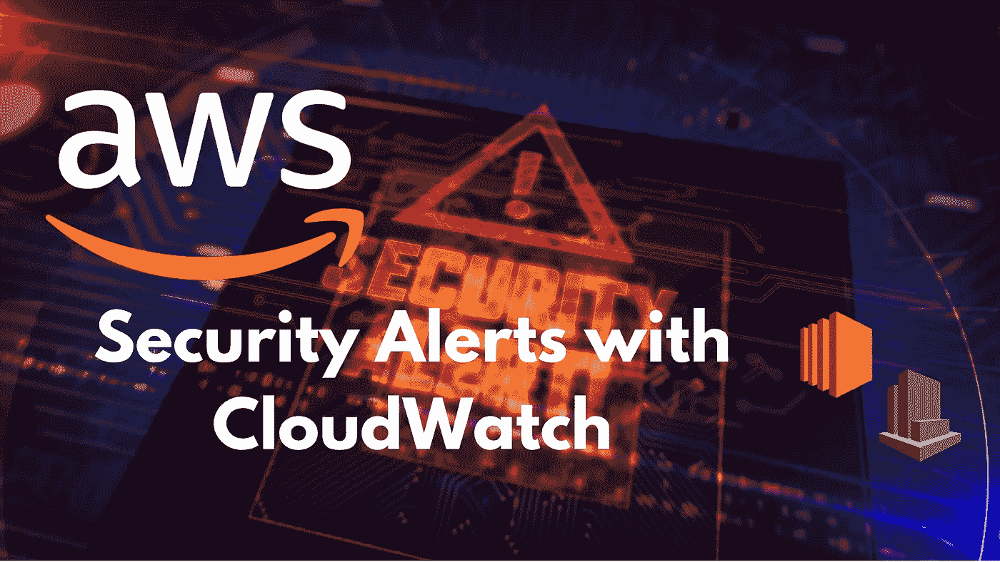
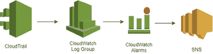

# 使用 CloudWatch 配置 AWS 安全警报

> 原文：<https://medium.com/globant/configure-aws-security-alerts-with-cloudwatch-40bf5c7f3ec4?source=collection_archive---------0----------------------->

# 介绍

亚马逊网络服务(AWS)是世界上最广泛采用的云平台，正如在任何云平台中一样，**安全性**必须是**的主要优先事项之一**。

在这篇文章中，我们将看到**如何使用 CloudTrail 和 CloudWatch** 设置安全警报，以监控您帐户中发生的事情，并在您感兴趣的事件发生时收到电子邮件通知。

我们将关注管理事件。

# 在本文中，我们将看到以下主题:

1.  工作流程图

2.设置闹钟:一步一步来

a)使用 CloudTrail 创建踪迹

b)创建社交网络主题

c)使用基于度量过滤器的 CloudWatch 创建警报

c.1)如何创建指标过滤器

c.2)如何创建警报

3.重要警报示例

4.结论

# 工作流程图

为了让这些警报工作，我们需要使用以下 3 种 AWS 服务:

*   **CloudTrail** :用于记录和保留与 AWS 基础设施上的操作相关的账户活动。
*   **CloudWatch** :允许你根据 CloudTrail 日志配置对你账户的监控。
*   **简单通知服务(SNS)** :是一个完全托管的消息服务，用于应用程序对应用程序(A2A)和应用程序对个人(A2P)的通信。

一旦一切都设置好了，CloudTrail 就会将你账户中发生的事件记录到你选择的路径中。

然后，一个 CloudWatch 日志组将被分配给该 trail(这就是 CludWatch 从 CloudTrail 获取信息的方式)。此类日志组将包含 CloudWatch 警报使用的自定义指标过滤器。

每当检测到度量过滤器中配置的事件之一时，它将发出相应的警报，将其状态修改为“In Alarm”状态。该警报将触发对相应 SNS 主题的 SNS 通知。

# 设置闹钟:一步一步来

# 使用 CloudTrail 创建踪迹

跟踪允许您归档、分析和响应 AWS 资源中的变化。

您可以从 AWS 管理控制台的 **CloudTrail 服务**中创建一条踪迹:

1.  在 CloudTrail 服务主页上，在 Trails 部分选择 **Create trail** 。
2.  在“创建踪迹”页面上，为踪迹名称键入踪迹的名称。
3.  对于存储位置，选择**创建新的 S3 桶**创建一个桶。当您创建一个 bucket 时，CloudTrail 会创建并应用所需的 bucket 策略。
4.  对于日志文件 SSE-KMS 加密，如果要使用 SSE-KMS 而不是 SSE-S3 加密日志文件，请选择“启用”。默认为启用。如果您启用了 SSE-KMS 加密，请选择新的或现有的 AWS KMS 客户主密钥。在 AWS KMS 别名中，以别名/MyAliasName 格式指定别名。关于这种加密的更多信息[点击这里](https://docs.aws.amazon.com/AmazonS3/latest/userguide/UsingServerSideEncryption.html)。
5.  在附加设置中，您可以执行以下操作:

*   启用日志文件验证，将日志摘要传送到您的 S3 时段。
*   您可以使用摘要文件来验证您的日志文件在 CloudTrail 交付之后没有发生变化。

6.通过选择在 CloudWatch Logs 中启用的**，配置 CloudTrail 将日志文件发送到 CloudWatch Logs:**

*   **选择 New 创建新的**日志组**，或选择 Existing 使用现有的日志组。**
*   **选择“新建”,为将日志发送到 CloudWatch 日志的权限创建新的 IAM 角色。选择现有，从下拉列表中选择现有的 IAM 角色。当您展开策略文档时，将显示新角色或现有角色的策略声明。**

**7.将标记部分留空，然后单击下一步。**

**8.在选择日志事件页面上，选择**管理事件**，然后选择**读写**事件。单击下一步。**

**9.在**审查和创建**页面中，一旦您验证了所有内容，点击**创建踪迹**。**

**此时，您将拥有一个与 CloudWatch 日志组相关的活动**踪迹。****

****请注意，AWS 自由层中仅包含一个管理事件线索。如果您想使用多条路径，将会产生额外费用。***

# **创建 SNS 主题以发送通知**

**亚马逊 CloudWatch 使用亚马逊 SNS 发送邮件。首先，创建并订阅一个 SNS 主题。当您创建 CloudWatch 警报时，您可以添加此 SNS 主题，以便在警报改变状态时发送电子邮件通知。**

****创建社交网络话题**:**

1.  **在[https://console.aws.amazon.com/sns/v3/home](https://console.aws.amazon.com/sns/v3/home)打开亚马逊 **SNS 控制台****
2.  **在 Amazon SNS 仪表板上的常用操作下，选择**创建主题**。**
3.  **在**创建新主题**对话框中，为**主题名称**输入主题名称(例如，安全-警报)。**
4.  **选择**创建主题**。**
5.  **为下一个任务复制主题 ARN(例如，arn:AWS:SNS:us-east-1:111122223333:Security-Alerts)。**

****订阅社交网络话题****

1.  **在亚马逊 SNS 控制台的导航窗格中，选择**订阅**，**创建订阅**。**
2.  **在“创建订阅”对话框中，为主题“ARN”粘贴您在上一任务中创建的主题“ARN”。**
3.  **对于协议，选择电子邮件。**
4.  **对于端点，输入可用于接收通知的电子邮件地址，然后选择创建订阅。**
5.  **从您的电子邮件应用程序中，打开来自 AWS 通知的邮件并确认您的订阅。您的网络浏览器显示来自 Amazon SNS 的确认响应。**

# **使用基于度量过滤器的 CloudWatch 创建警报**

**您可以使用度量过滤器来搜索和匹配事件日志中的术语、短语或值。当指标过滤器找到其中一个术语、短语或值时，您可以增加 CloudWatch 指标的值。**

**其工作原理如下:**

*   **在与您的踪迹相关的日志组中配置一个度量过滤器。**
*   **如果发生了任何选定的事件，这个**度量过滤器将每 5 分钟**控制一次。如果有，**度量将增加其值**。**
*   **最后，**基于度量过滤器**创建警报。每当度量过滤器增加其值时，警报将改变其状态，这将触发通知。**

# **如何创建度量过滤器**

**要为日志组创建度量过滤器，请执行以下步骤:**

1.  **打开云手表控制台。**
2.  **在导航窗格中，选择**日志组**。**
3.  **选择日志组的名称。**
4.  **选择操作，**创建度量过滤器**。**
5.  **对于**过滤模式**，输入要使用的过滤模式。您可以在这里指定要监控的事件。在本文的最后，我将为您提供一些过滤模式，以便您可以设置一些关键的警报。**
6.  **(可选)要测试您的过滤器模式，在**测试模式**下，输入一个或多个用于测试模式的记录事件。每个事件必须在一行内，因为换行符用于分隔**日志事件消息**框中的事件。**
7.  **选择下一个的**，然后输入过滤器的名称。****
8.  **在**指标详细信息**下，为**指标名称空间**输入将发布指标的 CloudWatch 名称空间的名称。如果该名称空间不存在，确保选择了**创建新的**。**
9.  **对于**指标名称**，输入新指标的名称。**
10.  **对于**度量值**，输入 1。对于包含其中一个关键字的每个日志事件，度量值都增加 1。**
11.  **选择**创建度量过滤器**。**

# **如何创建警报**

**创建度量过滤器后，将打开您的踪迹的日志组的详细信息页面。按照以下步骤创建警报。**

1.  **在**度量过滤器**选项卡上，找到您创建的度量过滤器。填写度量过滤器的复选框。在度量过滤器栏中，选择**创建警报**。**
2.  **在“创建警报”页面的“指定度量和条件”中，输入以下内容:**

*   **对于图形，根据您在创建提醒时所做的其他设置，线条被设置为 1。**
*   **对于**度量名称**，保留当前度量名称。**
*   **对于统计，保留默认值 Sum。**
*   **对于 Period，保留默认值 5 分钟。**
*   **在条件中，为阈值类型选择静态。**
*   **对于无论何时度量名称为，请选择大于/等于。**
*   **输入 1 作为“阈值”。**
*   **在附加配置中，在缺失数据处理中，选择**将缺失数据视为良好**。**
*   **选择下一步。**

**3.在**配置动作**页面上，选择**报警**，表示当**度量过滤器处于报警状态**时采取动作。**

*   **要选择 SNS 主题，选择**选择现有 SNS 主题****
*   **选择您为此创建的主题**
*   **跳过其他动作类型，选择**下一个**。**

**4.在“添加名称和描述”页面上，输入警报的友好名称和描述。选择下一步。**

**5.在“预览和创建”页面上，检查您的选择。选择编辑进行更改，或选择**创建报警**创建报警。**

**完成所有这些操作后，将设置您的警报，并且每当检测到您选择要监控的事件之一时，您都会收到一封电子邮件通知。**

# **重要警报示例**

**作为结束语，我将与您分享一些**过滤模式来创建一些重要的警报**:**

## **Root 帐户登录尝试**

**Root 帐户是一个高特权帐户，在第一次帐户配置后不应该使用它。这就是为什么知道有人试图使用它是很重要的。每当有人试图使用 root 帐户登录时，这个警报都会让您知道。**

****报警**:AWS _ Console _ Root _ log in _ Attempts**

****度量过滤器**:awsconsolerootloginatempts**

****过滤模式**:{ $ . user identity . type = " Root "&&$ . user identity . invoked by 不存在& & $。eventType！= "AwsServiceEvent" }**

****描述**:如果出现 AWS 控制台 root 登录尝试，则发出警报**

## **负载平衡器警报**

**负载平衡器可以公开您的服务和基础设施，因此知道何时创建或删除负载平衡器非常重要。这个闹钟会让你了解最新的信息。**

****报警**:创建或删除负载平衡器 _ 报警**

****度量过滤器**:CreateAndDeleteLoadBalancer**

****过滤模式** : { ($。event name = CreateLoadBalancer)| |($。eventName = DeleteLoadBalancer) }**

****描述**:创建或删除负载均衡器时发出警报。**

## **IAM 策略更改**

**通过修改 IAM 策略，用户可以获得更多的权限，这将是攻击者获得帐户访问权限后首先尝试的事情之一。当 IAM 策略发生变化时，此警报会让您知道。**

****告警** : IAM_Policy_Changes**

****度量过滤器** : IAMPolicyChanges**

****过滤模式** : {($。event name = deletegroupolicy)| |($。event name = DeleteRolePolicy)| |($。event name = delete user policy)| |($。eventName=PutGroupPolicy)||($。eventName=PutRolePolicy)||($。eventName=PutUserPolicy)||($。eventName=CreatePolicy)||($。eventName=DeletePolicy)||($。event name = CreatePolicyVersion)| |($。event name = DeletePolicyVersion)| |($。event name = AttachRolePolicy)| |($。event name = DetachRolePolicy)| |($。event name = attach user policy)| |($。event name = DetachUserPolicy)| |($。event name = attachgroupolicy)| |($。event name = detachgroupolicy)}**

****描述**:如果 IAM 策略发生变化，则发出警报**

## **S3 水桶政策的变化**

**为了保护您的 S3 存储桶免受未经授权的访问，如果允许访问存储桶的 S3 策略发生变化，将会发出此警报。**

****报警**:S3 _ 桶 _ 政策-变化**

****度量过滤器** : S3BucketPolicyChanges**

****过滤模式** : { ($。&事件来源= s3.amazonaws.com)&(($。eventName = PutBucketAcl) || ($。eventName = PutBucketPolicy) || ($。eventName = PutBucketCors) || ($。event name = PutBucketLifecycle)| |($。event name = putbucket replication)| |($。event name = DeleteBucketPolicy)| |($。event name = DeleteBucketCors)| |($。event name = DeleteBucketLifecycle)| |($。event name = deletebucket replication))}**

****描述**:如果 S3 存储桶策略发生变化，则发出警报**

## **VPC 配置更改**

**VPC 允许您控制进出 AWS 资源的网络访问，因此您需要知道它们的配置是否发生了任何意外的变化。**

****报警**:VPC _ 配置-变更**

****度量过滤器** : VPCConfigurationChanges**

****过滤模式** : { ($。eventName = CreateVpc) || ($。eventName = DeleteVpc) || ($。event name = modifyvcattribute)| |($。event name = AcceptVpcPeeringConnection)| |($。event name = CreateVpcPeeringConnection)| |($。event name = DeleteVpcPeeringConnection)| |($。event name = RejectVpcPeeringConnection)| |($。event name = attachclassilinkvpc)| |($。event name = detachclassicklinkvpc)| |($。event name = disablevpcclasslink)| |($。event name = enablevpcclasslink)}**

****描述**:如果 VPC 配置发生变化，则发出警报**

# **结论**

**如您所见，您可以只使用 AWS 服务来监控您的 AWS 帐户，无需额外费用。您可以选择想要了解的事件，并在每次事件发生时收到电子邮件通知。这意味着如果你的账户发生问题，你可以迅速采取行动。**

# ****参考文献****

*   **[全球网络安全工作室](https://www.globant.com/studio/cybersecurity)**
*   **[创建警报的 AWS 示例](https://docs.aws.amazon.com/awscloudtrail/latest/userguide/cloudwatch-alarms-for-cloudtrail.html#cloudwatch-alarms-for-cloudtrail-iam-policy-changes)**