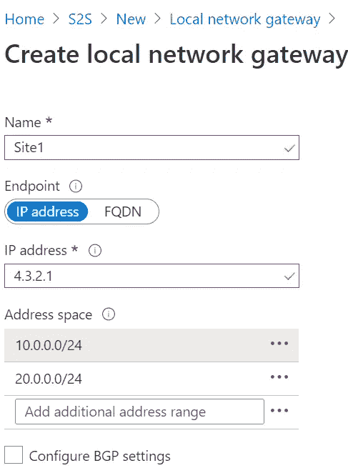

# 将 Azure 站点到站点 VPN 配置到本地网络

> 原文：<https://medium.com/globant/configure-azure-site-site-vpn-to-on-premise-network-93f7a04eee9b?source=collection_archive---------0----------------------->

**简介**

首先，我们先来了解一下，什么是 VPN，为什么会产生 VPN？

VPN —创建虚拟专用网络是为了给连接提供安全性。VPN 是在 90 年代中期互联网兴起时出现的。以反病毒或反恶意软件程序的形式存在用于最终用户系统的安全性，但是这些程序仅仅意味着保护安装它们的单个计算机。随着 90 年代中期互联网连接的兴起，保护整个连接的需求开始显现，这通过 VPN 的创建得以实现。

VPN 是互联网上的专用连接。它由几种不同的协议组成，所有这些协议的共同目的都是通过公共连接远程连接到私有网络。一开始，它只在商业中使用。但是现在 VPN 被用来保护普通人使用的互联网连接，防止恶意软件和黑客攻击，确保数字隐私等。

现在我们已经知道了什么是 VPN，让我们试着了解什么是站点到站点的连接。站点到站点 VPN 连接是 VPN 连接的一种，还有其他类型的 VPN 连接，如“点到站点”。在这篇博客中，我将详细阐述站点对站点。站点到站点 VPN 连接意味着至少有两个站点，每个站点都有一堆计算机，这些计算机希望在不使用互联网的情况下共享资源。这两个站点可以是内部站点，或者其中一个可以是云站点，另一个可以是内部站点，或者两个都可以是云站点。这里我们将讨论一个典型的场景，其中一个站点在本地，另一个在云上(Azure cloud)。

站点到站点 VPN 网关连接用于通过 IPsec/IKE VPN 隧道将您的内部网络连接到 Azure 虚拟网络。

image courtesy: Microsoft docs

因此，这里我们将讨论在 azure 网络中的计算机和本地网络中的计算机之间创建连接的步骤。

**先决条件**

我们需要三样东西作为先决条件

1.  需要有效的 *Azure 订阅。*
2.  需要在内部部署一个 *VPN 设备*，并具备配置 VPN 设备的知识。
3.  VPN 设备应该有一个静态的外部公共 IP 地址。

**创建虚拟网络**

1.  为此，你必须在搜索框中键入虚拟网络，然后按回车键。虚拟网络将出现在屏幕上。

2.点击**虚拟网络**将打开如下窗口，您必须点击**创建**按钮。

3.单击创建按钮后，将打开创建虚拟网络屏幕。您将看到如下所示的屏幕。您必须填写屏幕上要求的详细信息，如选择要创建虚拟网络的订阅。您可以从现有的资源组中选择或创建一个新的资源组。给你的虚拟网络取一个合适的名字，然后你选择地区。

现在，在“IP 地址”选项卡中，您将看到“IPv4 地址空间”填充了默认值。你可以更改这个地址

在“安全”选项卡中，保留所有默认设置，然后单击**审查+创建**。

验证设置后，单击创建按钮，这将创建虚拟网络。

**创建虚拟网关:**

既然我们已经创建了虚拟网络，现在我们必须创建虚拟网络网关。

> 什么是网关，它有什么作用？:网关是一种网络硬件，允许数据从一个离散的网络传递到另一个网络。

现在，要创建虚拟网络网关，正确的方法是首先转到您创建虚拟网络的资源组。这里你看到+添加按钮，点击它。

一旦你点击了+添加按钮，你会看到一个如下的屏幕，在这里你必须输入“虚拟网络网关”并按下回车键。

这样做会将您带到如下屏幕。

单击“创建”按钮将带您进入一个表单，您可以在其中填写有关虚拟网络网关配置的详细信息。

提供一个适当的名称，选择与您为创建虚拟网络选择的区域相同的区域，选择网关类型作为 VPN，选择 VPN 类型作为基于路由，选择 SKU 作为网关 SKU，选择第一代作为第一代 1，选择您最近在上面创建的虚拟网络，网关子网地址范围保持它已经出现，公共 IP 地址选择创建新的，给公共 IP 地址名称一个适当的名称，其余字段保持它如上图所示。

单击“查看+创建”按钮将尝试验证配置，如果验证成功，将出现“创建”按钮。点击这个创建按钮将创建 VPN 网关。

**创建本地网络网关**

本地网络网关是一个特定的对象，代表您的本地位置(站点),用于路由目的。要再次创建本地网络网关，请转到您已经创建了其他资源的资源组，然后单击+ Add 按钮。

Azure Marketplace 窗口将会打开，您必须填写“本地网络网关”详细信息。

您将进入一个屏幕，在那里您会找到一个创建按钮来创建本地网络网关。

单击“创建”按钮会将您带到一个屏幕，在此您必须填写有关本地网络网关配置的详细信息。

在“名称”字段中填入适当的名称，在端点中选择 IP 地址。如果您的 VPN 设备有一个静态 IP。如果您的 VPN 设备有 ISP 提供的动态 IP，请选择 FQDN。对于地址空间字段添加一些 IP 范围，您可以添加多个 IP 地址范围，但请记住，这些 IP 范围不得与您要连接的另一个网络的范围重叠。保持配置 BGP 设置未选中，仅在配置 BGP 时选中此项。对于位置，选择任意位置，它可能与用于创建虚拟网络的位置不同。

**配置您的 VPN 设备**

要配置您的 VPN 设备，您必须仔细阅读您购买的设备的文档。这里是下载流行设备配置脚本的链接。

**创建一个 VPN 连接**

现在，我们必须在我们已经创建的虚拟网络网关和您将根据设备文档以及上一段中提到的帮助创建的本地 VPN 设备之间创建一个“站点到站点 VPN”连接。

为了创建 VPN 连接，我们必须转到您的虚拟网络。您可以通过搜索虚拟网络的名称来浏览此处，或者转到创建虚拟网络时使用的资源组。我的名字是 VNet1。一旦你在那里，屏幕将看起来类似于下图。在这里，您必须单击下图中突出显示的已连接设备。您可以在右侧面板中看到您创建的虚拟网络网关。单击虚拟网络网关(这里是 VNet1GW)。

点击虚拟网关将打开如下屏幕。点击连接将出现一个屏幕，其中有+添加按钮。

点击添加按钮将带您到这里

在此表单中，对于“名称”字段，您填写一个适当的名称，连接类型选择站点到站点(IPSec)，对于虚拟网络网关字段，保留它自己出现的值。这是一个固定值，在我们从此处创建连接时不会改变。对于本地网络，网关选择我们之前为此演示创建的本地网络网关，因此我将选择 Site1。对于共享密钥，该值必须与您为本地本地 VPN 设备使用的值相匹配。对于使用 Azure 私有 IP 地址，请保持未选中状态。对于启用 BGP，不要选中它。为 IKE 协议字段选择 IKEv2 值。订阅、资源组和位置的其余值是固定的。

单击确定，这将创建一个连接。

**验证 VPN 连接**

一旦按照上述步骤创建了连接，现在就该验证连接了。所以去虚拟网络网关(这里就是 VNet1GW)。在左侧，您会看到一个名为“连接”的选项。点击它，您将能够看到您在上面创建的连接(VNet1toSite1)。单击连接的名称，然后单击要素

这里的状态必须是 Connected，否则，在创建连接时会出现一些问题。

**如何连接到虚拟网络上的虚拟机**

现在，最后一步是验证我们是否能够将内部部署的计算机连接到虚拟网络中的计算机。因此，在虚拟网络中配置一台计算机。部署虚拟机后，获取虚拟机的 IP。现在，从本地网络上的一台计算机对虚拟网络上的该 IP 进行 RDP。如果您在执行上述所有步骤时没有问题，您将能够通过 RDP 将本地计算机连接到虚拟网络上的计算机。

**我们可以将 Azure 功能连接到虚拟网络**

是的。我们可以在 Azure 上集成 Azure 功能和虚拟网络。但是它的用例是什么呢？为什么我们甚至需要将 Azure 功能集成到虚拟网络中。让我们试着去理解它。假设 azure 功能需要虚拟网络中的一些资源，例如，虚拟网络中有一台计算机或一组计算机，Azure 功能想要访问这些计算机。或者说，在虚拟网络上的这些计算机上有不同类型的文件。在这种情况下，Azure 功能可能需要建立与 Azure 虚拟网络的连接，这些计算机将在该网络上访问它们。

**我们可以用 Azure 虚拟网络连接我们在 Azure 上的应用。**

将 Azure 中的应用程序连接到 Azure 中的虚拟网络的好处是，你的应用程序将能够访问虚拟网络中可用的资源。想象一下这样一个场景，应用程序面向互联网，但它希望记录一些重要的内容，这些内容将由所有能够访问同一虚拟网络的员工使用。另一个例子是，假设虚拟网络中有一台计算机，员工正在上传一些文档，这些文档是在您的应用程序服务中运行的应用程序所需要的。因此，对于这类场景，你的应用服务和你的 Azure 虚拟网络之间必须有一个连接。

我尝试讨论虚拟网络使用情形的最后两个主题可以是一个独立的详细主题。细节可能包括如何在这些服务和 Azure 虚拟网络之间建立连接。但是这些细节超出了本博客的范围。如果你需要了解更多，我鼓励你找到如何在这些服务和互联网上的 Azure 虚拟网络之间建立连接。

**结论**

我们已经讨论了如何创建虚拟网络、VPN 网关、本地网络网关、如何参考设备文档来配置 VPN 设备、如何创建 VPN 连接并对其进行验证，以及如何将本地计算机连接到虚拟网络上的计算机。

这些是创建站点到站点虚拟网络以及从内部建立连接的步骤。