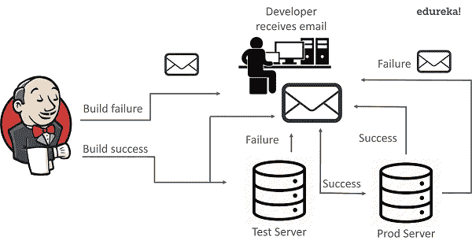
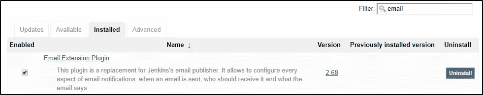
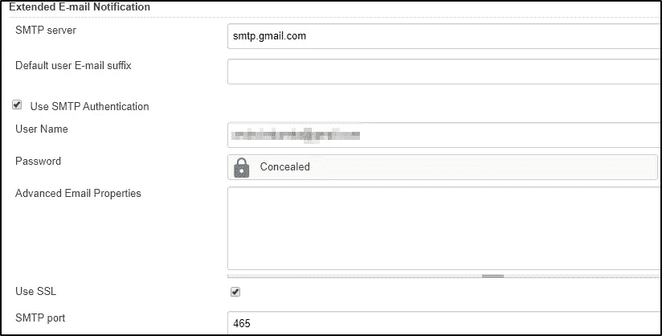
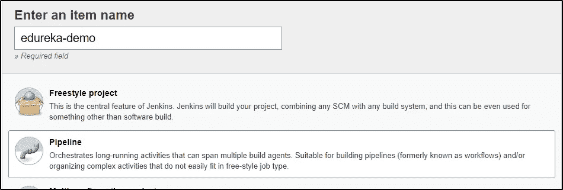
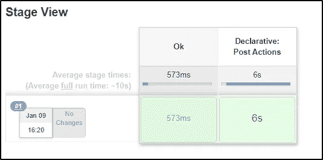
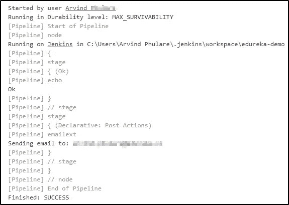
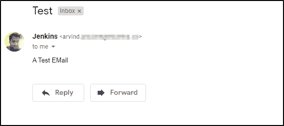
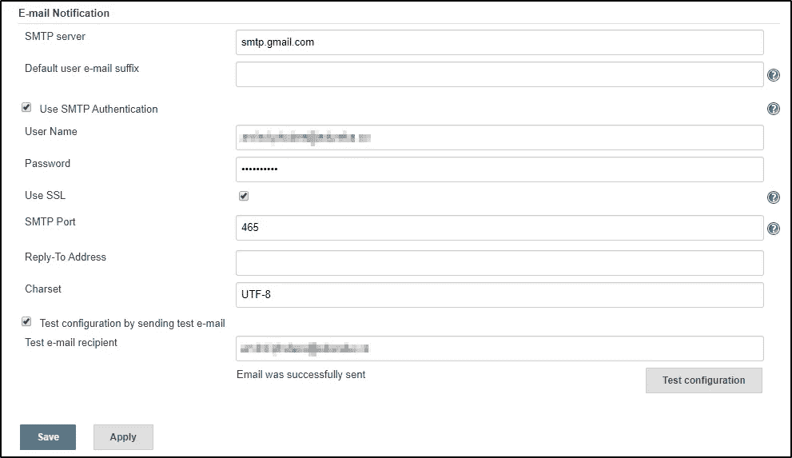
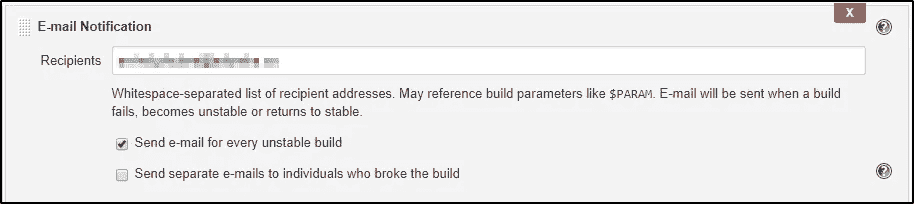
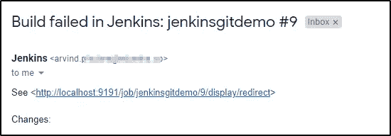

# 在 Jenkins 中配置电子邮件通知的 6 个简单步骤

> 原文：<https://medium.com/edureka/configure-email-notification-in-jenkins-c31d3a9c9f0a?source=collection_archive---------2----------------------->


Jenkins 无疑是 DevOps 中最受欢迎的工具之一。它可以以更快的速度自动构建和测试代码，因此软件公司可以加快他们的开发过程。Jenkins 为您提供了电子邮件通知服务，您可以通过它向团队报告构建状态和测试结果。在这篇关于 Jenkins 中的电子邮件通知的文章中，我们将要涉及的要点如下:

*   为什么我们在 Jenkins 中需要电子邮件通知？
*   **摆在詹金斯面前的问题**
*   **与詹金斯一起解决**
*   **如何在 Jenkins 中使用电子邮件服务？**

在我开始这篇关于 Jenkins 中的电子邮件通知的文章之前，这里有几个涵盖 Jenkins 基本知识的博客:

1.  **詹金斯是什么？**
2.  **使用 Jenkins 进行连续交付**

让我们从第一个话题开始。

# 为什么我们在 Jenkins 中需要电子邮件通知？

## 问题陈述:

*   假设应用程序的发布安排在午夜。现在，测试服务器或生产服务器上的应用程序出现了问题。此外，可能会有这样的情况，应用程序发布后几个小时就关闭了。如果应用程序(例如网飞)宕机几分钟，就可能导致数百万美元的损失。同样由于这样的错误，项目的最后期限可能会延长。

# 解决办法



*   这个问题被一个叫做 [Jenkins](https://jenkins.io/) 的自动化工具解决了。Jenkins 提供电子邮件通知服务来处理这种情况。
*   如果构建不成功，那么开发团队会被告知构建的状态。这可以在 Jenkins 的电子邮件插件的帮助下完成。**插件**是增强 **Jenkins** 环境功能以满足组织或用户特定需求的主要手段。
*   使用电子邮件插件，您可以配置在构建失败时应该通知的相关人员的电子邮件详细信息。
*   一旦开发人员得到错误通知，他就修复错误并再次将代码提交给 GitHub。在这之后，Jenkins 再次从 GitHub 中取出代码并准备一个新的构建。
*   类似地，Jenkins 可以通过电子邮件通知相关团队来解决发布后应用程序宕机的问题。

现在让我们看看如何在 Jenkins 中发送电子邮件通知。

# 如何在 Jenkins 中发送邮件通知？

在 Jenkins 中配置电子邮件通知基本上有两种方式。

1.  **使用电子邮件扩展插件** —这个[插件](https://plugins.jenkins.io/)可以让你配置电子邮件通知的方方面面。您可以自定义诸如何时发送电子邮件、由谁接收以及电子邮件内容等内容。
2.  **使用默认电子邮件通知程序**——这是 Jenkins 默认提供的。它有一个由内部版本号和状态组成的默认消息。

# 电子邮件扩展插件

## 第一步:登录詹金斯主页

使用 URL localhost:8080 转到 Jenkins 主页。默认端口号是 8080。我的情况是 9191。使用您的用户名和密码登录。

## 步骤 2:安装电子邮件扩展插件

然后在 Jenkins 主页上点击**管理 Jenkins- >管理插件**。在可用选项卡中搜索电子邮件扩展插件。如果在那里找到它，就安装它。如果没有找到，请在“已安装”选项卡中查找。



## 步骤 3:配置系统

现在转到**管理詹金斯- >配置系统**。在这里向下滚动到电子邮件通知部分。如果您使用的是 Gmail，请为 SMTP 服务器键入 smtp.gmail.com。点击高级并选择使用 SMTP 认证。输入您的 Gmail 用户名和密码。选择使用 **SSL** 选项，并输入端口号 **465** 。单击应用，然后单击保存。



## 步骤 4:创建 Jenkins 管道作业

现在转到 Jenkins 主页，创建一个新工作。使用您想要的任何名称命名作业，然后选择“管道”。点击确定。



现在，在管道部分键入以下代码。

```
pipeline {
agent anystages {
stage('Ok') {
steps {
echo "Ok"
}
}
}
post {
always {
emailext body: 'A Test EMail', recipientProviders: [[$class: 'DevelopersRecipientProvider'], [$class: 'RequesterRecipientProvider']], subject: 'Test'
}
}
}
```

任何詹金斯特工都有这条管道。它有一个取样的阶段。在 post 步骤中，您可以运行任何想要的脚本。我们有邮件发送者在里面。保存它，并通过单击“作业”菜单上的“立即构建”来运行。该构建将出现在舞台视图中。



## 步骤 5:查看控制台输出

单击内部版本号“#1”，然后单击“内部版本”菜单上的“控制台输出”。输出将是这样的:



## 第六步:检查邮件。

之后，进入你的 Gmail 收件箱，应该能看到这样一封邮件。



# 默认电子邮件通知程序

## 第一步:登录詹金斯主页

去詹金斯主页。

## 步骤 2:配置系统

点击**管理詹金斯- >配置系统**。在这里向下滚动到电子邮件通知部分。现在输入如下图所示的详细信息



一旦设置好邮件配置，您可以通过发送测试邮件检查**测试配置来测试它是否工作正常。**

## 步骤 3:向项目中添加后期生成操作

要允许您的项目发送电子邮件，您需要添加 **Post Build Action** 并从下拉列表中选择 **Email Notification** 。这将为您提供下面的界面，在这里您可以添加一个电子邮件地址的列表，电子邮件需要发送到。



## 步骤 4:构建项目并检查您的电子邮件

现在尝试运行您添加了电子邮件的项目。如果构建失败，您将收到一封关于构建失败的电子邮件。



这就是在 Jenkins 中设置电子邮件通知的方式。这是我在这篇文章中的观点。我希望你喜欢它，并理解我在这里解释的一切。

如果你想查看更多关于人工智能、Python、道德黑客等市场最热门技术的文章，你可以参考 Edureka 的官方网站。

请留意本系列中解释 DevOps 各个方面的其他文章。

> *1。* [*DevOps 教程*](/edureka/devops-tutorial-89363dac9d3f)
> 
> *2。* [*Git 教程*](/edureka/git-tutorial-da652b566ece)
> 
> *3。* [*詹金斯教程*](/edureka/jenkins-tutorial-68110a2b4bb3)
> 
> *4。* [*码头工人教程*](/edureka/docker-tutorial-9a6a6140d917)
> 
> *5。* [*Ansible 教程*](/edureka/ansible-tutorial-9a6794a49b23)
> 
> *6。* [*木偶教程*](/edureka/puppet-tutorial-848861e45cc2)
> 
> *7。* [*厨师教程*](/edureka/chef-tutorial-8205607f4564)
> 
> *8。* [*Nagios 教程*](/edureka/nagios-tutorial-e63e2a744cc8)
> 
> *9。* [*如何编排 DevOps 工具？*](/edureka/devops-tools-56e7d68994af)
> 
> *10。* [*连续交货*](/edureka/continuous-delivery-5ca2358aedd8)
> 
> *11。* [*持续集成*](/edureka/continuous-integration-615325cfeeac)
> 
> *12。* [*连续部署*](/edureka/continuous-deployment-b03df3e3c44c)
> 
> *13。* [*持续交付 vs 持续部署*](/edureka/continuous-delivery-vs-continuous-deployment-5375642865a)
> 
> *14。* [*CI CD 管道*](/edureka/ci-cd-pipeline-5508227b19ca)
> 
> 15。 [*码头工人撰写*](/edureka/docker-compose-containerizing-mean-stack-application-e4516a3c8c89)
> 
> 16。 [*码头工人群*](/edureka/docker-swarm-cluster-of-docker-engines-for-high-availability-40d9662a8df1)
> 
> *17。* [*Docker 联网*](/edureka/docker-networking-1a7d65e89013)
> 
> *18。* [*天穹*](/edureka/ansible-vault-secure-secrets-f5c322779c77)
> 
> 19。 [*可变角色*](/edureka/ansible-roles-78d48578aca1)
> 
> 20。 [*适用于 AWS*](/edureka/ansible-for-aws-provision-ec2-instance-9308b49daed9)
> 
> *21。* [*詹金斯管道*](/edureka/jenkins-pipeline-tutorial-continuous-delivery-75a86936bc92)
> 
> *22。* [*顶级 Docker 命令*](/edureka/docker-commands-29f7551498a8)
> 
> *23。*[*Git vs GitHub*](/edureka/git-vs-github-67c511d09d3e)
> 
> *24。* [*顶级 Git 命令*](/edureka/git-commands-with-example-7c5a555d14c)
> 
> *25。* [*DevOps 面试问题*](/edureka/devops-interview-questions-e91a4e6ecbf3)
> 
> *26。* [*谁是 DevOps 工程师？*](/edureka/devops-engineer-role-481567822e06)
> 
> *27。* [*DevOps 生命周期*](/edureka/devops-lifecycle-8412a213a654)
> 
> *28。*[*Git Reflog*](/edureka/git-reflog-dc05158c1217)
> 
> *29。*[](/edureka/ansible-provisioning-setting-up-lamp-stack-d8549b38dc59)
> 
> **三十。* [*组织正在寻找的顶尖 DevOps 技能*](/edureka/devops-skills-f6a7614ac1c7)*
> 
> **30。* [*瀑布 vs 敏捷*](/edureka/waterfall-vs-agile-991b14509fe8)*
> 
> **31。* [*詹金斯小抄*](/edureka/jenkins-cheat-sheet-e0f7e25558a3)*
> 
> **32。*[](/edureka/ansible-cheat-sheet-guide-5fe615ad65c0)*
> 
> ***33。* [*可答采访问答*](/edureka/ansible-interview-questions-adf8750be54)**
> 
> ***34。* [*50 码头工人面试问题*](/edureka/docker-interview-questions-da0010bedb75)**
> 
> ***35。* [*敏捷方法论*](/edureka/what-is-agile-methodology-fe8ad9f0da2f)**
> 
> ***36。* [*詹金斯访谈提问*](/edureka/jenkins-interview-questions-7bb54bc8c679)**
> 
> ***37。* [*Git 面试试题*](/edureka/git-interview-questions-32fb0f618565)**
> 
> ***38。* [*码头工人建筑*](/edureka/docker-architecture-be79628e076e)**
> 
> ***39。* [*在 DevOps 中使用的 Linux 命令*](/edureka/linux-commands-in-devops-73b5a2bcd007)**
> 
> ***40。* [*詹金斯 vs 竹子*](/edureka/jenkins-vs-bamboo-782c6b775cd5)**
> 
> ***41。* [*Nagios 教程*](/edureka/nagios-tutorial-e63e2a744cc8)**
> 
> ***42。* [*Nagios 面试问题*](/edureka/nagios-interview-questions-f3719926cc67)**
> 
> ***43。* [*开发实时场景*](/edureka/jenkins-x-d87c0271af57)**
> 
> ***44。* [*詹金斯与詹金斯的区别 X*](/edureka/jenkins-vs-bamboo-782c6b775cd5)**
> 
> ***45。*[*Windows Docker*](/edureka/docker-for-windows-ed971362c1ec)**
> 
> ***46。*[*Git vs Git hub*](http://git%20vs%20github/)**

***原为 2020 年 1 月 10 日在*[*https://www.edureka.co*](https://www.edureka.co/blog/email-notification-in-jenkins/)*发表。***