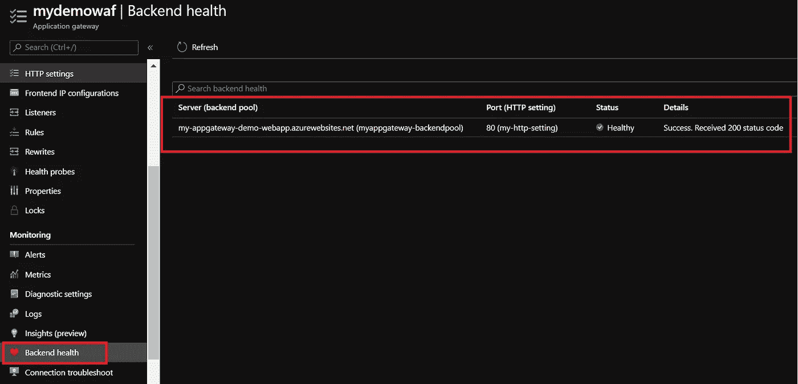
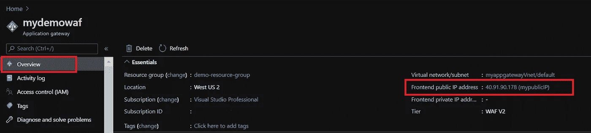

# 使用 Azure 应用程序网关配置 Web 应用程序防火墙(WAF)

> 原文：<https://medium.com/globant/configure-web-application-firewall-waf-with-azure-application-gateway-68961542f4e2?source=collection_archive---------0----------------------->

**WAF 的需求是什么？**

为什么我们需要保护 web 应用程序免受攻击，为什么 web 应用程序是这么多攻击的目标？

第一个原因是，我们正在使用已知的技术开发 web 应用程序。许多已知的 web 开发平台(如 PHP 和 ASP)都有已知的安全缺陷，攻击者利用这些弱点来利用应用程序。这些应用程序在后端使用的数据库引擎也是如此。

第二个原因是攻击的范围很广。web 应用程序的主要用户通过互联网进行连接。任何人都可能试图从互联网上使用或攻击您的应用程序。

几乎所有这些攻击都可以归为几类，SQL 注入攻击、跨站脚本、远程文件包含、丢失 HTTP 头、僵尸程序、爬虫和扫描程序在互联网上冲浪，试图找到脆弱的 web 应用程序、破坏 web 应用程序的过大请求等等。

所有这些攻击都是可以预防的。一种方法是在代码级别进行预防，这很有挑战性，这是开发人员的责任。此外，它需要在应用程序的多个层进行大量的维护、修补和监控。另一种简单得多的方法是购买 web 应用程序防火墙(WAFs ),并将其部署在 web 服务器的前面，以阻止常见的攻击。这为您的 web 应用程序提供了集中保护，使其免受常见利用和漏洞的攻击。

> **web 应用防火墙** (WAF)是一种特定形式的网络安全系统，它根据配置的策略过滤、监控和阻止进出 web 服务的 HTTP 流量，通常有预定义的规则集可供选择。

**什么是 Azure Web 应用防火墙？**

微软 Azure 也有一个 WAF 服务，为你的 web 应用提供集中保护，防止常见的攻击和漏洞。Azure Web 应用防火墙是 Azure 应用网关(第 7 层负载平衡器)的功能之一，其主要目标是保护 Web 应用免受常见攻击，如 SQL 注入、跨站点脚本等。它还遵循开放 Web 应用程序安全项目( **OWASP)** 核心规则集。Azure WAF 服务允许您从 OWASP 核心规则集中选择部分或全部规则。

Azure 应用网关有一个公共 IP，或者前端，你的应用用户将使用这个 IP 地址连接到你的应用网关。应用网关将接收传入的流量，并根据一些规则将流量重定向到后端池中适当的后端。后端池中可以有应用服务、虚拟机、虚拟机规模集，甚至其他 IP 地址。

Image Source : Microsoft

**好处**

*   它可以通过 Azure 门户、REST APIs、PowerShell 和 CLI 进行配置、部署和管理。
*   它适用于所有类型的 web 应用程序(ASP。NET，PHP，JSP 等。)
*   应用层不需要任何代码更改。
*   实时保护监控日志。
*   根据应用需求定制规则。

> 你可以在这里找到[服务的所有其他功能](https://docs.microsoft.com/en-us/azure/web-application-firewall/ag/ag-overview#features)

**晶圆模式**

*   **检测:**如果我们在“检测”模式下运行 WAF，则监控所有威胁警报并将其记录到日志文件中。在这种模式下，任何传入的请求都不会被阻止，并且会被记录在 WAF 日志中。
*   **预防:**针对攻击检测并阻止传入请求，攻击者在“预防”模式下简单接收 403 禁止错误。此模式还会在 WAF 日志中记录此类攻击。

> 对于任何应用，建议从 WAF 的检测模式开始。首先监控 WAF 日志中所选的规则，分析日志并重新访问规则集，以确定所选的规则集对于要在阻止模式中阻止的流量是否是正确的组合。

**晶圆定价**

Azure web 应用防火墙费用基于我们在部署期间选择的版本:

*   **Web 应用防火墙:**在这里，你将拥有一个至少中等规模的 Azure 应用网关的每小时价格。此外，价格取决于 WAF 将处理的数据量。
*   **Web 应用防火墙 V2:** 在这里，您将看到每小时的价格和基于“容量单位”数量的成本。您可以在此了解更多关于容量单位[的信息](https://docs.microsoft.com/id-id/azure/application-gateway/application-gateway-autoscaling-zone-redundant#pricing)

> [这里](https://azure.microsoft.com/en-in/updates/azure-application-gateway-standardv2-wafv2-skus-generally-available/)是 WAF 和 WAF V2 在功能方面的比较。你也可以在这里做自己的价格估算

**实施步骤**

在这个例子中，我们将使用一个简单的 ASP.NET 核心 Web API 应用程序。此应用程序包含一个“天气预报”端点，该端点将随机显示未来 5 天的温度，单位为摄氏度(°C)、华氏度(°F)以及摘要。我已经把这个应用部署到一个新的 Azure App 服务中，App 服务名为“my-appgateway-demo-webapp”。

现在，为了保护这个应用程序，我将使用 Azure 应用程序网关配置 Web 应用程序防火墙(WAF)

第一步:

*   登录 azure 门户，进入 Azure Marketplace 并搜索应用程序网关
*   选择应用程序网关
*   点击创建

S 第二步:

*   选择**订阅**
*   选择**资源组**
*   输入**应用网关名称**
*   选择**区域**
*   选择**层**至“晶圆”或“晶圆 V2”
*   如果选择 WAF，输入**实例计数**

> 注意:在 v1 层中，只有当您部署了两个或更多实例时，才支持高可用性

*   如果您选择 WAF，选择 **SKU 尺寸**为“中”或“大”(取决于您的应用尺寸)

*   如果选择晶圆 V2，在**启用自动缩放**选项中选择是或否
*   如果在启用自动缩放中选择是，则输入**最小刻度** & **最大刻度单位**

*   如果在启用自动缩放中选择否，则输入**缩放单位**
*   保持**防火墙状态**为“启用”
*   根据您的要求，保持**防火墙模式**为“预防”或“检测”
*   保持**可用性区域**为无
*   保持 **HTTP2** 为“禁用”
*   在**配置虚拟网络下，**选择现有的虚拟网络或通过选择**创建新的**创建一个新的虚拟网络

> 注意:您需要一个有空子网的虚拟网络，或者一个只包含应用程序网关的子网。

*   输入虚拟网络的**名称**
*   以 CIDR 符号输入虚拟网络**地址空间**
*   以 CIDR 记法输入**子网**地址范围

第三步:

*   根据您的要求从“公共”、“私有”或“两者”中选择**前端 IP 地址类型**

在本例中，我们将选择公共类型 IP 地址

*   添加新的**公共 IP 地址**并输入**名称**

第四步:

*   在下一个后端部分，单击“添加后端池”选项

*   输入后端池的**名称**
*   保持**添加没有目标的后端池**为“否”
*   选择**目标类型**和各自的**目标**，有多个选项可供选择，选择符合您要求的一个

因为我们已经有了一个 web 应用程序，所以在本例中，我们选择“App Services”作为目标类型

第五步:

*   在下一个配置部分，单击“添加路由规则”选项

*   输入**规则名称**
*   路由规则需要侦听器。单击“监听器”选项卡
*   输入**听众姓名**
*   选择**前端 IP** 选项为“公共”
*   根据您的要求，保持**协议**为“HTTP”或“HTTPS”
*   如果选择 HTTP，则输入**端口的**号

*   如果选择 HTTPS，则输入**端口**号
*   **选择证书**选项“上传证书”或“从密钥库中选择证书”。
*   如果选择上传证书，则从本地机器选择 **PFX 证书文件**，并输入**证书名称**和**密码**

在本例中，我们将选择协议为 HTTP

*   在附加设置部分，根据您的要求将**监听器类型**设为“基本”或“多站点”

> 注意:如果您在这个应用程序网关后面托管一个站点，请选择一个基本侦听器。如果您正在配置多个 web 应用程序或同一父域的多个子域，请选择多站点侦听器

*   路由规则也需要后端目标。单击“后端目标”选项卡
*   选择**目标类型**选项为“后端池”
*   选择此规则应将流量路由到的**后端目标**。在我们的示例中，我们可以选择刚刚在上述步骤 4 中创建的后端池
*   对于 HTTP 设置，单击“新建”创建新的 HTTP 设置。HTTP 设置定义此规则的行为，包括后端使用的端口和协议，以及基于 cookie 的会话相似性和连接排出等设置。

*   在“添加 HTTP 设置”窗口中输入 **HTTP 设置名称**
*   根据您的要求，保持**后端协议**为“HTTP”或“HTTPS”
*   如果选择 HTTP，则输入**后端端口**号

*   如果选择 HTTPS，那么输入**后端端口**号。此外，在可信根证书部分，根据您的要求，保留**使用众所周知的 CA 证书**作为“是”或“否”

在本例中，我们将选择 HTTP 作为后端协议

*   在附加设置部分，保持**基于 Cookie 的关联**和**连接排出**为“禁用”。为了在同一服务器上保持用户会话，应用网关可以使用 cookies。如果客户端支持使用 cookies，您可以启用此功能
*   输入**请求超时(秒)**。请求超时是应用程序网关在返回“连接超时”错误消息之前等待从后端池接收响应的秒数。默认情况下是 20 秒
*   进入**覆盖后台路径**、**T5、**、**默认为空。Override backend path 允许您覆盖 URL 中的路径，以便特定路径的请求可以被路由到另一个路径。**

*   在主机名部分，根据您的要求，用新的主机名将**替换为“是”或“否”**
*   如果选择是，选择**主机名覆盖**作为“从后端目标选择主机名”或“用特定域名覆盖”

由于我们在后端目标池中已经有了应用程序服务，在本例中，我们将选择“用新主机名覆盖”选项为“是”,并从后端目标中选择主机名

*   选择**创建自定义探头**为“是”或“否”。如果您选择“是”,那么一旦设置了应用程序网关，它将自动创建具有某个随机名称的健康探测器，并附加到此 Http 设置

为了给我们的健康探测器起一个有意义的名字，在本例中我们将选择 Create custom probes 为 No，并将在步骤 6 中配置健康探测器。

*   单击“添加”保存路由规则，然后单击“下一步”添加标记，最后单击“审阅+创建”
*   验证通过后，单击创建。Azure 创建应用程序网关可能需要几分钟时间

第六步:

现在应用程序网关已配置好，我们需要配置健康探测器。健康探测器用于 ping 您的主机并检查后端服务器是否在线。您可以按照以下步骤创建健康探测器。

*   在应用网关刀片上，单击“健康探测器”设置，然后单击“添加”

*   输入探头的**名称**
*   保持**协议**为“Http”或“HTTPS”取决于您在上面第 5 步定义 HTTP 设置时选择的协议

因为在我们的示例中，我们已经在 Http 设置中选择了 HTTP 协议，所以也将在 health probe 中选择 HTTP

*   选择**从后端 HTTP 设置中选择主机名**为“是”或“否”

因为在我们的示例中，我们已经在后端池中定义了主机名，所以将从后端 HTTP 设置中选择“选择主机名”作为“是”

*   选择**从后端 HTTP 设置中选择端口**为“是”或“否”

因为在我们的示例中，我们已经在 HTTP 设置中定义了端口号，所以将从后端 Http 设置中选择 Pick port 作为 Yes

*   输入探头的相对**路径**

由于我们在 azure app service 中托管的应用程序具有端点“weatherforecast ”,现在我们需要在该路径中配置相同的名称

*   以秒为单位输入探头的**间隔(秒)**。该值表示两次连续探测之间的时间间隔。默认情况下是 30 秒
*   以秒为单位输入探头的**超时(秒)**。如果在此期间未收到有效响应，探测将被标记为失败。默认情况下是 30 秒
*   输入探针的**不健康阈值**重试次数。如果连续探测失败计数达到此阈值，后端服务器将被标记为停机。默认情况下，它是 3

*   选择**使用探针匹配条件**为“是”或“否”。
*   在 **HTTP 响应状态代码匹配中输入逗号分隔的状态代码列表(如 200、201)或代码范围(如 220–226)。**如果在上面的使用探测器匹配条件中选择是，默认情况下，状态代码为 200–399 的 HTTP(S)响应被认为是健康的。
*   输入 **HTTP 响应体匹配。**与此处输入的字符串匹配的响应将被视为成功。匹配仅查找响应正文中是否存在字符串，而不是完整的正则表达式。默认情况下，它是空的。

*   选择 **HTTP 设置。**运行状况探测器将与此处选择的 HTTP 设置关联，因此将监控与所选 HTTP 设置关联的后端池的运行状况

> 注意:与此探测器配置中选择的协议具有相同协议的 HTTP 设置可用于关联

*   在添加运行状况探测器之前，单击 Test 测试后端运行状况

*   状态为“健康”后，单击“添加”将此健康探测器添加到应用程序网关中。

应用网关刀片中的“后端健康”设置是检查后端服务器池健康的另一种方式

在完成步骤 1 到步骤 6 之后，现在您的应用程序网关 WAF 已经成功启动并运行，可以处理传入的请求了。

**可选步骤:**

一旦 WAF 启动，您就可以根据您的需求对其进行配置。

1.  **更改防火墙模式**:防火墙模式将是您在步骤 2 中选择的模式。如果您希望以后更改此设置，您可以从 Web 应用程序防火墙设置选项中进行更改，如下所示:

2.**更改规则集**:默认情况下，适用的规则集是“OWASP 3.0”，这也是推荐的。但是，您可以从其他规则集中进行选择，也可以从 Web 应用程序防火墙设置的规则选项卡中进行选择，如下所示:

3.**选择/取消选择规则/规则组**:默认情况下，启用规则集的所有规则，禁用高级规则配置选项。通过启用高级规则配置，我们可以根据您的应用选择/取消选择规则/规则组。

4.**设置定制规则**:WAF 管理员可以编写定制规则，包括规则名称、规则优先级和一系列匹配条件。这些规则比托管规则集中的其他规则具有更高的优先级。根据匹配条件，自定义规则将阻止或允许流量。你可以在这里了解更多关于 WAF v2 [中的自定义规则。](https://docs.microsoft.com/en-us/azure/web-application-firewall/ag/custom-waf-rules-overview)

> 注意:最多可以创建 100 个自定义规则。

**测试应用网关部署**

*   在应用程序网关中，转到概述选项卡，并找到“前端公共 IP 地址”

或者，您可以转到前端 IP 配置选项卡，并找到公共 IP 地址

*   复制公共 IP 地址，并将其粘贴到浏览器的地址栏中
*   检查响应。有效的响应表示应用程序网关已启动并正在运行，并且成功连接到后端应用程序服务

**晶圆监控**

要查看 WAF 上触发的规则的更多信息，您首先需要打开诊断日志，通过添加诊断设置来实现。存储日志有三个选项:

*   存储帐户
*   活动中心
*   Azure 监视器日志

Image Source : Microsoft

在本例中，我们将把他们定向到 Azure 存储帐户

现在已经为 WAF 启用了诊断日志记录，使用 Azure Storage Explorer 我们可以查看日志文件。应用程序网关将日志存储在以下 3 个容器中

*   洞察-日志-应用程序网关访问日志
*   洞察-日志-应用程序网关防火墙日志
*   洞察-日志-应用网关性能日志

WAF 日志容器是**insights-logs-applicationgatewayfirewalllog**。在存储帐户中，浏览容器，直到找到 PT1H.json 文件。该文件是 WAF 上防火墙操作的每小时日志。

WAF 日志中的每个条目都将包含关于请求及其触发原因的信息，例如 ruleId、消息详细信息。下面是分别针对跨站点脚本和 SQL 注入攻击的示例日志

XSS Attack Log Sample

SQL Injection Attack Log Sample

> 你可以在这里了解更多关于晶圆日志

**限制**

以下是 WAF 和 Azure 应用程序网关的限制列表:

*   每个订阅最多可以部署 1000 个应用程序网关实例。
*   对于应用程序网关的单个实例，最多可以配置 100 个 HTTP 侦听器。还要记住，简单的 HTTP 到 HTTPS 重定向需要您部署两个不同的侦听器。
*   中型 WAF 的最大文件上传大小为 100 MB，大型 WAF 的最大文件上传大小为 500 MB
*   WAF 层中的应用网关仅支持动态 IP 地址。除非您手动重启应用程序网关，否则动态 IP 不会改变。这仅适用于 WAF 层，不适用于 WAF 2 层。如果您需要高可用性和静态 IP，必须使用 WAF 版本 2。

> 你可以在这里找到服务的所有其他限制

**结论**

Microsoft Web 应用程序防火墙解决方案易于部署，并且在防止对您的 Web 应用程序的恶意攻击方面更加有效。对于大多数常见的情况，Microsoft 默认规则非常强大，您也可以设置自定义规则。

WAF 和健壮应用程序编码使得 web 应用程序更加安全和健壮。