# 在基于 Oracle 云基础架构的多虚拟网卡客户机上安装非官方操作系统

> 原文：<https://medium.com/oracledevs/configuring-a-kvm-server-with-multi-vnic-guests-on-bare-metal-cloud-service-a31e61367408?source=collection_archive---------0----------------------->

Oracle 官方 BYOH [使用多虚拟网卡在裸机实例上安装和配置 KVM 白皮书](https://docs.us-phoenix-1.oraclecloud.com/Content/Resources/Assets/installing_kvm_multi_vnics.pdf)支持并推荐在 Oracle 云基础设施(OCI)实例上配置 KVM 服务器。另外，它提供了最新的内容！

本教程提供了一个例子，说明在 Oracle Cloud Infrastructure (OCI)上配置了 [KVM(基于内核的虚拟机)](https://www.linux-kvm.org/page/Main_Page) hypervisor 之后，如何轻松地在裸机 KVM 实例上安装 [Debian](https://www.debian.org/) 和其他非官方操作系统。

这个过程允许您在 BMCS KVM 实例上运行任何您需要的操作系统，作为 Oracle Cloud 上的[来宾虚拟机。有关 BMCS 官方图片的更多信息，请参见](https://www.oracle.com/cloud/compute/virtual-machines/what-is-virtual-machine/)[甲骨文提供的图片](https://docs.us-phoenix-1.oraclecloud.com/Content/Compute/References/images.htm)

# 入门指南

KVM，基于内核的虚拟机，是一个虚拟化软件，它能够在硬件虚拟化扩展的帮助下运行多个客户操作系统。它支持多种客户操作系统，如 Linux、Windows、Solaris、Haiku、REACT OS 等等。KVM 可以使用命令行或可用的图形工具进行管理。virt-Manager(Virtual Machine Manager)是管理基于 KVM 的虚拟机的最广泛使用的应用程序，它支持创建、编辑、启动和停止基于 KVM 的虚拟机，以及在主机之间实时或冷迁移虚拟机。

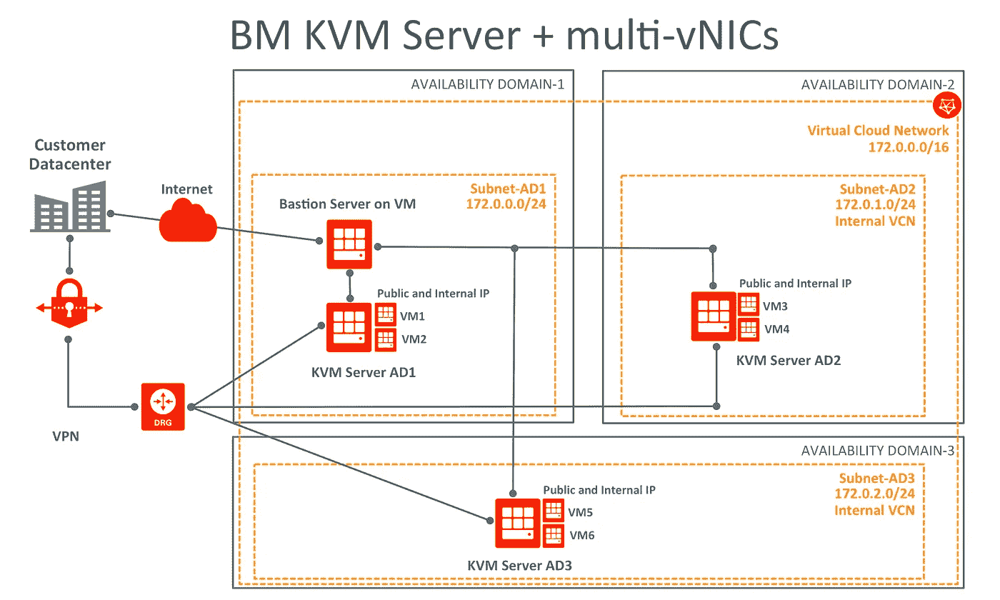

# 要求

*   BMCS 实例(标准 1.36、高 1.36 或高 1.36)
*   在 Windows Server 实例上运行时，应用程序许可证可能需要通过软件保障进行许可证移动。有关您的许可权的问题应该向 Microsoft 或您的 Microsoft 经销商提出
*   请注意，将您的许可证带到 OCI 时，您要独自承担在裸机 KVM 服务器实例上使用的任何第三方操作系统/应用程序的许可义务
*   您的 KVM VM OS ISO 需要上传到您的裸机(BM) KVM 服务器实例中
*   连接到 BM KVM 服务器实例的附加块存储卷，用于保存 KVM VM qco w2 磁盘映像
*   KVM 只有在 cpu 支持硬件虚拟化(Intel VT 或 AMD-V)的情况下才能工作，要了解您的 CPU 是否支持 VT 特性，请运行以下命令。

> $ sudo egrep '(vmx | SVM)'/proc/CPU info

如果上述命令返回任何显示 vmx 或 svm 的输出，则您的硬件支持 VT，否则不支持。裸机实例支持“vmx”硬件虚拟化。

# 安装 KVM

发出以下命令来安装最新的 qemu 包和 virt-manager，它提供了管理虚拟机的图形界面。

> $ sudo yum install QEMU-KVM QEMU-img virt-manager lib virt lib virt-python lib virt-client virt-install virt-viewer

# 安装 VNC

运行以下命令安装 VNC 软件包

> $ sudo yum groupinstall“带 GUI 的服务器”
> 
> $ sudo yum install " @ X Window System " xorg-X11-xauth xorg-X11-fonts-* xorg-X11-utils tiger VNC-server-y

现在，复制 vncserver@。对 vncserver@的服务:1.service。

> $ cd /lib/systemd/system
> 
> $ sudo cp vncserver@。服务 vncserver@:1 .服务
> 
> $ sudo vi vncserver\@\:1.service

将 vncserver@1.service 中的<user>替换为 VNC 用户名，使用如下所示的“opc”用户名。</user>

> ExecStart =/sbin/run user-l OPC-c "/usr/bin/VNC server % I-geometry 1280 x 1024 "
> 
> PIDFile=/home/opc/。vnc/%H%i.pid

为 vncserver@中定义的 opc 用户设置 VNC 密码。服务

> # su - opc
> 
> # vncpasswd
> 
> 密码:
> 
> 验证:
> 
> #退出

配置防火墙以允许 VNC 连接

将 VNC 配置为自动启动

> $ sudo systemctl 后台程序-重新加载
> 
> $ sudo system CTL enable VNC server @:1 . service
> 
> $ sudo ln-s '/usr/lib/systemd/system/vncserver @:1 . service ' '/etc/systemd/system/multi-user . target . wants/vncserver @:1 . service '
> 
> $ sudo system CTL start vncserver @:1 . service

# 为多虚拟网卡准备 KVM 服务器

在 Oracle Linux 7.x KVM 服务器实例上，执行以下操作:

> $ sudo VI/etc/默认/grub
> 
> #在 GRUB_CMDLINE_LINUX 行中追加以下参数
> 
> Intel _ io MMU = on ixgbe . max _ VFS = 16 rd black list = ixgbevf

下面是一个例子:

> $ sudo cat /etc/default/grub |grep 命令行
> 
> GRUB _**CMDLINE**_ LINUX = " crash kernel = auto LANG = en _ US。UTF-8 console=tty0 console=ttyS0，9600 rd . luks = 0 rd . LVM = 0 rd . MD = 0dm = 0 IP = DHCP netroot = iscsi:169 . 254 . 0 . 2::::iqn . 2015–02 . Oracle . boot:uefi iscsi _ param = node . session . timeo . replacement _ time out = 6000**Intel _ io MMU = on IX gbe . max _ VFS = 16 rd black list = IX**

保存并退出 vi。

现在，运行以下命令来

-将本机英特尔 VF 驱动程序列入黑名单，并使用操作系统本机驱动程序

> $ sudo echo " black list ixbevf " >/etc/modprobe . d/black list-ixbevf . conf

-启用调谐

> $ sudo systemctl 启用优化
> 
> $ sudo systemctl 开始调整
> 
> $ sudo tuned-adm 配置文件虚拟主机

-重新创建 grub 以验证所有更改

> $ sudo grub 2-mkconfig-o/boot/EFI/EFI/red hat/grub . CFG

使用您的 BMCS 用户界面，编辑您的 BM 虚拟云网络安全列表，并打开端口 5901(如果该端口对应于您正在使用的 VNC 端口)

> *来源:0.0.0.0/0*
> 
> *IP 协议:TCP*
> 
> *源端口范围:全部*
> 
> *目的端口范围:5901*
> 
> *允许:端口 TCP 流量:5901*

重启裸机 KVM 服务器实例，加载 KVM 内核模块并重启 gnome。重启完成后，您应该能够通过任何 VNC 应用程序(如 [vncviewer](https://www.realvnc.com/en/download/viewer/) )访问裸机 KVM 服务器实例

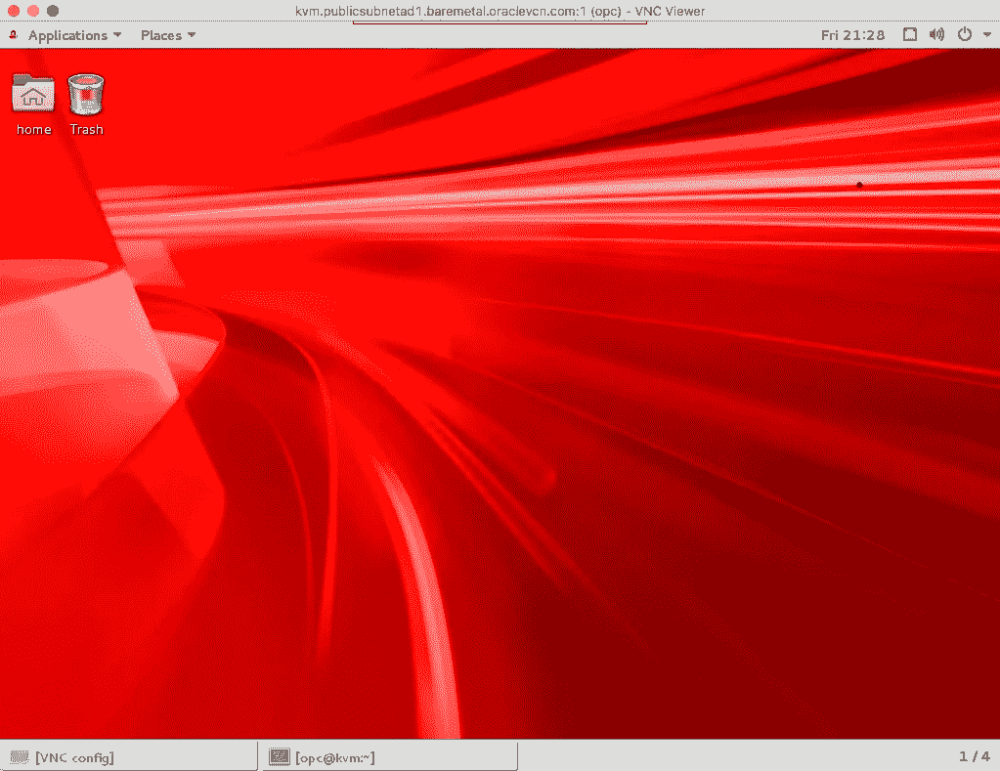

注意:您需要使用 passwd 命令通过 SSH 重置 opc 用户密码，以便能够通过 VNC 连接到您的 BM KVM 服务器 gnome 界面。

# 创建 BMCS 虚拟网络信息中心

下一步是创建一个 vNIC 并将其附加到 BM KVM 服务器实例中。使用 BMCS 仪表板，单击 BM KVM 实例的详细信息，选择“连接的虚拟网卡”,然后单击“创建虚拟网卡”选项。

下面是 Debian 在可用性域 1 (AD1)上使用名为“New-BM-172”的虚拟云网络(VCN)的一个例子

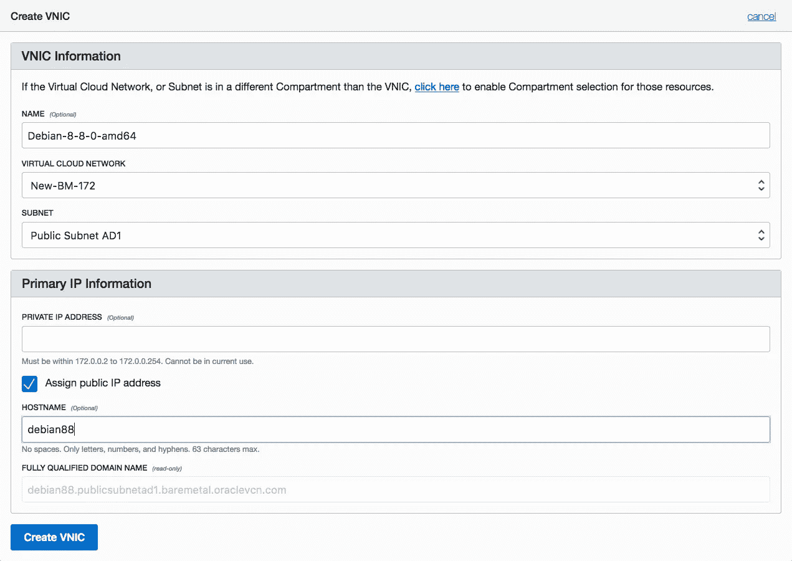

创建后，您将看到以下内容:

请注意“MAC 地址”和 VLAN 标签信息，因为您稍后会用到它们。现在，您已经准备好配置 KVM 来宾虚拟机，并向其中添加上述虚拟网卡。

# 创建 KVM BM 实例

如上所述，可以使用命令行或可用的图形工具来管理 KVM。在本教程中，您将使用 virt-manager GUI 和一个终端应用程序。使用 VNC 连接到 BM KVM 服务器实例，打开 gnome 终端并运行

单击“创建新的虚拟机”按钮，并按照要求的选项进行操作，例如

选择 ISO 图像

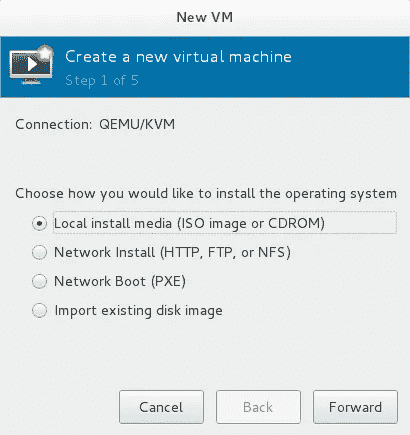

指向您的 ISO 位置

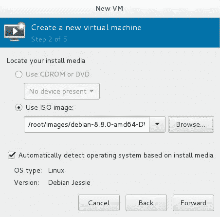

选择内存量和 CPU 数量。

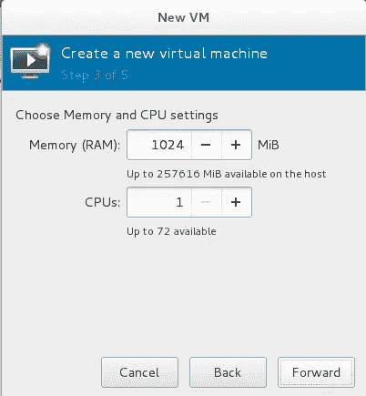

选择存储(qcow2)文件或设备(即；/dev/sdb))

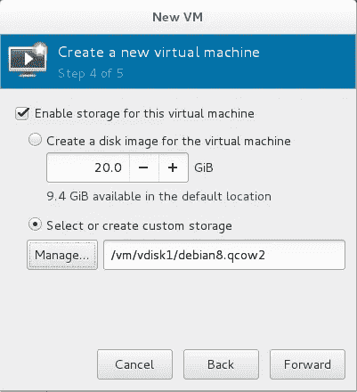

键入 KVM 来宾虚拟机的名称。您可以使用与 vNIC 设置相同的名称，也可以使用不同的名称。

在来宾安装过程中，使用您在 vNIC 设置中选择的相同操作系统主机名。

不要忘记选择“安装前自定义配置”选项

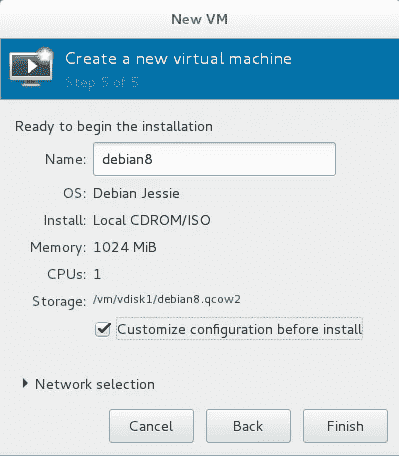

删除默认添加的默认网卡，单击开始安装选项，但不要启动它

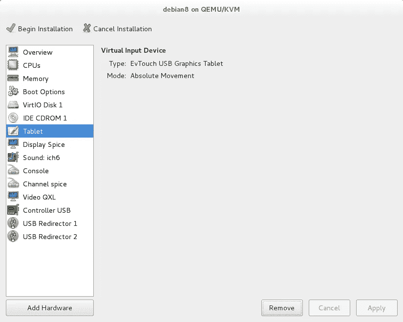

点击“强制关闭”选项，如下所示

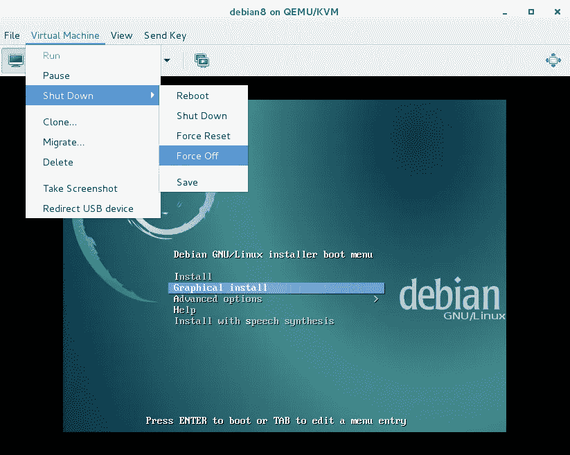

在开始 KVM 来宾虚拟机安装之前，您需要将 BMCS 虚拟网卡添加到其中。

# 将 BMCS 虚拟网卡与 KVM 虚拟机相关联

找到与您创建的、与 BM KVM 服务器关联的 vNIC 相关的 PCI 总线信息。之后，您将使用在上述 vNIC 步骤中获得的 VLAN 信息。

运行以下命令并替换 VLAN 标签 ID 的 VLAN 信息变量，以标识与 BMCS 虚拟网卡相关联的 PCI 设备，如下例所示

> $ sudo virsh node dev-dump XML ` ethtool-I ens2f 0 | grep bus-info | awk ' { print $ 2 } ' | sed 's/^/pci_/' | sed ' s/\:/_/g ' | sed ' s/\。/_/g'` | grep "地址域" | sed '**VLAN-信息**q；d' | sed 's/^ * <地址/ <地址类型=\"pci\"/'

下面是基于上述 vNIC 过程的样子，注意 VLAN 信息变量被改为 3，以匹配与 Debian 88 vNIC 相关的 VLAN 标签 ID。

> $ sudo virsh node dev-dump XML ` ethtool-I ens2f 0 | grep bus-info | awk ' { print $ 2 } ' | sed 's/^/pci_/' | sed ' s/\:/_/g ' | sed ' s/\。/_/g'` | grep "地址域" | sed '**3**q；d' | sed 's/^ * <地址/ <地址类型=\"pci\"/'
> 
> **<地址类型="pci "域='0x0000 '总线='0x13 '槽='0x10 '功能='0x4'/ >**

创建一个名为 kvm-vnic-attach.xml 的文件(可以使用 xml 文件的任何名称),并确保它与您的 vnic 配置(MAC 地址、VLAN 标签 ID (BMCS UI 仪表板——附加的 vNICS 选项)以及上面的 virsh nodedev-dumpxml 输出)匹配，如下所示

> $ sudo VI/tmp/KVM-vnic-attach . XML
> 
> ####BMCS 虚拟网卡信息+虚拟节点开发-转储 xml 输出
> 
> <interface type="’hostdev’" managed="’yes’"></interface>
> 
> **<地址类型="pci "域='0x0000 '总线='0x13 '槽='0x10 '功能='0x4'/ >**
> 
> <vlan></vlan>
> 
> <tag id="’<strong" class="ak">3 '/ ></tag>
> 
> <mac address="’<strong" class="ak">00:00:17:01:02:1E'/></mac>
> 
> # # # #/tmp/KVM-vnic-attach . XML 的结尾

保存并退出。

运行以下命令行，将新 hostdev NIC 连接到 KVM guest 虚拟机。

> $ sudo virsh attach-device debian 8/tmy/KVM-vnic-attach . XML-config

设备连接成功

继续安装 KVM 虚拟管理器。打开 virt-manager 并验证您的新 vNIC 是否已添加到来宾 XML 配置中

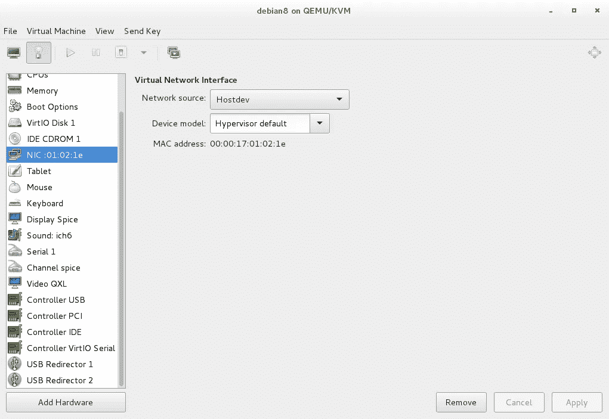

选择引导选项，并将光盘设置为引导顺序的主光盘

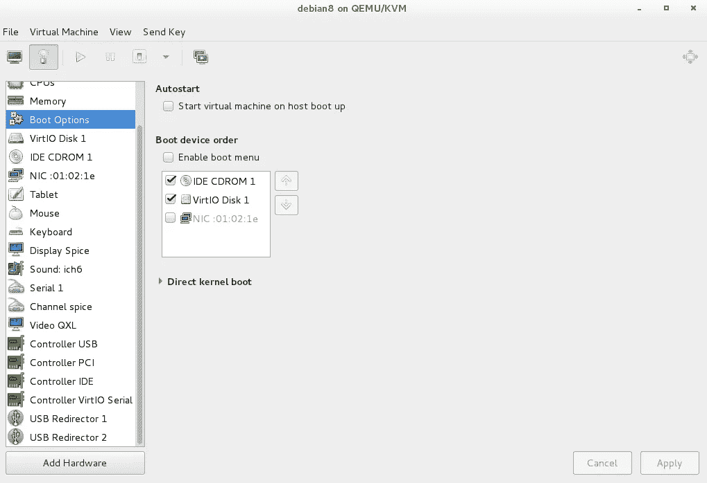

检查光盘是否与本地 ISO 文件连接

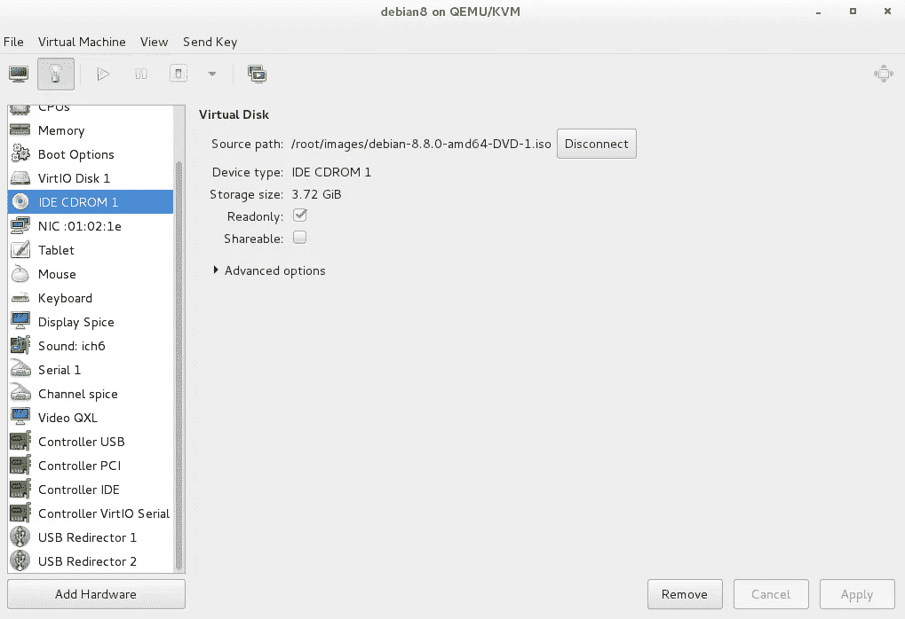

并照常安装 KVM 客户操作系统。剩下的唯一一步是根据您的 vNIC/VCN 配置设置一个静态 IP 地址，这可以在 KVM guest 安装期间或之后完成。

下面是本教程中使用的 vNIC 数据的一个示例。

静态 IP:172.0.0.47

掩模:255.255.255.0

温伯格:172.0.0.1

域名系统:169.254.169.254

安装完成后，断开 CD-ROM ISO，启动新的 KVM guest 虚拟机，您应该能够使用与您的 BMCS 虚拟网卡关联的公共 IP 地址以及您配置的服务连接到它。

BMCS KVM 服务器上的 Debian 8.8.0 Guest

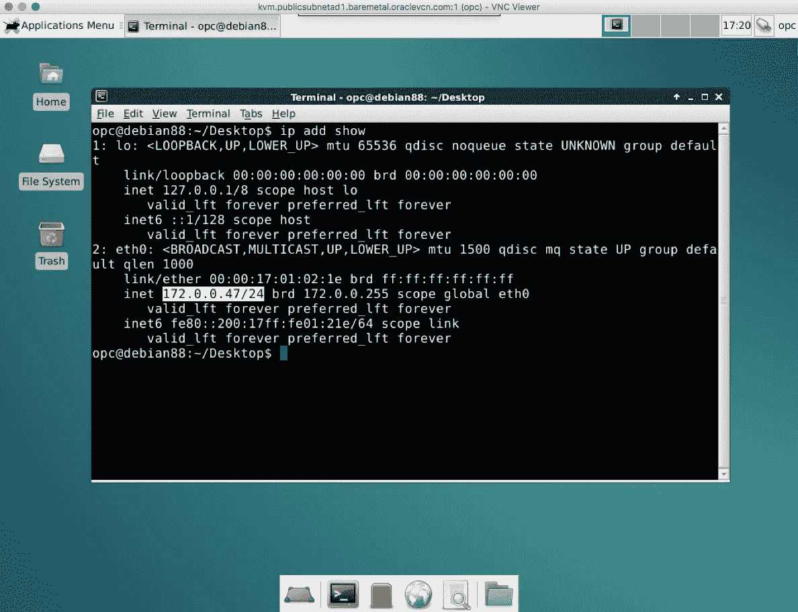

使用 BMCS 虚拟网卡公共 IP 地址的 ssh 连接

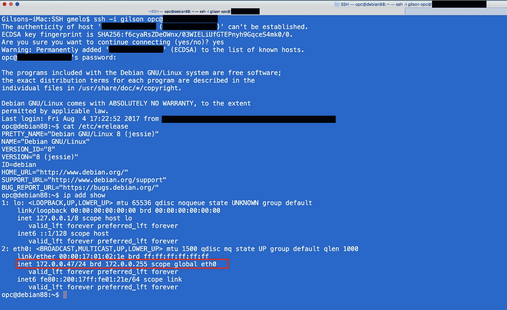

下面是一些在裸机 KVM 服务器实例上运行的其他 KVM 客户操作系统示例

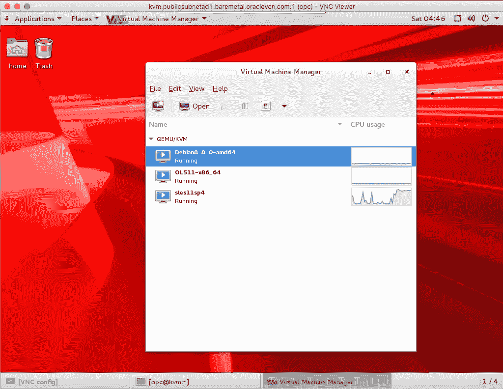

您在 BMCS 上的 BM KVM 服务器+多 vNIC 设置已经完成！

# 其他安全建议:

*   禁用 ssh 密码认证并启用 SSH 密钥认证(在/home/opc/中添加您的 SSH 公钥。ssh/授权密钥文件)
*   保持 KVM 客户机防火墙处于启用状态，仅打开所需的端口
*   定期修补您的 KVM 来宾虚拟机
*   尽可能使用 VPN
*   安装一个堡垒服务器登录到您的 BMCS KVM 服务器，并使用内部 IP 地址只为后者