# 配置 Android Studio

> 原文：<https://medium.com/google-developer-experts/configuring-android-studio-4aa4f54f1153?source=collection_archive---------0----------------------->

# 介绍

*Android Studio* 有一个很酷的功能，可以*导入*和*导出*设置。所以在安装新的 *Android Studio* 版本时，我通常会导入我以前的设置。但是最近一件糟糕的事情发生在我身上——我丢失了我的 *Android Studio* 设置文件。

> 我给你的建议是:总是在云上的某个地方备份你的 Android Studio 设置文件。

因为我正在从头开始配置我的 Android Studio，以下是一些可能对你有用的东西。

# 显示行号

当我第一次启动 *Android Studio* 并开始使用它时，我想做的第一件事就是能够看到文件中的行号。我一直很好奇为什么这个东西不是默认开启的？

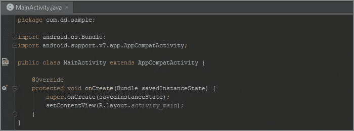

Without line numbers

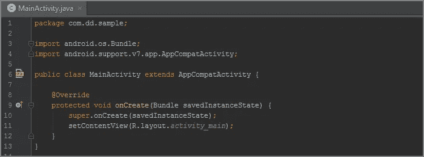

With line numbers

这样的话

*   在工具栏菜单中选择*文件* | *设置*
*   选择*编辑* | *总体* | *外观*
*   勾选*显示行号*

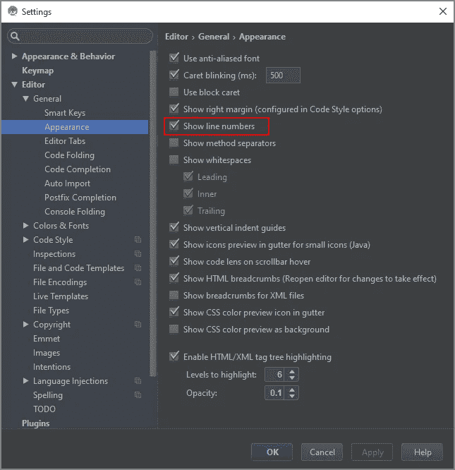

Settings

# 骆驼驼峰

*当你按下*Ctrl+左/右*箭头键浏览你的代码时，Android Studio* 不尊重“驼峰”一词。

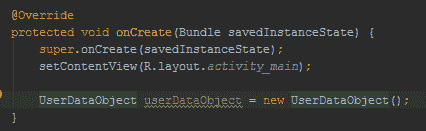

Without ‘Camel Humps’

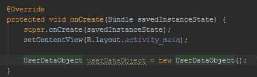

With ‘Camel Humps’

这样的话

*   在工具栏菜单中选择*文件* | *设置*
*   选择*编辑器* | *通用* | *智能按键*
*   勾选*使用‘驼峰’字样*

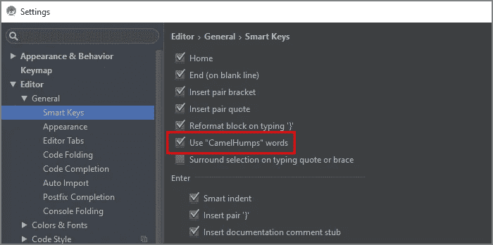

Settings

**注意:**如果你仍然想在鼠标上双击选择整个单词

*   在工具栏菜单中选择*文件* | *设置*
*   选择*编辑* | *通用*
*   去掉*上的勾号【双击选择时尊重驼峰文字设置】*

# 字段命名约定

如果你想遵循 Android 代码风格指南中的[字段命名约定](https://source.android.com/source/code-style.html#follow-field-naming-conventions)，请先阅读 *Jake Wharton 的*文章— [只需将 mNo 改为匈牙利符号](http://jakewharton.com/just-say-no-to-hungarian-notation/)。不过，有一件事 *Android Studio* 可以自动为我们做——生成域名前缀:

*   非公共、非静态的字段名以 **m** 开头。
*   静态字段名称以 **s** 开头。

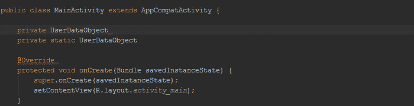

Field name prefix

这样的话

*   在工具栏菜单中选择*文件* | *设置*
*   选择*编辑器* | *代码样式* | *Java*
*   选择*代码生成*选项卡
*   为字段添加 **m** 前缀，为静态字段添加 **s** 前缀

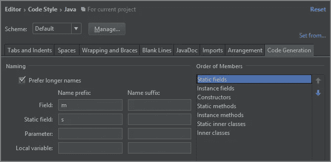

Settings

# 外部类和内部类之间的私有成员访问

在 *Android Studio* 中有一个检查我认为应该默认开启:

*   在工具栏菜单中选择*文件* | *设置*
*   选择*编辑* | *检查*
*   勾选*Java*| J2ME |外部和内部类之间的私有成员访问

这种检查将帮助您减少方法数量，获得更好的性能和更少的内存使用。如果你想知道更多，就去读一下 inspection description 和 Jake Wharton 的演讲。

# 快速进口

在 *Android Studio* 中有自动导入或清理未使用导入的快捷方式。但我们生活在 2015 年，对吗？这些事情应该在飞行中完成。

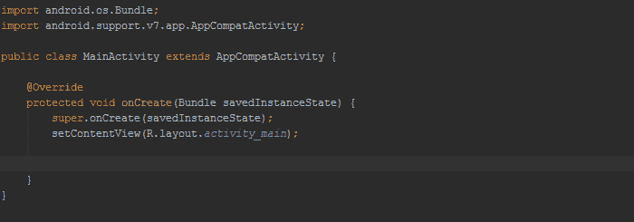

Without imports on the fly


With imports on the fly

这样的话

*   在工具栏菜单中选择*文件* | *设置*
*   选择*编辑* | *通用* | *自动导入*
*   勾选*动态优化进口*
*   勾选*动态添加明确的导入*

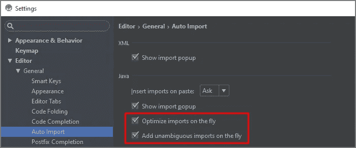

Settings

# Android 日志颜色

默认 *Darcula* 主题 *Logcat* 高亮显示，我无法识别日志的类型。

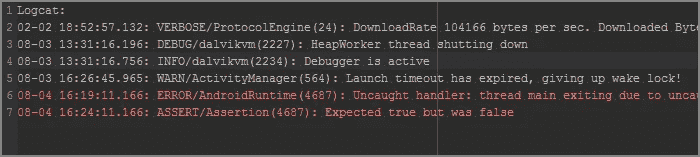

Darcula theme Logcat highlighting

我更喜欢使用朴素的旧*安卓赫萝*主题的亮色。

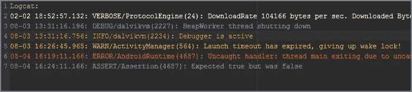

Holo theme Logcat highlighting

这样的话

*   在工具栏菜单中选择*文件* | *设置*
*   选择*编辑器* | *颜色&字体* | *Android Logcat*
*   点击*另存为…* 按钮，创建新的颜色方案
*   将所有颜色更改为*“赫萝主题颜色”(取消选中“对每种颜色使用继承属性”)*

```
Assert:  #AA66CC
Debug:   #33B5E5
Error:   #FF4444
Info:    #99CC00
Verbose: #FFFFFF
Warning: #FFBB33
```


Holo theme colors