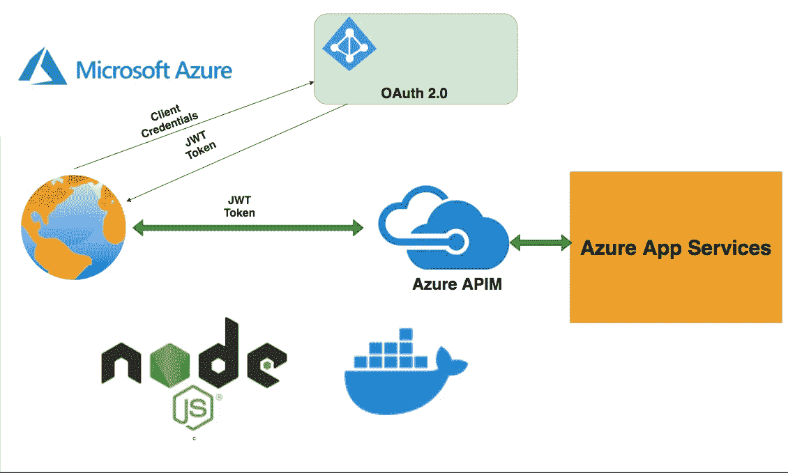

# 在 APIM 为运行在应用服务上的 NodeJS APIs 配置 Auth 2.0

> 原文：<https://medium.com/bb-tutorials-and-thoughts/configuring-auth-2-0-in-apim-for-nodejs-apis-running-on-app-services-2074a745e9b0?source=collection_archive---------6----------------------->

## 包含示例项目的逐步指南

当你在应用服务上部署你的 web 应用或 API 时，你可以直接从应用服务端点公开它们，也可以通过 Azure APIM 提供服务。使用 APIM 有几个优点:基于上下文路径路由到不同的应用，实现微服务…