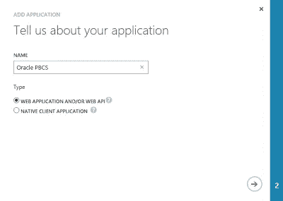
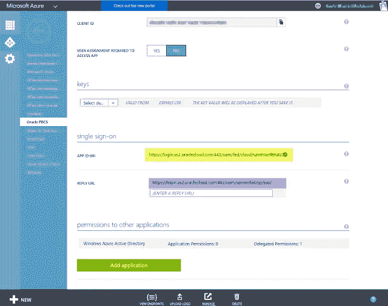

# 将 Azure AD Base 版本配置为 Oracle 规划和预算云应用的身份

> 原文：<https://medium.com/oracledevs/configuring-azure-ad-base-version-as-an-identity-56b67793c1?source=collection_archive---------0----------------------->

在这本简明、图文并茂的操作指南中，Oracle ACE Director[Celvin katookaran](https://twitter.com/cvkattookaran)将带您一步步完成在 Oracle Planning and Budgeting Cloud 和 Azure Active Directory 基础版之间设置单点登录的过程。

> 最初由 OTN 的 [Celvin Kattookaran](https://community.oracle.com/people/Celvin+Kattookaran) 发表

# 介绍

从 2015 年 11 月的 Oracle Planning and Budgeting Cloud Service(PBCS)版本开始，您可以配置单点登录(SSO)来验证服务用户，使用:

*   微软活动目录联合服务器(ADFS) 2.0、ADFS 2.1、ADFS 3.0
*   Shibboleth 身份提供者 2.4.0
*   Oracle 身份联盟服务器 11g。

在本文中，我们将回顾在 Oracle Planning and Budgeting Cloud 和 Azure Active Directory 基础版之间设置单点登录的流程。

# SAML 2.0 及其工作原理

安全声明标记语言 2.0 (SAML)是一种基于 XML 的数据格式，用于在安全域之间交换身份验证和授权数据，实现跨域的基于 web 的身份验证和授权。

在单点登录配置的设置中，一个安全域充当服务提供商(消费者(SP )),另一个充当身份提供商(IdP )(权威),如下图所示。

1.  用户试图登录 PBCS
2.  OPC (Oracle 公共云)生成 SAML 请求
3.  OPC 将浏览器重定向到 SSO URL 页面，浏览器现在打开 SSO 页面，用户使用其 AD 用户名和密码登录
4.  Azure 现在使用 SAML 请求来验证用户
5.  Azure 生成一个 SAML 响应
6.  Azure 将 SAML 响应返回给浏览器，浏览器现在将 SAML 响应发送给 OPC
7.  OPC 验证 SAML 响应
8.  用户现在已登录 PBCS

使用 Oracle 公共云配置 Azure AD Base 版本包括 5 个步骤:

1.  将 Azure AD 配置为联盟的 IdP
2.  将 Oracle 公共云配置为联合的 SP
3.  OPC 配置后更新 Azure
4.  测试 SSO
5.  启用 SSO

# 将 Azure AD 配置为联盟的 IdP

登录 Azure 门户网站。导航到**浏览到活动目录**，然后到**应用**。

点击**添加**按钮，添加一个新的应用程序。

选择**添加我的组织正在开发的应用程序。**(哦，我懂了，是甲骨文的应用。)

提供一个名称并选择 **Web 应用程序和/或 Web API** 。

登录 URL 将是您的 PBCS URL(不包括 Workspace/HyperionPlanning 部分)。

[https://pbcs-domain.pbcs.us2.oraclecloud.com](https://pbcs-domain.pbcs.us2.oraclecloud.com/)

添加应用 ID URI 的 URL(我们稍后将再次讨论)。我只是复制了相同的登录 URL:

一旦创建了应用程序，您就可以通过打开**视图端点**来获取提供者元数据。还可以通过上传 215px x 215px 的图片来更改 Azure 应用的 logo。

复制“**联盟元数据文档**”中的链接(链接到联盟元数据 xml 文件)。将它粘贴到网络浏览器中。

将文件保存为 XML 文件。

现在是时候将 Oracle 公共云配置为服务提供商了

# 将 Oracle 公共云配置为 SAML 联盟的服务提供商

1.  登录 Oracle 公有云([https://my services . us2 . Oracle Cloud . com)-](https://myservices.us2.oraclecloud.com/)-/)->-【用户】->-【单点登录配置】
2.  点击**配置单点登录**

上传联盟元数据 XML

*   为单点登录协议选择 **HTTP POST**
*   选择**用户的电子邮件地址**作为“用户标识符”
*   为“包含在”选择 **NameID**

点击**保存**。保存 IdP 信息后，您将获得四个链接。

在下一步中，您将需要**提供者 Id** 和**断言消费者服务 URL** 值。

# OPC 配置后更新 Azure

登录 Azure 门户网站。

导航至**活动目录- >应用- >您的应用- >配置**

*   应用程序 ID URL =提供商 ID
*   回复 URL =断言消费者服务 URL

# 测试 SSO

登录 **OPC- >用户- >单点登录配置- >测试单点登录**

点击**开始单点登录**。您将被重定向到 Microsoft 站点。

提供您的密码以查看结果。

如果测试成功，您现在可以在 OPC 中**启用 SSO** 。

# 启用 SSO

启用后，您将在 PBCS 登录 url 中看到一个新链接。

# 正在 OPC 中加载 Azure AD 用户

Azure AD 用户必须在 OPC 中添加，然后才能登录到 PBCS。这可以通过上传以下格式的 CSV 文件以批量模式完成:

**名字、姓氏、电子邮件、用户登录**

要上传用户，登录 **OPC- >用户- >导入- >浏览 CSV 文件- >导入**

# Office 365 应用启动器

使用 Office 365 应用程序启动器，您可以将您的应用程序绑定到 EXCEL、Outlook 和其他 Office 应用程序，这允许您直接从这些 Office 应用程序中启动 PBCS URL。

# 结论

使用单点登录消除了在外部系统上更新帐户的需要，从而大大简化了用户维护。

客户可以通过将用户从其 IDP 中删除来撤销访问权限。Office 365 和基本 Azure AD 版本允许您直接从微软产品中访问外部应用程序。

# 关于作者

[Celvin Kattookaran](https://community.oracle.com/people/Celvin+Kattookaran) 是甲骨文 ACE 总监兼休伦咨询集团首席架构师。他以开发创造性和有效的商业解决方案来解决客户的挑战而闻名。他经常为 Oracle 社区论坛和 Network 54 Essbase 论坛投稿。在闲暇时间，他为 EPM 产品开发实用程序，使顾问的生活更轻松。

*最初发表于*[T5【community.oracle.com】](https://community.oracle.com/docs/DOC-997863)*。*