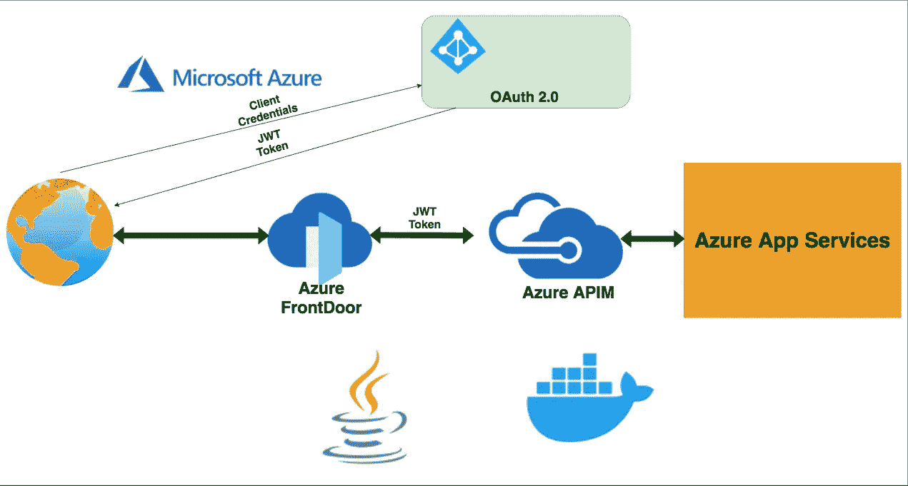

# 使用 APIM 为运行在应用服务上的 Java APIs 配置 Azure FrontDoor

> 原文：<https://medium.com/bb-tutorials-and-thoughts/configuring-azure-frontdoor-for-java-apis-running-on-app-services-with-apim-1d918e8078dd?source=collection_archive---------7----------------------->

## 包含示例项目的逐步指南

假设您已经在 Azure App services 上部署了您的应用程序并配置了 APIM，APIM 提供了所有功能，例如基于上下文路径路由到不同的应用程序、实施微服务、添加 OAuth、缓存层、共享您的 APIs