# 在 Oracle Integration Gen2 中配置通知

> 原文：<https://medium.com/oracledevs/configuring-notifications-in-oracle-integration-gen2-934dff68382d?source=collection_archive---------0----------------------->

在这篇文章中，我试图列出在 Oracle Integration Cloud Gen2 中配置电子邮件通知的步骤。我试图提供尽可能多的图片，使它能够自我描述。

Oracle 官方文档[https://docs . Oracle . com/en/cloud/PAAs/integration-cloud/user-processes/configure-application-settings . html # GUID-c 0807233-d0a 8-42AD-86DA-d16ea 2989 f1 a](https://docs.oracle.com/en/cloud/paas/integration-cloud/user-processes/configure-application-settings.html#GUID-C0807233-D0A8-42AD-86DA-D16EA2989F1A)

设置电子邮件通知的第一步是配置通知基础架构。

登录到您的 OCI 控制台，并导航到您的 OIC 实例的配置服务页面

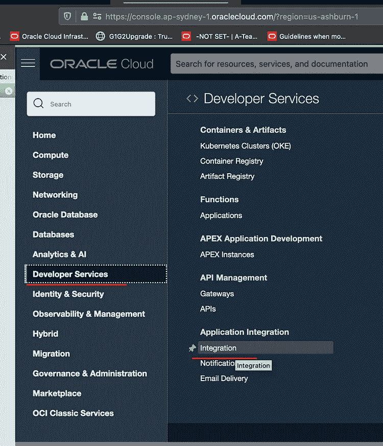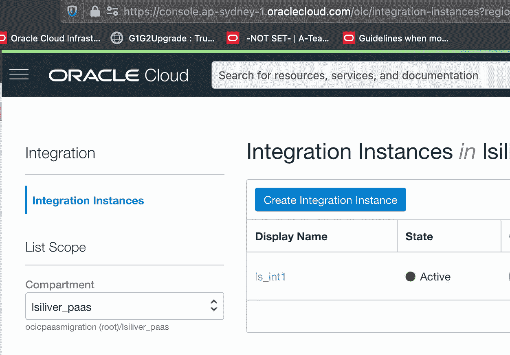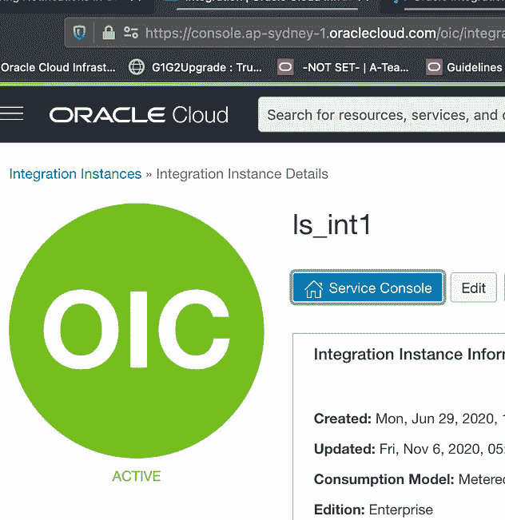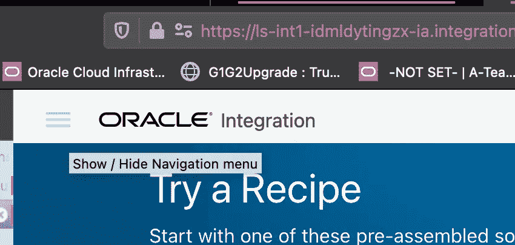

**左侧导航菜单→我的任务→管理→服务→基础设施**

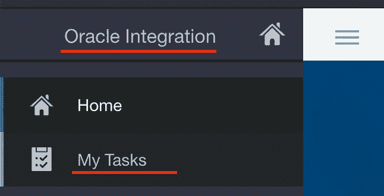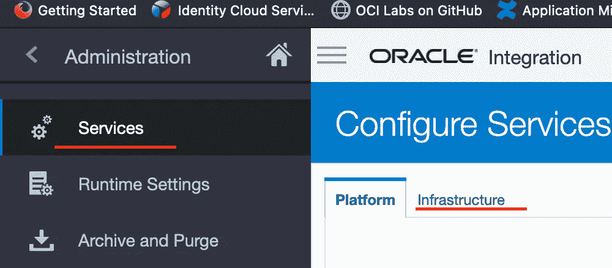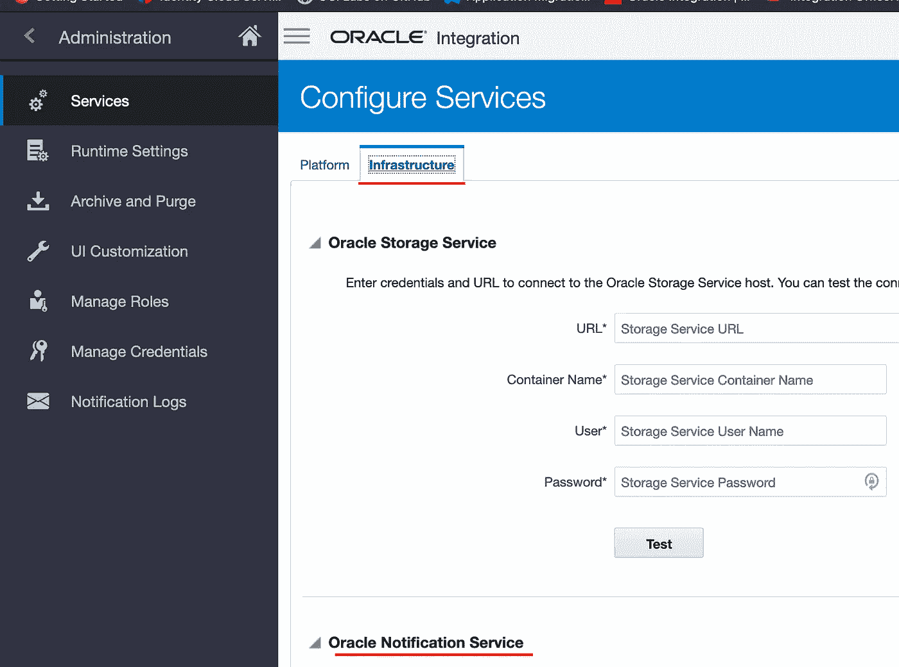

默认设置为“**无**”。从下拉列表中选择“**电子邮件**，并提供“**发件人**电子邮件地址。点击**注册**，然后点击**保存**保存设置。

请忽略“电子邮件地址已有的”对话框中的**，点击**确定**。在确认消息上点击**确定**。**

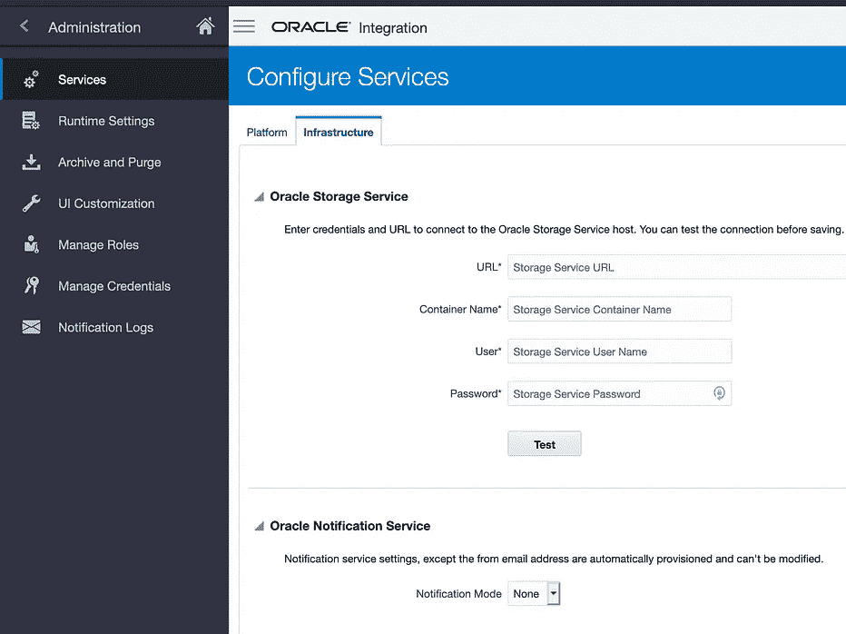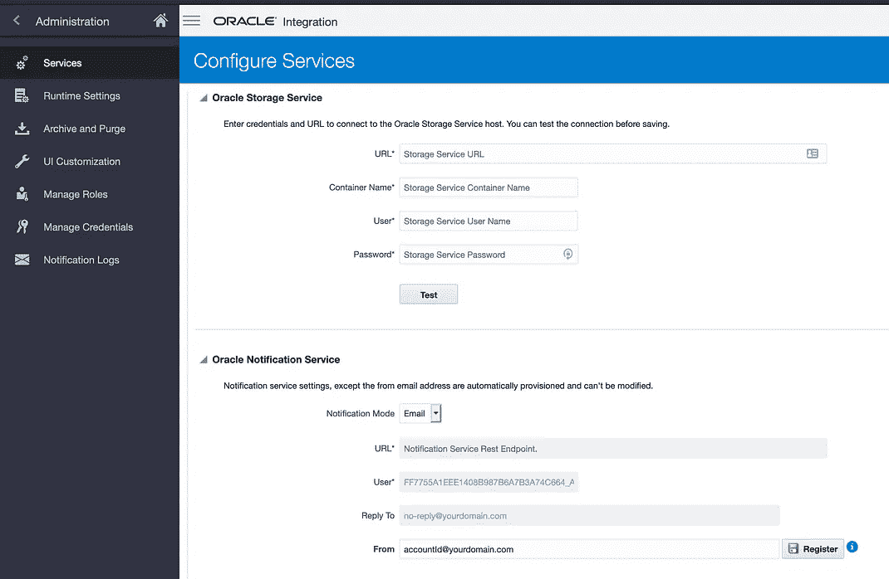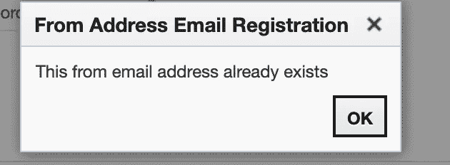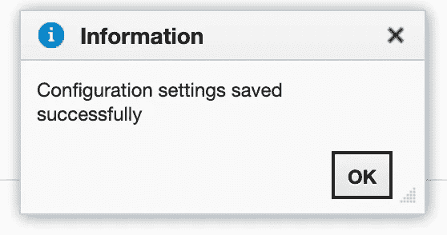

要测试通知，请导航至**我的任务→管理→通知日志→“测试通知”**按钮

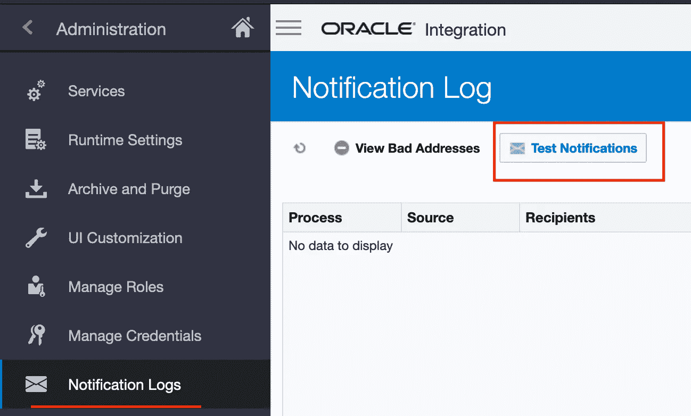

输入电子邮件地址以及主题和内容示例。点击**发送**，你会看到确认信息发送。您还可以查看页面中的所有通知，方法是选中“**显示已发送通知**”框

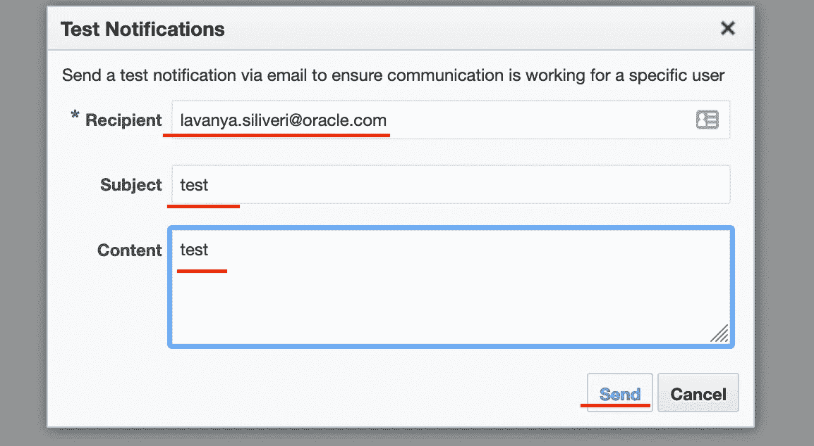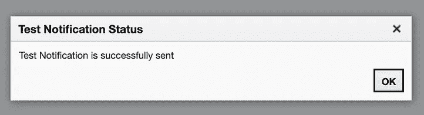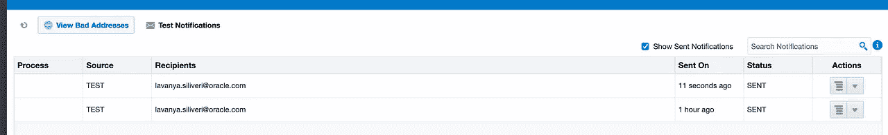

除此之外，**请确保进行了 SPF 和 DKIM 配置**

**Oracle 文档**—[https://docs . Oracle . com/en/cloud/PAAs/integration-cloud/Oracle-integration-OCI/configure-email-authentic ation-settings-SPF-and-dkim . html # GUID-ea2a 2697-D7CF-4e 7e 4-796 de 6d 1195 e](https://docs.oracle.com/en/cloud/paas/integration-cloud/oracle-integration-oci/configure-email-authentication-settings-spf-and-dkim.html#GUID-EA2A2697-D7CF-4E71-B7E4-796DE6D1195E)

*   发件人策略框架(SPF)允许域所有者识别他们已批准代表其域发送电子邮件的服务器。在 Oracle Integration 的情况下，域所有者需要批准 OCI 作为批准的发件人，并在其域中为其添加记录。
*   DomainKeys Identified Mail (DKIM)通过一对密钥对电子邮件进行身份验证:一个在域名系统 TXT 记录中发布的公钥，一个在发送邮件的签名中加密的私钥。密钥由电子邮件服务提供商生成。

1.  **配置 SPF(发件人策略框架)。**

将 SPF 记录添加到`from`地址的域中，以包含 Oracle 云基础架构电子邮件交付域。

SPF 记录使用以下格式。SPF 记录必须标识 Oracle 集成实例的大陆键，如下例所示。

`v=spf1 include:<continentkey>.[oracleemaildelivery.com](http://oracleemaildelivery.com) ~all`

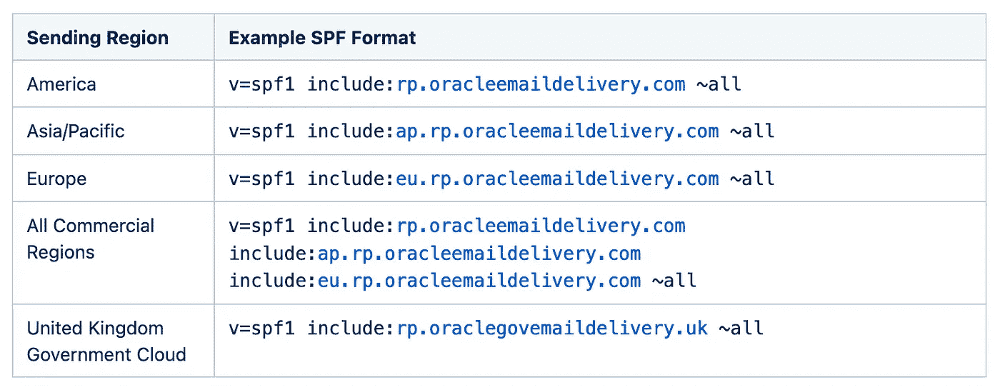

在早期的 Oracle 集成实例中，通过将标准记录`include:[spf_c.oraclecloud.com](http://spf_c.oraclecloud.com)`添加到`from`地址的域中来支持发送方验证。

**2。配置 DKIM(域名密钥识别邮件)。**

要为 Oracle Integration Generation 2 实例配置 DKIM 密钥，**请在 My Oracle Suppor 中记录服务请求** t。包括以下详细信息:

*   **选择器名称**
*   **钥匙尺寸**
*   `**from**` **将用于发送电子邮件的地址**

Oracle 为您提供了为您的域添加 CNAME DNS 记录的详细信息。添加 DNS 记录的说明取决于您的域提供商。CNAME 包含公钥的位置。

例如，对于选择器名称`me-yyz-20200502`，发送域`[mail.example.com](http://mail.example.com)`，电子邮件区域代码`yyz`，CNAME 如下所示:

`[me-yyz-20200502._domainkey.mail.example.com](http://me-yyz-20200502._domainkey.mail.example.com) IN CNAME [me-yyz-20200502.mail.example.com.dkim.yyz1.oracleemaildelivery.com](http://me-yyz-20200502.mail.example.com.dkim.yyz1.oracleemaildelivery.com)`

DNS 更新后，更新服务请求，Oracle 将为您的域激活 DKIM 设置。