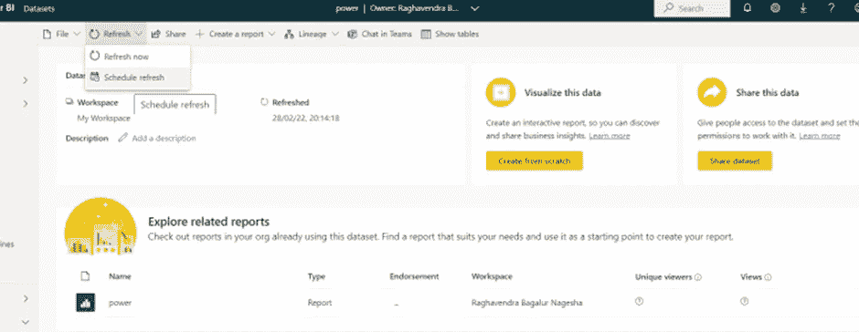

# 电力 BI 中数据网关的配置

> 原文：<https://medium.com/version-1/configuring-of-data-gateway-in-power-bi-f7f95882f19?source=collection_archive---------1----------------------->

为了执行计划的更新，我们需要安装 Power BI 数据网关。

1.  在 Power BI Online 中，点击右上角的[下载]按钮>>选择[数据网关]。

2.运行安装程序并选择适当的网关安装类型。我们将有两种选择:

*   可由多个用户共享和重用的企业，也支持 Power BI、PowerApps、Logic Apps 和 Microsoft Flow
*   或者只能由个人和电源 BI 使用的个人模式

3.其他因素，如网关的安装位置、现有的网络以及我们组织内关于网关的政策，可能会影响我们将要设置的安装类型。请注意，如果我们将网关安装在个人计算机上，当我们的计算机关闭时，网关将不会运行。

4.我们完成安装后，请返回 Power BI Online 并转到[管理网关]。选择[添加数据源以使用网关]。

5.在下一个屏幕上，确保我们选择了[ODBC]数据源类型，并设置了到服务器、数据库、用户名和密码的正确连接字符串。

**注意**:对于连接字符串，按以下格式传递值

> **数据库= {数据库名称}；driver = { PostgreSQL Unicode(x64)}；端口= 5432；server = { PostgreSQL 的私有 IP }；sslmode =要求**

6.连接成功建立后，转到[Users]选项卡，勾选相关用户，将其添加到数据源。

7.我们需要确保数据集运行正确的网关连接。为此，单击数据集并选择[计划刷新]。

8.在下一个屏幕上，确保我们选择了正确的[网关连接]。

9.然后打开[计划刷新]选项，以确保我们可以设置刷新频率。根据我们当前使用的 Power BI 许可证(Power BI for Office 365 ),我们只能安排[每日]刷新，最多设置 8 次刷新:

10.单击[Apply]后，我们应该会看到一条成功消息。

11.我们现在还可以测试数据集的手动刷新。

# **结论**

我们可以看到 Power BI 服务通过内部数据网关连接托管数据库。有些配置比较棘手，但并不难。

如果你对此感兴趣或有任何反馈，请在评论区告诉我。

**本博客是四部分系列的第四部分:** [第一部分—创建虚拟网络和 PostgreSQL](/version-1/vnet-integratedpostgresql-integration-with-power-bi-app-12950039e687)
[第二部分—创建和配置虚拟网络网关(点到站点)](/version-1/creating-and-configuring-virtual-network-gateway-point-to-site-using-azure-certification-7a5b61839e54)
[第三部分—安装 ODBC 驱动程序以远程连接到 PostgreSQL 数据库](/version-1/installing-odbc-driver-for-remote-connection-to-postgresql-db-9b8d496e50e4)

**关于作者:** Raghavendra BN 是一名 DevOps 工程师，目前在 Version 1 的 Foundation 的团队工作。关注版本 1 和 Raghavendra BN，了解更多关于 Microsoft Azure 和 Azure DevOps 的博客。