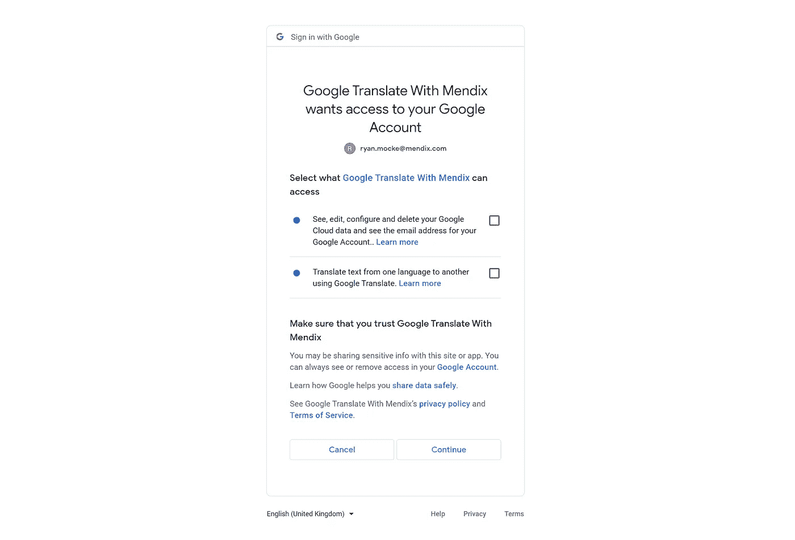
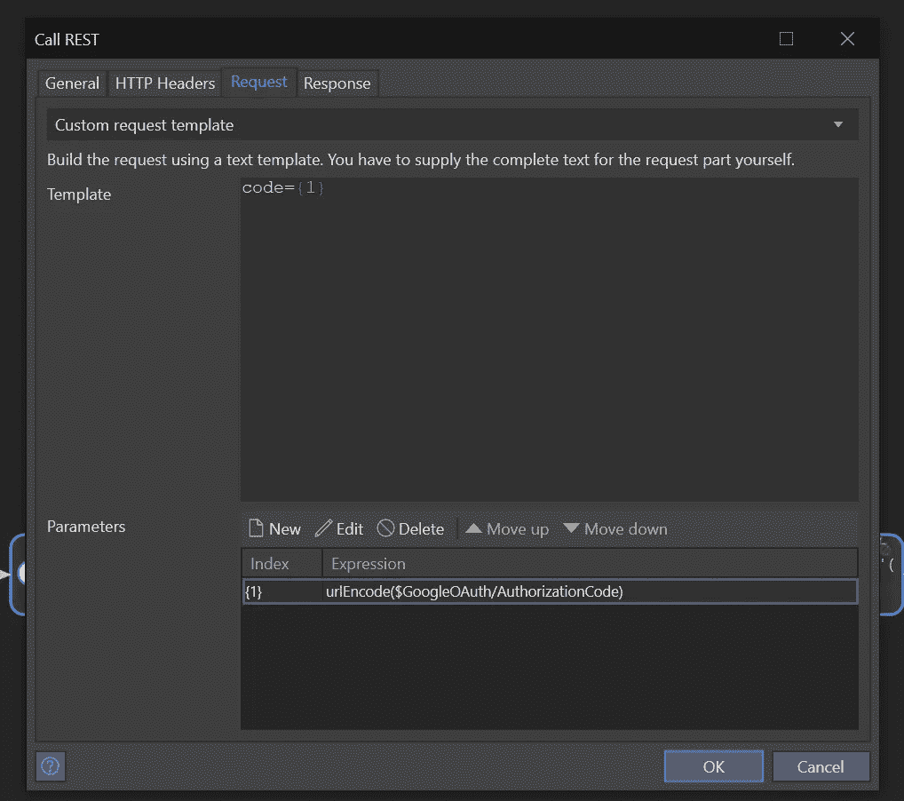
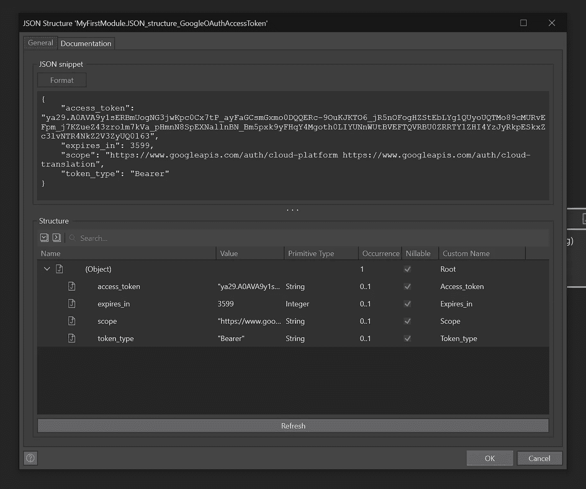

# 在 Mendix 中配置 REST 服务

> 原文：<https://medium.com/mendix/configuring-rest-services-in-mendix-a36c513df4b1?source=collection_archive---------0----------------------->

# 以 Google OAuth 2.0 身份服务为例。


# 在当今高度互联的世界中，很难找到一款无需任何外部数据集成就能运行的应用。如果你是一名开发人员，我可以保证在你的职业生涯中，你必须集成至少一个 REST API。

# 为什么要休息？

虽然 API 或应用程序插件有许多种类和标准，但我将讨论我个人最喜欢的；休息服务。你可能会问，“为什么要休息？”。答案很简单，比肥皂容易。还有其他原因，REST 比只支持 XML 的 SOAP 支持更多的数据格式。我认为 REST 最好的另一个重要原因是它与 JSON 是相辅相成的。

JSON (JavaScript Object Notation)通常提供更快的数据解析，这意味着这种轻量级数据格式对浏览器的支持更好。最后，在 Mendix 中使用 REST APIs 不需要安装任何客户端库或文件来让您的应用程序工作。

# 我使用的是什么 API？

Google Cloud API 拥有一整套 Google 最好的服务，这些服务都被分解成可消费的方法，其中许多完全免费使用。但是，在与这些 API 进行交互之前，您的请求需要使用 OAuth 令牌进行身份验证。Google 使用 OAuth 2.0 作为其大多数 API 的事实认证方法。这意味着，为了让用户使用谷歌 API，他们首先需要调用[谷歌身份 API](https://developers.google.com/identity/protocols/oauth2/web-server) (用于服务器端应用)，以便对谷歌的服务进行任何后续调用。

换句话说，获得一个令牌是实现许多 Google API 的第一步，对于希望从事 API 开发的人来说，这是一个很好的起点。

# 先决条件

在你开始之前，本博客假设你已经在谷歌云平台上为一个项目启用了任何谷歌 API，并且完成了那个谷歌项目的 [OAuth 证书页面](https://console.cloud.google.com/apis/credentials)和 [Oauth 同意屏幕](https://console.cloud.google.com/apis/credentials/consent)。特别是，您需要为您的应用程序配置重定向 URL，以指向您的本地主机或部署的 web 应用程序，并且在配置应用程序的 OAuth 客户端后，您需要有 Google 提供的客户端 ID 和客户端密码。

# 关于 REST 方法的一句话

在这个例子中，我使用 POST 方法调用 Google 的 Identity API，但是这是什么意思呢？在 REST 中，您必须了解 5 种方法:

*   **POST** —用于创建新记录
*   **GET** —这将返回一条记录或记录列表
*   **PUT** —用于更新或替换一条记录
*   **补丁** —用于更新或修改记录
*   **删除** —删除或缓和记录

我知道还有一些其他方法，但我在工作中从未遇到过，如果你感兴趣，这里有一个很好的方法总结[。](https://restfulapi.net/http-methods/)

# 集成 REST 服务的总体计划

根据您使用的方法和使用的 API，完成集成的实际步骤可能会有所不同，例如，GET 请求没有请求体，而是使用查询字符串。但一般来说，在 Mendix Studio Pro 中使用 REST 服务的步骤如下:

1.  **设置您的位置**

*   也称为端点或 URI，这是托管服务的位置

**2。选择您的 HTTP 方法**

*   上面提到的方法之间的选择，通常 API 文档会告诉你选择哪一个。

**3。认证**

*   可以是 OAUTH、API 键或者根本不需要。

**4。HTTP 报头**

*   头可以扮演不同的角色，每个服务都可以有唯一的头，无论您尝试使用哪个 API，您都需要参考文档。

> 要设置响应的格式，我们可以使用头" **Content-type** "并为其提供值" **Application/JSON** "用于 JSON 格式，或" **Application/XML** "用于 XML。还存在其他选项，比如'**Application/x-www-form-urlencoded**'，我们将在本教程中使用这些选项(查看这个 stack overflow 帖子，获得对 [**所有内容类型**](https://stackoverflow.com/questions/23714383/what-are-all-the-possible-values-for-http-content-type-header) **)** 。

**5。创建请求**

*   对于大多数方法，您需要提供一个请求体，通常采用 JSON 格式。对于 GET 方法，我们通常使用添加到位置末尾的查询字符串来传递参数，通常用“？”来标识这个地方也被称为 URI 的尽头。

**6。处理响应**

*   这里有几个选项，从将响应存储在字符串变量中，还是应用将数据映射到您的域模型的导入映射，这里的最佳选项将因情况而异，但是在大多数情况下，您应该选择应用导入映射。

# 谷歌身份是如何工作的？

在我们开始之前，先快速解释一下 Google 是如何为服务器端应用实现 OAuth 2.0 的。

[谷歌的文档](https://developers.google.com/identity/protocols/oauth2/web-server)用 5 个步骤来解释它，我将在这里为你总结:

[](https://developers.google.com/identity/protocols/oauth2/web-server) [## 将 OAuth 2.0 用于 Web 服务器应用程序| Google 身份| Google 开发者

### 本文档解释了 web 服务器应用程序如何使用 Google API 客户端库或 Google OAuth 2.0 端点来…

developers.google.com](https://developers.google.com/identity/protocols/oauth2/web-server) 

## 步骤 1:设置授权参数

这意味着我们需要在我们的 Mendix 应用程序中创建一个 URL，代表来自 Google 服务的用户详细说明我们的应用程序想要访问的内容。

在第 2 步中，用户被带到此 Google URL 以批准访问用户的 Google 帐户，然后他们将被重定向回您的 Mendix 应用程序，以及我们将用于授权令牌请求的访问代码。

这里的重要值是:

*   **重定向 URI** (应该重定向到你 app 的网址)，
*   **范围**(Google API 的权限，例如邮件/驱动/翻译等，点击[此处](https://developers.google.com/identity/protocols/oauth2/scopes)查看 Google API 的所有范围列表)
*   **客户端 ID** (在 OAuth 下注册您的应用程序后，Google 提供的客户端 ID)
*   **状态**(应用程序用来维护状态的值，稍后您可以使用它来检索正确的请求)

以下是该 URL 的一个示例:

```
[https://accounts.google.com/o/oauth2/v2/auth?**scope**=https%3A%2F%2Fwww.googleapis.com%2Fauth%2Fcloud-platform+https%3A%2F%2Fwww.googleapis.com%2Fauth%2Fcloud-translation&**access_type**=offline&**include_granted_scopes**=true&**response_type**=Code&**state**=123&**redirect_uri**=http://localhost:8080/link/googleredirect?**code**=&client_id=281413935351-jh5hs5chgf9n84eeqhpodrfq6oir2qnk.apps.googleusercontent.com](https://accounts.google.com/o/oauth2/v2/auth?scope=https%3A%2F%2Fwww.googleapis.com%2Fauth%2Fcloud-platform+https%3A%2F%2Fwww.googleapis.com%2Fauth%2Fcloud-translation&access_type=offline&include_granted_scopes=true&response_type=Code&state=state_parameter_passthrough_value&redirect_uri=http://localhost:8080/link/googleredirect?code=&client_id=281413935351-jh5hs5chgf9n84eeqhpodrfq6oir2qnk.apps.googleusercontent.com)
```

## 第二步:重定向到 Google 的 OAuth 2.0 服务器

将用户重定向到您在步骤 1 中创建的 URL(我使用了 Nanoflows 中可用的 Open URL Javascript 动作)


## 第三步:谷歌提示用户同意


Google 要求用户登录/选择他们的帐户，然后批准您的应用程序请求的访问权限。



## 步骤 4:处理 OAuth 2.0 服务器响应

在用户验证了对其帐户的请求后，Google 会将用户重定向到我们在步骤 1 中提供的重定向 URI 参数。这是你的应用 URL，但是在我的例子中，我使用了 [Deeplink](https://docs.mendix.com/appstore/modules/deep-link/) 模块来处理重定向。这样我就可以获得谷歌链接中的授权码。这是为处理此问题而创建的深层链接的一个示例:

```
[http://localhost:8080/link/googleredirect?code=](https://accounts.google.com/o/oauth2/v2/auth?scope=https%3A%2F%2Fwww.googleapis.com%2Fauth%2Fcloud-platform+https%3A%2F%2Fwww.googleapis.com%2Fauth%2Fcloud-translation&access_type=offline&include_granted_scopes=true&response_type=Code&state=state_parameter_passthrough_value&redirect_uri=http://localhost:8080/link/googleredirect?code=&client_id=281413935351-jh5hs5chgf9n84eeqhpodrfq6oir2qnk.apps.googleusercontent.com)
```

 [## 深度链接

### 描述了深度链接模块的配置和用法，该模块可在 Mendix 市场中获得。

docs.mendix.com](https://docs.mendix.com/appstore/modules/deep-link/) 

## 步骤 5:用授权码交换刷新和访问令牌

一旦谷歌给了你**访问码**，你现在就可以打电话把它换成一个官方令牌。下面是我的例子的请求和响应

> 我已经删除了我在谷歌上的项目，发布后，这些请求将无法正常工作(**你需要使用自己的客户 ID 和客户密码**

```
Request content for POST request to [https://oauth2.googleapis.com/token?grant_type=authorization_code&client_id=281413935351-jh5hs5chgf9n84eeqhpodrfq6oir2qnk.apps.googleusercontent.com&client_secret=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&redirect_uri=http%3A%2F%2Flocalhost%3A8080%2Flink%2Fgoogleredirect%3FCode%3D](https://oauth2.googleapis.com/token?grant_type=authorization_code&client_id=281413935351-jh5hs5chgf9n84eeqhpodrfq6oir2qnk.apps.googleusercontent.com&client_secret=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&redirect_uri=http%3A%2F%2Flocalhost%3A8080%2Flink%2Fgoogleredirect%3FCode%3D) 
HTTP/1.1
Content-Type: application/x-www-form-urlencodedcode=4%2F0AdQt8qiGaCaJYgKgRpHKqXj8265JL72PfsKpusgctqYXhVwPxg5qn4EHU9iUGnMxMiHiqAResponse content for POST request to [https://oauth2.googleapis.com/token?grant_type=authorization_code&client_id=281413935351-jh5hs5chgf9n84eeqhpodrfq6oir2qnk.apps.googleusercontent.com&client_secret=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&redirect_uri=http%3A%2F%2Flocalhost%3A8080%2Flink%2Fgoogleredirect%3FCode%3D](https://oauth2.googleapis.com/token?grant_type=authorization_code&client_id=281413935351-jh5hs5chgf9n84eeqhpodrfq6oir2qnk.apps.googleusercontent.com&client_secret=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&redirect_uri=http%3A%2F%2Flocalhost%3A8080%2Flink%2Fgoogleredirect%3FCode%3D)
HTTP/1.1 200 OK
Cache-Control: no-cache, no-store, max-age=0, must-revalidate
Pragma: no-cache
Date: Mon, 01 Aug 2022 12:53:44 GMT
Expires: Mon, 01 Jan 1990 00:00:00 GMT
Content-Type: application/json; charset=utf-8
Vary: Origin
Vary: X-Origin
Vary: Referer
Server: scaffolding on HTTPServer2
X-XSS-Protection: 0
X-Frame-Options: SAMEORIGIN
X-Content-Type-Options: nosniff
Alt-Svc: h3=”:443"; ma=2592000,h3–29=”:443"; ma=2592000,h3-Q050=”:443"; ma=2592000,h3-Q046=”:443"; ma=2592000,h3-Q043=”:443"; ma=2592000,quic=”:443"; ma=2592000; v=”46,43"
Transfer-Encoding: chunked{
 “access_token”: “ya29.A0AVA9y1tawnqK-42beGFAomiTqx8Zg0UUiedmIIPaAIraSas6VEO2D7NH5rInBPCUQK_7aghDiiTVrD_SnnQzOAtGq3XP2GQfWbpuZmDFjWfL0FSAw6JQU37mthQnRFsJvvqlgzTcryTdruKiOtcc63YrI8DvYUNnWUtBVEFTQVRBU0ZRRTY1ZHI4NjVOQUxhR2ppS0kyOVpINVZoYTJ4Zw0163”,
 “expires_in”: 3599,
 “scope”: “[https://www.googleapis.com/auth/cloud-platform](https://www.googleapis.com/auth/cloud-platform) [https://www.googleapis.com/auth/cloud-translation](https://www.googleapis.com/auth/cloud-translation)",
 “token_type”: “Bearer”
}
```

现在，您有望理解这背后的架构，我们可以进入调用令牌 API 的细节了。

# 在 Mendix 中调用 API

## 设置位置

要设置您的位置，请转到 call REST 操作的属性(在微流中)并单击编辑。您可以通过在引号内提供 API 所在的 URI 来设置位置，因为它是一个**字符串值**。

然而，最好的做法是创建一个应用程序常量来存储它，这样您就不必担心打字错误或复制粘贴错误。

地点是 https://oauth2.googleapis.com/token 的。请记住，我们将在位置的末尾追加一个查询。


# 选择 HTTP 方法

如上所述，我们使用了**发布方法**进行整合。我选择这个是因为 Google 的文档表明在他们的例子中应该是这样的。

# 接下来，认证

为了确保我们是注册用户，我们需要发送谷歌在我们的请求一些细节。我们需要提供**客户端 ID 和客户端秘密**我们的应用程序是由 Google 发布的(作为查询字段)，我们需要在请求体中传递授予用户的**访问代码**。

# 我们需要什么标题？

对于这个请求，我们只需要添加头' **Content-type'** ，并赋予它值**'**application/x-www-form-urlencoded**'。我们传递这个，因为它告诉谷歌你的请求使用什么格式。**

**在假设没有文档之前，一定要检查所提供的文档，因为不包括必需的头通常会导致 401 响应(错误请求)。**

# **构建我们的查询**

**因为我们需要在 URI 中为我们的请求传递一些参数，所以我们需要将我们的查询追加到 API 的基本位置。**

**基本位置:**

```
[https://oauth2.googleapis.com/token](https://oauth2.googleapis.com/token?grant_type=authorization_code&client_id=281413935351-jh5hs5chgf9n84eeqhpodrfq6oir2qnk.apps.googleusercontent.com&client_secret=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&redirect_uri=http%3A%2F%2Flocalhost%3A8080%2Flink%2Fgoogleredirect%3FCode%3D)
```

**附加查询字符串:**

```
[?**grant_type**=authorization_code&**client_id**=281413935351-jh5hs5chgf9n84eeqhpodrfq6oir2qnk.apps.googleusercontent.com&**client_secret**=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&**redirect_uri**=http%3A%2F%2Flocalhost%3A8080%2Flink%2Fgoogleredirect%3FCode%3](https://oauth2.googleapis.com/token?grant_type=authorization_code&client_id=281413935351-jh5hs5chgf9n84eeqhpodrfq6oir2qnk.apps.googleusercontent.com&client_secret=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&redirect_uri=http%3A%2F%2Flocalhost%3A8080%2Flink%2Fgoogleredirect%3FCode%3D)
```

**以下是直接来自谷歌的每个字段的含义:**

****

****记得在发出请求之前对您的查询进行 URL 编码**。**

> ****网址编码？那是什么？****
> 
> **如果查询字符串中有任何特殊字符或空格，将导致 401 错误(错误请求)。这只是一种将这些特殊字符转换成浏览器普遍接受的东西的方法。URL 编码是 Mendix 中的一个字符串函数，您可以在任何微流或纳流中调用它。**

**现在，您可以将所有内容附加在一起，最终的字符串应该如下所示**

```
[https://accounts.google.com/o/oauth2/v2/auth?**scope**=https%3A%2F%2Fwww.googleapis.com%2Fauth%2Fcloud-platform+https%3A%2F%2Fwww.googleapis.com%2Fauth%2Fcloud-translation&**access_type**=offline&**include_granted_scopes**=true&**response_type**=Code&**state**=1&**redirect_uri**=http://localhost:8080/link/googleredirect?code=&**client_id**=281413935351-jh5hs5chgf9n84eeqhpodrfq6oir2qnk.apps.googleusercontent.com](https://accounts.google.com/o/oauth2/v2/auth?scope=https%3A%2F%2Fwww.googleapis.com%2Fauth%2Fcloud-platform+https%3A%2F%2Fwww.googleapis.com%2Fauth%2Fcloud-translation&access_type=offline&include_granted_scopes=true&response_type=Code&state=state_parameter_passthrough_value&redirect_uri=http://localhost:8080/link/googleredirect?code=&client_id=281413935351-jh5hs5chgf9n84eeqhpodrfq6oir2qnk.apps.googleusercontent.com)
```

**请记住，实际的查询语句将拥有您的凭据，并提供您的应用程序用户的访问代码和重定向 URL，因此它将与我的不同。**

## **定义请求正文**

**由于这是一个 Post 方法，我们需要提供一个请求体。在请求下，选择**自定义请求模板**，并提供正文:**

```
code=YOUR_USER_ACCESS_CODE
```

****

# **现在来处理响应**

**Mendix 允许我们**应用导入映射**来将响应数据映射到您的域模型中。**

**要做到这一点，您需要一个 JSON 示例来说明响应应该是什么。在他们的文档中，谷歌给了我们这个例子。**

```
{
  "access_token": "1/fFAGRNJru1FTz70BzhT3Zg",
  "expires_in": 3920,
  "token_type": "Bearer",
  "scope": "https://www.googleapis.com/auth/drive.metadata.readonly",
  "refresh_token": "1//xEoDL4iW3cxlI7yDbSRFYNG01kVKM2C-259HOF2aQbI"
}
```

**在 Studio Pro 中，在 call REST 活动的 Response 选项卡下选择“应用导入映射”。**

**从出现的窗口中选择创建新的导入映射，并为映射命名。**

**一旦在导入映射编辑器中点击屏幕左上角的**选择元素**。为此选择“ **JSON 结构**”作为选项。**

**选择或**创建 JSON 映射**，使用适当的名称。现在将上面的 JSON 粘贴到文本区域，并单击“刷新”。**

****

**单击“确定”关闭该窗口。现在回到“选择元素”屏幕，单击全部展开，然后选中全部，然后单击确定。**

****

**接下来，在导入映射中，您现在可以简单地单击“自动映射”。Studio Pro 将自动创建任何所需的实体和关联。默认情况下，这些将被创建为非持久实体(存在于内存中并且不提交给数据库的实体)。如果需要的话，您可以手动修改这个映射，但是大多数时候都没有，您可以保留它。**

**现在，您可以在微流中访问和检索 API 返回的数据。**

****

**一旦数据在您的应用程序中可用，具体如何处理由您决定。每个服务都是不同的，没有两个实现是相同的。**

****

**在我的示例中，我将令牌存储在一个持久实体中，该实体链接到数据库中的用户帐户，但是在现实世界的实现中，您还应该考虑添加加密。**

# **那是所有人的**

**我希望这对您有所帮助，如果您想了解更多关于如何在 Mendix 中实现 REST 服务的信息，请查看我们的[文档](https://docs.mendix.com/howto/integration/consume-a-rest-service/)页面以获取更多信息，或者去我们的[学院](https://academy.mendix.com/link/paths/44/Importing-and-Exporting-Your-Data)开始学习。**

## **阅读更多**

 **[## 消费休息服务

### 描述如何从 REST 服务获取信息。

docs.mendix.com](https://docs.mendix.com/howto/integration/consume-a-rest-service/)** **[](https://video.mendix.com/watch/LxzKESFzqsrvNcGCY5YHCg) [## Mendix REST API:分步指南

### 从其他服务获取数据是构建软件的关键部分。请加入 Vin Beltrani，他将带领我们了解…

video.mendix.com](https://video.mendix.com/watch/LxzKESFzqsrvNcGCY5YHCg)  [## 呼叫休息服务

### 此活动只能在微流中使用。1 简介呼叫休息服务活动可用于呼叫休息…

docs.mendix.com](https://docs.mendix.com/refguide/call-rest-action/)  [## 门迪克斯

### 学习路径:导入和导出数据

academy.mendix.com](https://academy.mendix.com/link/paths/44/Importing-and-Exporting-Your-Data)** 

***来自发布者-***

**如果你喜欢这篇文章，你可以在我们的 [*中页*](https://medium.com/mendix) *找到更多喜欢的。对于精彩的视频和直播会话，您可以前往*[*MxLive*](https://www.mendix.com/live/)*或我们的社区*[*Youtube PAG*](https://www.youtube.com/c/MendixCommunity/community)*e .***

***希望入门的创客，可以注册一个* [*免费账号*](https://signup.mendix.com/link/signup/?source=direct) *，通过我们的* [*学苑*](https://academy.mendix.com/link/home) *即时获取学习。***

**有兴趣更多地参与我们的社区吗？加入我们的 [*Slack 社区频道*](https://join.slack.com/t/mendixcommunity/shared_invite/zt-hwhwkcxu-~59ywyjqHlUHXmrw5heqpQ) *。***